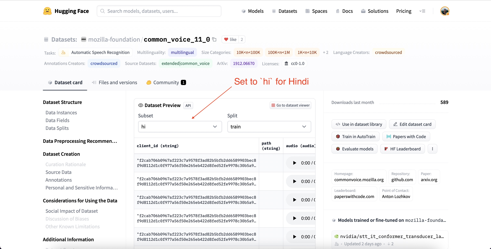

# Fine-Tune Whisper For Multilingual ASR with 🤗 Transformers

{blog_metadata}
{authors}

<a target="_blank" href="https://colab.research.google.com/github/sanchit-gandhi/notebooks/blob/main/fine_tune_whisper.ipynb">
    
</a>

In this blog, we present a step-by-step guide on fine-tuning Whisper 
for any multilingual ASR dataset using Hugging Face 🤗 Transformers. This blog 
provides in-depth explanations of the Whisper model, the Common Voice dataset and 
the theory behind fine-tuning, with accompanying code cells to execute the data 
preparation and fine-tuning steps. For a more streamlined version of the notebook 
with fewer explanations but all the code, see the accompanying [Google Colab](https://colab.research.google.com/github/sanchit-gandhi/notebooks/blob/main/fine_tune_whisper.ipynb).

## Table of Contents

1. [Introduction](#introduction)
2. [Fine-tuning Whisper in a Google Colab](#fine-tuning-whisper-in-a-google-colab)
    1. [Prepare Environment](#prepare-environment)
    2. [Load Dataset](#load-dataset)
    3. [Prepare Feature Extractor, Tokenizer and Data](#prepare-feature-extractor-tokenizer-and-data)
    4. [Training and Evaluation](#training-and-evaluation)
    5. [Building a Demo](#building-a-demo)
3. [Closing Remarks](#closing-remarks)

## Introduction

Whisper is a pre-trained model for automatic speech recognition (ASR) 
published in [September 2022](https://openai.com/blog/whisper/) by the authors 
Alec Radford et al. from OpenAI. Unlike many of its predecessors, such as 
[Wav2Vec 2.0](https://arxiv.org/abs/2006.11477), which are pre-trained 
on un-labelled audio data, Whisper is pre-trained on a vast quantity of 
**labelled** audio-transcription data, 680,000 hours to be precise. 
This is an order of magnitude more data than the un-labelled audio data used 
to train Wav2Vec 2.0 (60,000 hours). What is more, 117,000 hours of this 
pre-training data is multilingual ASR data. This results in checkpoints 
that can be applied to over 96 languages, many of which are considered 
_low-resource_.

This quantity of labelled data enables Whisper to be pre-trained directly on the 
_supervised_ task of speech recognition, learning a speech-to-text mapping from 
the labelled audio-transcription pre-training data \\({}^1\\). As a consequence, 
Whisper requires little additional fine-tuning to yield a performant ASR model.
This is in contrast to Wav2Vec 2.0, which is pre-trained on the _unsupervised_ 
task of masked prediction. Here, the model is trained to learn an intermediate 
mapping from speech to hidden states from un-labelled audio only data. 
While unsupervised pre-training yields high-quality representations of speech, 
it does **not** learn a speech-to-text mapping. This mapping is only learned 
during fine-tuning, thus requiring more fine-tuning to yield competitive 
performance.

When scaled to 680,000 hours of labelled pre-training data, Whisper models 
demonstrate a strong ability to generalise to many datasets and domains.
The pre-trained checkpoints achieve competitive results to state-of-the-art 
ASR systems, with near 3% word error rate (WER) on the test-clean subset of 
LibriSpeech ASR and a new state-of-the-art on TED-LIUM with 4.7% WER (_c.f._ 
Table 8 of the [Whisper paper](https://cdn.openai.com/papers/whisper.pdf)).
The extensive multilingual ASR knowledge acquired by Whisper during pre-training 
can be leveraged for other low-resource languages; through fine-tuning, the 
pre-trained checkpoints can be adapted for specific datasets and languages 
to further improve upon these results.

Whisper is a Transformer based encoder-decoder model, 
also referred to as a _sequence-to-sequence_ model. It maps a _sequence_ 
of audio spectrogram features to a _sequence_ of text tokens. First, 
the raw audio inputs are converted to a log-Mel spectrogram by action of 
the feature extractor. The Transformer encoder then encodes the spectrogram 
to form a sequence of encoder hidden states. Finally, the decoder 
autoregressively predicts text tokens, conditional on both the previous tokens 
and the encoder hidden states. Figure 1 summarises the Whisper model.

<figure>

<figcaption align = "center"><b>Figure 1:</b> Whisper model. The architecture 
follows the standard Transformer-based encoder-decoder model. A 
log-Mel spectrogram is input to the encoder. The last encoder 
hidden states are input to the decoder via cross-attention mechanisms. The 
decoder autoregressively predicts text tokens, jointly conditional on the 
encoder hidden states and previously predicted tokens. Figure source: 
<a href="https://openai.com/blog/whisper/">OpenAI Whisper Blog</a>.</figcaption>
</figure>

In a sequence-to-sequence model, the encoder transforms the audio inputs 
into a set of hidden state representations, extracting important features 
from the spoken speech. The decoder plays the role of a language model, 
processing the hidden state representations and generating the corresponding 
text transcriptions. Incorporating a language model **internally** in the 
system architecture is termed _deep fusion_. This is in contrast to 
_shallow fusion_, where a language model is combined **externally** with 
an encoder, such as with CTC + \\(n\\)-gram (_c.f._ [Internal Language Model Estimation](https://arxiv.org/pdf/2011.01991.pdf)).
With deep fusion, the entire system can be trained end-to-end with the 
same training data and loss function, giving greater flexibility and generally 
superior performance (_c.f._ [ESB Benchmark](https://arxiv.org/abs/2210.13352)).

Whisper is pre-trained and fine-tuned using the cross-entropy objective function, 
a standard objective function for training sequence-to-sequence systems on classification tasks. 
Here, the system is trained to correctly classify the target text token from a pre-defined 
vocabulary of text tokens.

The Whisper checkpoints come in five configurations of varying model sizes.
The smallest four are trained on either English-only or multilingual data.
The largest checkpoint is multilingual only. All nine of the pre-trained checkpoints 
are available on the [Hugging Face Hub](https://huggingface.co/models?search=openai/whisper). The 
checkpoints are summarised in the following table with links to the models on the Hub:

| Size   | Layers | Width | Heads | Parameters | English-only                                         | Multilingual                                      |
|--------|--------|-------|-------|------------|------------------------------------------------------|---------------------------------------------------|
| tiny   | 4      | 384   | 6     | 39 M       | [✓](https://huggingface.co/openai/whisper-tiny.en)   | [✓](https://huggingface.co/openai/whisper-tiny.)  |
| base   | 6      | 512   | 8     | 74 M       | [✓](https://huggingface.co/openai/whisper-base.en)   | [✓](https://huggingface.co/openai/whisper-base)   |
| small  | 12     | 768   | 12    | 244 M      | [✓](https://huggingface.co/openai/whisper-small.en)  | [✓](https://huggingface.co/openai/whisper-small)  |
| medium | 24     | 1024  | 16    | 769 M      | [✓](https://huggingface.co/openai/whisper-medium.en) | [✓](https://huggingface.co/openai/whisper-medium) |
| large  | 32     | 1280  | 20    | 1550 M     | x                                                    | [✓](https://huggingface.co/openai/whisper-large)  |

For demonstration purposes, we'll fine-tune the multilingual version of the 
[`small`](https://huggingface.co/openai/whisper-small) checkpoint with 244M params (~= 1GB). 
As for our data, we'll train and evaluate our system on a low-resource language 
taken from the [Common Voice](https://huggingface.co/datasets/mozilla-foundation/common_voice_11_0)
dataset. We'll show that with as little as 8 hours of fine-tuning data, we can achieve 
strong performance in this language.

------------------------------------------------------------------------

\\({}^1\\) The name Whisper follows from the acronym “WSPSR”, which stands for “Web-scale Supervised Pre-training for Speech Recognition”.

## Fine-tuning Whisper in a Google Colab

### Prepare Environment

First, we need to update the Unix package `ffmpeg` to version 4:
```bash
!add-apt-repository -y ppa:jonathonf/ffmpeg-4
!apt update
!apt install -y ffmpeg
```

We'll employ several popular Python packages to fine-tune the Whisper model.
We'll use `datasets` to download and prepare our training data and 
`transformers` to load and train our Whisper model. We'll also require
the `soundfile` package to pre-process audio files, `evaluate` and `jiwer` to
assess the performance of our model. Finally, we'll
use `gradio` to build a flashy demo of our fine-tuned model.

```bash
!pip install datasets>=2.6.1
!pip install git+https://github.com/huggingface/transformers
!pip install librosa
!pip install evaluate>=0.30
!pip install jiwer
!pip install gradio
```

We strongly advise you to upload model checkpoints directly the [Hugging Face Hub](https://huggingface.co/) 
whilst training. The Hub provides:
- Integrated version control: you can be sure that no model checkpoint is lost during training.
- Tensorboard logs: track important metrics over the course of training.
- Model cards: document what a model does and its intended use cases.
- Community: an easy way to share and collaborate with the community!

Linking the notebook to the Hub is straightforward - it simply requires entering your 
Hub authentication token when prompted. Find your Hub authentication token [here](https://huggingface.co/settings/tokens):

```python
from huggingface_hub import notebook_login

notebook_login()
```

**Print Output:**
```bash
Login successful
Your token has been saved to /root/.huggingface/token
```

### Load Dataset

Common Voice is a series of crowd-sourced datasets where speakers 
record text from Wikipedia in various languages. We'll use the latest edition 
of the Common Voice dataset ([version 11](https://huggingface.co/datasets/mozilla-foundation/common_voice_11_0)). 
As for our language, we'll fine-tune our model on 
[_Hindi_](https://en.wikipedia.org/wiki/Hindi), an Indo-Aryan language 
spoken in northern, central, eastern, and western India. Common Voice 11.0 
contains approximately 12 hours of labelled Hindi data, 4 of which are 
held-out test data.

Let's head to the Hub and view the dataset page for Common Voice: [mozilla-foundation/common_voice_11_0](https://huggingface.co/datasets/mozilla-foundation/common_voice_11_0).

The first time we view this page, we'll be asked to accept the 
terms of use. After that, we'll be given full access to the dataset.

Once we've provided authentication to use the dataset, we'll be presented with the 
dataset preview. The dataset preview shows us the first 100 samples 
of the dataset. What's more, it's loaded up with audio samples ready for us 
to listen to in real time. We can select the Hindi subset of Common Voice by 
setting the subset to `hi` using the dropdown menu (`hi` being the language 
identifier code for Hindi):

<figure>

</figure>

If we hit the play button on the first sample, we can listen to the audio and 
see the corresponding text. Have a scroll through the samples for the train 
and test sets to get a better feel for the audio and text data that we're 
dealing with. You can tell from the intonation and style that the recordings 
are taken from narrated speech. You'll also likely notice the large variation in 
speakers and recording quality, a common trait of crowd-sourced data. 

Using 🤗 Datasets, downloading and preparing data is extremely simple. 
We can download and prepare the Common Voice splits in just one line of code.
Since Hindi is very low-resource, we'll combine the `train` and `validation` 
splits to give approximately 8 hours of training data. We'll use the 4 hours 
of `test` data as our held-out test set:
```python
from datasets import load_dataset, DatasetDict

common_voice = DatasetDict()

common_voice["train"] = load_dataset("mozilla-foundation/common_voice_11_0", "hi", split="train+validation", use_auth_token=True)
common_voice["test"] = load_dataset("mozilla-foundation/common_voice_11_0", "hi", split="test", use_auth_token=True)

print(common_voice)
```

**Print Output:**
```
DatasetDict({
    train: Dataset({
        features: ['client_id', 'path', 'audio', 'sentence', 'up_votes', 'down_votes', 'age', 'gender', 'accent', 'locale', 'segment'],
        num_rows: 6540
    })
    test: Dataset({
        features: ['client_id', 'path', 'audio', 'sentence', 'up_votes', 'down_votes', 'age', 'gender', 'accent', 'locale', 'segment'],
        num_rows: 2894
    })
})
```

Most ASR datasets only provide input audio samples (`audio`) and the 
corresponding transcribed text (`sentence`). Common Voice contains additional 
metadata information, such as `accent` and `locale`, which we can disregard for ASR.
Keeping the notebook as general as possible, we only consider the input audio and
transcribed text for fine-tuning, discarding the additional metadata information:

```python
common_voice = common_voice.remove_columns(["accent", "age", "client_id", "down_votes", "gender", "locale", "path", "segment", "up_votes"])
```

Common Voice is but one multilingual ASR dataset that we can download from the Hub - 
there are plenty more available to us! To view the range of datasets available for speech recognition, 
follow the link: [ASR Datasets on the Hub](https://huggingface.co/datasets?task_categories=task_categories:automatic-speech-recognition&sort=downloads).

### Prepare Feature Extractor, Tokenizer and Data

The ASR pipeline can be de-composed into three components: 
1) A feature extractor which pre-processes the raw audio-inputs
2) The model which performs the sequence-to-sequence mapping 
3) A tokenizer which post-processes the model outputs to text format

In 🤗 Transformers, the Whisper model has an associated feature extractor and tokenizer, 
called [WhisperFeatureExtractor](https://huggingface.co/docs/transformers/main/model_doc/whisper#transformers.WhisperFeatureExtractor)
and [WhisperTokenizer](https://huggingface.co/docs/transformers/main/model_doc/whisper#transformers.WhisperTokenizer) 
respectively.

We'll go through details of the feature extractor and tokenizer one-by-one!

### Load WhisperFeatureExtractor

Speech is represented by a 1-dimensional array that varies with time. 
The value of the array at any given time step is the signal's _amplitude_ 
at that point. From the amplitude information alone, we can reconstruct the 
frequency spectrum of the audio and recover all acoustic features.

Since speech is continuous, it contains an infinite number of amplitude values.
This poses problems for computer devices which expect finite arrays. Thus, we 
discretise our speech signal by _sampling_ values from our signal at fixed time steps.
The interval with which we sample our audio is known as the _sampling rate_ 
and is usually measured in samples/sec or _Hertz (Hz)_. Sampling with a higher 
sampling rate results in a better approximation of the continuous speech signal, 
but also requires storing more values per second. 

It is crucial that we match the sampling rate of our audio inputs to the sampling
rate expected by our model, as audio signals with different sampling rates have very
different distributions. Audio samples should only ever be processed with the 
correct sampling rate. Failing to do so can lead to unexpected results!
For instance, taking an audio sample with a sampling rate of 16kHz and listening 
to it with a sampling rate of 8kHz will make the audio sound as though it's in half-speed. 
In the same way, passing audio with the wrong sampling rate can falter an ASR model 
that expects one sampling rate and receives another. The Whisper 
feature extractor expects audio inputs with a sampling rate of 16kHz, so we need to 
match our inputs to this value. We don't want to inadvertently train an ASR 
system on slow-motion speech!

The Whisper feature extractor performs two operations. It first pads/truncates a batch of audio samples
such that all samples have an input length of 30s. Samples shorter than 30s are padded to 30s
by appending zeros to the end of the sequence (zeros in an audio signal corresponding to no signal
or silence). Samples longer than 30s are truncated to 30s. Since all elements 
in the batch are padded/truncated to a maximum length in the input space, we don't require 
an attention mask when forwarding the audio inputs to the Whisper model. 
Whisper is unique in this regard - with most audio models, you can expect to provide 
an attention mask that details where sequences have been padded, and thus where they
should be ignored in the self-attention mechanism. Whisper is trained to operate without
an attention mask and infer directly from the speech signals where to ignore the inputs.

The second operation that the Whisper feature extractor performs is converting the 
padded audio arrays to log-Mel spectrograms. These spectrograms are 
a visual representation of the frequencies of a signal, rather like a Fourier transform. 
An example spectrogram is shown in Figure 2. Along the \\(y\\)-axis are the Mel channels, 
which correspond to particular frequency bins. Along the \\(x\\)-axis is time. The colour of 
each pixel corresponds to the log-intensity of that frequency bin at a given time. The 
log-Mel spectrogram is the form of input expected by the Whisper model.

The Mel channels (frequency bins) are standard in speech processing and chosen to approximate
the human auditory range. All we need to know for Whisper fine-tuning is that 
the spectrogram is a visual representation of the frequencies in the speech signal. For more detail
on Mel channels, refer to [Mel-frequency cepstrum](https://en.wikipedia.org/wiki/Mel-frequency_cepstrum).

<figure>

<figcaption align = "center"><b>Figure 2:</b> Conversion of sampled audio array to log-Mel spectrogram.
Left: sampled 1-dimensional audio signal. Right: corresponding log-Mel spectrogram. Figure source:
<a href="https://ai.googleblog.com/2019/04/specaugment-new-data-augmentation.html">Google SpecAugment Blog</a>.
</figcaption>
</figure>

Luckily for us, the 🤗 Transformers Whisper feature extractor performs both the
padding and spectrogram conversion in just one line of code! Let's go ahead 
and load the feature extractor from the pre-trained checkpoint to have ready 
for our audio data:

```python
from transformers import WhisperFeatureExtractor

feature_extractor = WhisperFeatureExtractor.from_pretrained("openai/whisper-small")
```

### Load WhisperTokenizer

Now let's look at how to load a Whisper tokenizer. The Whisper model outputs 
text tokens that indicate the _index_ of the predicted text among the dictionary 
of vocabulary items. The tokenizer maps a sequence of text tokens to the actual 
text string (e.g. [1169, 3797, 3332] -> "the cat sat").

Traditionally, when using encoder-only models for ASR, we decode using 
[_Connectionist Temporal Classification (CTC)_](https://distill.pub/2017/ctc/). 
Here we are required to train a CTC tokenizer for each dataset we use. 
One of the advantages of using an encoder-decoder architecture is that 
we can directly leverage the tokenizer from the pre-trained model.

The Whisper tokenizer is pre-trained on the transcriptions for the 96 pre-training languages.
Consequently, it has an extensive [byte-pair](https://huggingface.co/course/chapter6/5?fw=pt#bytepair-encoding-tokenization) 
that is appropriate for almost all multilingual ASR applications. 
For Hindi, we can load the tokenizer and use it for fine-tuning without 
any further modifications. We simply have to specify the target language 
and the task. These arguments inform the tokenizer to prefix the language 
and task tokens to the start of encoded label sequences:

```python
from transformers import WhisperTokenizer

tokenizer = WhisperTokenizer.from_pretrained("openai/whisper-small", language="Hindi", task="transcribe")
```

We can verify that the tokenizer correctly encodes Hindi characters by 
encoding and decoding the first sample of the Common Voice dataset. When 
encoding the transcriptions, the tokenizer appends 'special tokens' to the 
start and end of the sequence, including the start/end of transcript tokens, the 
language token and the task tokens (as specified by the arguments in the previous step). 
When decoding the label ids, we have the option of 'skipping' these special 
tokens, allowing us to return a string in the original input form:

```python
input_str = common_voice["train"][0]["sentence"]
labels = tokenizer(input_str).input_ids
decoded_with_special = tokenizer.decode(labels, skip_special_tokens=False)
decoded_str = tokenizer.decode(labels, skip_special_tokens=True)

print(f"Input:                 {input_str}")
print(f"Decoded w/ special:    {decoded_with_special}")
print(f"Decoded w/out special: {decoded_str}")
print(f"Are equal:             {input_str == decoded_str}")
```
**Print Output:**
```bash
Input:                 खीर की मिठास पर गरमाई बिहार की सियासत, कुशवाहा ने दी सफाई
Decoded w/ special:    <|startoftranscript|><|hi|><|transcribe|><|notimestamps|>खीर की मिठास पर गरमाई बिहार की सियासत, कुशवाहा ने दी सफाई<|endoftext|>
Decoded w/out special: खीर की मिठास पर गरमाई बिहार की सियासत, कुशवाहा ने दी सफाई
Are equal:             True
```

### Combine To Create A WhisperProcessor

To simplify using the feature extractor and tokenizer, we can _wrap_ 
both into a single `WhisperProcessor` class. This processor object 
inherits from the `WhisperFeatureExtractor` and `WhisperProcessor` 
and can be used on the audio inputs and model predictions as required. 
In doing so, we only need to keep track of two objects during training: 
the `processor` and the `model`:

```python
from transformers import WhisperProcessor

processor = WhisperProcessor.from_pretrained("openai/whisper-small", language="Hindi", task="transcribe")
```

### Prepare Data
Let's print the first example of the Common Voice dataset to see 
what form the data is in:
```python
print(common_voice["train"][0])
```
**Print Output:**
```python
{'audio': {'path': '/home/sanchit_huggingface_co/.cache/huggingface/datasets/downloads/extracted/607848c7e74a89a3b5225c0fa5ffb9470e39b7f11112db614962076a847f3abf/cv-corpus-11.0-2022-09-21/hi/clips/common_voice_hi_25998259.mp3', 
           'array': array([0.0000000e+00, 0.0000000e+00, 0.0000000e+00, ..., 9.6724887e-07,
       1.5334779e-06, 1.0415988e-06], dtype=float32), 
           'sampling_rate': 48000},
 'sentence': 'खीर की मिठास पर गरमाई बिहार की सियासत, कुशवाहा ने दी सफाई'}
```
We can see that we've got a 1-dimensional input audio array and the 
corresponding target transcription. We've spoken heavily about the 
importance of the sampling rate and the fact that we need to match the 
sampling rate of our audio to that of the Whisper model (16kHz). Since 
our input audio is sampled at 48kHz, we need to _downsample_ it to 
16kHz before passing it to the Whisper feature extractor.

We'll set the audio inputs to the correct sampling rate using dataset's 
[`cast_column`](https://huggingface.co/docs/datasets/package_reference/main_classes.html?highlight=cast_column#datasets.DatasetDict.cast_column)
method. This operation does not change the audio in-place, 
but rather signals to `datasets` to resample audio samples _on the fly_ the 
first time that they are loaded:

```python
from datasets import Audio

common_voice = common_voice.cast_column("audio", Audio(sampling_rate=16000))
```

Re-loading the first audio sample in the Common Voice dataset will resample 
it to the desired sampling rate:

```python
print(common_voice["train"][0])
```
**Print Output:**
```python
{'audio': {'path': '/home/sanchit_huggingface_co/.cache/huggingface/datasets/downloads/extracted/607848c7e74a89a3b5225c0fa5ffb9470e39b7f11112db614962076a847f3abf/cv-corpus-11.0-2022-09-21/hi/clips/common_voice_hi_25998259.mp3', 
           'array': array([ 0.0000000e+00,  0.0000000e+00,  0.0000000e+00, ...,
       -3.4206650e-07,  3.2979898e-07,  1.0042874e-06], dtype=float32),
           'sampling_rate': 16000},
 'sentence': 'खीर की मिठास पर गरमाई बिहार की सियासत, कुशवाहा ने दी सफाई'}
```
Great! We can see that the sampling rate has been downsampled to 16kHz. The 
array values are also different, as we've now only got approximately one amplitude value 
for every three we had before.

Now we can write a function to prepare our data ready for the model:
1. We load and resample the audio data by calling `batch["audio"]`. As explained above, 🤗 Datasets performs any necessary resampling operations on the fly.
2. We use the feature extractor to compute the log-Mel spectrogram input features from our 1-dimensional audio array.
3. We encode the transcriptions to label ids through the use of the tokenizer.

```python
def prepare_dataset(batch):
    # load and resample audio data from 48 to 16kHz
    audio = batch["audio"]

    # compute log-Mel input features from input audio array 
    batch["input_features"] = feature_extractor(audio["array"], sampling_rate=audio["sampling_rate"]).input_features[0]

    # encode target text to label ids 
    batch["labels"] = tokenizer(batch["sentence"]).input_ids
    return batch
```

We can apply the data preparation function to all of our training examples using dataset's `.map` method:

```python
common_voice = common_voice.map(prepare_dataset, remove_columns=common_voice.column_names["train"], num_proc=4)
```

Alright! With that we have our data fully prepared for training! 
Let's continue and take a look at how we can use this data to 
fine-tune Whisper.

**Note**: Currently `datasets` makes use of both [`torchaudio`](https://pytorch.org/audio/stable/index.html) 
and [`librosa`](https://librosa.org/doc/latest/index.html) for audio loading and resampling. 
If you wish to implement your own customised data loading/sampling, you can use the `"path"` 
column to obtain the audio file path and disregard the `"audio"` column.

## Training and Evaluation

Now that we've prepared our data, we're ready to dive into the training pipeline. 
The [🤗 Trainer](https://huggingface.co/transformers/master/main_classes/trainer.html?highlight=trainer)
will do much of the heavy lifting for us. All we have to do is:

- Define a data collator: the data collator takes our pre-processed data and prepares PyTorch tensors ready for the model.

- Evaluation metrics: during evaluation, we want to evaluate the model using the [word error rate (WER)](https://huggingface.co/metrics/wer) metric. We need to define a `compute_metrics` function that handles this computation.

- Load a pre-trained checkpoint: we need to load a pre-trained checkpoint and configure it correctly for training.

- Define the training arguments: these will be used by the 🤗 Trainer in constructing the training schedule.

Once we've fine-tuned the model, we will evaluate it on the test data to verify that we have correctly trained it 
to transcribe speech in Hindi.

### Define a Data Collator

The data collator for a sequence-to-sequence speech model is unique in the sense that it 
treats the `input_features` and `labels` independently: the  `input_features` must be 
handled by the feature extractor and the `labels` by the tokenizer.

The `input_features` are already padded to 30s and converted to a log-Mel spectrogram 
of fixed dimension, so all we have to do is convert them to batched PyTorch tensors. We do this 
using the feature extractor's `.pad` method with `return_tensors=pt`. Note that no additional 
padding is applied here since the inputs are of fixed dimension, 
the `input_features` are simply converted to PyTorch tensors.

On the other hand, the `labels` are un-padded. We first pad the sequences
to the maximum length in the batch using the tokenizer's `.pad` method. The padding tokens 
are then replaced by `-100` so that these tokens are **not** taken into account when 
computing the loss. We then cut the start of transcript token from the beginning of the label sequence as we 
append it later during training.

We can leverage the `WhisperProcessor` we defined earlier to perform both the 
feature extractor and the tokenizer operations:

```python
import torch

from dataclasses import dataclass
from typing import Any, Dict, List, Union

@dataclass
class DataCollatorSpeechSeq2SeqWithPadding:
    processor: Any

    def __call__(self, features: List[Dict[str, Union[List[int], torch.Tensor]]]) -> Dict[str, torch.Tensor]:
        # split inputs and labels since they have to be of different lengths and need different padding methods
        # first treat the audio inputs by simply returning torch tensors
        input_features = [{"input_features": feature["input_features"]} for feature in features]
        batch = self.processor.feature_extractor.pad(input_features, return_tensors="pt")

        # get the tokenized label sequences
        label_features = [{"input_ids": feature["labels"]} for feature in features]
        # pad the labels to max length
        labels_batch = self.processor.tokenizer.pad(label_features, return_tensors="pt")

        # replace padding with -100 to ignore loss correctly
        labels = labels_batch["input_ids"].masked_fill(labels_batch.attention_mask.ne(1), -100)

        # if bos token is appended in previous tokenization step,
        # cut bos token here as it's append later anyways
        if (labels[:, 0] == self.processor.tokenizer.bos_token_id).all().cpu().item():
            labels = labels[:, 1:]

        batch["labels"] = labels

        return batch
```

Let's initialise the data collator we've just defined:

```python
data_collator = DataCollatorSpeechSeq2SeqWithPadding(processor=processor)
```

### Evaluation Metrics
Next, we define the evaluation metric we'll use on our evaluation
set. We'll use the Word Error Rate (WER) metric, the 'de-facto' metric for assessing 
ASR systems. For more information, refer to the WER [docs](https://huggingface.co/metrics/wer). 
We'll load the WER metric from 🤗 Evaluate:

```python
import evaluate

metric = evaluate.load("wer")
```

We then simply have to define a function that takes our model 
predictions and returns the WER metric. This function, called
`compute_metrics`, first replaces `-100` with the `pad_token_id`
in the `label_ids` (undoing the step we applied in the 
data collator to ignore padded tokens correctly in the loss).
It then decodes the predicted and label ids to strings. Finally,
it computes the WER between the predictions and reference labels:

```python
def compute_metrics(pred):
    pred_ids = pred.predictions
    label_ids = pred.label_ids

    # replace -100 with the pad_token_id
    label_ids[label_ids == -100] = tokenizer.pad_token_id

    # we do not want to group tokens when computing the metrics
    pred_str = tokenizer.batch_decode(pred_ids, skip_special_tokens=True)
    label_str = tokenizer.batch_decode(label_ids, skip_special_tokens=True)

    wer = 100 * metric.compute(predictions=pred_str, references=label_str)

    return {"wer": wer}
```

### Load a Pre-Trained Checkpoint

Now let's load the pre-trained Whisper `small` checkpoint. Again, this 
is trivial through use of 🤗 Transformers!

```python
from transformers import WhisperForConditionalGeneration

model = WhisperForConditionalGeneration.from_pretrained("openai/whisper-small")
```

The Whisper model has token ids that are forced as model outputs before 
autoregressive generation is started ([`forced_decoder_ids`](https://huggingface.co/docs/transformers/main_classes/text_generation#transformers.generation_utils.GenerationMixin.generate.forced_decoder_ids)).
These token ids control the transcription language and task for zero-shot ASR. For fine-tuning, 
we'll set these ids to `None`, as we'll train the model to predict the correct language (Hindi) 
and task (transcription). There are also tokens that are completely suppressed during generation 
([`suppress_tokens`](https://huggingface.co/docs/transformers/main_classes/text_generation#transformers.generation_utils.GenerationMixin.generate.suppress_tokens)). 
These tokens have their log probabilities set to `-inf`, such that they are never sampled. 
We'll override these tokens to an empty list, meaning no tokens are suppressed:

```python
model.config.forced_decoder_ids = None
model.config.suppress_tokens = []
```

### Define the Training Arguments
In the final step, we define all the parameters related to training. A subset of parameters are 
explained below:
- `output_dir`: local directory in which to save the model weights. This will also be the repository name on the [Hugging Face Hub](https://huggingface.co/).
- `generation_max_length`: maximum number of tokens to autoregressively generate during evaluation.
- `save_steps`: during training, intermediate checkpoints will be saved and uploaded asynchronously to the Hub every `save_steps` training steps.
- `eval_steps`: during training, evaluation of intermediate checkpoints will be performed every `eval_steps` training steps.
- `report_to`: where to save training logs. Supported platforms are `"azure_ml"`, `"comet_ml"`, `"mlflow"`, `"neptune"`, `"tensorboard"` and `"wandb"`. Pick your favourite or leave as `"tensorboard"` to log to the Hub.

For more detail on the other training arguments, refer to the Seq2SeqTrainingArguments [docs](https://huggingface.co/docs/transformers/main_classes/trainer#transformers.Seq2SeqTrainingArguments).

```python
from transformers import Seq2SeqTrainingArguments

training_args = Seq2SeqTrainingArguments(
    output_dir="./whisper-small-hi",  # change to a repo name of your choice
    per_device_train_batch_size=16,
    gradient_accumulation_steps=1,  # increase by 2x for every 2x decrease in batch size
    learning_rate=1e-5,
    warmup_steps=500,
    max_steps=4000,
    gradient_checkpointing=True,
    fp16=True,
    evaluation_strategy="steps",
    per_device_eval_batch_size=8,
    predict_with_generate=True,
    generation_max_length=225,
    save_steps=1000,
    eval_steps=1000,
    logging_steps=25,
    report_to=["tensorboard"],
    load_best_model_at_end=True,
    metric_for_best_model="wer",
    greater_is_better=False,
    push_to_hub=True,
)
```

**Note**: if one does not want to upload the model checkpoints to the Hub, 
set `push_to_hub=False`.

We can forward the training arguments to the 🤗 Trainer along with our model,
dataset, data collator and `compute_metrics` function:

```python
from transformers import Seq2SeqTrainer

trainer = Seq2SeqTrainer(
    args=training_args,
    model=model,
    train_dataset=common_voice["train"],
    eval_dataset=common_voice["test"],
    data_collator=data_collator,
    compute_metrics=compute_metrics,
    tokenizer=processor.feature_extractor,
)
```

And with that, we're ready to start training!

### Training
To launch training, simply execute:
```python
trainer.train()
```

Training will take approximately 5-10 hours depending on your GPU or the one 
allocated to the Google Colab. Depending on your GPU, it is possible 
that you will encounter a CUDA `"out-of-memory"` error when you start training. In this case,
you can reduce the `per_device_train_batch_size` incrementally by factors of 2 
and employ [`gradient_accumulation_steps`](https://huggingface.co/docs/transformers/main_classes/trainer#transformers.Seq2SeqTrainingArguments.gradient_accumulation_steps)
to compensate.

**Print Output:**

| Step | Training Loss | Epoch | Validation Loss |  WER  |
|:----:|:-------------:|:-----:|:---------------:|:-----:|
| 1000 |    0.1011     | 2.44  |     0.3075      | 34.63 |
| 2000 |    0.0264     | 4.89  |     0.3558      | 33.13 |
| 3000 |    0.0025     | 7.33  |     0.4214      | 32.59 |
| 4000 |    0.0006     | 9.78  |     0.4519      | 32.01 |
| 5000 |    0.0002     | 12.22 |     0.4679      | 32.10 |

Our best WER is 32.0% - not bad for 8h of training data! The big question is how this 
compares to other ASR systems. For that, we can view the [`hf-speech-bench`](https://huggingface.co/spaces/huggingface/hf-speech-bench), 
a leaderboard that categorises models by language and dataset, and subsequently ranks 
them according to their WER.

<figure>

</figure>

Our fine-tuned model significantly improves upon the zero-shot performance of the Whisper 
`small` checkpoint, highlighting the strong transfer learning capabilities of Whisper.

We can automatically submit our checkpoint to the leaderboard when we
push the training results to the Hub - we simply have to set the appropriate key-word 
arguments (kwargs). You can change these values to match your dataset, language and 
model name accordingly:

```python
kwargs = {
    "dataset_tags": "mozilla-foundation/common_voice_11_0",
    "dataset": "Common Voice 11.0",  # a 'pretty' name for the training dataset
    "dataset_args": "config: hi, split: test",
    "language": "hi",
    "model_name": "Whisper Small Hi - Sanchit Gandhi",  # a 'pretty' name for your model
    "finetuned_from": "openai/whisper-small",
    "tasks": "automatic-speech-recognition",
    "tags": "hf-asr-leaderboard",
}
```

The training results can now be uploaded to the Hub. To do so, execute the `push_to_hub` command:

```python
trainer.push_to_hub(**kwargs)
```

You can now share this model with anyone using the link on the Hub. They can also 
load it with the identifier `"your-username/the-name-you-picked"`, for instance:

```python
from transformers import WhisperForConditionalGeneration, WhisperProcessor

model = WhisperForConditionalGeneration.from_pretrained("sanchit-gandhi/whisper-small-hi")
processor = WhisperProcessor.from_pretrained("sanchit-gandhi/whisper-small-hi")
```

While the fine-tuned model yields satisfactory results on the Common 
Voice Hindi test data, it is by no means optimal. The purpose of this 
notebook is to demonstrate how the pre-trained Whisper checkpoints can 
be fine-tuned on any multilingual ASR dataset. The results could likely 
be improved by optimising the training hyperparameters, such as 
_learning rate_ and _dropout_, and using a larger pre-trained 
checkpoint (`medium` or `large`).

### Building a Demo
Now that we've fine-tuned our model, we can build a demo to show 
off its ASR capabilities! We'll use 🤗 Transformers 
`pipeline`, which will take care of the entire ASR pipeline, 
right from pre-processing the audio inputs to decoding the 
model predictions. We'll build our interactive demo with [Gradio](https://www.gradio.app). 
Gradio is arguably the most straightforward way of building 
machine learning demos; with Gradio, we can build a demo in 
just a matter of minutes!

Running the example below will generate a Gradio demo where we 
can record speech through the microphone of our computer and input it to 
our fine-tuned Whisper model to transcribe the corresponding text:

```python
from transformers import pipeline
import gradio as gr

pipe = pipeline(model="sanchit-gandhi/whisper-small-hi")  # change to "your-username/the-name-you-picked"

def transcribe(audio):
    text = pipe(audio)["text"]
    return text

iface = gr.Interface(
    fn=transcribe, 
    inputs=gr.Audio(source="microphone", type="filepath"), 
    outputs="text",
    title="Whisper Small Hindi",
    description="Realtime demo for Hindi speech recognition using a fine-tuned Whisper small model.",
)

iface.launch()
```

## Closing Remarks

In this blog, we covered a step-by-step guide on fine-tuning Whisper for multilingual ASR 
using 🤗 Datasets, Transformers and the Hugging Face Hub. Refer to the [Google Colab](https://colab.research.google.com/github/sanchit-gandhi/notebooks/blob/main/fine_tune_whisper.ipynb) 
should you wish to try fine-tuning for yourself. If you're interested in fine-tuning other 
Transformers models, both for English and multilingual ASR, be sure to check out the 
examples scripts at [examples/pytorch/speech-recognition](https://github.com/huggingface/transformers/tree/main/examples/pytorch/speech-recognition).
