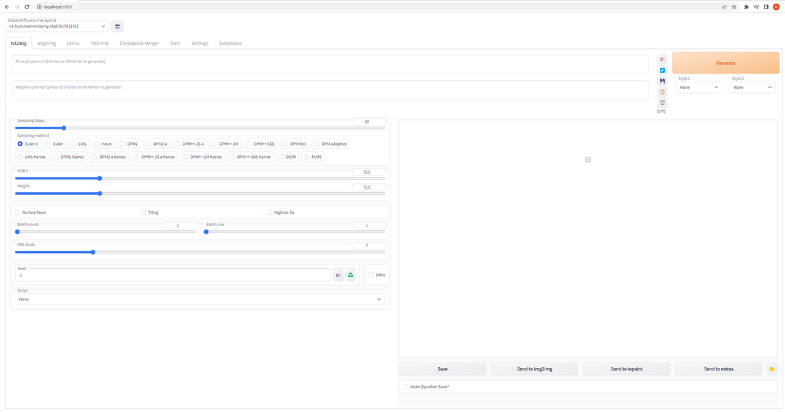
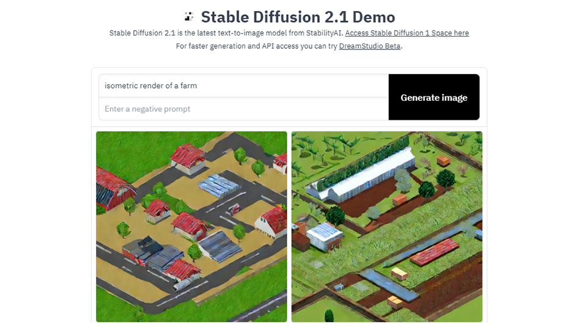
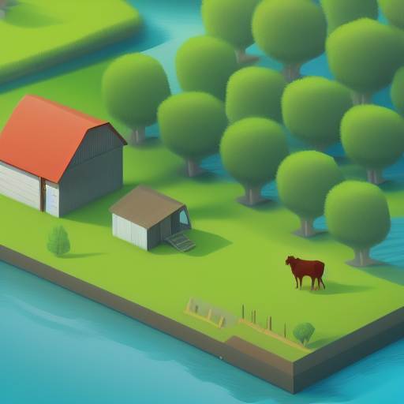
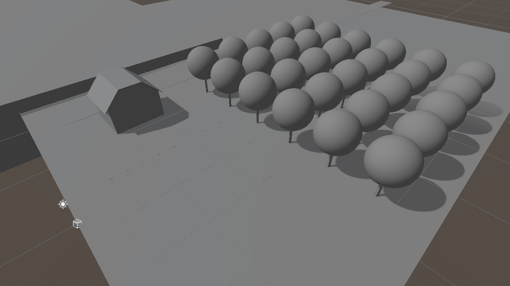
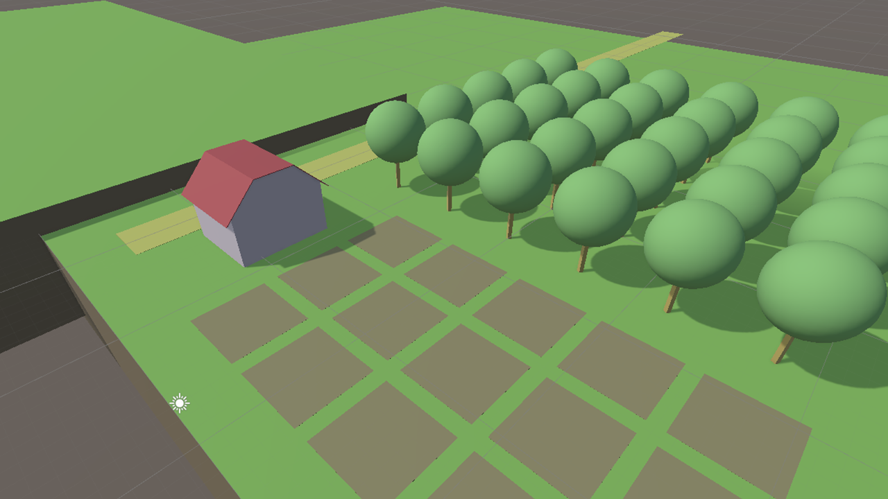
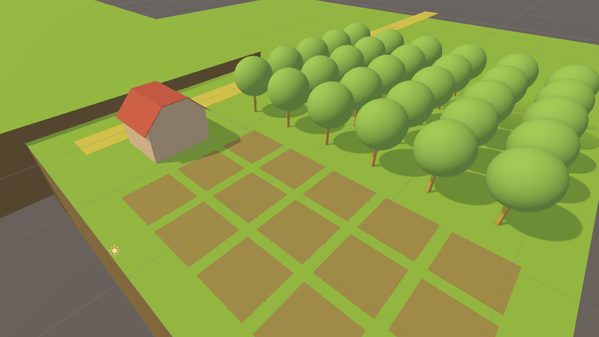
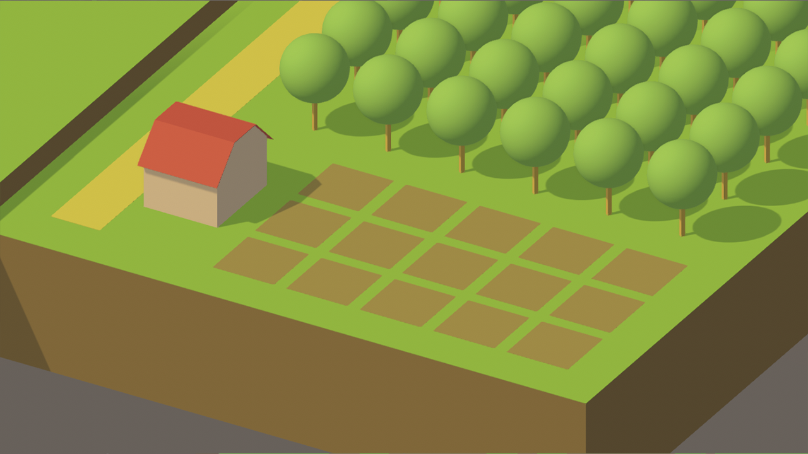
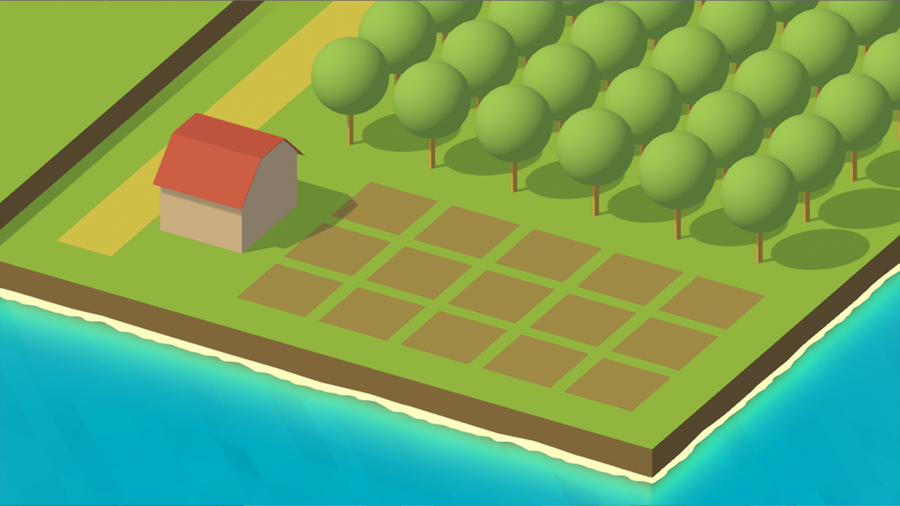
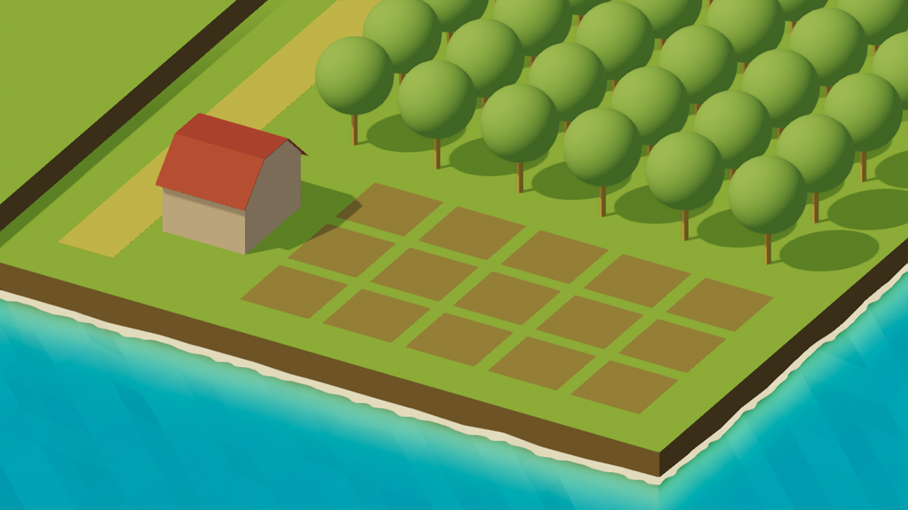

<h1>AI for Game Development: Creating a Farming Game in 5 Days. Part 1</h1>

<div class="author-card">
    <a href="/dylanebert">
        
        <div class="bfc">
            <code>dylanebert</code>
            <span class="fullname">Dylan Ebert</span>
        </div>
  </a>
</div>
 
</head>

<body>

**Welcome to AI for Game Development!** In this series, we'll be using AI tools to create a fully functional farming game in just 5 days. By the end of this series, you will have learned how you can incorporate a variety of AI tools into your game development workflow. I will show you how you can use AI tools for:

1. Art Style
2. Game Design
3. 3D Assets
4. 2D Assets
5. Story

Want the quick video version? You can watch it [here](https://www.tiktok.com/@individualkex). Otherwise, if you want the technical details, keep reading!

<!-- TODO: Update above link to video -->

**Note:** This tutorial is intended for readers who are familiar with Unity development and C#. If you're new to these technologies, check out the [Unity for Beginners](https://www.tiktok.com/@individualkex/video/7086863567412038954?is_from_webapp=1&sender_device=pc&web_id=7043883634428052997) series before continuing.

## Day 1: Art Style

The first step in our game development process **is deciding on the art style**. To decide on the art style for our farming game, we'll be using a tool called Stable Diffusion. Stable Diffusion is an open-source model that generates images based on text descriptions. We'll use this tool to create a visual style for our game.

### Setting up Stable Diffusion

There are a couple options for running Stable Diffusion: *locally* or *online*. If you're on a desktop with a decent GPU and want the fully-featured toolset, I recommend <a href="#locally">locally</a>. Otherwise, you can run an <a href="#online">online</a> solution.

#### Locally <a name="locally"></a>

We'll be running Stable Diffusion locally using the [Automatic1111 WebUI](https://github.com/AUTOMATIC1111/stable-diffusion-webui). This is a popular solution for running Stable Diffusion locally, but it does require some technical knowledge to set up. If you're on Windows and have an Nvidia GPU with at least 8 gigabytes in memory, continue with the instructions below. Otherwise, you can find instructions for other platforms on the [GitHub repository README](https://github.com/AUTOMATIC1111/stable-diffusion-webui), or may opt instead for an <a href="#online">online</a> solution.

##### Installation on Windows:

**Requirements**: An Nvidia GPU with at least 8 gigabytes of memory.

1. Install [Python 3.10.6](https://www.python.org/downloads/windows/). **Be sure to check "Add Python to PATH" during installation.**
2. Install [git](https://git-scm.com/download/win).
3. Clone the repository by typing the following in the Command Prompt:
```
git clone https://github.com/AUTOMATIC1111/stable-diffusion-webui.git
```
4. Download the [Stable Diffusion 1.5 weights](https://huggingface.co/runwayml/stable-diffusion-v1-5). Place them in the `models` directory of the cloned repository.
5. Run the WebUI by running `webui-user.bat` in the cloned repository.
6. Navigate to `localhost://7860` to use the WebUI. If everything is working correctly, it should look something like this:

<figure class="image text-center">
  
</figure> 

#### Online <a name="online"></a>

If you don't meet the requirements to run Stable Diffusion locally, or prefer a more streamlined solution, there are many ways to run Stable Diffusion online.

Free solutions include many [spaces](https://huggingface.co/spaces) here on 🤗 Hugging Face, such as the [Stable Diffusion 2.1 Demo](https://huggingface.co/spaces/stabilityai/stable-diffusion) or the [camemduru webui](https://huggingface.co/spaces/camenduru/webui). You can find a list of additional online services [here](https://github.com/AUTOMATIC1111/stable-diffusion-webui/wiki/Online-Services).

*Note:* Parts of this series will use advanced features such as image2image, which may not be available on all online services.

### Generating Concept Art <a name="generating"></a>

Let's generate some concept art. The steps are simple:

1. Type what you want.
2. Click generate.

<figure class="image text-center">
  
</figure> 

But, how do you get the results you actually want? Prompting can be an art by itself, so it's ok if the first images you generate are not great. There are many amazing resources out there to improve your prompting. I made a [20-second video](https://youtube.com/shorts/8PGucf999nI?feature=share) on the topic. You can also find this more extensive [written guide](https://www.reddit.com/r/StableDiffusion/comments/x41n87/how_to_get_images_that_dont_suck_a/).

The shared point of emphasis of these is to use a source such as [lexica.art](https://lexica.art/) to see what others have generated with Stable Diffusion. Look for images that are similar to the style you want, and get inspired. There is no right or wrong answer here, but here are some tips when generating concept art with Stable Diffusion 1.5:

- Constrain the *form* of the output with words like *isometric, simple, solid shapes*. This produces styles that are easier to reproduce in-game.
- Some keywords, like *low poly*, while on-topic, tend to produce lower-quality results. Try to find alternate keywords that don't degrade results.
- Using names of specific artists is a powerful way to guide the model toward specific styles with higher-quality results.

I settled on the prompt: *isometric render of a farm by a river, simple, solid shapes, james gilleard, atey ghailan*. Here's the result:

<figure class="image text-center">
  
</figure>

### Bringing it to Unity

Now, how do we make this concept art into a game? We'll be using [Unity](https://unity.com/), a popular game engine, to bring our game to life.

1. Create a Unity project using [Unity 2021.9.3f1](https://unity.com/releases/editor/whats-new/2021.3.9) with the [Universal Render Pipeline](https://docs.unity3d.com/Packages/com.unity.render-pipelines.universal@15.0/manual/index.html).
2. Block out the scene using basic shapes. For example, to add a cube, *Right Click -> 3D Object -> Cube*.

<figure class="image text-center">
  
</figure>

3. Set up your [Materials](https://docs.unity3d.com/Manual/Materials.html), using the concept art as a reference. I'm using the basic built-in materials.

<figure class="image text-center">
  
</figure>

4. Set up your [Lighting](https://docs.unity3d.com/Manual/Lighting.html). I'm using a warm sun (#FFE08C, intensity 1.25) with soft ambient lighting (#B3AF91).

<figure class="image text-center">
  
</figure>

5. Set up your [Camera](https://docs.unity3d.com/ScriptReference/Camera.html) **using an orthographic projection** to match the projection of the concept art.

<figure class="image text-center">
  
</figure>

6. Add some water. I'm using the [Stylized Water Shader](https://assetstore.unity.com/packages/vfx/shaders/stylized-water-shader-71207) from the Unity asset store.

<figure class="image text-center">
  
</figure>

7. Finally, set up [Post-processing](https://docs.unity3d.com/Packages/com.unity.render-pipelines.universal@7.1/manual/integration-with-post-processing.html). I'm using ACES tonemapping and +0.2 exposure.

<figure class="image text-center">
  
</figure>

That's it! A simple but appealing scene, made in less than a day! Have questions? Want to get more involved? Join the [Hugging Face Discord](https://t.co/1n75wi976V?amp=1)!

In the next part, we'll be using **AI for Game Design**.

<!-- TODO: Add sneak peak once second article is available -->