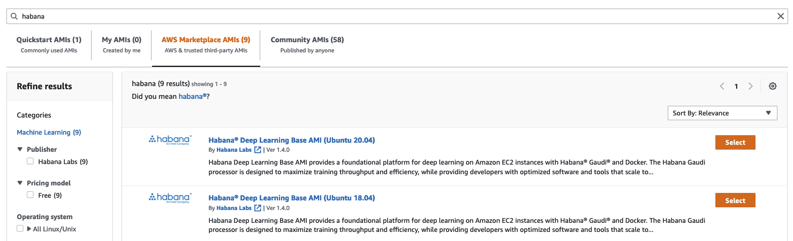
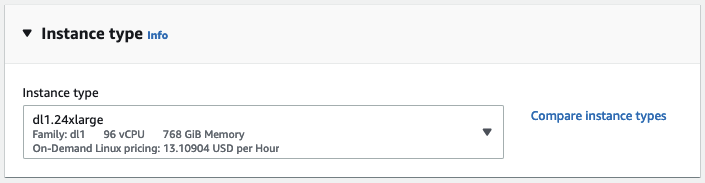
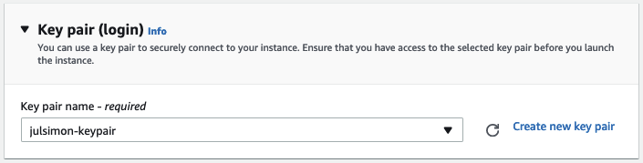
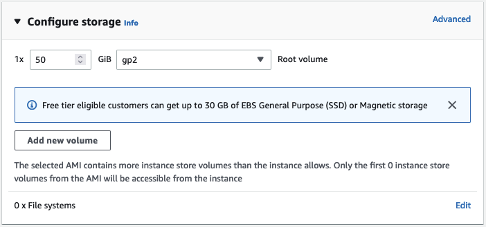
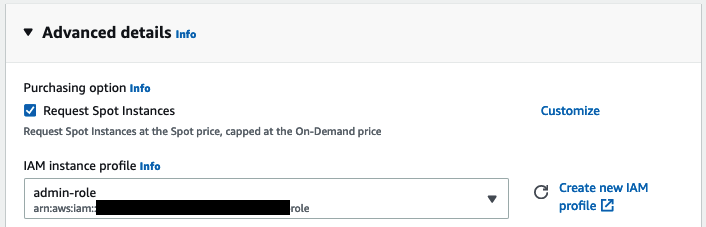

<h1>
Getting Started with Transformers on Habana Gaudi
</h1>


<div class="blog-metadata">
    <small>Published April 26, 2022.</small>
    <a target="_blank" class="btn no-underline text-sm mb-5 font-sans" href="https://github.com/huggingface/blog/blob/main/getting-started-habana.md">
        Update on GitHub
    </a>
</div>

<div class="author-card">
    <a href="https://twitter.com/julsimon">
        
        <div class="bfc">
            <code>juliensimon</code>
            <span class=fullname">Julien Simon</span>
        </div>
    </a>
</div>

A couple of weeks ago, we've had the pleasure to [announce](https://huggingface.co/blog/habana) that [Habana Labs](https://habana.ai) and [Hugging Face](https://huggingface.co/) would partner to accelerate Transformer model training.

Habana Gaudi accelerators deliver up to 40% better price performance for training machine learning models compared to the latest GPU-based Amazon EC2 instances. We are super excited to bring this price performance advantages to Transformers 🚀

In this hands-on post, I'll show you how to quickly set up a Habana Gaudi instance on Amazon Web Services, and then fine-tune a BERT model for text classification. As usual, all code is provided so that you may reuse it in your projects.

Let's get started!


## Setting up an Habana Gaudi instance on AWS

The simplest way to work with Habana Gaudi accelerators is to launch an Amazon EC2 [DL1](https://aws.amazon.com/ec2/instance-types/dl1/) instance. These instances are equipped with 8 Habana Gaudi processors that can easily be put to work thanks to the [Habana Deep Learning Amazon Machine Image](https://aws.amazon.com/marketplace/server/procurement?productId=9a75c51a-a4d1-4470-884f-6be27933fcc8) (AMI).  This AMI comes preinstalled with the [Habana SynapseAI® SDK](https://developer.habana.ai/), and the tools required to run Gaudi accelerated Docker containers. If you'd like to use other AMIs or containers, instructions are available in the [Habana documentation](https://docs.habana.ai/en/latest/AWS_Quick_Starts/index.html).

Starting from the [EC2 console](https://console.aws.amazon.com/ec2sp/v2/) in the us-east-1 region, I first click on **Launch an instance** and define a name for the instance ("habana-demo-julsimon").

Then, I search the Amazon Marketplace for Habana AMIs.

<kbd>
  
</kbd>

I pick the Habana Deep Learning Base AMI (Ubuntu 20.04). 

<kbd>
  
</kbd>

Next, I pick the *dl1.24xlarge* instance size (the only size available).

<kbd>
  
</kbd>

Then, I select the keypair that I'll use to connect to the instance with ```ssh```. If you don't have a keypair, you can create one in place.

<kbd>
  
</kbd>

As a next step, I make sure that the instance allows incoming ```ssh``` traffic. I do not restrict the source address for simplicity, but you should definitely do it in your account.

<kbd>
  
</kbd>

By default, this AMI will start an instance with 8GB of Amazon EBS storage, which won't be enough here. I bump storage to 50GB.

<kbd>
  
</kbd>

Next, I assign an Amazon IAM role to the instance. In real life, this role should have the minimum set of permissions required to run your training job, such as the ability to read data from one of your Amazon S3 buckets. This role is not needed here as the dataset will be downloaded from the Hugging Face hub. If you're not familiar with IAM, I highly recommend reading the [Getting Started](https://docs.aws.amazon.com/IAM/latest/UserGuide/getting-started.html) documentation.

Then, I ask EC2 to provision my instance as a [Spot Instance](https://docs.aws.amazon.com/AWSEC2/latest/UserGuide/using-spot-instances.html), a great way to reduce the $13.11 per hour cost.

<kbd>
  
</kbd>

Finally, I launch the instance. A couple of minutes later, the instance is ready and I can connect to it with ```ssh```. Windows users can do the same with *PuTTY* by following the [documentation](https://docs.aws.amazon.com/AWSEC2/latest/UserGuide/putty.html).

```
ssh -i ~/.ssh/julsimon-keypair.pem ubuntu@ec2-18-207-189-109.compute-1.amazonaws.com
```

On this instance, the last setup step is to pull the Habana container for PyTorch, which is the framework I'll use to fine-tune my model. You can find information on other prebuilt containers and on how to build your own in the Habana [documentation](https://docs.habana.ai/en/latest/Installation_Guide/index.html).

```
docker pull \
vault.habana.ai/gaudi-docker/1.4.0/ubuntu20.04/habanalabs/pytorch-installer-1.10.2:1.4.0-442
```

Once the image has been pulled to the instance, I run it in interactive mode.

```
docker run -it \
--runtime=habana \
-e HABANA_VISIBLE_DEVICES=all \
-e OMPI_MCA_btl_vader_single_copy_mechanism=none \
--cap-add=sys_nice \
--net=host \
--ipc=host vault.habana.ai/gaudi-docker/1.4.0/ubuntu20.04/habanalabs/pytorch-installer-1.10.2:1.4.0-442
```

I'm now ready to fine-tune my model.

## Fine-tuning a text classification model on Habana Gaudi

I first clone the [Optimum Habana](https://github.com/huggingface/optimum-habana) repository inside the container I've just started.

```
git clone https://github.com/huggingface/optimum-habana.git
```

Then, I install the Optimum Habana package from source.

```
cd optimum-habana
python setup.py install
```

Then, I move to the subdirectory containing the text classification example and install the required Python packages.

```
cd examples/text-classification
pip install -r requirements.txt
```

I can now launch the training job, which downloads the [bert-large-uncased-whole-word-masking](https://huggingface.co/bert-large-uncased-whole-word-masking) model from the Hugging Face hub, and fine-tunes it on the [MRPC](https://www.microsoft.com/en-us/download/details.aspx?id=52398) task of the [GLUE](https://gluebenchmark.com/) benchmark. 

Please note that I'm fetching the Habana Gaudi configuration for BERT from the Hugging Face hub, and you could also use your own. In addition, other popular models are supported, and you can find their configuration file in the [Habana organization](https://huggingface.co/Habana).

```
python run_glue.py \
--model_name_or_path bert-large-uncased-whole-word-masking \
--gaudi_config_name Habana/bert-large-uncased-whole-word-masking \
--task_name mrpc \
--do_train \
--do_eval \
--per_device_train_batch_size 32 \
--learning_rate 3e-5 \
--num_train_epochs 3 \
--max_seq_length 128 \
--use_habana \
--use_lazy_mode \
--output_dir ./output/mrpc/
```

After 2 minutes and 39 seconds, the job is complete and has achieved an excellent F1 score of 0.9181, which could certainly improve with more epochs.

```
{'train_runtime': 159.0603, 
 'train_samples_per_second': 69.181, 
 'train_steps_per_second': 2.169, 
 'train_loss': 0.3333333333333333, 
 'epoch': 3.0}

***** eval metrics *****
  epoch                   =        3.0
  eval_accuracy           =     0.8824
  eval_combined_score     =     0.9002
  eval_f1                 =     0.9181
  eval_loss               =      0.368
  eval_runtime            = 0:00:10.48
  eval_samples            =        408
  eval_samples_per_second =     38.899
  eval_steps_per_second   =      4.862
```

Last but not least, I terminate the EC2 instance to avoid unnecessary charges. Looking at the [Savings Summary](https://console.aws.amazon.com/ec2sp/v2/home/spot) in the EC2 console, I see that I saved 70% thanks to Spot Instances, paying only $3.93 per hour instead of $13.11.

<kbd>
  
</kbd>

As you can see, the combination of Transformers, Habana Gaudi, and AWS instances is powerful, simple, and cost-effective. Give it a try and let us know what you think. We definitely welcome your questions and feedback on the [Hugging Face Forum](https://discuss.huggingface.co/).

---

*Please [reach out to Habana](https://habana.ai/contact-us/) to learn more about training Hugging Face models on Gaudi processors.*


  


