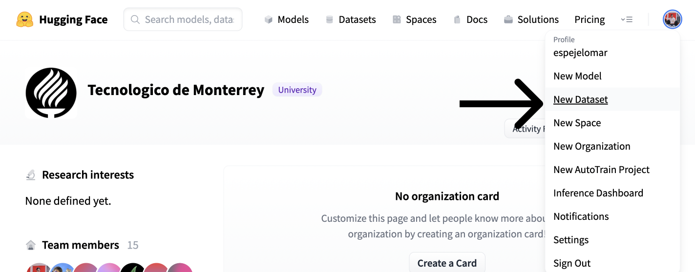
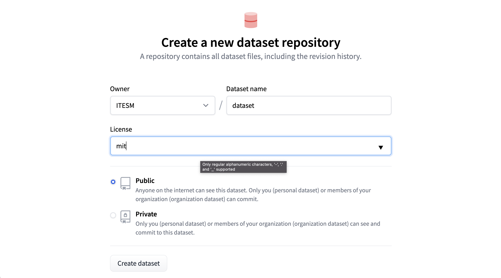
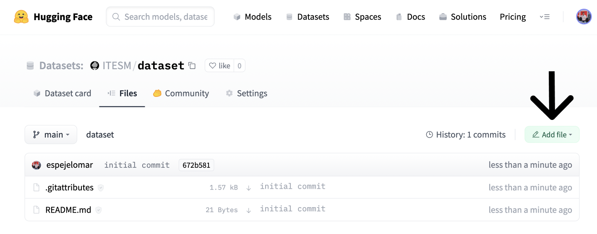
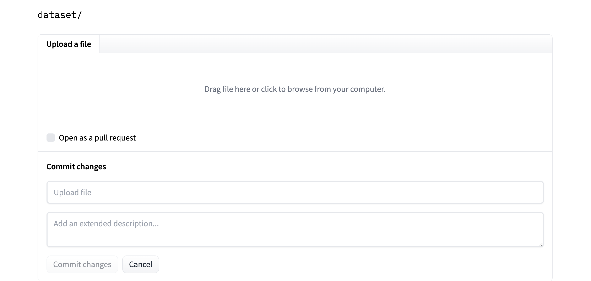

# Getting Started With Embeddings

<!-- {blog_metadata} -->
<!-- {authors} -->

Check out this tutorial with the Notebook Companion:
<a target="_blank" href="https://colab.research.google.com/github/huggingface/blog/blob/main/notebooks/80_getting_started_with_embeddings.ipynb">
    
</a>

## Understanding embeddings

An embedding is a numerical representation of a piece of information, for example, text, documents, images, audio, etc. The representation captures the semantic meaning of what is being embedded, making it robust for many industry applications.

Given the text "What is the main benefit of voting?", an embedding of the sentence could be represented in a vector space, for example, with a list of 384 numbers (for example, [0.84, 0.42, ..., 0.02]). Since this list captures the meaning, we can do exciting things, like calculating the distance between different embeddings to determine how well the meaning of two sentences matches.

Embeddings are not limited to text! You can also create an embedding of an image (for example, a list of 384 numbers) and compare it with a text embedding to determine if a sentence describes the image. This concept is under powerful systems for image search, classification, description, and more!

How are embeddings generated? The open-source library called [Sentence Transformers](https://www.sbert.net/index.html) allows you to create state-of-the-art embeddings from images and text for free. This blog shows an example with this library.

## What are embeddings for?

> "[...] once you understand this ML multitool (embedding), you'll be able to build everything from search engines to recommendation systems to chatbots and a whole lot more. You don't have to be a data scientist with ML expertise to use them, nor do you need a huge labeled dataset." - [Dale Markowitz, Google Cloud](https://cloud.google.com/blog/topics/developers-practitioners/meet-ais-multitool-vector-embeddings).

Once a piece of information (a sentence, a document, an image) is embedded, the creativity starts; several interesting industrial applications use embeddings. E.g., Google Search uses embeddings to [match text to text and text to images](https://cloud.google.com/blog/topics/developers-practitioners/meet-ais-multitool-vector-embeddings); Snapchat uses them to "[serve the right ad to the right user at the right time](https://eng.snap.com/machine-learning-snap-ad-ranking)"; and Meta (Facebook) uses them for [their social search](https://research.facebook.com/publications/embedding-based-retrieval-in-facebook-search/).

Before they could get intelligence from embeddings, these companies had to embed their pieces of information. An embedded dataset allows algorithms to search quickly, sort, group, and more. However, it can be expensive and technically complicated. In this post, we use simple open-source tools to show how easy it can be to embed and analyze a dataset.

## Getting started with embeddings

We will create a small Frequently Asked Questions (FAQs) engine: receive a query from a user and identify which FAQ is the most similar. We will use the [US Social Security Medicare FAQs](https://faq.ssa.gov/en-US/topic/?id=CAT-01092).

But first, we need to embed our dataset (other texts use the terms encode and embed interchangeably). The Hugging Face Inference API allows us to embed a dataset using a quick POST call easily.

Since the embeddings capture the semantic meaning of the questions, it is possible to compare different embeddings and see how different or similar they are. Thanks to this, you can get the most similar embedding to a query, which is equivalent to finding the most similar FAQ. Check out our [semantic search tutorial](https://huggingface.co/spaces/sentence-transformers/embeddings-semantic-search) for a more detailed explanation of how this mechanism works.

In a nutshell, we will:
1. Embed Medicare's FAQs using the Inference API.
2. Upload the embedded questions to the Hub for free hosting.
3. Compare a customer's query to the embedded dataset to identify which is the most similar FAQ.


## 1. Embedding a dataset

The first step is selecting an existing pre-trained model for creating the embeddings. We can choose a model from the [Sentence Transformers library](https://huggingface.co/sentence-transformers). In this case, let's use the ["sentence-transformers/all-MiniLM-L6-v2"](https://huggingface.co/sentence-transformers/all-MiniLM-L6-v2) because it's a small but powerful model. In a future post, we will examine other models and their trade-offs.

Log in to the Hub. You must create a write token in your [Account Settings](http://hf.co/settings/tokens). We will store the write token in `hf_token`.

```py
model_id = "sentence-transformers/all-MiniLM-L6-v2"
hf_token = "get your token in http://hf.co/settings/tokens"
```
To generate the embeddings you can use the `https://api-inference.huggingface.co/pipeline/feature-extraction/{model_id}` endpoint with the headers `{"Authorization": f"Bearer {hf_token}"}`. Here is a function that receives a dictionary with the texts and returns a list with embeddings.

```py
import requests

api_url = f"https://api-inference.huggingface.co/pipeline/feature-extraction/{model_id}"
headers = {"Authorization": f"Bearer {hf_token}"}
```

The first time you generate the embeddings, it may take a while (approximately 20 seconds) for the API to return them. We use the `retry` decorator (install with `pip install retry`) so that if on the first try, `output = query(dict(inputs = texts))` doesn't work, wait 10 seconds and try three times again. This happens because, on the first request, the model needs to be downloaded and installed on the server, but subsequent calls are much faster.

```py
def query(texts):
    response = requests.post(api_url, headers=headers, json={"inputs": texts, "options":{"wait_for_model":True}})
    return response.json()
```

The current API does not enforce strict rate limitations. Instead, Hugging Face balances the loads evenly between all our available resources and favors steady flows of requests. If you need to embed several texts or images, the [Hugging Face Accelerated Inference API](https://huggingface.co/docs/api-inference/index) would speed the inference and let you choose between using a CPU or GPU. 

```py
texts = ["How do I get a replacement Medicare card?",
        "What is the monthly premium for Medicare Part B?",
        "How do I terminate my Medicare Part B (medical insurance)?",
        "How do I sign up for Medicare?",
        "Can I sign up for Medicare Part B if I am working and have health insurance through an employer?",
        "How do I sign up for Medicare Part B if I already have Part A?",
        "What are Medicare late enrollment penalties?",
        "What is Medicare and who can get it?",
        "How can I get help with my Medicare Part A and Part B premiums?",
        "What are the different parts of Medicare?",
        "Will my Medicare premiums be higher because of my higher income?",
        "What is TRICARE ?",
        "Should I sign up for Medicare Part B if I have Veterans' Benefits?"]

output = query(texts)
```

As a response, you get back a list of lists. Each list contains the embedding of a FAQ. The model, ["sentence-transformers/all-MiniLM-L6-v2"](https://huggingface.co/sentence-transformers/all-MiniLM-L6-v2), is encoding the input questions to 13 embeddings of size 384 each. Let's convert the list to a Pandas `DataFrame` of shape (13x384).

```py
import pandas as pd
embeddings = pd.DataFrame(output)
```
It looks similar to this matrix:

```py
[[-0.02388945  0.05525852 -0.01165488 ...  0.00577787  0.03409787  -0.0068891 ]
 [-0.0126876   0.04687412 -0.01050217 ... -0.02310316 -0.00278466   0.01047371]
 [ 0.00049438  0.11941205  0.00522949 ...  0.01687654 -0.02386115   0.00526433]
 ...
 [-0.03900796 -0.01060951 -0.00738271 ... -0.08390449  0.03768405   0.00231361]
 [-0.09598278 -0.06301168 -0.11690582 ...  0.00549841  0.1528919   0.02472013]
 [-0.01162949  0.05961934  0.01650903 ... -0.02821241 -0.00116556   0.0010672 ]]
```

## 2. Host embeddings for free on the Hugging Face Hub

🤗 Datasets is a library for quickly accessing and sharing datasets. Let's host the embeddings dataset in the Hub using the user interface (UI). Then, anyone can load it with a single line of code. You can also use the terminal to share datasets; see [the documentation](https://huggingface.co/docs/datasets/share#share) for the steps. In the [notebook companion](https://colab.research.google.com/github/huggingface/blog/blob/main/notebooks/80_getting_started_with_embeddings.ipynb) of this entry, you will be able to use the terminal to share the dataset. If you want to skip this section, check out the [`ITESM/embedded_faqs_medicare` repo](https://huggingface.co/datasets/ITESM/embedded_faqs_medicare) with the embedded FAQs.

First, we export our embeddings from a Pandas `DataFrame` to a CSV. You can save your dataset in any way you prefer, e.g., zip or pickle; you don't need to use Pandas or CSV. Since our embeddings file is not large, we can store it in a CSV, which is easily inferred by the `datasets.load_dataset()` function we will employ in the next section (see the [Datasets documentation](https://huggingface.co/docs/datasets/about_dataset_load#build-and-load)), i.e., we don't need to create a loading script. We will save the embeddings with the name `embeddings.csv`.

```py
embeddings.to_csv("embeddings.csv", index=False)
```

Follow the next steps to host `embeddings.csv` in the Hub.

* Click on your user in the top right corner of the [Hub UI](https://huggingface.co/).
* Create a dataset with "New dataset." 



* Choose the Owner (organization or individual), name, and license of the dataset. Select if you want it to be private or public. Create the dataset.



* Go to the "Files" tab (screenshot below) and click "Add file" and "Upload file."



* Finally, drag or upload the dataset, and commit the changes.



Now the dataset is hosted on the Hub for free. You (or whoever you want to share the embeddings with) can quickly load them. Let's see how.

## 3. Get the most similar Frequently Asked Questions to a query

Suppose a Medicare customer asks, "How can Medicare help me?". We will **find** which of our FAQs could best answer our user query. We will create an embedding of the query that can represent its semantic meaning. We then compare it to each embedding in our FAQ dataset to identify which is closest to the query in vector space.

Install the 🤗 Datasets library with `pip install datasets`. Then, load the embedded dataset from the Hub and convert it to a PyTorch `FloatTensor`. Note that this is not the only way to operate on a `Dataset`; for example, you could use NumPy, Tensorflow, or SciPy (refer to the [Documentation](https://huggingface.co/docs/datasets/loading)). If you want to practice with a real dataset, the [`ITESM/embedded_faqs_medicare`](https://huggingface.co/datasets/ITESM/embedded_faqs_medicare) repo contains the embedded FAQs, or you can use the [companion notebook](https://colab.research.google.com/github/huggingface/blog/blob/main/notebooks/80_getting_started_with_embeddings.ipynb) to this blog. 

```py
import torch
from datasets import load_dataset

faqs_embeddings = load_dataset('namespace/repo_name')
dataset_embeddings = torch.from_numpy(faqs_embeddings["train"].to_pandas().to_numpy()).to(torch.float)
```
We use the query function we defined before to embed the customer's question and convert it to a PyTorch `FloatTensor` to operate over it efficiently. Note that after the embedded dataset is loaded, we could use the `add_faiss_index` and `search` methods of a `Dataset` to identify the closest FAQ to an embedded query using the [faiss library](https://github.com/facebookresearch/faiss). Here is a [nice tutorial of the alternative](https://huggingface.co/docs/datasets/faiss_es).

```py
question = ["How can Medicare help me?"]
output = query(question)

query_embeddings = torch.FloatTensor(output)
```

You can use the `util.semantic_search` function in the Sentence Transformers library to identify which of the FAQs are closest (most similar) to the user's query. This function uses cosine similarity as the default function to determine the proximity of the embeddings. However, you could also use other functions that measure the distance between two points in a vector space, for example, the dot product.

Install `sentence-transformers` with `pip install -U sentence-transformers`, and search for the five most similar FAQs to the query.

```py
from sentence_transformers.util import semantic_search

hits = semantic_search(query_embeddings, dataset_embeddings, top_k=5)
```

`util.semantic_search` identifies how close each of the 13 FAQs is to the customer query and returns a list of dictionaries with the top `top_k` FAQs. `hits` looks like this:

```py
[{'corpus_id': 8, 'score': 0.75653076171875},
 {'corpus_id': 7, 'score': 0.7418993711471558},
 {'corpus_id': 3, 'score': 0.7252674102783203},
 {'corpus_id': 9, 'score': 0.6735571622848511},
 {'corpus_id': 10, 'score': 0.6505177617073059}]
```

The values ​​in `corpus_id` allow us to index the list of `texts` we defined in the first section and get the five most similar FAQs:

```py
print([texts[hits[0][i]['corpus_id']] for i in range(len(hits[0]))])
```

Here are the 5 FAQs that come closest to the customer's query:

```py
['How can I get help with my Medicare Part A and Part B premiums?',
 'What is Medicare and who can get it?',
 'How do I sign up for Medicare?',
 'What are the different parts of Medicare?',
 'Will my Medicare premiums be higher because of my higher income?']
```

This list represents the 5 FAQs closest to the customer's query. Nice! We used here PyTorch and Sentence Transformers as our main numerical tools. However, we could have defined the cosine similarity and ranking functions by ourselves using tools such as NumPy and SciPy.


## Additional resources to keep learning
If you want to know more about the Sentence Transformers library:

- The [Hub Organization](https://huggingface.co/sentence-transformers) for all the new models and instructions on how to download models.
- The [Nils Reimers tweet](https://twitter.com/Nils_Reimers/status/1487014195568775173) comparing Sentence Transformer models with GPT-3 Embeddings. Spoiler alert: the Sentence Transformers are awesome!
- The [Sentence Transformers documentation](https://www.sbert.net/),
- [Nima's thread](https://twitter.com/NimaBoscarino/status/1535331680805801984) on recent research.

Thanks for reading!
