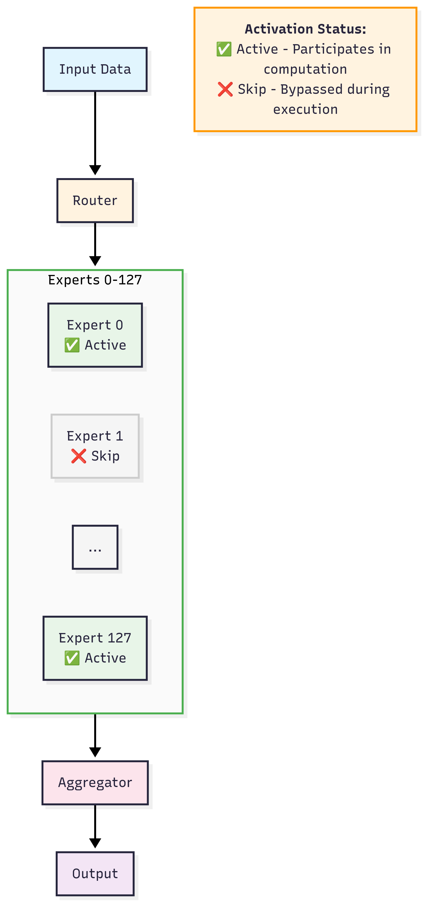
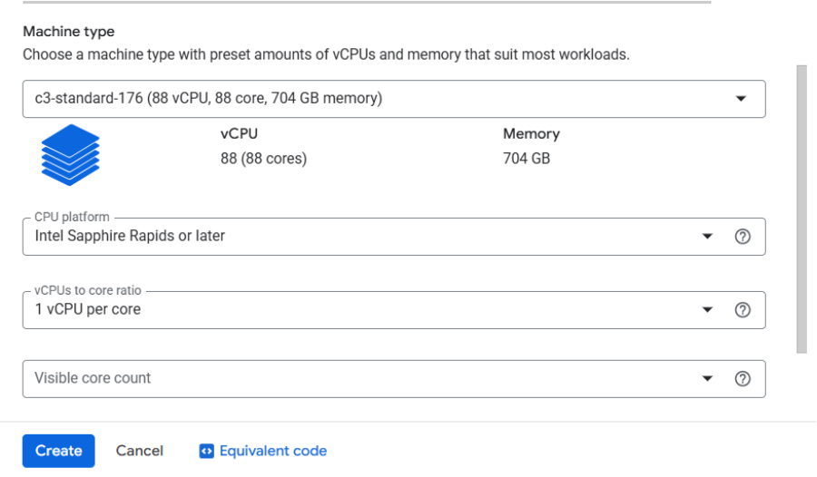
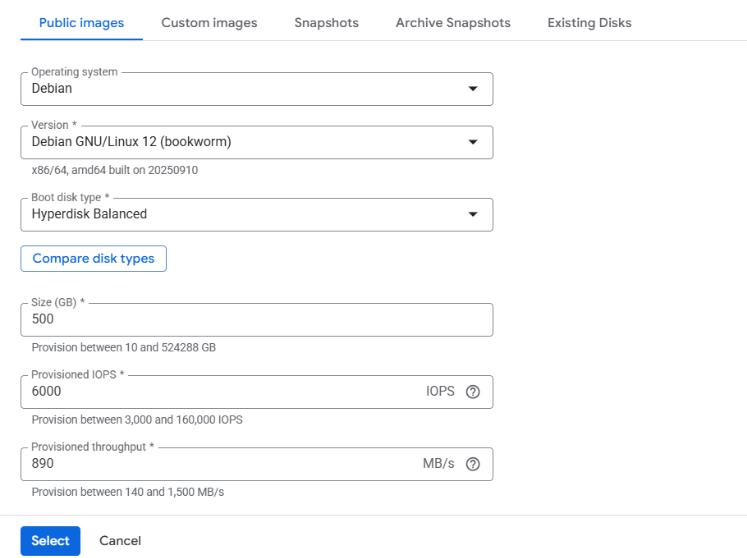
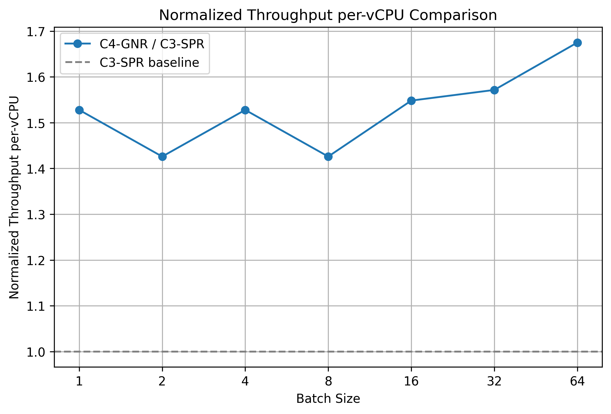
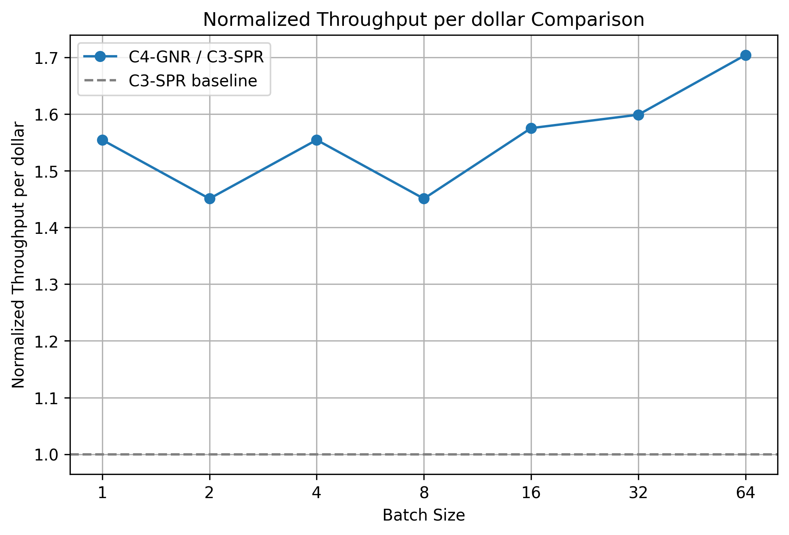

# Optimizing GPT OSS on 6th Gen Xeon at GCP

TL;DR: We benchmarked the text generation performance of OpenAI GPT OSS LLM on Google Cloud C4 (using Intel Xeon 6 "Granite Rapids" (GNR)) and C3 (4th Gen Intel Xeon "Sapphire Rapids" (SPR)) instances. It shows the C4 VM (GNR) delivers:
- 1.4x ~ 1.7x better throughput per vCPU

Combining performance and price (C4 has a lower price per hour over C3), C4 delivers around 1.7× TCO over C3.

## Introduction

GPT OSS is an open-source MoE model released by OpenAI demonstrating strong reasoning quality. Although it has large parameters, only a small subset of experts is activated per token, making CPU inference viable. 

With joint work between Intel and Hugging Face, we merged an expert execution optimization (PR [40304](https://github.com/huggingface/transformers/pull/40304)) that eliminates redundant computation where every expert processed all tokens to transformers. With this optimization, each expert runs only on the tokens it is routed to, removing FLOPs waste and improving effective utilization.

<kbd>
  
</kbd>


## Benchmark Scope & Hardware

We benchmark a large MoE model under a controlled, repeatable generation workload to isolate architectural differences (C3 SPR vs C4 GNR) and MoE execution efficiency. The focus is steady‑state decoding (per‑token latency) and end‑to‑end normalized throughput with increasing batch size while keeping sequence lengths fixed. All runs use static KV cache and SDPA attention for determinism.

### Configuration Summary
- Model: [unsloth/gpt-oss-120b-BF16](https://huggingface.co/unsloth/gpt-oss-120b-BF16)
- Precision: bfloat16
- Task: Text generation
- Input length: 1024 tokens (left‑padded)
- Output length: 1024 tokens
- Batch sizes: 1, 2, 4, 8, 16, 32, 64
- Enabled features:
  - Static KV cache
  - SDPA attention backend
- Reported metrics:
  - Throughput (Total generated tokens per second aggregated over the batch)

### Hardware Under Test
| Instance | Architecture | vCPUs |
|----------|--------------|-------|
| C3       | 4th Gen Xeon (SPR) | 172 |
| C4       | 6th Gen Xeon (GNR) | 144 |


## Create instance
### C3
Visit [google cloud console](https://console.cloud.google.com/) and click on `create a VM` under your project. Follow the steps below to create a 176vCPU instance which corresponds to two Intel Sapphire Rapids sockets.

1. Pick 3 in the `Machine configuration` and specify Machine type as `c3-standard-176`. You can also set the `CPU platform` and turn on all-core turbo to make performance more stable:
   
2. configure OS and storage tab as below:
   
3. keep other configurations as default
4. click `CREATE` button


### C4
Visit [google cloud console](https://console.cloud.google.com/) and click on `create a VM` under your project. Follow the below steps to create a 144 vCPU instance which corresponds to one Intel Granite Rapids processor socket.

1. Pick C4 in the `Machine configuration` tab and specify Machine type as `c4-standard-144`. You can also set the `CPU platform` and turn on all-core turbo to make performance more stable:
   
2. configure OS and storage tab as we need for C3.
3. keep other configurations as default
4. click `CREATE` button


## Set up environment
Please SSH connect to the instance and install docker. Follow the steps below to set up the environment easily. For reproducibility, we list the version and commit we are using in the commands.

1. `$ git clone https://github.com/huggingface/transformers.git`
2. `$ cd transformers/`
3. `$ git checkout 26b65fb5168f324277b85c558ef8209bfceae1fe`
4. `$ cd docker/transformers-intel-cpu/`
5. `$ sudo docker build . -t <your_docker_image_tag>`
6. `$ sudo docker run -it --rm --privileged -v /home/<your_home_folder>:/workspace <your_docker_image_tag> /bin/bash`

We are in container now, do following steps.

1. `$ pip install "transformers"@git+https://github.com/huggingface/transformers.git@26b65fb5168f324277b85c558ef8209bfceae1fe`
2. `$ pip install torch==2.8.0 torchvision torchaudio --index-url https://download.pytorch.org/whl/cpu`


## Benchmark Procedure

For each batch size we
1. Build a fixed 1024‑token left‑padded batch.
2. Run a single warm‑up generation on the same inputs (excluded from timing).
3. set `max_new_tokens=1024` and measure total latency, then derive `throughput = (OUTPUT_TOKENS * batch_size) / total_latency`.

Run `numactl -l python benchmark.py` for the following codes.

```python
import os
import time
import torch
from datasets import load_dataset
from transformers import AutoModelForCausalLM, AutoTokenizer

INPUT_TOKENS = 1024
OUTPUT_TOKENS = 1024

def get_inputs(tokenizer, batch_size):
    dataset = load_dataset("ola13/small-the_pile", split="train")
    tokenizer.padding_side = "left"
    selected_texts = []
    for sample in dataset:
        input_ids = tokenizer(sample["text"], return_tensors="pt").input_ids
        if len(selected_texts) == 0 and input_ids.shape[-1] >= INPUT_TOKENS:
            selected_texts.append(sample["text"])
        elif len(selected_texts) > 0:
            selected_texts.append(sample["text"])
        if len(selected_texts) == batch_size:
            break

    return tokenizer(selected_texts, max_length=INPUT_TOKENS, padding="max_length", truncation=True, return_tensors="pt")

def run_generate(model, inputs, generation_config):
    inputs["generation_config"] = generation_config
    model.generate(**inputs) # warm up
    pre = time.time()
    model.generate(**inputs)
    latency = (time.time() - pre)
    return latency

def benchmark(model, tokenizer, batch_size, generation_config):
    inputs = get_inputs(tokenizer, batch_size)
    generation_config.max_new_tokens = 1
    generation_config.min_new_tokens = 1
    prefill_latency = run_generate(model, inputs, generation_config)
    generation_config.max_new_tokens = OUTPUT_TOKENS
    generation_config.min_new_tokens = OUTPUT_TOKENS
    total_latency = run_generate(model, inputs, generation_config)
    decoding_latency = (total_latency - prefill_latency) / (OUTPUT_TOKENS - 1)
    throughput = OUTPUT_TOKENS * batch_size / total_latency

    return prefill_latency, decoding_latency, throughput


if __name__ == "__main__":
    model_id = "unsloth/gpt-oss-120b-BF16"
    tokenizer = AutoTokenizer.from_pretrained(model_id)
    model_kwargs = {"dtype": torch.bfloat16}
    model = AutoModelForCausalLM.from_pretrained(model_id, **model_kwargs)
    model.config._attn_implementation="sdpa"
    generation_config = model.generation_config
    generation_config.do_sample = False
    generation_config.cache_implementation="static"

    for batch_size in [1, 2, 4, 8, 16, 32, 64]:
        print(f"---------- Run generation with batch size = {batch_size} ----------", flush=True)
        prefill_latency, decoding_latency, throughput = benchmark(model, tokenizer, batch_size, generation_config)
        print(f"throughput = {throughput}", flush=True)
```


## Results
### Normalized Throughput per vCPU
Across batch sizes up to 64, C4 consistently outperforms C3 with a 1.4x ~ 1.7× throughput per-vCPU. The formula is:

`normalized_throughput_per_vCPU = (throughput_C4 / vCPUs_C4) / (throughput_C3 / vCPUs_C3)`

<kbd>
  
</kbd>

### Cost & TCO Perspective
C4-GNR features lower cost and higher throughput than C3-SPR. As illustrated in the figure below, under the same budget, the throughput of C4-GNR can reach 1.4x to 1.7x that of C3-SPR. The formula is:

`normalized_throughput_per_dollar = (throughput_C4 / cost_C4) / (throughput_C3 / cost_C3)`

<kbd>
  
</kbd>
The TCO can reach 1.7x when the batch size is 64. 


## Key Takeaways
- Intel Granite Rapids (C4) provides both performance gains and better cost efficiency for large MoE inference.


## Conclusion

C4 (Xeon 6 GNR) establishes a clear advantage over C3 (4th Gen Xeon SPR) for GPT OSS MoE inference, combining higher throughput, and reduced cost. These results underline that with targeted framework optimizations, large MoE models can be efficiently served on next-generation general-purpose CPUs. 
