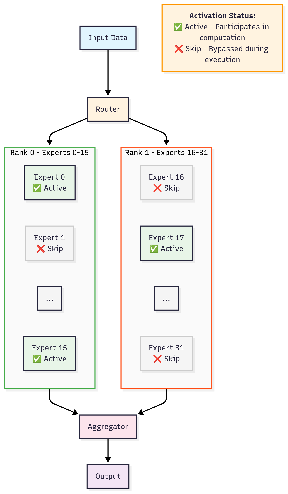
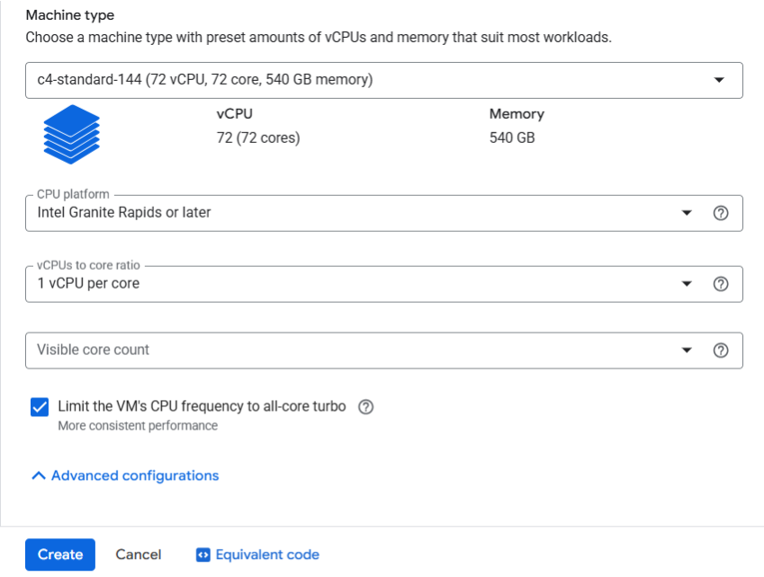
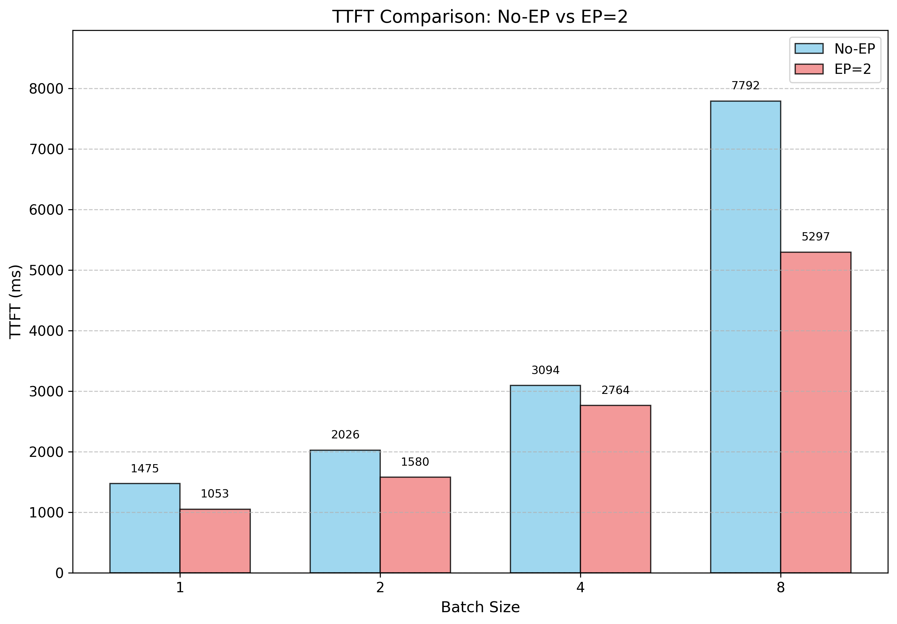
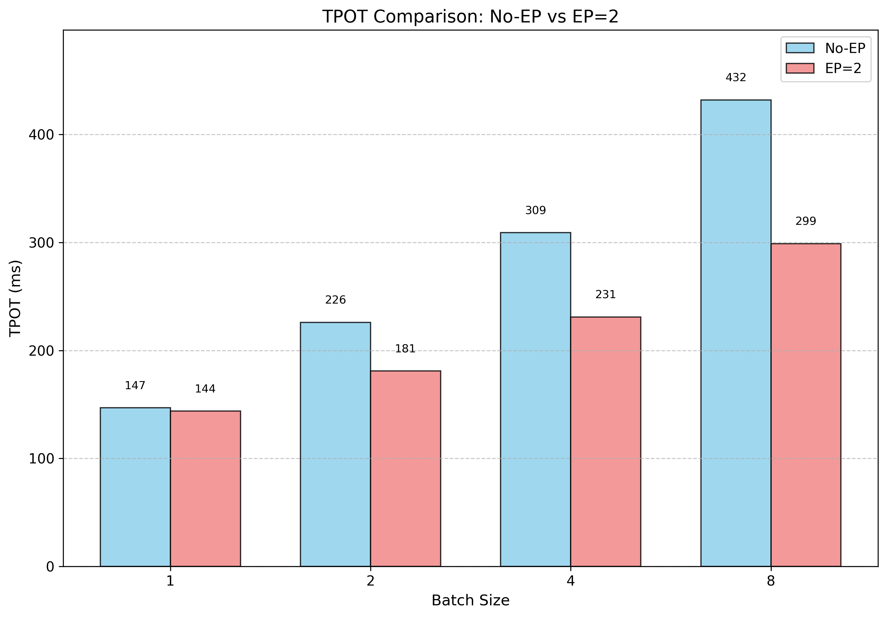
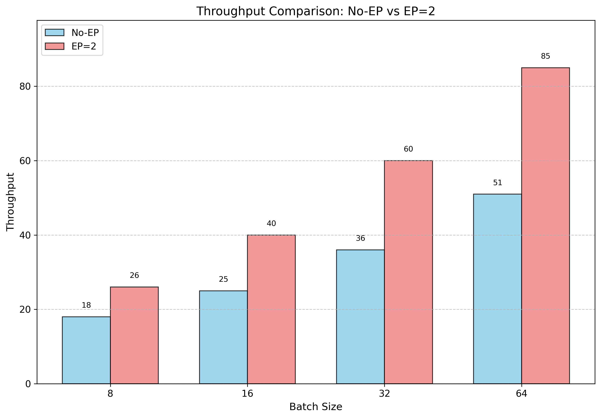

# Optimizing GPT OSS on 6th Gen Xeon at GCP

With our optimization, GPT-OSS achieves inference speeds that approach human reading speed up to batch size 4. We have merged all optimizations into Transformers, so users can benefit from them out of the box. Users can reproduce the resultes in this blog on GNR powered C4 by following this blog.


## Introduction

GPT OSS is an open-weight model known for its strong reasoning and versatility. Its MoE architecture, while having a large number of parameters, activates only a small subset during inference. This makes it possible to run large models on Intel Xeon CPUs, where Expert Parallelism can further improve performance by distributing the computation of experts across multiple processes.

The following diagram briefly shows our optimizations on the experts.

<kbd>
  
</kbd>

The first optimization in PR [40304](https://github.com/huggingface/transformers/pull/40304) focus on the expert computing strategy. Previously, Transformers computed all tokens for every expert, leading to unnecessary computation overhead. With our optimization, each expert processes only the tokens it activates.

The second optimization in [40545](https://github.com/huggingface/transformers/pull/40545) enables native transfomers expert parallelism for GPT OSS model. EP (Expert Parallelism) is a technique used to distribute the computation of experts across multiple computation resources.

In this blog, we benchmark the bfloat16 version of GPT OSS model [lmsys/gpt-oss-20b-bf16](https://huggingface.co/lmsys/gpt-oss-20b-bf16) on Intel 6th Gen Xeon GNR CPUs at GCP C4. The task is text generation with input sequence length 1024 and output sequence length 1024, and we sweep batch size from 1 to 64.


## Create C4 instance
Visit [google cloud console](https://console.cloud.google.com/) and click on `create a VM` under your project. Follow the below steps to create a 288-vcpu instance which corresponds to one Intel Granite Rapids socket.

1. pick C4 in `Machine configuration` tab and specify `Machine type` as `c4-standard-288`. You can also set `CPU platform` and turn on all-core turbo to make performance more stable:
   
2. keep other configurations as default
3. click `CREATE` button


## Set up environment
Run `vim Dockerfile` and paste the following codes.

```dockerfile
FROM intel/deep-learning-essentials:2025.1.3-0-devel-ubuntu24.04 AS base
SHELL ["/bin/bash", "-c"]

ARG PYTHON_VERSION=3.12
ENV DEBIAN_FRONTEND=noninteractive

RUN apt-get update && \
    apt-get install -y software-properties-common && \
    add-apt-repository -y ppa:deadsnakes/ppa && \
    apt-get update

RUN apt-get update && apt-get -y install apt-utils build-essential ca-certificates \
    clinfo curl git git-lfs vim numactl python3-dev wget google-perftools \
    && apt-get clean \
    && rm -rf /var/lib/apt/lists/*

# Use virtual env because Ubuntu:24 does not allowed pip on original python
RUN curl -LsSf https://astral.sh/uv/install.sh | sh
ENV PATH="/root/.local/bin:$PATH"
ENV VIRTUAL_ENV="/opt/venv"
ENV UV_PYTHON_INSTALL_DIR=/opt/uv/python
RUN uv venv --python ${PYTHON_VERSION} --seed ${VIRTUAL_ENV}
ENV PATH="$VIRTUAL_ENV/bin:$PATH"

RUN pip install torch torchvision torchaudio torchcodec --index-url https://download.pytorch.org/whl/cpu --no-cache-dir
RUN pip install -U datasets transformers accelerate intel-openmp

ENV LD_PRELOAD=${LD_PRELOAD}:/opt/venv/lib/libiomp5.so:/usr/lib/x86_64-linux-gnu/libtcmalloc.so.4
ENV KMP_AFFINITY=granularity=fine,compact,1,0

RUN touch /entrypoint.sh && chmod +x /entrypoint.sh
RUN echo "#!/bin/bash" >> /entrypoint.sh && echo "/bin/bash" >> /entrypoint.sh

ENTRYPOINT ["/entrypoint.sh"]
```

Run `sudo docker build . -t <your_docker_image_tag>`, then, run `sudo docker run -it --rm --privileged -v /home/<your_home_folder>:/workspace <your_docker_image_tag> /bin/bash`

We are in container now, do following steps:
`pip install git+https://github.com/huggingface/transformers.git`


## Benchmark

Run `vim benchmark.py` and paste the following codes.

```python
import os
import time
import torch
from datasets import load_dataset
from transformers import AutoModelForCausalLM, AutoTokenizer

os.environ['RANK'] = str(os.environ.get('PMI_RANK', 0))
os.environ['LOCAL_RANK'] = str(os.environ.get('PMI_RANK', 0))
os.environ['WORLD_SIZE'] = str(os.environ.get('PMI_SIZE', 1))
INPUT_TOKENS = 1024
OUTPUT_TOKENS = 1024

def get_inputs(tokenizer, batch_size):
    dataset = load_dataset("ola13/small-the_pile", split="train")
    tokenizer.padding_side = "left"
    selected_texts = []
    for sample in dataset:
        input_ids = tokenizer(sample["text"], return_tensors="pt").input_ids
        if len(selected_texts) == 0 and input_ids.shape[-1] >= INPUT_TOKENS:
            selected_texts.append(sample["text"])
        elif len(selected_texts) > 0:
            selected_texts.append(sample["text"])
        if len(selected_texts) == batch_size:
            break

    return tokenizer(selected_texts, max_length=INPUT_TOKENS, padding="max_length", truncation=True, return_tensors="pt")

def run_generate(model, inputs, generation_config):
    inputs["generation_config"] = generation_config
    pre = time.time()
    model.generate(**inputs)
    latency = (time.time() - pre)
    return latency

def benchmark(model, tokenizer, batch_size, generation_config):
    inputs = get_inputs(tokenizer, batch_size)
    generation_config.max_new_tokens = 8
    generation_config.min_new_tokens = 8
    _ = run_generate(model, inputs, generation_config) # warm_up
    generation_config.max_new_tokens = 1
    generation_config.min_new_tokens = 1
    prefill_latency = run_generate(model, inputs, generation_config)
    generation_config.max_new_tokens = OUTPUT_TOKENS
    generation_config.min_new_tokens = OUTPUT_TOKENS
    total_latency = run_generate(model, inputs, generation_config)
    decoding_latency = (total_latency - prefill_latency) / (OUTPUT_TOKENS - 1)
    throughput = OUTPUT_TOKENS * batch_size / total_latency

    return prefill_latency, decoding_latency, throughput


if __name__ == "__main__":
    model_id = "lmsys/gpt-oss-20b-bf16"
    tokenizer = AutoTokenizer.from_pretrained(model_id)
    model_kwargs = {"dtype": torch.bfloat16}
    if int(os.environ.get("WORLD_SIZE", 0)) > 1:
        model_kwargs["tp_plan"] = "auto"
    model = AutoModelForCausalLM.from_pretrained(model_id, **model_kwargs)
    model.config._attn_implementation="sdpa"
    generation_config = model.generation_config
    generation_config.do_sample = False
    generation_config.cache_implementation="static"

    for batch_size in [1, 2, 4, 8, 16, 32, 64]:
        if int(os.environ['RANK']) == 0:
            print(f"---------- Run generation with batch size = {batch_size} ----------", flush=True)
        prefill_latency, decoding_latency, throughput = \
            benchmark(model, tokenizer, batch_size, generation_config)
        if int(os.environ['RANK']) == 0:
            print(f"TTFT = {prefill_latency * 1000} ms", flush=True)
            print(f"TPOT = {decoding_latency * 1000} ms", flush=True)
            print(f"throughput = {throughput}", flush=True)
```

Run `numactl -C 0-71 --membind 0 python benchmark.py` to get the performance without EP.

Run `mpirun -np 2 --map-by ppr:1:numa --bind-to numa -genv MASTER_ADDR=127.0.0.1 -genv MASTER_PORT=29500 -genv OMP_NUM_THREADS=24 python benchmark.py` to get the performance with EP=2.


## Results and Conclusion

The following figures show the performance results for TTFT (Time to First Token) and TPOT (Time per Output Token) under batch sizes 1~8.

<kbd>
  
</kbd>

<kbd>
  
</kbd>

From the figures above, we can see that with EP enabled, the model achieves human reading speed (240-300 ms/token) up to batch size 8, where the TPOT is 299 ms/token.

The following figures show the throughputs under batch sizes 8~64.

<kbd>
  
</kbd>

From the throughput figure, we can observe that EP significantly improves throughput. With EP enabled, the model achieves a throughput of 85 tokens/second at batch size 64.

This blog demonstrates the potential of running large MoE models on CPUs. With further optimizations, we look forward to unlocking even greater performance on CPU-based systems in the future.
