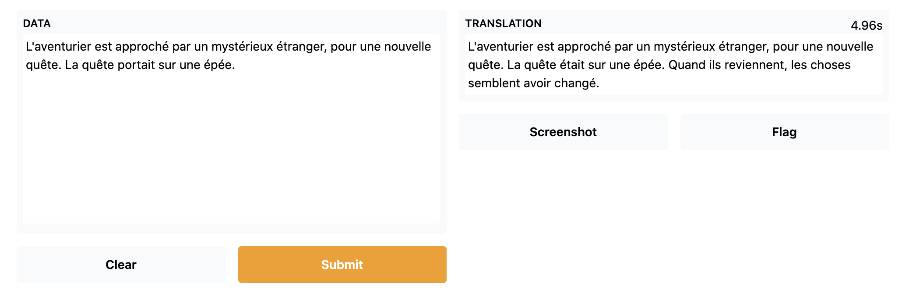

<h1>
    Showcase Your Projects in Spaces using Gradio
</h1>

<div class="blog-metadata">
    <small>Published September 21, 2021.</small>
    <a target="_blank" class="btn no-underline text-sm mb-5 font-sans" href="https://github.com/huggingface/blog/blob/master/gradio-spaces.md">
        Update on GitHub
    </a>
</div>

<div class="author-card">
    <a href="/merve">
        
        <div class="bfc">
            <code>merve</code>
            <span class="fullname">Merve Noyan</span>
        </div>
    </a>
</div>


It's so easy to demonstrate a Machine Learning project thanks to [Gradio](https://gradio.app/). 
In this blog post, we'll walk you through:
- the recent Gradio integration that helps you demo models from the Hub seamlessly with few lines of code leveraging the [Inference API](https://huggingface.co/inference-api).
- how to use Hugging Face Spaces to host demos of your own models.


## Hugging Face Hub Integration in Gradio

You can demonstrate your models in the Hub easily. You only need to define the [Interface](https://gradio.app/docs#interface) that includes:
- The repository ID of the model you want to infer with
- define a description and title
- maybe even an example input to guide your audience.
After defining your Interface, just call `.launch()` and your demo will start running. You can do this in Colab, but if you want to share it with the community a great option is to use Spaces!

Spaces are a simple, free way to host your ML demo apps in Python. To do so, you can create a repository at https://huggingface.co/new-space and select Gradio as the SDK.  Once done, you can create a file called `app.py`, copy the code below, and in few seconds your app will be up and running!

```
import gradio as gr
description = "Story generation with GPT-2"
title = "Generate your own story 
interface = gr.Interface.load("huggingface/pranavpsv/gpt2-genre-story-generator",
description=description,
examples=[["Adventurer is approached by a mysterious stranger in the tavern for a new quest."]]
)
interface.launch()
```
You can play with Story Generation model [here](https://huggingface.co/spaces/merve/GPT-2-story-gen)


This integration supports different types of models, `image-to-text`, `speech-to-text`, `text-to-speech` and more. You can check out this example BigGAN ImageNet text-to-image model [here](https://huggingface.co/spaces/merve/BigGAN-ImageNET)


## Serving Custom Model Checkpoints with Gradio in Hugging Face Spaces

You can serve your models in Spaces even if your model is not supported by the Inference API. Just wrap your model inference in a Gradio `Interface` as described below and put it in Spaces. 


## Mix and Match Models!

Using Gradio Series, you can mix-and-match different models! Here, we've put French to English translation model on top of the story generator and English to French translation model at the end of the generator model to simply make a French story generator.

```
import gradio as gr
from gradio.mix import Series

description = "Generate your own D&D story!"
title = "French Story Generator using Opus MT and GPT-2"
translator_fr = gr.Interface.load("huggingface/Helsinki-NLP/opus-mt-fr-en")
story_gen = gr.Interface.load("huggingface/pranavpsv/gpt2-genre-story-generator")
translator_en = gr.Interface.load("huggingface/Helsinki-NLP/opus-mt-en-fr")

Series(translator_fr, story_gen, translator_en, description = description,
title = title,
examples=[["L'aventurier est approché par un mystérieux étranger, pour une nouvelle quête."]], inputs = gr.inputs.Textbox(lines = 10)).launch()

```
You can check out the French Story Generator [here](https://huggingface.co/spaces/merve/french-story-gen)


## Uploading your Models to the Spaces

You can serve your demos in Hugging Face thanks to Spaces! To do this, simply create a new Space, and then drag and drop your demos or use Git. 


Easily build your first demo with Spaces [here](https://huggingface.co/spaces)!