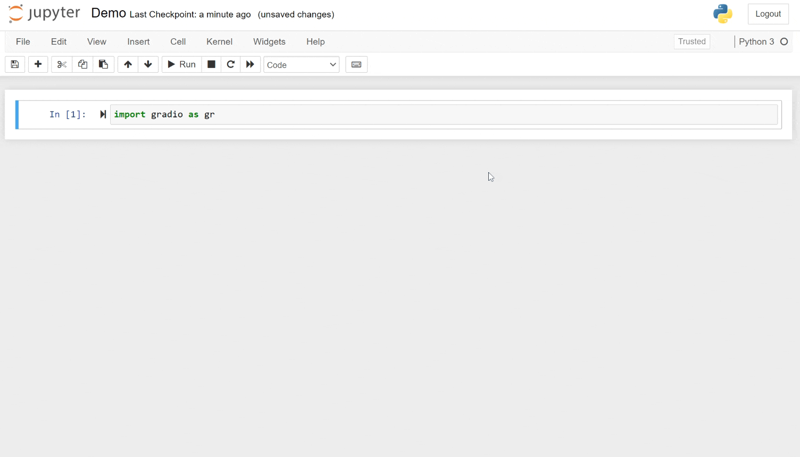
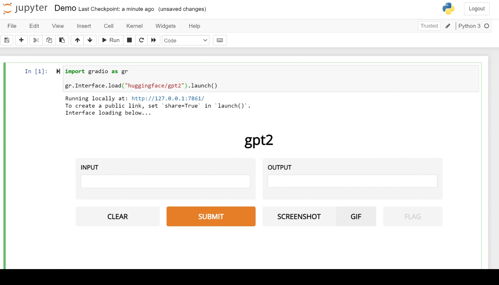
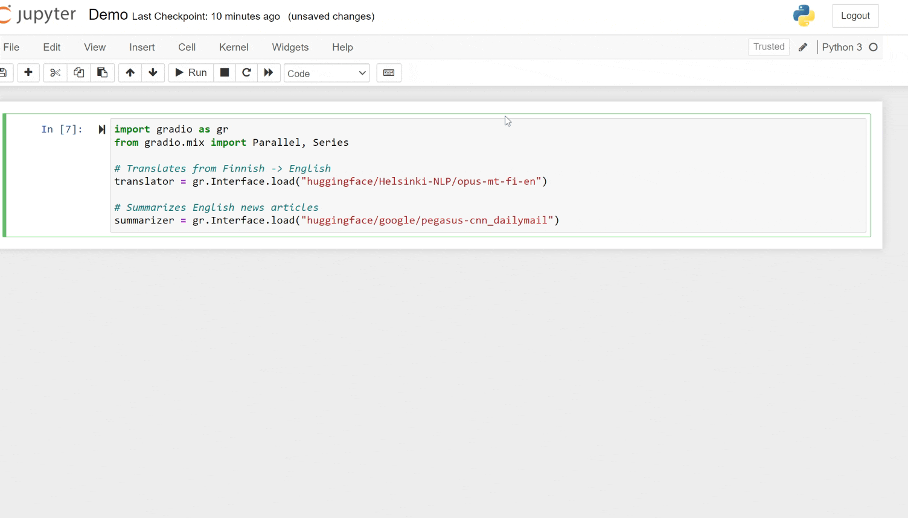

# Using & Mixing Hugging Face Models with Gradio 2.0

> ##### Cross-posted from the&nbsp;[Gradio blog](https://gradio.app/blog/using-huggingface-models).

{blog_metadata}
{authors}

The **[Hugging Face Model Hub](https://huggingface.co/models)** has more than 10,000 machine learning models submitted by users. You’ll find all kinds of natural language processing models that, for example, translate between Finnish and English or recognize Chinese speech. More recently, the Hub has expanded to even include models for image classification and audio processing. 

Hugging Face has always worked to make models accessible and easy to use. The `transformers` library makes it possible to load a model in a few lines of code. After a model is loaded, it can be used to make predictions on new data programmatically.  _But it’s not just programmers that are using machine learning models!_ An increasingly common scenario in machine learning is **demoing models to interdisciplinary teams** or letting **non-programmers use models** (to help discover biases, failure points, etc.). 

The **[Gradio library](https://gradio.app/)** lets machine learning developers create demos and GUIs from machine learning models very easily, and share them for free with your collaborators as easily as sharing a Google docs link. Now, we’re excited to share that the Gradio 2.0 library lets you **_load and use almost any Hugging Face model_ _with a GUI_** **_in just 1 line of code_**. Here’s an example:

By default, this uses HuggingFace’s hosted Inference API (you can supply your own API key or use the public access without an API key), or you can also run `pip install transformers` and run the model computations locally if you’d like.

Do you want to customize the demo? You can override any of the default parameters of the [Interface class](https://gradio.app/docs) by passing in your own parameters:

**_But wait, there’s more!_** With 10,000 models already on Model Hub, we see models not just as standalone pieces of code, but as lego pieces that can be **composed and mixed** to create more sophisticated applications and demos. 

For example, Gradio lets you load multiple models in _parallel_ (imagine you want to compare 4 different text generation models from Hugging Face to see which one is the best for your use case):

Or put your models in _series_. This makes it easy to build complex applications built from multiple machine learning models. For example, here we can build an application to translate and summarize Finnish news articles in 3 lines of code:

You can even mix multiple models in _series_ compared to each other in _parallel_ (we’ll let you try that yourself!). To try any of this out, just install Gradio (`pip install gradio`) and pick a Hugging Face model you want to try. Start building with Gradio and Hugging Face 🧱⛏️
