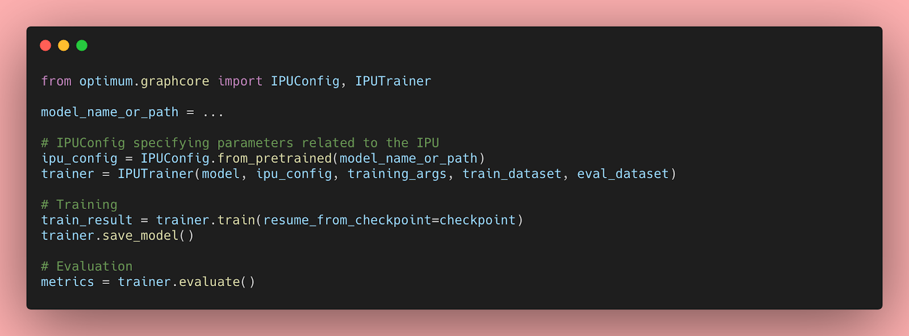

# Getting Started with Hugging Face Transformers for IPUs with Optimum


{authors}

Transformer models have proven to be extremely efficient on a wide range of machine learning tasks, such as natural language processing, audio processing, and computer vision. However, the prediction speed of these large models can make them impractical for latency-sensitive use cases like conversational applications or search. Furthermore, optimizing their performance in the real world requires considerable time, effort and skills that are beyond the reach of many companies and organizations. 

Luckily, Hugging Face has introduced [Optimum](https://huggingface.co/hardware), an open source library which makes it much easier to reduce the prediction latency of Transformer models on a variety of hardware platforms. In this blog post, you will learn how to accelerate Transformer models for the Graphcore [Intelligence Processing Unit](https://www.graphcore.ai/products/ipu) (IPU), a highly flexible, easy-to-use parallel processor designed from the ground up for AI workloads.

### Optimum Meets Graphcore IPU

Through this partnership between Graphcore and Hugging Face, we are now introducing BERT as the first IPU-optimized model. We will be introducing many more of these IPU-optimized models in the coming months, spanning applications such as vision, speech, translation and text generation.

Graphcore engineers have implemented and optimized BERT for our IPU systems using Hugging Face transformers to help developers easily train, fine-tune and accelerate their state-of-the-art models.

### Getting started with IPUs and Optimum

Let’s use BERT as an example to help you get started with using Optimum and IPUs.

In this guide, we will use an [IPU-POD16](https://www.graphcore.ai/products/mk2/ipu-pod16) system in Graphcloud, Graphcore’s cloud-based machine learning platform and follow PyTorch setup instructions found in [Getting Started with Graphcloud](https://docs.graphcore.ai/projects/graphcloud-getting-started/en/latest/index.html).

Graphcore’s [Poplar SDK](https://www.graphcore.ai/developer) is already installed on the Graphcloud server. If you have a different setup, you can find the instructions that apply to your system in the [PyTorch for the IPU: User Guide](https://docs.graphcore.ai/projects/poptorch-user-guide/en/latest/intro.html).

#### Set up the Poplar SDK Environment
 
You will need to run the following commands to set several environment variables that enable Graphcore tools and Poplar libraries. On the latest system running Poplar SDK version 2.3 on Ubuntu 18.04, you can find <sdk-path> in the folder ```/opt/gc/poplar_sdk-ubuntu_18_04-2.3.0+774-b47c577c2a/```. 

You would need to run both enable scripts for Poplar and PopART (Poplar Advanced Runtime) to use PyTorch:

```
$ cd /opt/gc/poplar_sdk-ubuntu_18_04-2.3.0+774-b47c577c2a/
$ source poplar-ubuntu_18_04-2.3.0+774-b47c577c2a/enable.sh
$ source popart-ubuntu_18_04-2.3.0+774-b47c577c2a/enable.sh
```

#### Set up PopTorch for the IPU

PopTorch is part of the Poplar SDK. It provides functions that allow PyTorch models to run on the IPU with minimal code changes. You can create and activate a PopTorch environment following the guide [Setting up PyTorch for the IPU](https://docs.graphcore.ai/projects/graphcloud-pytorch-quick-start/en/latest/pytorch_setup.html):

```
$ virtualenv -p python3 ~/workspace/poptorch_env
$ source ~/workspace/poptorch_env/bin/activate
$ pip3 install -U pip
$ pip3 install /opt/gc/poplar_sdk-ubuntu_18_04-2.3.0+774-b47c577c2a/poptorch-<sdk-version>.whl
```

#### Install Optimum Graphcore

Now that your environment has all the Graphcore Poplar and PopTorch libraries available, you need to install the latest 🤗 Optimum Graphcore package in this environment. This will be the interface between the 🤗 Transformers library and Graphcore IPUs.

Please make sure that the PopTorch virtual environment you created in the previous step is activated. Your terminal should have a prefix showing the name of the poptorch environment like below:

```
(poptorch_env) user@host:~/workspace/poptorch_env$ pip3 install optimum[graphcore] optuna
```

#### Clone Optimum Graphcore Repository

The Optimum Graphcore repository contains the sample code for using Optimum models in IPU. You should clone the repository and change the directory to the ```example/question-answering``` folder which contains the IPU implementation of BERT.

```
$ git clone https://github.com/huggingface/optimum-graphcore.git
$ cd optimum-graphcore/examples/question-answering
```

Now, we will use ```run_qa.py``` to fine-tune the IPU implementation of [BERT](https://huggingface.co/bert-large-uncased) on the SQUAD1.1 dataset. 

#### Run a sample to fine-tune BERT on SQuAD1.1 

The ```run_qa.py``` script only works with models that have a fast tokenizer (backed by the 🤗 Tokenizers library), as it uses special features of those tokenizers. This is the case for our [BERT](https://huggingface.co/bert-large-uncased) model, and you should pass its name as the input argument to ```--model_name_or_path```. In order to use the IPU, Optimum will look for the ```ipu_config.json``` file from the path passed to the argument ```--ipu_config_name```. 

```
$ python3 run_qa.py \
	--ipu_config_name=./ \
	--model_name_or_path bert-base-uncased \
	--dataset_name squad \
	--do_train \
	--do_eval \
	--output_dir output \
	--overwrite_output_dir \
	--per_device_train_batch_size 2 \
	--per_device_eval_batch_size 2 \
--learning_rate 6e-5 \
--num_train_epochs 3 \
--max_seq_length 384 \
--doc_stride 128 \
--seed 1984 \
--lr_scheduler_type linear \
--loss_scaling 64 \
--weight_decay 0.01 \
--warmup_ratio 0.1 \
--output_dir /tmp/debug_squad/
```

### A closer look at Optimum-Graphcore
 
#### Getting the data
 
A very simple way to get datasets is to use the Hugging Face [Datasets library](https://github.com/huggingface/datasets), which makes it easy for developers to download and share datasets on the Hugging Face hub. It also has pre-built data versioning based on git and git-lfs, so you can iterate on updated versions of the data by just pointing to the same repo. 

Here, the dataset comes with the training and validation files, and dataset configs to help facilitate which inputs to use in each model execution phase. The argument ```--dataset_name==squad``` points to [SQuAD v1.1](https://huggingface.co/datasets/squad) on the Hugging Face Hub. You could also provide your own CSV/JSON/TXT training and evaluation files as long as they follow the same format as the SQuAD dataset or another question-answering dataset in Datasets library.

#### Loading the pretrained model and tokenizer
 
To turn words into tokens, this script will require a fast tokenizer. It will show an error if you didn't pass one. For reference, here's the [list](https://huggingface.co/transformers/index.html#supported-frameworks) of supported tokenizers.

``` 
	# Tokenizer check: this script requires a fast tokenizer.
	if not isinstance(tokenizer, PreTrainedTokenizerFast):
    	raise ValueError("This example script only works for models that have a fast tokenizer. Checkout the big table of models
        	"at https://huggingface.co/transformers/index.html#supported-frameworks to find the model types that meet this "
        	"requirement"
    	          	)
```

The argument ```--model_name_or_path==bert-base-uncased`` loads the [bert-base-uncased](https://huggingface.co/bert-base-uncased) model implementation available in the Hugging Face Hub.

From the Hugging Face Hub description:

"*BERT base model (uncased): Pretrained model on English language using a masked language modeling (MLM) objective. It was introduced in this paper and first released in this repository. This model is uncased: it does not make a difference between english and English.*"

#### Training and Validation

You can now use the ```IPUTrainer``` class available in Optimum to leverage the entire Graphcore software and hardware stack, and train your models in IPUs with minimal code changes. Thanks to Optimum, you can plug-and-play state of the art hardware to train your state of the art models. 

<kbd>

</kbd>

In order to train and validate the BERT model, you can pass the arguments ```--do_train``` and ```--do_eval``` to the ```run_qa.py``` script. After executing the script with the hyper-parameters above, you should see the following training and validation results:

```
"epoch": 3.0,
"train_loss": 0.9465060763888888,
"train_runtime": 368.4015,
"train_samples": 88524,
"train_samples_per_second": 720.877,
"train_steps_per_second": 2.809

The validation step yields the following results:
***** eval metrics *****
  epoch            =     3.0
  eval_exact_match = 80.6623
  eval_f1          = 88.2757
  eval_samples     =   10784
```
  
You can see the rest of the IPU BERT implementation in the [Optimum-Graphcore: SQuAD Examples](https://github.com/huggingface/optimum-graphcore/tree/main/examples/question-answering).

### Resources for Optimum Transformers on IPU Systems

* [Optimum-Graphcore: SQuAD Examples](https://github.com/huggingface/optimum-graphcore/tree/main/examples/question-answering)
* [Graphcore Hugging Face Models & Datasets](https://github.com/graphcore/tutorials/tree/master/tutorials/pytorch/tut_finetuning_bert#tutorial-on-bert-fine-tuning-on-ipu)
* GitHub Tutorial: [BERT Fine-tuning on IPU using Hugging Face transformers](https://github.com/graphcore/tutorials/tree/master/tutorials/pytorch/tut_finetuning_bert#tutorial-on-bert-fine-tuning-on-ipu) 
* [Graphcore Developer Portal](https://github.com/graphcore/tutorials/tree/master/tutorials/pytorch/tut_finetuning_bert#tutorial-on-bert-fine-tuning-on-ipu)
* [Graphcore GitHub](https://github.com/graphcore)
* [Graphcore SDK Containers on Docker Hub](https://hub.docker.com/u/graphcore)


