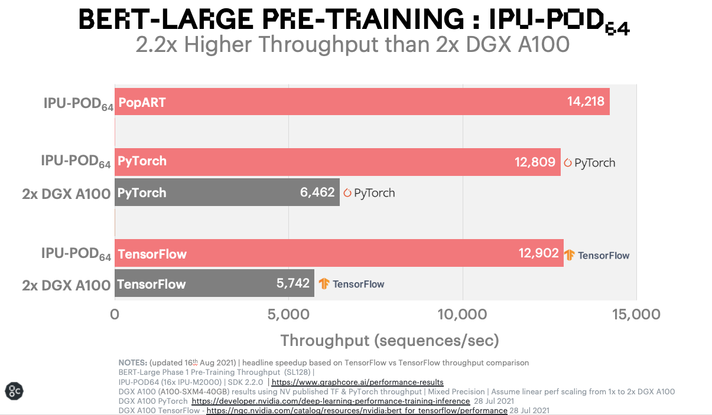

# Hugging Face and Graphcore partner for IPU-optimized Transformers

    <a target="_blank" class="btn no-underline text-sm mb-5 font-sans" href="https://github.com/huggingface/blog/blob/master/graphcore-ipu.md">
        Update on GitHub
    </a>

    <a href="/sallydoherty">
        
        

            <code>sallydoherty</code>
            Sally Doherty
            guest
        

    </a>

> ##### Speaking at the 2021 AI Hardware Summit, Hugging Face announced the launch of their new Hardware Partner Program, including device-optimized models and software integrations. Here, Graphcore - creators of the Intelligence Processing Unit (IPU) and a founding member of the program – explain how their partnership with Hugging Face will allow developers to easily accelerate their use of state-of-the-art Transformer models.

Graphcore and Hugging Face are two companies with a common goal – to make it easier for innovators to harness the power of machine intelligence. 

Hugging Face’s Hardware Partner Program will allow developers using Graphcore systems to deploy state-of-the-art Transformer models, optimised for our Intelligence Processing Unit (IPU), at production scale, with minimum coding complexity.

## What is an Intelligence Processing Unit?

IPUs are the processors that power Graphcore’s IPU-POD datacenter compute systems. This new type of processor is designed to support the very specific computational requirements of AI and machine learning. Characteristics such as fine-grained parallelism, low precision arithmetic, and the ability to handle sparsity have been built into our silicon.

Instead of adopting a SIMD/SIMT architecture like GPUs, Graphcore’s IPU uses a massively parallel, MIMD architecture, with ultra-high bandwidth memory placed adjacent to the processor cores, right on the silicon die.

This design delivers high performance and new levels of efficiency, whether running today’s most popular models, such as BERT and EfficientNet, or exploring next-generation AI applications.

Software plays a vital role in unlocking the IPU’s capabilities. Our Poplar SDK has been co-designed with the processor since Graphcore’s inception. Today it fully integrates with standard machine learning frameworks, including PyTorch and TensorFlow, as well as orchestration and deployment tools such as Docker and Kubernetes.

Making Poplar compatible with these widely used, third-party systems allows developers to easily port their models from their other compute platforms and start taking advantage of the IPU’s advanced AI capabilities.

## Optimising Transformers for Production

Transformers have completely transformed (pun intended) the field of AI. Models such as BERT are widely used by Graphcore customers in a huge array of applications, across NLP and beyond. These multi-talented models can perform feature extraction, text generation, sentiment analysis, translation and many more functions.

Already, Hugging Face plays host to hundreds of Transformers, from the French-language CamemBERT to ViT which applies lessons learned in NLP to computer vision. The Transformers library is downloaded an average of 2 million times every month and demand is growing.

With a user base of more than 50,000 developers – Hugging Face has seen the fastest ever adoption of an open-source project.

Now, with its Hardware Partner Program, Hugging Face is connecting the ultimate Transformer toolset with today's most advanced AI hardware.

Using Optimum, a new open-source library and toolkit, developers will be able to access hardware-optimized models certified by Hugging Face.

These are being developed in a collaboration between Graphcore and Hugging Face, with the first IPU-optimized models appearing on Optimum later this year. Ultimately, these will cover a wide range of applications, from vision and speech to translation and text generation.

Hugging Face CEO Clément Delangue said: “Developers all want access to the latest and greatest hardware – like the Graphcore IPU, but there’s always that question of whether they’ll have to learn new code or processes. With Optimum and the Hugging Face Hardware Program, that’s just not an issue. It’s essentially plug-and-play".

## SOTA Models meet SOTA Hardware

Prior to the announcement of the Hugging Face Partnership, we had demonstrated the power of the IPU to accelerate state-of-the-art Transformer models with a special Graphcore-optimised implementation of Hugging Face BERT using Pytorch.

Full details of this example can be found in the Graphcore blog [BERT-Large training on the IPU explained](https://www.graphcore.ai/posts/bert-large-training-on-the-ipu-explained).

The dramatic benchmark results for BERT running on a Graphcore system, compared with a comparable GPU-based system are surely a tantalising prospect for anyone currently running the popular NLP model on something other than the IPU.

This type of acceleration can be game changing for machine learning researchers and engineers, winning them back valuable hours of training time and allowing them many more iterations when developing new models.

Now Graphcore users will be able to unlock such performance advantages, through the Hugging Face platform, with its elegant simplicity and superlative range of models.

Together, Hugging Face and Graphcore are helping even more people to access the power of Transformers and accelerate the AI revolution.

*Visit the [Hugging Face Hardware Partner portal](https://huggingface.co/hardware) to learn more about Graphcore IPU systems and how to gain access*
