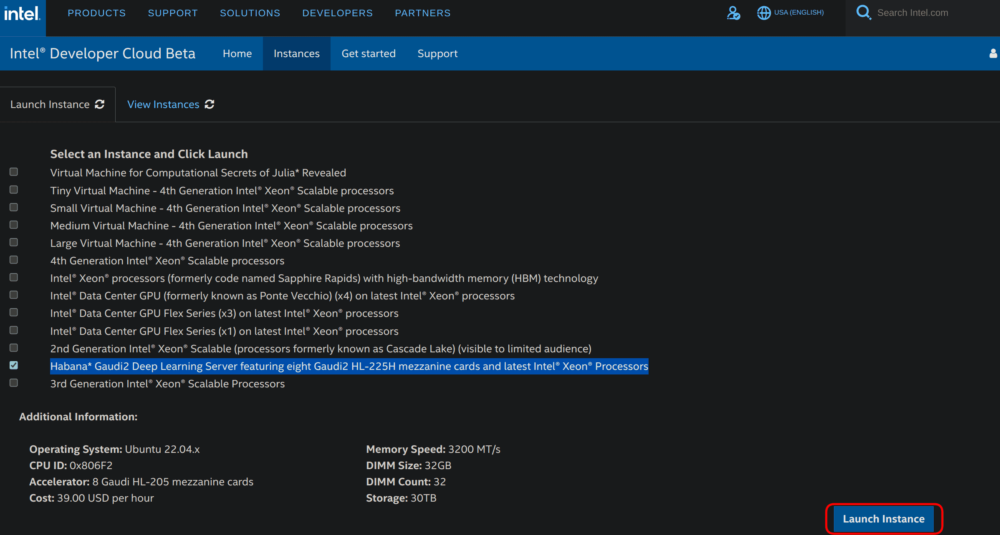
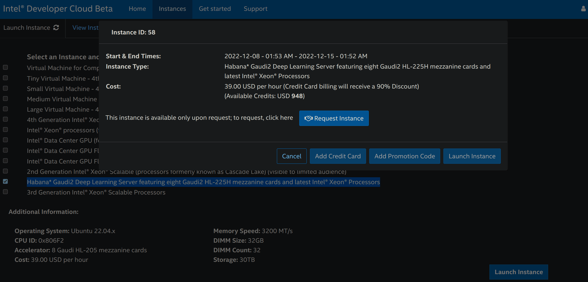

# Faster Training and Inference: Habana Gaudi®-2 vs Nvidia A100 80GB

{blog_metadata}
{authors}

In this article, you will learn how to use [Habana® Gaudi®2](https://habana.ai/training/gaudi2/) to accelerate model training and inference, and train bigger models with 🤗 [Optimum Habana](https://huggingface.co/docs/optimum/habana/index). Then, we present several benchmarks including BERT pre-training, Stable Diffusion inference and T5-3B fine-tuning, to assess the performance differences between first generation Gaudi, Gaudi2 and Nvidia A100 80GB. Spoiler alert - Gaudi2 is about twice faster than Nvidia A100 80GB for both training and inference!

[Gaudi2](https://habana.ai/training/gaudi2/) is the second generation AI hardware accelerator designed by Habana Labs. A single server contains 8 accelerator devices with 96GB of memory each (versus 32GB on first generation Gaudi and 80GB on A100 80GB). The Habana SDK, [SynapseAI](https://developer.habana.ai/), is common to both first-gen Gaudi and Gaudi2.
That means that 🤗 Optimum Habana, which offers a very user-friendly interface between the 🤗 Transformers and 🤗 Diffusers libraries and SynapseAI, **works the exact same way on Gaudi2 as on first-gen Gaudi!**
So if you already have ready-to-use training or inference workflows for first-gen Gaudi, we encourage you to try them on Gaudi2, as they will work without any single change.

## How to Get Access to Gaudi2?

One of the easy, cost-efficient ways that Intel and Habana have made Gaudi2 available is on the Intel Developer Cloud. To start using Gaudi2 there, you should follow the following steps:

1. Go to the [Intel Developer Cloud landing page](https://www.intel.com/content/www/us/en/developer/tools/devcloud/services.html) and sign in to your account or register if you do not have one.

2. Go to the [Intel Developer Cloud management console](https://scheduler.cloud.intel.com/#/systems).

3. Select *Habana Gaudi2 Deep Learning Server featuring eight Gaudi2 HL-225H mezzanine cards and latest Intel® Xeon® Processors* and click on *Launch Instance* in the lower right corner as shown below.
<figure class="image table text-center m-0 w-full">
  
</figure>

4. You can then request an instance:
<figure class="image table text-center m-0 w-full">
  
</figure>

5. Once your request is validated, re-do step 3 and click on *Add OpenSSH Publickey* to add a payment method (credit card or promotion code) and a SSH public key that you can generate with `ssh-keygen -t rsa -b 4096 -f ~/.ssh/id_rsa`. You may be redirected to step 3 each time you add a payment method or a SSH public key.

6. Re-do step 3 and then click on *Launch Instance*. You will have to accept the proposed general conditions to actually launch the instance.

7. Go to the [Intel Developer Cloud management console](https://scheduler.cloud.intel.com/#/systems) and click on the tab called *View Instances*.

8. You can copy the SSH command to access your Gaudi2 instance remotely!

> If you terminate the instance and want to use Gaudi2 again, you will have to re-do the whole process.

You can find more information about this process [here](https://scheduler.cloud.intel.com/public/Intel_Developer_Cloud_Getting_Started.html).

## Benchmarks

Several benchmarks were performed to assess the abilities of first-gen Gaudi, Gaudi2 and A100 80GB for both training and inference, and for models of various sizes.

### Pre-Training BERT

A few months ago, [Philipp Schmid](https://huggingface.co/philschmid), technical lead at Hugging Face, presented [how to pre-train BERT on Gaudi with 🤗 Optimum Habana](https://huggingface.co/blog/pretraining-bert). 65k training steps were performed with a batch size of 32 samples per device (so 8*32=256 in total) for a total training time of 8 hours and 53 minutes (you can see the TensorBoard logs of this run [here](https://huggingface.co/philschmid/bert-base-uncased-2022-habana-test-6/tensorboard?scroll=1#scalars)).

We re-ran the same script with the same hyperparameters on Gaudi2 and got a total training time of 2 hours and 55 minutes (see the logs [here](https://huggingface.co/regisss/bert-pretraining-gaudi-2-batch-size-32/tensorboard?scroll=1#scalars)). **That makes a x3.04 speedup on Gaudi2 without changing anything.**

Since Gaudi2 has roughly 3 times more memory per device compared to first-gen Gaudi, it is possible to leverage this greater capacity to have bigger batches. This will give HPUs more work to do and will also enable developers to try a range of hyperparameter values that was not reachable with first-gen Gaudi. With a batch size of 64 samples per device (512 in total), we got with 20k steps a similar loss convergence to the 65k steps of the previous runs. That makes a total training time of 1 hour and 33 minutes (see the logs [here](https://huggingface.co/regisss/bert-pretraining-gaudi-2-batch-size-64/tensorboard?scroll=1#scalars)). The throughput is x1.16 higher with this configuration, while this new batch size strongly accelerates convergence.
**Overall, with Gaudi2, the total training time is reduced by a 5.75 factor and the throughput is x3.53 higher compared to first-gen Gaudi**.

**Gaudi2 also offers a speedup over A100**: 1580.2 samples/s versus 981.6 for a batch size of 32 and 1835.8 samples/s versus 1082.6 for a batch size of 64, which is consistent with the x1.8 speedup [announced by Habana](https://habana.ai/training/gaudi2/) on the phase 1 of BERT pre-training with a batch size of 64.

The following table displays the throughputs we got for first-gen Gaudi, Gaudi2 and Nvidia A100 80GB GPUs:

|   | First-gen Gaudi (BS=32) | Gaudi2 (BS=32) | Gaudi2 (BS=64) | A100 (BS=32) | A100 (BS=64) |
|:-:|:-----------------------:|:--------------:|:--------------:|:-------:|:---------------------:|
| Throughput (samples/s) | 520.2 | 1580.2 | 1835.8 | 981.6 | 1082.6 |
| Speedup | x1.0 | x3.04 | x3.53 | x1.89 | x2.08 |

*BS* is the batch size per device. The Gaudi runs were performed in mixed precision (bf16/fp32) and the A100 runs in fp16. All runs were *distributed* runs on *8 devices*.

### Generating Images from Text with Stable Diffusion

One of the main new features of 🤗 Optimum Habana release 1.3 is [the support for Stable Diffusion](https://huggingface.co/docs/optimum/habana/usage_guides/stable_diffusion). It is now very easy to generate images from text on Gaudi. Unlike with 🤗 Diffusers on GPUs, images are generated by batches. Due to model compilation times, the first two batches will be slower than the following iterations. In this benchmark, these first two iterations were discarded to compute the throughputs for both first-gen Gaudi and Gaudi2.

[This script](https://github.com/huggingface/optimum-habana/tree/main/examples/stable-diffusion) was run for batch sizes of 4 and 8 samples and returned equal latencies for both. It uses the [`Habana/stable-diffusion`](https://huggingface.co/Habana/stable-diffusion) Gaudi configuration.

The results we got, which are consistent with the numbers published by Habana [here](https://developer.habana.ai/resources/habana-models-performance/), are displayed in the table below.
**Gaudi2 showcases latencies that are x3.65 faster than first-gen Gaudi (4.34s versus 1.19s) and x2.21 faster than Nvidia A100 (2.63s versus 1.19s).** It can also support bigger batch sizes.

|   | First-gen Gaudi (BS=4/8) | Gaudi2 (BS=4/8) | A100 (BS=1) |
|:-:|:----------------:|:----------------:|:-----------:|
| Latency (s/img) | 4.34 | 1.19 | 2.63 |
| Speedup | x1.0 | x3.65 | x1.65 |

*BS* is the batch size.
The Gaudi runs were performed in mixed precision (bf16/fp32) and the A100 runs in fp16 (more information [here](https://huggingface.co/docs/diffusers/optimization/fp16)). All runs were *single-device* runs.

### Fine-tuning T5-3B

With 96 GB of memory per device, Gaudi2 enables running much bigger models. For instance, we managed to fine-tune T5-3B (containing 3 billion parameters) with gradient checkpointing being the only applied memory optimization. This is not possible on first-gen Gaudi.
[Here](https://huggingface.co/regisss/t5-3b-summarization-gaudi-2/tensorboard?scroll=1#scalars) are the logs of this run where the model was fine-tuned on the CNN DailyMail dataset for text summarization using [this script](https://github.com/huggingface/optimum-habana/tree/main/examples/summarization).

The results we achieved are presented in the table below. **Gaudi2 is x2.44 faster than A100 80GB.** We observe that we cannot fit a batch size larger than 1 on Gaudi2 here. This is due to the memory space taken by the graph where operations are accumulated during the first iteration of the run. Habana is working on optimizing the memory footprint in future releases of SynapseAI. We are looking forward to expanding this benchmark using newer versions of Habana's SDK and also using [DeepSpeed](https://www.deepspeed.ai/) to see if the same trend holds.

|   | First-gen Gaudi | Gaudi2 (BS=1) | A100 (BS=16) |
|:-:|:-------:|:--------------:|:------------:|
| Throughput (samples/s) | N/A | 19.7 | 8.07 |
| Speedup | / | x2.44 | x1.0 |

*BS* is the batch size per device. Gaudi2 and A100 runs were performed in fp32 with gradient checkpointing enabled. All runs were *distributed* runs on *8 devices*.

## Conclusion

In this article, we discuss our first experience with Gaudi2. The transition from first generation Gaudi to Gaudi2 is completely seamless since SynapseAI, Habana's SDK, is fully compatible with both. This means that new optimizations proposed by future releases will benefit both of them.

You have seen that Habana Gaudi2 significantly improves performance over first generation Gaudi and delivers about twice the throughput speed as Nvidia A100 80GB for both training and inference.

You also know now how to setup a Gaudi2 instance through the Intel Developer Zone. Check out the [examples](https://github.com/huggingface/optimum-habana/tree/main/examples) you can easily run on it with 🤗 Optimum Habana.

If you are interested in accelerating your Machine Learning training and inference workflows using the latest AI hardware accelerators and software libraries, check out our [Expert Acceleration Program](https://huggingface.co/support). To learn more about Habana solutions, [read about our partnership here](https://huggingface.co/hardware/habana) and [contact them](https://habana.ai/contact-us/). To learn more about Hugging Face efforts to make AI hardware accelerators easy to use, check out our [Hardware Partner Program](https://huggingface.co/hardware).

### Related Topics

- [Getting Started on Transformers with Habana Gaudi](https://huggingface.co/blog/getting-started-habana)
- [Accelerate Transformer Model Training with Hugging Face and Habana Labs](https://developer.habana.ai/events/accelerate-transformer-model-training-with-hugging-face-and-habana-labs/)

---

Thanks for reading! If you have any questions, feel free to contact me, either through [Github](https://github.com/huggingface/optimum-habana) or on the [forum](https://discuss.huggingface.co/c/optimum/59). You can also connect with me on [LinkedIn](https://www.linkedin.com/in/regispierrard/).
