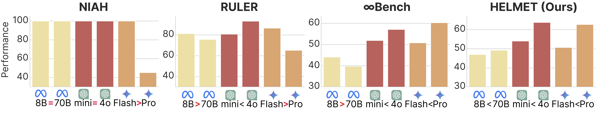
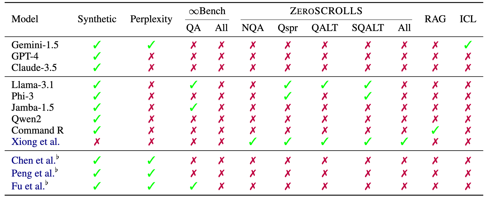
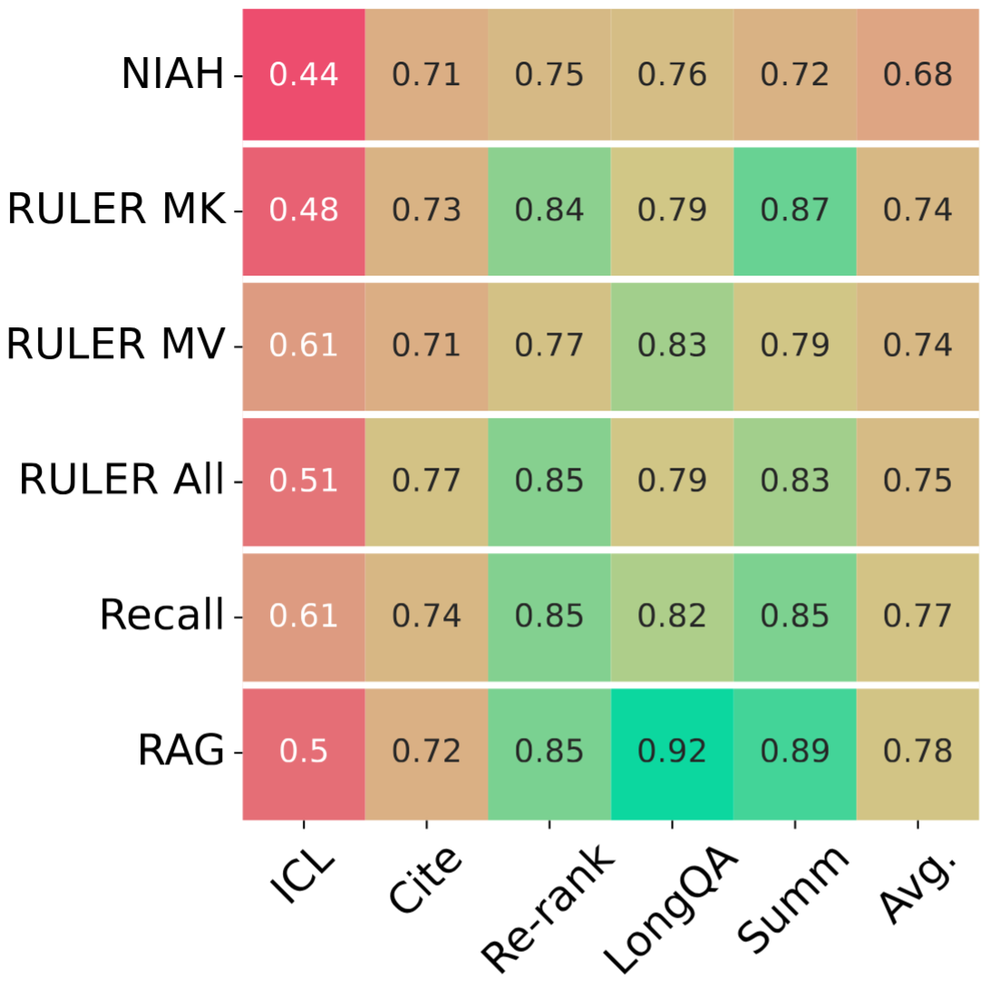
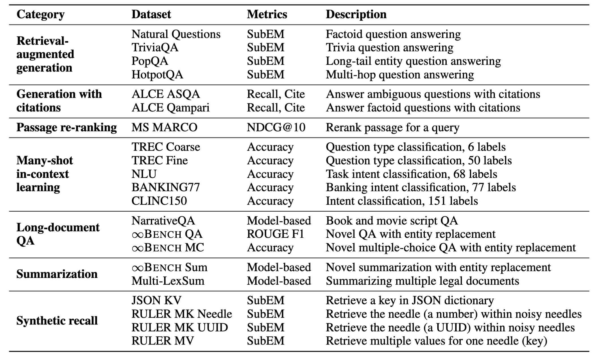
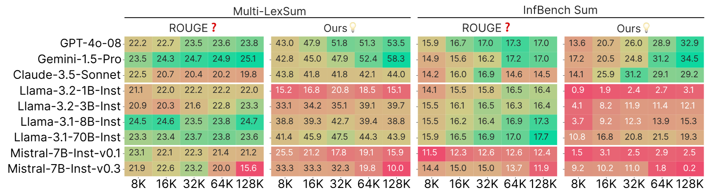
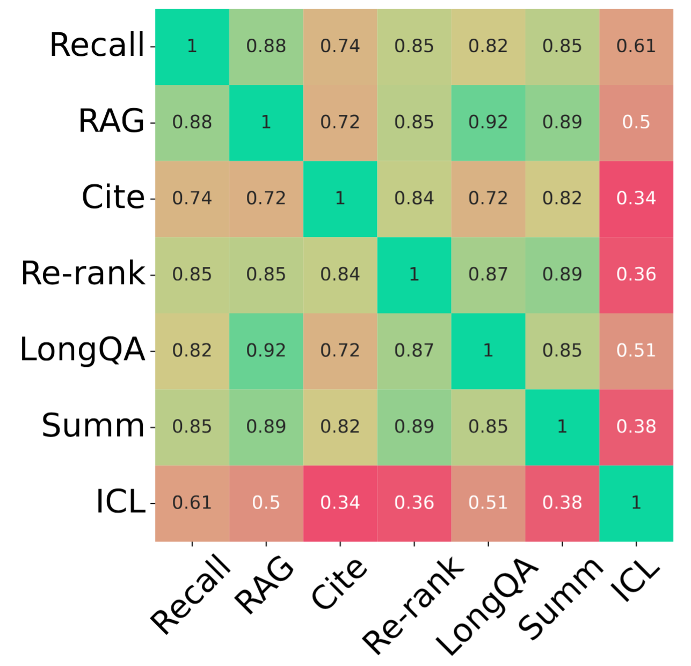
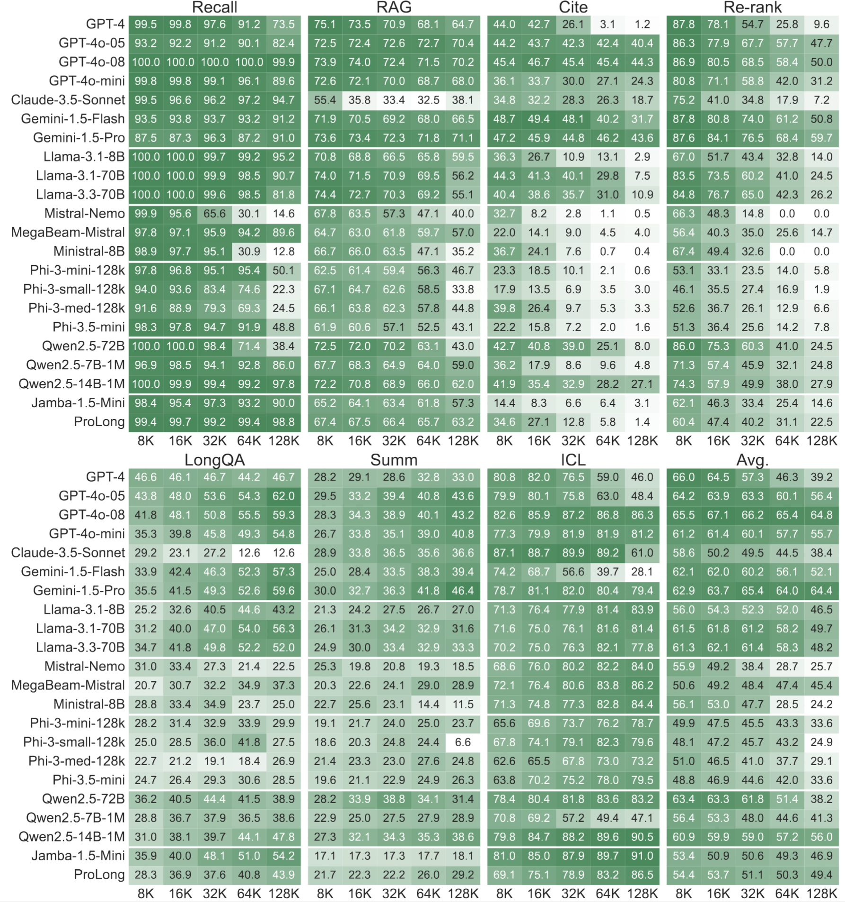

<h1 class="subtitle is-3 publication-subtitle">
  <span>Introducing <span style="color: #E77500"><b>HELMET</b></span>: Holistically Evaluating Long-context Language Models</span>
</h1>

Contact: hyen@cs.princeton.edu \
Paper: https://arxiv.org/abs/2410.02694 \
Website: https://princeton-nlp.github.io/HELMET \
Code & Data: https://github.com/princeton-nlp/HELMET

Since we first released HELMET last October, there has been more development on long-context language models than ever before, and we are thrilled to see the adoption of HELMET by the community, such as [Microsoft's Phi-4](https://arxiv.org/abs/2412.08905) and [AI21's Jamba 1.6](https://www.ai21.com/blog/introducing-jamba-1-6/).
After the initial release, we have added more models to our evaluation suite and conducted additional analyses. We are excited to share our new results and present HELMET at ICLR 2025!

In this blog, we will describe the construction of HELMET, our key findings, and how practitioners can use HELMET to differentiate between various LCLMs in future research and applications.
Finally, we will conclude with a quickstart guide for using HELMET with HuggingFace.

## Evaluating long-context language models is challenging but important

From summarizing numerous legal documents to learning new tasks on the fly, long-context language models (LCLMs) have immense potential to change the way we use and interact with language models.
Language models have been limited by their context window, which is around 2K to 8K tokens (e.g., [ChatGPT](https://openai.com/index/chatgpt/), [Llama-2/3](https://arxiv.org/abs/2407.21783)).
Recently, model developers have been constantly increasing the context window of their models, with recent models like [GPT-4o](https://openai.com/index/hello-gpt-4o/), [Claude-3](https://www.anthropic.com/news/claude-3-family), and [Gemini-1.5](https://blog.google/technology/ai/google-gemini-next-generation-model-february-2024/#ethics-safety) supporting context windows of up to millions of tokens.

<figure>
  
  <figcaption>Figure 1: Existing benchmarks show counterintuitive trends, such as smaller models outperforming larger ones (e.g., Llama-3.1 8B > 70B).</figcaption>
</figure>

However, with longer context windows, previous natural language benchmarks (e.g., [Scrolls](https://arxiv.org/abs/2201.03533)) are no longer suitable for evaluating LCLMs.
Consequently, perplexity and synthetic tasks (e.g., needle-in-a-haystack) emerged as the most popular evaluation metrics for recent LCLMs, but they often **do not reflect real-world performance**.
Model developers may also evaluate on other arbitrary datasets, which complicates model comparisons.
Furthermore, existing benchmarks for LCLMs may show confusing and counterintuitive results, making it difficult to understand the strengths and weaknesses of different models (Figure 1).
<!-- For downstream users, it may be difficult to choose the right model for their applications, as the evaluation settings between different models are *inconsistent* and often *not reflective of real-world applications*. -->

In this work, we propose HELMET (How to Evaluate Long-Context Models Effectively and Thoroughly), a comprehensive benchmark for evaluating LCLMs that improves upon existing benchmarks in several ways—*diversity, controllability, and reliability*.
We evaluate 59 recent LCLMs and find that it is crucial to evaluate models across diverse applications to understand their capabilities and frontier LCLMs are still limited on complex tasks.


<!-- Since the initial release, model developers have adopted HELMET for evaluating their models, such as [Microsoft's Phi-4](https://arxiv.org/abs/2412.08905), and we hope that HELMET will be useful for future development of LCLMs. -->

<!-- We evaluate over 50 recent models on diverse, application-centric tasks, which enables researchers and practitioners to compare models across different axes. -->

<!-- However, existing benchmarks for long-context language modeling primarily rely on either perplexity and synthetic tasks, such as needle-in-a-haystack, even though it is unclear how well the performance on these tasks would transfer to real-world applications.  -->

<!-- In this work, we propose HELMET (How to Evaluate Long-Context Models Effectively and Thoroughly), a comprehensive benchmark for evaluating LCLMs.
In contrast to previous benchmarks, HELMET is designed to include diverse, application-centric tasks, complemented with reliable evaluation settings. 
We evaluate over 50 recent models, enabling detail comparisons and understanding of existing models and architectures across diverse axes.
Our experiments reveal key findings: (1) synthetic tasks like needle-in-a-haystack (NIAH) do not reflect real-world performance, (2) diverse types of tasks exhibit distinct trends, and (3) open-source models still lag behind proprietary models on more complex tasks.
Ultimately, we advocate for a holistic evaluation across diverse tasks. -->

## Existing evaluations overly rely on synthetic tasks

With the development of LCLMs across both industry and the open-source community, it is crucial to have a reliable method for evaluating and comparing these models. However, current models are *often evaluated on different benchmarks* (Table 1).

<figure>
  
  <figcaption>
    Table 1: Model developers often evaluate on different sets of datasets. <sup>♭</sup>: Base models. NQA: NarrativeQA, Qspr: Qasper, QALT: QuALITY, SQALT: SQuALTY.
  </figcaption>
</figure>

A common practice for evaluating long-context language models is to use perplexity or synthetic tasks, such as needle-in-a-haystack (NIAH). 
However, recent works have shown that perplexity does not correlate well with downstream performance ([Fang et al., 2024](https://arxiv.org/abs/2410.23771)). 
In Figure 2, we show that synthetic tasks like NIAH do not correlate with real-world performance, but the more complex synthetic tasks achieve higher correlation with real-world tasks.

<figure>
  
  <figcaption>
    Figure 2: Simple synthetic tasks, such as NIAH, do not correlate well with downstream tasks, such as summarization or generation with citations. More complex variants (e.g., RULER MV) achieve higher correlation. 
  </figcaption>
</figure>

\
Among the existing benchmarks with realistic applications, such as ZeroScrolls ([Shaman et al., 2023](https://arxiv.org/abs/2308.14508)), LongBench ([Bai et al., 2024](https://arxiv.org/abs/2308.14508)), and InfiniteBench ([Zhang et al., 2024](https://arxiv.org/abs/2402.13718)), there are still crucial limitations:

- Insufficient coverage of downstream tasks: often focused on specific domains
- Inadequate lengths for testing frontier LCLMs: older QA datasets are often limited to <32K tokens (e.g., [QASPER](https://arxiv.org/abs/2105.03011), [QuALITY](https://arxiv.org/abs/2112.08608))
- Unreliable metrics: N-gram matching metrics like ROUGE are noisy—they do not correlate with human judgments ([Goyal et al., 2023](https://arxiv.org/abs/2209.12356)) and do not distinguish between models
- Incompatibility with base models: require instruction-tuning, which means they cannot be used for base model development

Thus, we propose HELMET to address these limitations and provide a comprehensive evaluation of LCLMs.

## Crafting diverse, controllable, and reliable evaluation for LCLMs

We design HELMET with the following desiderata:
1. Diverse coverage of downstream tasks
2. Controllable length and complexity
3. Reliable evaluation for base and instruction-tuned models

Table 2 shows an overview of the benchmark.
In our experiments, we evaluate on input length from 8K to 128K tokens, but HELMET can be easily extended to even longer context lengths.

<figure>
  
  <figcaption>Table 2: Overview of HELMET datasets. SubEM: Substring Exact Match.</figcaption>
</figure>

### Key improvements over existing benchmarks


***Diverse coverage***: HELMET includes a diverse set of tasks, such as retrieval-augmented generation with real retrieval passages, generation with citations, and summarization. We carefully select datasets with naturally long contexts that reflect real-world applications. These datasets are complemented with reliable evaluation settings, such as model-based evaluations and human studies.


***Controllable length and difficulty***: An important dimension to consider when evaluating LCLMs is the input length, as longer inputs can provide more information while challenging the model's ability to process noisy contexts. In our tasks, we can control the input length by changing the number of retrieved passages (RAG, Cite, Re-rank), the number of demonstrations (ICL), or the length of the input document (LongQA, Summ). Although LongQA and Summ cannot be easily extended to longer contexts, we intentionally chose datasets with natural documents of length far greater than 100K tokens, such that they can still be used to evaluate frontier LCLMs.


***Reliable evaluation***: Many existing benchmarks still use n-gram-based metrics, such as ROUGE, despite their poor correlation with human judgments ([Goyal et al., 2023](https://arxiv.org/abs/2209.12356)). We employ model-based evaluations that show better distinguishability between models and different input lengths (Figure 3). Furthermore, our human studies show that our metrics have a high agreement with human judgments.

<figure>
  
  <figcaption>
     Figure 3: ROUGE cannot differentiate between models and lengths, while model-based evaluations are better at separating models of different capacities.
  </figcaption>
</figure>


***Robust prompting***: Existing long-context benchmarks often require models to follow instructions, but many model developments revolve around base models, which have to rely on synthetic tasks or perplexity for evaluation. Thus, we support base models for a subset of our tasks via in-context learning examples. This substantially improves the performance of base models, which is more reflective of real-world applications.


## LCLMs still have a long way to go on real-world tasks

Our experiments and analyses include a comprehensive set of 59 LCLMs. To our knowledge, this is the most thorough and controlled comparison of long-context models on diverse applications. These models cover both leading proprietary and open-source models, and we also consider models with different architectures (e.g., full-attention transformers, hybrid architectures) and positional extrapolation techniques. In this section, we will highlight a few key findings from our experiments.

### Diverse evaluation is needed for assessing long-context abilities

Long-context benchmarks are often constructed with specific applications in mind, such as summarization or question answering, which limits the understanding of LCLMs in a broader context. We examine model performance over a wide range of real tasks and find that different categories do not always correlate with each other (Figure 4).

<figure>
   
   <figcaption>Figure 4: Different categories do not correlate well with each other.</figcaption>
</figure>

While some tasks moderately correlate with each other (e.g., RAG and MS-MARCO) due to their retrieval-based nature, others show little correlation (e.g., Summ and Cite). Notably, ICL has the lowest correlation with other tasks, which suggests that it is a unique task that requires different capabilities from the model. Therefore, model developers should evaluate across these distinct axes to draw a more holistic picture of the model's capabilities.

### Models degrade with increasing lengths and task complexity

We present the results of the frontier proprietary models as well as a few open-source models on HELMET.
Additional results can be found in the paper and the website.

<figure>
   
   <figcaption>Figure 5: HELMET results on selected instruction-tuned models across tasks and input lengths.</figcaption>
</figure>

First, we observe that **open-source models lag behind closed-source models on complex tasks**. Although the gap appears small on simpler tasks, such as Recall, the gap widens on more complex ones, such as Cite.

Furthermore, **performance degradation with increasing lengths is category-dependent**. Even the most advanced models, such as GPT-4o and Gemini, experience a significant decrease in performance on tasks like re-ranking. This change in performance cannot be observed from simply looking at the synthetic task performance.

Finally, **there is no clear winner across all categories**, thereby calling for evaluation across different axes. Additional analysis, such as the performance of different positional extrapolation methods and the lost-in-the-middle phenomenon, can be found in the paper.

## Using HELMET for future developments

### How to run HELMET
Using HELMET is easy! Simply clone our [GitHub repository](https://github.com/princeton-nlp/HELMET), and everything is ready to go after setting up the environment! 

We provide many different ways for loading models, which can be configured in the config file:
1. using HuggingFace's `transformers` library
2. using HuggingFace's TGI to launch a model endpoint in your machine
3. using HuggingFace's Inference Endpoints to launch a remote model endpoint
4. using vllm to launch a model endpoint in your machine. Note: You can launch vllm endpoint on Intel Gaudi accelerators. 
5. using model provider's APIs

#### Option 1. Using HuggingFace's `transformers` library
Just use the config yamls in our repo and run these evaluations with
```
python eval.py --config configs/rag.yaml --model_name_or_path <model_name>
```
Behind the scenes, HuggingFace's `transformers` library is used, and both local and remote models are automatically supported.

#### Option 2. Using HuggingFace's TGI
First, follow the instructions on [TGI github](https://github.com/huggingface/text-generation-inference) to launch a model endpoint. Then in your config file, specify the endpoint url. For example, you can have a config.yaml like below
```
input_max_length: 131072
datasets: kilt_nq
generation_max_length: 20
test_files: data/kilt/nq-dev-multikilt_1000_k1000_dep6.jsonl
demo_files: data/kilt/nq-train-multikilt_1000_k3_dep6.jsonl
use_chat_template: true
max_test_samples: 100
shots: 2
stop_new_line: true
model_name_or_path: tgi:meta-llama/Llama-3.1-8B-Instruct # need to add "tgi:" prefix
use_tgi_serving: true # add this line in your config
```
Then use the command below to run the benchmark
```bash
export LLM_ENPOINT=<your-tgi-endpoint> # example: "https://10.10.10.1:8080/v1"
python eval.py --config configs/config.yaml --endpoint_url $LLM_ENDPOINT
```

#### Option 3. Using HuggingFace's Inference Endpoints
First set up an endpoint by following the instructions [here](https://huggingface.co/inference-endpoints/dedicated). Get the endpoint url and your API key. Then use the same config yaml shown in Option 2 above, and run the command below.
```bash
export LLM_ENPOINT=<your-hf-inference-endpoint> # example: "https://XXXX.us-east-1.aws.endpoints.huggingface.cloud/v1"
export API_KEY=<your-hf-api-key>
python eval.py --config configs/config.yaml --endpoint_url $LLM_ENDPOINT --api_key $API_KEY
```

#### Option 4. Using VLLM
You can launch a model endpoint with vllm on your system, including Intel Gaudi2 and Gaudi3 accelerators. See the instructions [here](https://github.com/princeton-nlp/HELMET/tree/main#run-on-intel-gaudi) on how to run HELMET using vllm on Intel Gaudi accelerators.

You can use the same example config.yaml as in Option 2, except for two lines of change as below:
```
model_name_or_path: meta-llama/Llama-3.1-8B-Instruct # no prefix needed
use_vllm_serving: true # use vllm instead of tgi
```
Then use the command below to run the benchmark
```bash
export LLM_ENPOINT=<your-vllm-endpoint>
python eval.py --config configs/config.yaml --endpoint_url $LLM_ENDPOINT
```

#### Option 5. Using Model Provider's APIs
We support APIs from OpenAI, Anthropic, Google, and TogetherAI.
Please refer to the instructions in our [repo](https://github.com/princeton-nlp/HELMET/tree/main).


### Faster development

We recommend using the Recall and RAG tasks for fast iterations during model development.
These tasks achieve a good balance between fast evaluation and correlation with other realistic tasks.
You can easily run these evaluations with just
```bash
python eval.py --config configs/rag.yaml --model_name_or_path <model_name>
```

### Quick comparison with existing models

It is often expensive to run all the baselines for evaluating LCLMs, especially at long contexts given their computational and memory costs.
For example, running HELMET at all lengths on a 70B model requires a node with 8 * 80GB GPUs for hundreds of GPU hours, which can be costly. 
By evaluating on HELMET, researchers can directly compare their models to existing ones simply by referencing our results, which cover 59 models of different sizes and architectures.
You can find the leaderboard on our [website](https://princeton-nlp.github.io/HELMET).

### Looking ahead

HELMET is a step towards a more comprehensive evaluation of long-context language models, but there are still many more exciting applications of LCLMs. 
For example, we recently released [LongProc](https://arxiv.org/abs/2501.05414), a benchmark for evaluating LCLMs on *long-form generation* and *following procedures*, which are critical for developing reasoning models that generate tens of thousands of tokens in thinking steps.
Although summarization tasks have long outputs (up to 1K tokens), LongProc focuses on even longer outputs, up to 8K tokens. 
Similar to HELMET, LongProc is also designed with reliable evaluation settings and diverse tasks. 
We are working on integrating LongProc into HELMET's evaluation suite, and we hope that this will provide a more comprehensive evaluation of LCLMs on long-form tasks.

## Acknowledgements

We thank Mengzhou Xia, Howard Chen, Xi Ye, Yinghui He, Lucy He, Alexander Wettig, Sadhika Malladi, Adithya Bhaskar, Joie Zhang, and other members of the Princeton Language and Intelligence (PLI) group for their helpful feedback.
This work is gratefully supported by the Microsoft Accelerate Foundation Models Research (AFMR) for Azure OpenAI credits and an Intel grant.

## Citation

If you find HELMET useful, please consider citing our paper:

```
@inproceedings{yen2025helmet,
      title={HELMET: How to Evaluate Long-Context Language Models Effectively and Thoroughly}, 
      author={Howard Yen and Tianyu Gao and Minmin Hou and Ke Ding and Daniel Fleischer and Peter Izsak and Moshe Wasserblat and Danqi Chen},
      year={2025},
      booktitle={International Conference on Learning Representations (ICLR)},
}
```

