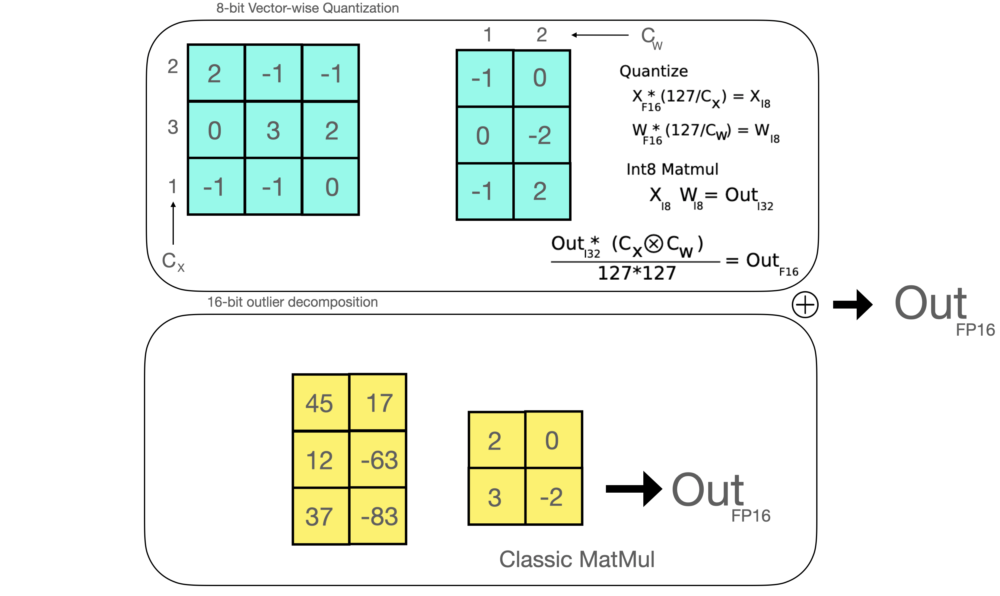

# A Gentle Introduction to 8-bit Matrix Multiplication for transformers at scale using Hugging Face Transformers, Accelerate and bitsandbytes

{blog_metadata}

{authors}


## Introduction

Language models are becoming larger all the time. At the time of this writing, PaLM has 540B parameters, OPT, GPT-3, and BLOOM have around 176B parameters, and we are trending towards even larger models. Below is a diagram showing the size of some recent language models.


Therefore, these models are hard to run on easily accessible devices. For example, just to do inference on BLOOM-176B, you would need to have 8x 80GB A100 GPUs (~$15k each). To fine-tune BLOOM-176B, you'd need 72 of these GPUs! Much larger models, like PaLM would require even more resources.

Because these huge models require so many GPUs to run, we need to find ways to reduce these requirements while preserving the model's performance. Various technologies have been developed that try to shrink the model size, you may have heard of quantization and distillation, and there are many others.

After completing the training of BLOOM-176B, we at HuggingFace and BigScience were looking for ways to make this big model easier to run on less GPUs. Through our BigScience community we were made aware of research on Int8 inference that does not degrade predictive performance of large models and reduces the memory footprint of large models by a factor or 2x. Soon we started collaboring on this research which ended with a full integration into Hugging Face `transformers`. With this blog post, we offer LLM.int8() integration for all Hugging Face models which we explain in more detail below. If you want to read more about our research, you can read our paper, [LLM.int8(): 8-bit Matrix Multiplication for Transformers at Scale](https://arxiv.org/abs/2208.07339).

This article focuses on giving a high-level overview of this quantization technology, outlining the difficulties in incorporating it into the `transformers` library, and drawing up the long-term goals of this partnership.

Here you will learn what exactly make a large model use so much memory? What makes BLOOM 350GB? Let's begin by gradually going over a few basic premises.

## Common data types used in Machine Learning

We start with the basic understanding of different floating point data types, which are also referred to as "precision" in the context of Machine Learning.

The size of a model is determined by the number of its parameters, and their precision, typically one of float32, float16 or bfloat16 (image below from: https://blogs.nvidia.com/blog/2020/05/14/tensorfloat-32-precision-format/).


Float32 (FP32) stands for the standardized IEEE 32-bit floating point representation. With this data type it is possible to represent a wide range of floating numbers. In FP32, 8 bits are reserved for the "exponent", 23 bits for the "mantissa" and 1 bit for the sign of the number. In addition to that, most of the hardware supports FP32 operations and instructions.


In the float16 (FP16) data type, 5 bits are reserved for the exponent and 10 bits are reserved for the mantissa. This makes the representable range of FP16 numbers much lower than FP32. This exposes FP16 numbers to the risk of overflowing (trying to represent a number that is very large) and underflowing (representing a number that is very small).


For example, if you do `10k * 10k` you end up with `100k` which is not possible to represent in FP16, as the largest number possible is `64k`. And thus you'd end up with `NaN` (Not a Number) result and if you have sequential computation like in neural networks, all the prior work is destroyed.
Usually, loss scaling is used to overcome this issue, but it doesn't always work well.

A new format, bfloat16 (BF16), was created to avoid these constraints. In BF16, 8 bits are reserved for the exponent (which is the same as in FP32) and 7 bits are reserved for the fraction.


This means that in BF16 we can retain the same dynamic range as FP32. But we lose 3 bits of precision. Now there is absolutely no problem with huge numbers, but the precision is worse than FP16 here.

In the Ampere architecture, NVIDIA also introduced [TensorFloat-32](https://blogs.nvidia.com/blog/2020/05/14/tensorfloat-32-precision-format/) (TF32) precision format, combining the dynamic range of BF16 and precision of FP16 to only use 19 bits. It's currently only used internally during certain operations.

In the machine learning jargon FP32 is called full precision (4 bytes), while BF16 and FP16 are referred to as half-precision (2 bytes).
On top of that, the int8 (INT8) data type consists of an 8-bit representation that can store 2^8 different values (between [0, 255] or [-128, 127] for signed integers).

While, ideally the training and inference should be done in FP32, it is two times slower than FP16/BF16 and therefore a mixed precision approach is used where the weights are held in FP32 as a precise "main weights" reference, while computation in a forward and backward pass are done for FP16/BF16 to enhance training speed. The FP16/BF16 gradients are then used to update the FP32 main weights. 

During training, the main weights are always stored in FP32, but in practice, the half-precision weights often provide similar quality during inference as their FP32 counterpart -- a precise reference of the model is only needed when it receives multiple gradient updates. This means we can use the half-precision weights and use half the GPUs to accomplish the same outcome.


To calculate the model size in bytes, one multiplies the number of parameters by the size of the chosen precision in bytes.  For example, if we use the bfloat16 version of the BLOOM-176B model, we have `176*10**9 x 2 bytes = 352GB`! As discussed earlier, this is quite a challenge to fit into a few GPUs.

But what if we can store those weights with less memory using a different data type? A methodology called quantization has been used widely in Deep Learning.


## Introduction to model quantization

Experimentially, we have discovered that instead of using the 4-byte FP32 precision, we can get an almost identical inference outcome with 2-byte BF16/FP16 half-precision, which halves the model size. It'd be amazing to cut it further, but the inference quality outcome starts to drop dramatically at lower precision.

To remediate that, we introduce 8-bit quantization. This method uses a quarter precision, thus needing only 1/4th of the model size! But it's not done by just dropping another half of the bits.

Quantization is done by essentially “rounding” from one data type to another. For example, if one data type has the range 0..9 and another 0..4, then the value “4” in the first data type would be rounded to “2” in the second data type. However, if we have the value “3” in the first data type, it lies between 1 and 2 of the second data type, then we would usually round to “2”. This shows that both values “4” and “3” of the first data type have the same value “2” in the second data type. This highlights that quantization is a noisy process that can lead to information loss, a sort of lossy compression.

The two most common 8-bit quantization techniques are zero-point quantization and absolute maximum (absmax) quantization. Zero-point quantization and absmax quantization map the floating point values into more compact int8 (1 byte) values. First, these methods normalize the input by scaling it by a quantization constant.

For example, in zero-point quantization, if my range is -1.0…1.0 and I want to quantize into the range -127…127, I want to scale by the factor of 127 and then round it into the 8-bit precision. To retrieve the original value, you would need to divide the int8 value by that same quantization factor of 127. For example, the value 0.3 would be scaled to `0.3*127 = 38.1`. Through rounding, we get the value of 38. If we reverse this, we get `38/127=0.2992` – we have a quantization error of 0.008 in this example. These seemingly tiny errors tend to accumulate and grow as they get propagated through the model’s layers and result in performance degradation.


(Image taken from: [this blogpost](https://intellabs.github.io/distiller/algo_quantization.html) )

Now let's look at the details of absmax quantization. To calculate the mapping between the fp16 number and its corresponding int8 number in absmax quantization, you have to first divide by the absolute maximum value of the tensor and then multiply by the total range of the data type.

For example, let's assume you want to apply absmax quantization in a vector that contains `[1.2, -0.5, -4.3, 1.2, -3.1, 0.8, 2.4, 5.4]`. You extract the absolute maximum of it, which is `5.4` in this case. Int8 has a range of `[-127, 127]`, so we divide 127 by `5.4` and obtain `23.5` for the scaling factor. Therefore multiplying the original vector by it gives the quantized vector `[28, -12, -101, 28, -73, 19, 56, 127]`.


To retrieve the latest, one can just divide in full precision the int8 number with the quantization factor, but since the result above is "rounded" some precision will be lost.


For an unsigned int8, we would subtract the minimum and scale by the absolute maximum. This is close to what zero-point quantization does. It's is similar to a min-max scaling but the latter maintains the value scales in such a way that the value “0” is always represented by an integer without any quantization error.

These tricks can be combined in several ways, for example, row-wise or vector-wise quantization, when it comes to matrix multiplication for more accurate results. Looking at the matrix multiplication, A\*B=C, instead of regular quantization that normalize by a absolute maximum value per tensor, vector-wise quantization finds the absolute maximum of each row of A and each column of B. Then we normalize A and B by dividing these vectors. We then multiply A\*B to get C. Finally, to get back the FP16 values, we denormalize by computing the outer product of the absolute maximum vector of A and B. More details on this technique can be found in the [LLM.int8() paper](https://arxiv.org/abs/2208.07339) or in the [blog post about quantization and emergent features](https://timdettmers.com/2022/08/17/llm-int8-and-emergent-features/) on Tim's blog.

While these basic techniques enable us to quanitize Deep Learning models, they usually lead to a drop in accuracy for larger models. The LLM.int8() implementation that we integrated into Hugging Face Transformers and Accelerate libraries is the first technique that does not degrade performance even for large models with 176B parameters, such as BLOOM.


## A gentle summary of LLM.int8(): zero degradation matrix multiplication for Large Language Models

In LLM.int8(), we have demonstrated that it is crucial to comprehend the scale-dependent emergent properties of transformers in order to understand why traditional quantization fails for large models. We demonstrate that performance deterioration is caused by outlier features, which we explain in the next section. The LLM.int8() algorithm itself can be explain as follows.

In essence, LLM.int8() seeks to complete the matrix multiplication computation in three steps:
1. From the input hidden states, extract the outliers (i.e. values that are larger than a certain threshold) by column.
2. Perform the matrix multiplication of the outliers in FP16 and the non-outliers in int8.
3. Dequantize the non-outlier results and add both outlier and non-outlier results together to receive the full result in FP16.

These steps can be summarized in the following animation:


### The importance of outlier features

A value that is outside the range of some numbers' global distribution is generally referred to as an outlier. Outlier detection has been widely used and covered in the current literature, and having prior knowledge of the distribution of your features helps with the task of outlier detection. More specifically, we have observed that classic quantization at scale fails for transformer-based models >6B parameters. While large outlier features are also present in smaller models, we observe that a certain threshold these outliers from highly systematic patterns across transformers which are present in every layer of the transformer. For more details on these phenomena see the [LLM.int8() paper](https://arxiv.org/abs/2208.07339) and [emergent features blog post](https://timdettmers.com/2022/08/17/llm-int8-and-emergent-features/).

As mentioned earlier, 8-bit precision is extremely constrained, therefore quantizing a vector with several big values can produce wildly erroneous results. Additionally, because of a built-in characteristic of the transformer-based architecture that links all the elements together, these errors tend to compound as they get propagated across multiple layers. Therefore, mixed-precision decomposition has been developed to facilitate efficient quantization with such extreme outliers. It is discussed next.

### Inside the MatMul

Once the hidden states are computed we extract the outliers using a custom threshold and we decompose the matrix into two parts as explained above. We found that extracting all outliers with magnitude 6 or greater in this way recoveres full inference performance. The outlier part is done in fp16 so it is a classic matrix multiplication, whereas the 8-bit matrix multiplication is done by quantizing the weights and hidden states into 8-bit precision using vector-wise quantization -- that is, row-wise quantization for the hidden state and column-wise quantization for the weight matrix.
After this step, the results are dequantized and returned in half-precision in order to add them to the first matrix multiplication.



### What does 0 degradation mean?

How can we properly evaluate the performance degradation of this method? How much quality do we lose in terms of generation when using 8-bit models?

We ran several common benchmarks with the 8-bit and native models using lm-eval-harness and reported the results.

For OPT-175B:

| benchmarks | -  |  - |    -   |   -    |         difference - value   |
| ---------- | --------- | ---------------- |        --------------------      |    --------------------   |  -------------------- |
| name       | metric    | value - int8 | value - fp16 | std err - fp16 |  -     |
| hellaswag  | acc\_norm |           0.7849 |       0.7849 |            0.0041 |      0 |
| hellaswag  | acc       |           0.5921 |       0.5931 |    0.0049 |  0.001 |
| piqa       | acc       |           0.7965 |       0.7959 |      0.0094 | 0.0006 |
| piqa       | acc\_norm |           0.8101 |       0.8107 |     0.0091 | 0.0006 |
| lambada    | ppl       |           3.0142 |       3.0152 |     0.0552 |  0.001 |
| lambada    | acc       |           0.7464 |       0.7466 |         0.0061 | 0.0002 |
| winogrande | acc       |           0.7174 |       0.7245 |      0.0125 | 0.0071 |

For BLOOM-176:

| benchmarks | - | -   | -  |   -        |     difference - value  |
| ---------- | --------- | ---------------- |    --------------------  |        --------------------             | -------------------- |
| name       | metric    | value - int8 | value - bf16 | std err - bf16 |     -  |
| hellaswag  | acc\_norm |           0.7274 |       0.7303 |         0.0044 | 0.0029 |
| hellaswag  | acc       |           0.5563 |       0.5584 |           0.005 | 0.0021 |
| piqa       | acc       |           0.7835 |       0.7884 |         0.0095 | 0.0049 |
| piqa       | acc\_norm |           0.7922 |       0.7911 |         0.0095 | 0.0011 |
| lambada    | ppl       |           3.9191 |        3.931 |      0.0846 | 0.0119 |
| lambada    | acc       |           0.6808 |       0.6718 |            0.0065 |  0.009 |
| winogrande | acc       |           0.7048 |       0.7048 |         0.0128 |      0 |


We indeed observe 0 performance degradation for those models since the absolute difference of the metrics are all below the standard error (except for BLOOM-int8 which is slightly better than the native model on lambada). For a more detailed performance evaluation against state-of-the-art approaches, take a look at the [paper](https://arxiv.org/abs/2208.07339)!

### Is it faster than native models?


The main purpose of the LLM.int8() method is to make large models more accessible without performance degradation. But the method would be less useful if it is very slow. So we benchmarked the generation speed of multiple models.
We find that BLOOM-176B with LLM.int8() is about 15% to 23% slower than the fp16 version – which is still quite acceptable. We found larger slowdowns for smaller models, like T5-3B and T5-11B. We worked hard to speed up these small models. Within a day, we could improve inference per token from 312 ms to 173 ms for T5-3B and from 45 ms to 25 ms for T5-11B. Additionally, issues were [already identified](https://github.com/TimDettmers/bitsandbytes/issues/6#issuecomment-1211345635), and LLM.int8() will likely be faster still for small models in upcoming releases. For now, the current numbers are in the table below.


| Precision      | Number of parameters | Hardware     | Time per token in milliseconds for Batch Size 1 | Time per token in milliseconds for Batch Size 8 | Time per token in milliseconds for Batch Size 32 |
| -------------- | -------------------- | ------------ | ----------------------------------------------- | ----------------------------------------------- | ------------------------------------------------ |
| bf16           | 176B                 | 8xA100 80GB  |                                             239 |                                              32 |                                              9.9 |
| int8           | 176B                 | 4xA100 80GB  |                                             282 |                                            37.5 |                                             10.2 |
| bf16           | 176B                 | 14xA100 40GB |                                             285 |                                            36.5 |                                             10.4 |
| int8           | 176B                 | 5xA100 40GB  |                                             367 |                                            46.4 |                                              oom |
| fp16           | 11B                  | 2xT4 15GB    |                                            11.7 |                                             1.7 |                                              0.5 |
| int8           | 11B                  | 1xT4 15GB    |                                            43.5 |                                             5.3 |                                              1.3 |
| fp32           | 3B                   | 2xT4 15GB    |                                              45 |                                             7.2 |                                              3.1 |
| int8           | 3B                   | 1xT4 15GB    |                                             312 |                                            39.1 |                                             10.2 |

The 3 models are BLOOM-176B, T5-11B and T5-3B.

### Hugging Face `transformers` integration nuances

Next let's discuss the specifics of the Hugging Face `transformers` integration. Let's look at the usage and the common culprit you may encounter while trying to set things up.

### Usage

The module responsible for the whole magic described in this blog post is called `Linear8bitLt` and you can easily import it from the `bitsandbytes` library. It is derived from a classic `torch.nn` Module and can be easily used and deployed in your architecture with the code described below.

Here is a step-by-step example of the following use case: let's say you want to convert a small model in int8 using `bitsandbytes`.

1. First we need the correct imports below!

```py
import torch
import torch.nn as nn

import bitsandbytes as bnb
from bnb.nn import Linear8bitLt
```

2. Then you can define your own model. Note that you can convert a checkpoint or model of any precision to 8-bit (FP16, BF16 or FP32) but, currently, the input of the model has to be FP16 for our Int8 module to work. So we treat our model here as a fp16 model.

```py
fp16_model = nn.Sequential(
    nn.Linear(64, 64),
    nn.Linear(64, 64)
)
```

3. Let's say you have trained your model on your favorite dataset and task! Now time to save the model:

```py
[... train the model ...]
torch.save(fp16_model.state_dict(), "model.pt")
```

4. Now that your `state_dict` is saved, let us define an int8 model:

```py
int8_model = nn.Sequential(
    Linear8bitLt(64, 64, has_fp16_weights=False),
    Linear8bitLt(64, 64, has_fp16_weights=False)
)
```

Here it is very important to add the flag `has_fp16_weights`. By default, this is set to `True` which is used to train in mixed Int8/FP16 precision. However, we are interested in memory efficient inference for which we need to use `has_fp16_weights=False`.

5. Now time to load your model in 8-bit!

```py
int8_model.load_state_dict(torch.load("model.pt"))
int8_model = int8_model.to(0) # Quantization happens here
```

Note that the quantization step is done in the second line once the model is set on the GPU. If you print `int8_model[0].weight` before calling the `.to` function you get:

```
int8_model[0].weight
Parameter containing:
tensor([[ 0.0031, -0.0438,  0.0494,  ..., -0.0046, -0.0410,  0.0436],
        [-0.1013,  0.0394,  0.0787,  ...,  0.0986,  0.0595,  0.0162],
        [-0.0859, -0.1227, -0.1209,  ...,  0.1158,  0.0186, -0.0530],
        ...,
        [ 0.0804,  0.0725,  0.0638,  ..., -0.0487, -0.0524, -0.1076],
        [-0.0200, -0.0406,  0.0663,  ...,  0.0123,  0.0551, -0.0121],
        [-0.0041,  0.0865, -0.0013,  ..., -0.0427, -0.0764,  0.1189]],
       dtype=torch.float16)
```

Whereas if you print it after the second line's call you get:

```
int8_model[0].weight
Parameter containing:
tensor([[   3,  -47,   54,  ...,   -5,  -44,   47],
        [-104,   40,   81,  ...,  101,   61,   17],
        [ -89, -127, -125,  ...,  120,   19,  -55],
        ...,
        [  82,   74,   65,  ...,  -49,  -53, -109],
        [ -21,  -42,   68,  ...,   13,   57,  -12],
        [  -4,   88,   -1,  ...,  -43,  -78,  121]],
        device='cuda:0', dtype=torch.int8, requires_grad=True)
```

The weights values are "truncated" as we have seen when explaining quantization in the previous sections. Also, the values seem to be distributed between [-127, 127].
You might also wonder how to retrieve the FP16 weights in order to perform the outlier MatMul in fp16? You can simply do:

```py
(int8_model[0].weight.CB * int8_model[0].weight.SCB) / 127
```

And you will get:

```
tensor([[ 0.0028, -0.0459,  0.0522,  ..., -0.0049, -0.0428,  0.0462],
        [-0.0960,  0.0391,  0.0782,  ...,  0.0994,  0.0593,  0.0167],
        [-0.0822, -0.1240, -0.1207,  ...,  0.1181,  0.0185, -0.0541],
        ...,
        [ 0.0757,  0.0723,  0.0628,  ..., -0.0482, -0.0516, -0.1072],
        [-0.0194, -0.0410,  0.0657,  ...,  0.0128,  0.0554, -0.0118],
        [-0.0037,  0.0859, -0.0010,  ..., -0.0423, -0.0759,  0.1190]],
       device='cuda:0')
```

Which is close enough to the original FP16 values (2 print outs up)!

6. Now you can safely infer using your model by making sure your input is on the correct GPU and is in FP16:

```py
input_ = torch.randn(64, dtype=torch.float16)
hidden_states = int8_model(input_.to(torch.device('cuda', 0)))
```

Check out [the example script](/assets/96_hf_bitsandbytes_integration/example.py) for the full minimal code!

As a side note, you should be aware that these modules differ slightly from the `nn.Linear` modules in that their parameters come from the `bnb.nn.Int8Params` class rather than the `nn.Parameter` class. You'll see later that this presented an additional obstacle on our journey!

Now the time has come to understand how to integrate that into the `transformers` library!


### `accelerate` is all you need

When working with huge models, the `accelerate` library includes a number of helpful utilities. The `init_empty_weights` method is especially helpful because any model, regardless of size, may be initialized with this method as a context manager without allocating any memory for the model weights.

```py
import torch.nn as nn
from accelerate import init_empty_weights

with init_empty_weights():
    model = nn.Sequential([nn.Linear(100000, 100000) for _ in range(1000)]) # This will take ~0 RAM!
```

The initialized model will be put on PyTorch's `meta` device, an underlying mechanism to represent shape and dtype without allocating memory for storage. How cool is that?

Initially, this function is called inside the `.from_pretrained` function and overrides all parameters to `torch.nn.Parameter`. This would not fit our requirement since we want to keep the `Int8Params` class in our case for `Linear8bitLt` modules as explained above. We managed to fix that on [the following PR](https://github.com/huggingface/accelerate/pull/519) that modifies:

```py
module._parameters[name] = nn.Parameter(module._parameters[name].to(torch.device("meta")))
```

to

```py
param_cls = type(module._parameters[name])
kwargs = module._parameters[name].__dict__
module._parameters[name] = param_cls(module._parameters[name].to(torch.device("meta")), **kwargs)
```

Now that this is fixed, we can easily leverage this context manager and play with it to replace all `nn.Linear` modules to `bnb.nn.Linear8bitLt` at no memory cost using a custom function!

```py
def replace_8bit_linear(model, threshold=6.0, module_to_not_convert="lm_head"):
    for name, module in model.named_children():
        if len(list(module.children())) > 0:
            replace_8bit_linear(module, threshold, module_to_not_convert)

        if isinstance(module, nn.Linear) and name != module_to_not_convert:
            with init_empty_weights():
                model._modules[name] = bnb.nn.Linear8bitLt(
                    module.in_features,
                    module.out_features,
                    module.bias is not None,
                    has_fp16_weights=False,
                    threshold=threshold,
                )
    return model
```

This function recursively replaces all `nn.Linear` layers of a given model initialized on the `meta` device and replaces them with a `Linear8bitLt` module. The attribute `has_fp16_weights` has to be set to `False` in order to directly load the weights in `int8` together with the quantization statistics.

We also discard the replacement for some modules (here the `lm_head`) since we want to keep the latest in their native precision for more precise and stable results.

But it isn't over yet! The function above is executed under the `init_empty_weights` context manager which means that the new model will be still in the `meta` device.
For models that are initialized under this context manager, `accelerate` will manually load the parameters of each module and move them to the correct devices.
In `bitsandbytes`, setting a `Linear8bitLt` module's device is a crucial step (if you are curious, you can check the code snippet [here](https://github.com/TimDettmers/bitsandbytes/blob/bd515328d70f344f935075f359c5aefc616878d5/bitsandbytes/nn/modules.py#L94)) as we have seen in our toy script.

Here the quantization step fails when calling it twice. We had to come up with an implementation of `accelerate`'s `set_module_tensor_to_device` function (termed as `set_module_8bit_tensor_to_device`) to make sure we don't call it twice. Let's discuss this in detail in the section below!

### Be very careful on how to set devices with `accelerate`

Here we played a very delicate balancing act with the `accelerate` library!
Once you load your model and set it on the correct devices, sometimes you still need to call `set_module_tensor_to_device` to dispatch the model with hooks on all devices. This is done inside the `dispatch_model` function from `accelerate`, which involves potentially calling `.to` several times and is something we want to avoid.
2 Pull Requests were needed to achieve what we wanted! The initial PR proposed [here](https://github.com/huggingface/accelerate/pull/539/) broke some tests but [this PR](https://github.com/huggingface/accelerate/pull/576/) successfully fixed everything!

### Wrapping it all up

Therefore the ultimate recipe is:
1. Initialize a model in the `meta` device with the correct modules
2. Set the parameters one by one on the correct GPU device and make sure you never do this procedure twice!
3. Put new keyword arguments in the correct place everywhere, and add some nice documentation
4. Add very extensive tests! Check our tests [here](https://github.com/huggingface/transformers/blob/main/tests/mixed_int8/test_mixed_int8.py) for more details
This may sound quite easy, but we went through many hard debugging sessions together, often times involving CUDA kernels!

All said and done, this integration adventure was very fun; from deep diving and doing some "surgery" on different libraries to aligning everything and making it work!

Now time to see how to benefit from this integration and how to successfully use it in `transformers`!

## How to use it in `transformers`

### Hardware requirements

8-bit tensor cores are not supported on the CPU. bitsandbytes can be run on 8-bit tensor core-supported hardware, which are Turing and Ampere GPUs (RTX 20s, RTX 30s, A40-A100, T4+). For example, Google Colab GPUs are usually NVIDIA T4 GPUs, and their latest generation of GPUs does support 8-bit tensor cores. Our demos are based on Google Colab so check them out below!

### Installation

Just install the latest version of the libraries using the commands below (make sure that you are using python>=3.8) and run the commands below to try out

```bash
pip install accelerate
pip install bitsandbytes
pip install git+https://github.com/huggingface/transformers.git
```

### Example demos - running T5 11b on a Google Colab

Check out the Google Colab demos for running 8bit models on a BLOOM-3B model!

Here is the demo for running T5-11B. The T5-11B model checkpoint is in FP32 which uses 42GB of memory and does not fit on Google Colab. With our 8-bit modules it only uses 11GB and fits easily:

[](https://colab.research.google.com/drive/1YORPWx4okIHXnjW7MSAidXN29mPVNT7F?usp=sharing)


Or this demo for BLOOM-3B:

[](https://colab.research.google.com/github/huggingface/blog/blob/main/notebooks/HuggingFace_int8_demo.ipynb)

## Scope of improvements

This approach, in our opinion, greatly improves access to very large models. With no performance degradation, it enables users with less compute to access models that were previously inaccessible.
We've found several areas for improvement that can be worked on in the future to make this method even better for large models!

### Faster inference speed for smaller models

As we have seen in the [the benchmarking section](#is-it-faster-than-native-models?), we could improve the runtime speed for small model (<=6B parameters) by a factor of almost 2x. However, while the inference speed is robust for large models like BLOOM-176B there are still improvements to be had for small models. We already identified the issues and likely recover same performance as fp16, or get small speedups. You will see these changes being integrated within the next couple of weeks.

### Support for Kepler GPUs (GTX 1080 etc)

While we support all GPUs from the past four years, some old GPUs like GTX 1080 still see heavy use. While these GPUs do not have Int8 tensor cores, they do have Int8 vector units (a kind of "weak" tensor core). As such, these GPUs can also experience Int8 acceleration. However, it requires a entire different stack of software for fast inference. While we do plan to integrate support for Kepler GPUs to make the LLM.int8() feature more widely available, it will take some time to realize this due to its complexity.

### Saving 8-bit state dicts on the Hub

8-bit state dicts cannot currently be loaded directly into the 8-bit model after being pushed on the Hub. This is due to the fact that the statistics (remember `weight.CB` and `weight.SCB`) computed by the model are not currently stored or taken into account inside the state dict, and the `Linear8bitLt` module does not support this feature yet.
We think that having the ability to save that and push it to the Hub might contribute to greater accessibility.
### CPU support

CPU devices do not support 8-bit cores, as was stated at the beginning of this blogpost. Can we, however, get past that? Running this module on CPUs would also significantly improve usability and accessibility.

### Scaling up on other modalities

Currently, language models dominate very large models. Leveraging this method on very large vision, audio, and multi-modal models might be an interesting thing to do for better accessibility in the coming years as these models become more accessible.

## Credits

Huge thanks to the following who contributed to improve the readability of the article as well as contributed in the integration procedure in `transformers` (listed in alphabetic order):
JustHeuristic (Yozh),
Michael Benayoun,
Stas Bekman,
Steven Liu,
Sylvain Gugger,
Tim Dettmers
