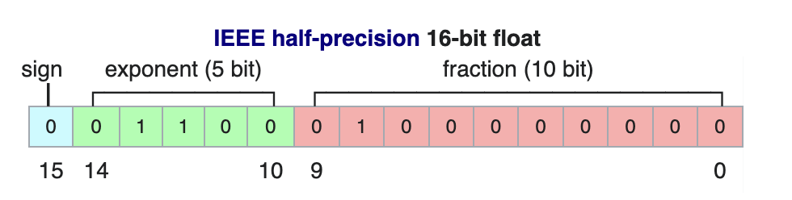

# A Gentle Introduction to 8-bit Matrix Multiplication for transformers at scale using HuggingFace Transformers, Accelerate and BitsAndBytes

<div class="blog-metadata">
    <small>Published August 18, 2022.</small>
    <a target="_blank" class="btn no-underline text-sm mb-5 font-sans" href="https://github.com/huggingface/blog/blob/main/hf-bitsandbytes-integration.md">
        Update on GitHub
    </a>
</div>

<div class="author-card">
    <a href="/Younes">
        
        <div class="bfc">
            <code>Younes</code>
            <span class="fullname">Younes Belkada</span>
        </div>
    </a>
    <a href="/Tim">
        
        <div class="bfc">
            <code>Tim</code>
            <span class="fullname">Tim Dettmers</span>
            <span class="bg-gray-100 dark:bg-gray-700 rounded px-1 text-gray-600 text-sm font-mono">guest</span>
        </div>
    </a>
</div>


# Introduction

Language models have been becoming larger all the time. At the time of this writing, PaLM has 540B parameters, OPT, GPT-3 and BLOOM have around 176B parameters, and the current trend is towards even larger models. Below is a qualitative diagram showing the size of some recent language models.


At this same time, PaLM has 540B parameters, OPT, GPT-3 and BLOOM have around 176B parameters, and the current trend is towards even larger models. 


Therefore, these models are hard to run on easily accessible devices. For example, just to do inference on BLOOM-175B you would need to have 8x 80GB A100 GPUs (~$15k each), and 72 of those GPUs to finetune. Much larger models, like PaLM would require even more resources.

Because these huge models require so many GPUs to run, we need to find ways to reduce these requirements, while preserving model's performance. Various technologies have been developed that try to shrink the model size, you may have heard of quantization and distillation, and there are many others.

At Hugging Face and BigScience, after completing the training of BLOOM-176B, one of the approaches we took is to collaborate with `bitsandbytes` and integrate the technology described in the recent "GPT3.int8(): 8-bit Matrix Multiplication for Transformers at Scale" paper into Hugging Face Transformers. We chose to integrate it since no post-training quantization is required to run this method and you can reduce the memory footprint of the models by 2x for any model by adding just a few lines of code.

This article focuses on giving a high-level overview of this quantization technology, outlining the difficulties in incorporating it into the `transformers` library, and drawing up the long-term goals of this partnership.

What elements affect a model's size? What makes BLOOM 350GB? Let's begin by gradually going over a few basic premises.

# Common data types used in Machine Learning

We start with the basic understanding of different floating point data types, which are also referred to as "precision" in the context of Machine Learning.

The size of a model is determined by the number of its parameters, and their precision, typically one of float32, float16 or bfloat16.

Float32 (FP32) stands for the standard 32-bit floating point representation. With this data type it is possible to represent a wide range of floating numbers. In FP32, 8 bits are reserved for the "exponent", 23 bits for the "mantissa" and 1 bit for the sign of the number. In addition to that, most of the hardware supports FP32 operations and instructions.


In the float16 (FP16) data type, 5 bits are reserved for the exponent and 10 bits are reserved for the mantissa. This makes the representable range of FP16 numbers much lower than FP32. This exposes FP16 numbers to the risk of overflowing (trying to represent a number that is very large) and underflowing (representing a number that is very small).



For example, if you do `10k * 10k` you end up with `100k` which is not possible to represent in FP16, as the largest number possible is `64k`. And thus you'd end up with `NaN` (Not a Number) result and all the prior work is destroyed.
Usually, scaling is used to overcome this issue, but it doesn't always work well.

Thus a new format bfloat16 (BF16) was created to overcome this issue. In BF16, 8 bits are reserved for the exponent (which is the same as in FP32) and 7 bits are reserved for the fraction.


This means that in BF16 we can retain the same dynamic range as FP32. But we lose 3 bits of precision. Now there is absolutely no problem with huge numbers, but the precision is worse than FP16 here.

In the Ampere architecture NVIDIA also introduced TensorFloat-32 (TF32) precision format, which combines the dynamic range of BF16 and precision of FP16, which uses 19 bits. But it's currently only used internally only during certain operations.


In the machine learning jargon FP32 is called full precision (4 bytes), while BF16 and FP16 are referred to as half-precision (2 bytes).
On top of that, the int8 (INT8) data type consists of a 8-bit representation that can store 2^8 different values (between [0, 255] or [-128, 127] for signed integrers). 


While, ideally the training and inference should be done in FP32, it is usually quite expensive and therefore a mixed precision approach is used where some parts of the training loop is done in FP32 while the other in either BF16 or FP16. The lower precision also runs faster.

During training the master weights are always stored in FP32, but in practice often the half-precision weights provide approximately as good of a quality during inference as their FP32 counterpart, and thus we can use the half-precision weights and thus use half the GPUs to accomplish the same outcome.


To calculate the model size in bytes one multiplies the number of parameters by the size of the chosen precision in bytes.  For example, if we use the bfloat16 version of the BLOOM-176B model we have `176*10**9 x 2 bytes = 352GB`! As discussed earlier this is quite a challenge to fit into a few GPUs.

But what if we can store those weights using less memory using a different data type? A methodology called quantization has been used widely in Deep Learning.


# Introduction to model quantization

How can we play with the precision of the parameters and reduce the model’s size? To improve accessibility for edge device applications, 8-bit quantization methods have been developed and widely used in Deep Learning. In other words, reducing the half-precision model’s precision into 8-bit (instead of 16-bit) leads to significant memory footprint reduction.

Quantization is done by essentially “rounding” from one data type to another. For example, if one data type has the range 0..9 and another 0..4 then the value “4” in the first data type would be rounded to “2” in the second data type. However, if we have the value “3” in the first data type, it lies between 1 and 2 of the second data type and we would usually round to “2”. This shows that both value “4” and “3” of the first data type have the same value “2” in the second data type. This highlights, that quantization is a noisy process that can lead to degradation of the information stored.

The most common types of 8-bit quantization techniques are zero-point quantization and absolute maximum (absmax) quantization. Zero-point quantization and absmax quantization maps the floating point values into more compact int8 (1 byte) values. What these methods do as a first step towards quantization is to normalize the input by scaling by a quantization constant. For example, if my range is -1.0…1.0 and I want to quantize into the range -127…127, I want to scale by the factor 127 before rounding to the 8-bit value. To retrieve back the original value you would just need to divide the int8 value by the quantization factor 127. For example, the value 0.3 would be scaled to 0.3*127 = 38.1. Through rounding we get the value of 38. If we reverse this, we get 38/127=0.2992 – we have a quantization error of 0.008 in this example. Those small errors can be accumulated and propagated across the model’s layers and lead to potential performance degradation.


(Image taken from: [this blogpost](https://intellabs.github.io/distiller/algo_quantization.html) )

While the examples above were some toy examples, we now look at the details of absmax quantization. To calculate the mapping between the fp16 number and its corresponding int8 number in absmax quantization you have to first divide by the absolute maximum value of the tensor, and then multiply by the total range of the data type. For example, Int8 has a range of [-127, 127] and thus we scale by 127. For unsigned Int8, we would subtract the minimum and scale by the absolute maximum. This is close to what zero-point quantization does, a min-max scaling with the difference that zero-point quantization maintains scales the values in such a way that the value “0” is always represented by an integer without any quantization error.  To retrieve back the latest, one can just divide in full precision the int8 number with the quantization factor.


These tricks can be combined in several ways, for example row-wise or vector-wise quantization when it comes to matrix multiplication for more accurate results.

If you want to read more details about how classic quantization techniques work, we recommend to read this [blogpost](https://intellabs.github.io/distiller/algo_quantization.html), or read the GPT3.int8() paper (link).

While these basic techniques enable us to quantize transformers, they usually lead to a drop in accuracy for larger models. The bnb-int8 implementation that we integrated into our transformers and accelerate libraries is the first technique that does not degrade performance even for large models with 176B parameters, such as BLOOM. How does this work?


# A gentle summary of mixed int8 matrix multiplication for Large Language Models

Authors have demonstrated how crucial it is to comprehend the scale-dependent emergent properties of transformers in order to understand why traditional quantization fails for big models. They demonstrate that performance deterioration is caused by outlier features.

In essence, 8-bit Matrix Multiplication at Scale for Transformers seeks to complete the matrix multiplication computation in three steps:
1. From the input hidden states, extract the outliers and non-outliers by column.
2. Perform the matrix multiplication of the outliers in fp16 and the non-outliers in int8
3. Dequantize the non-outliers results and retrieve the full result in fp16


## Why outliers are so important here?

A value that is outside the range of some numbers' global distribution is generally referred to as an outlier. Outlier detection has been widely used and covered in the current literature and having a prior knowledge on the distribution of your features helps with the task of outlier detection. 
More specifically, authors have observed that classic quantization at scale fails for transformer-based models >6B parameters. 

(XXX) here add the figure, ask to Tim if this is ok

For the majority of models, hidden state features in transformers increase in magnitude with model size. As was mentioned earlier, 8-bit precision is extremely constrained, therefore quantizing a vector with several big values can produce wildly erroneous results. Additionally, because of a built-in characteristic of the transformer-based architecture that links all the elements together, these errors would propagate deeper across layers.
Therefore, mixed-precision decomposition has been developed to facilitate efficient quantization with such extreme outliers and we will review it together on the next section. 

## Inside the MatMul

Once the hidden states are computed we extract the outliers using a custom threshold (here we use 6.0) and we decompose the matrix in two parts as explained above.
The outlier part is done in fp16 so it is a classic matrix multiplication whereas the 8bit matrix multiplication is done by quantizing the weights and hidden states int 8-bit precision using row-wise absmax quantization for the hidden states and column-wise absmax quantization for the weight matrix.
After this step the results are de-quantized and retrieved back in half precision to be able to add it to the first matrix multiplication.


## What does 0 degradation mean?

How can we properly evaluate the performance degradation of this method? How much quality do we lose in terms of generation when using 8-bit models?
We have ran several common tasks benchmarks with the 8-bit and native model using lm-eval-harness and reported the results:

| benchmarks |   | | | difference       |
| ---------- | --------- | ---------------- |
| name       | metric    | value - int8 - 6 | value - fp16 | err - int8 - 6 | err - fp16 | \- |
| hellaswag  | acc\_norm | 0.7849           | 0.7849 | 0.0041 | 0.0041 | 0 |
| hellaswag  | acc       | 0.5921           | 0.5931 | 0.0049 | 0.0049 | 0.001 |
| piqa       | acc       | 0.7965           | 0.7959 | 0.0094 | 0.0094 | 0.0006 |
| piqa       | acc\_norm | 0.8101           | 0.8107 | 0.0092 | 0.0091 | 0.0006 |
| lambada    | ppl       | 3.0142           | 3.0152 | 0.0552 | 0.0552 | 0.001 |
| lambada    | acc       | 0.7464           | 0.7466 | 0.0061 | 0.0061 | 0.0002 |
| winogrande | acc       | 0.7174           | 0.7245 | 0.0127 | 0.0125 | 0.0071 |

And the results on BLOOM-176:

| benchmarks |   | | | difference       |
| ---------- | --------- | ---------------- |
| name       | metric    | value - int8 - 6 | value - bf16 | err - int8 - 6 | err - bf16 | \- |
| hellaswag  | acc\_norm | 0.7274           | 0.7303 | 0.0044 | 0.0044 | 0.0029 |
| hellaswag  | acc       | 0.5563           | 0.5584 | 0.005 | 0.005 | 0.0021 |
| piqa       | acc       | 0.7835           | 0.7884 | 0.0096 | 0.0095 | 0.0049 |
| piqa       | acc\_norm | 0.7922           | 0.7911 | 0.0095 | 0.0095 | 0.0011 |
| lambada    | ppl       | 3.9191           | 3.931 | 0.0842 | 0.0846 | 0.0119 |
| lambada    | acc       | 0.6808           | 0.6718 | 0.0065 | 0.0065 | 0.009 |
| winogrande | acc       | 0.7048           | 0.7048 | 0.0128 | 0.0128 | 0 |


We indeed observe 0 performance degradation for those models since the absolute difference of the metrics are all below the standard error (except for BLOOM-int8 which is slightly better than the native model on lambada). For more detailed performance evaluation against state of the art approaches you may look closely at the paper!

## Is it faster than native models?

We benchmarked the inference speed of int8 models on different models, although we are close to having the same speed than the native model for large models (tested on BLOOM-176) the inference speed seems to be much slower than the native model on smaller models.

| Model          | Number of parameters | Hardware     | Time per token in milliseconds for Batch Size 1 | Time per token in milliseconds for Batch Size 8 | Time per token in milliseconds for Batch Size 32 |
| -------------- | -------------------- | ------------ | ----------------------------------------------- | ----------------------------------------------- | ------------------------------------------------ |
| BLOOM-176-int8 | 176B                 | 4xA100 80GB  | 282                                             | 37.5                                            | 10.2                                             |
| BLOOM-176-bf16 | 176B                 | 8xA100 80GB  | 239                                             | 32                                              | 9.9                                              |
| BLOOM-176-int8 | 176B                 | 6xA100 40GB  | 365                                             | 46.7                                            | 12.4                                             |
| BLOOM-176-int8 | 176B                 | 5xA100 40GB  | 367                                             | 46.4                                            | oom                                              |
| BLOOM-176-bf16 | 176B                 | 14xA100 40GB | 285                                             | 36.5                                            | 10.4                                             |
| T5-11b | fp16  | 11B                  | 2xT4 15GB    | 11.7                                            | 1.7                                             | 0.5                                              |
| T5-11b | int8  | 11B                  | 1xT4 15GB    | 43.5                                            | 5.3                                             | 1.3                                              |
| T5-3b | fp32   | 3B                   | 2xT4 15GB    | 45                                              | 7.2                                             | 3.1                                              |
| T5-3b | int8   | 3B                   | 1xT4 15GB    | 312                                             | 39.1                                            | 10.2                                             |


For more technical deep-dive of the method, we highly suggest you to check Tim Dettmers' blog : (link)

# Which technology to use for `transformers` integration?

How were these technologies incorporated into the `transformers` library? What were the difficulties we faced and the main techniques we employed in the integration project? Let's examine everything in the next sections!

## How to use it in `bitsandbytes` library?

The module that is responsible of the whole magic described in this blogpost is called `Linear8bitLt` module and you can easily import from `bitsandbytes` library. The latest derives from a classic `torch.nn` Module and be easily used and deployed in your architecture with the commands described below. Let's walk through step by step with a specific usecase: let's say you want to convert a shallow model in int8 using `bitsandbytes`, here is all what you need to know:

1. First we need the correct imports below!

```py
import torch
import torch.nn as nn

import bitsandbytes as bnb
from bnb.nn import Linear8bitLt
```

2. Then you can define your own FP16 model. This detail is very important as you absolutely need a FP16 model to make it work. You can also train or load a FP32 or BF16 model and cast it directly to FP16 (but at your own risk).

```py
fp16_model = nn.Sequential(
    nn.Linear(64, 64),
    nn.Linear(64, 64)
).to(torch.float16)
```

3. Let's say you have trained your model on your favorite dataset and task! Now time to save the model

```py
torch.save(fp16_model.state_dict(), "model.pt")
```

4. Now that you have your `state_dict` that is saved , let us define an int8 model as below:

```py
int8_model = nn.Sequential(
    Linear8bitLt(64, 64, has_fp16_weights=False),
    Linear8bitLt(64, 64, has_fp16_weights=False)
)
```

Here it is very important to add the flag `has_fp16_weights` as by default this is set to `True` and right now loading a model with `has_fp16_weights=True` is not very well supported yet.

5. Now time to load your model in 8-bit!

```py
int8_model.load_state_dict(torch.load("model.pt"))
int8_model = int8_model.to(0) # Quantization happens here
```

Note that the quantization step is done in the second line once the model is set on the GPU. If you print `int8_model[0].weight` before calling the `.to` function you get:

```
int8_model[0].weight
Parameter containing:
tensor([[ 0.0031, -0.0438,  0.0494,  ..., -0.0046, -0.0410,  0.0436],
        [-0.1013,  0.0394,  0.0787,  ...,  0.0986,  0.0595,  0.0162],
        [-0.0859, -0.1227, -0.1209,  ...,  0.1158,  0.0186, -0.0530],
        ...,
        [ 0.0804,  0.0725,  0.0638,  ..., -0.0487, -0.0524, -0.1076],
        [-0.0200, -0.0406,  0.0663,  ...,  0.0123,  0.0551, -0.0121],
        [-0.0041,  0.0865, -0.0013,  ..., -0.0427, -0.0764,  0.1189]],
       dtype=torch.float16)
```

Whereas if you print it after the second line's call you get:

```
int8_model[0].weight
Parameter containing:
tensor([[   3,  -47,   54,  ...,   -5,  -44,   47],
        [-104,   40,   81,  ...,  101,   61,   17],
        [ -89, -127, -125,  ...,  120,   19,  -55],
        ...,
        [  82,   74,   65,  ...,  -49,  -53, -109],
        [ -21,  -42,   68,  ...,   13,   57,  -12],
        [  -4,   88,   -1,  ...,  -43,  -78,  121]], device='cuda:0',
       dtype=torch.int8, requires_grad=True)
```

Note that you can see that the values of the weights are "truncated" as we have seen when explaining quantization in the previous sections. Also the values seems to be distributed between [-128, 127]
You might also wonder how to retrieve the FP16 weights in order to perform the outlier MatMul in fp16? You can simply do:

```py
(int8_model[0].weight.CB * int8_model[0].weight.SCB)/127
```

And you will get:

```
tensor([[ 0.0028, -0.0459,  0.0522,  ..., -0.0049, -0.0428,  0.0462],
        [-0.0960,  0.0391,  0.0782,  ...,  0.0994,  0.0593,  0.0167],
        [-0.0822, -0.1240, -0.1207,  ...,  0.1181,  0.0185, -0.0541],
        ...,
        [ 0.0757,  0.0723,  0.0628,  ..., -0.0482, -0.0516, -0.1072],
        [-0.0194, -0.0410,  0.0657,  ...,  0.0128,  0.0554, -0.0118],
        [-0.0037,  0.0859, -0.0010,  ..., -0.0423, -0.0759,  0.1190]],
       device='cuda:0')
```

Which is close enough to the original FP16 values!

6. Now you can safely infer using your model, by of course making sure your model is on the correct GPU

```py
input_ = torch.randn(8, 64, dtype=torch.float16)
hidden_states = int8_model(input_.to(0))
```

Checkout [this gist](https://gist.github.com/younesbelkada/9035e247b066d1cf18682e9e4c21032d) for the full minimal code! Now time has come to understand how to integrate that into `transformers` library!

As a side note, you should aware that these modules differ slightly from the `nn.Linear` modules in that their parameters come from the `bnb.nn.Int8Params` class rather than the `nn.Parameter` class. You'll see in later that this presented an additional obstacle on our journey! 

## `accelerate` is all you need

When working with huge models, the `accelerate` library includes a number of helpful utilities. The method from that package called `init_empty_weights` is one of those that we truly enjoy. Any model, regardless of size, may be initialized while using this method as a context manager with 0 cost, aka **no memory**.

```py
import torch.nn as nn
from accelerate import init_empty_weights

with init_empty_weights():
    model = nn.Sequential([nn.Linear(100000, 100000) for _ in range(1000)]) # This will take 0 RAM!
```

The initialized model will be put on the Pytorch's `meta` device, an underlying mechanism to represent shape and dtype without allocating memory for storage. Isn't very cool?

Initially this function called inside the `.from_pretrained` function overrides all parameters to `torch.nn.Parameter`, this would not fit our requirement since we want to keep the `Int8Params` class in our case for `Linear8bitLt` modules as explained above. We managed to fix that on [the following PR](https://github.com/huggingface/accelerate/pull/519) that modifies:

```py
module._parameters[name] = nn.Parameter(module._parameters[name].to(torch.device("meta")))
```

to

```py
param_cls = type(module._parameters[name])
kwargs = module._parameters[name].__dict__
module._parameters[name] = param_cls(module._parameters[name].to(torch.device("meta")), **kwargs)
```

Now that this is fixed, we can easily leverage this context manager and play with it to replace all `nn.Linear` modules to `bnb.nn.Linear8bitLt` with no cost using a custom function!

```py
def replace_8bit_linear(model, threshold=6.0, modules_to_not_convert="lm_head"):
    for name, module in model.named_children():
        if len(list(module.children())) > 0:
            replace_8bit_linear(module, threshold, modules_to_not_convert)

        if isinstance(module, nn.Linear) and name != modules_to_not_convert:
            with init_empty_weights():
                model._modules[name] = bnb.nn.Linear8bitLt(
                    module.in_features,
                    module.out_features,
                    module.bias is not None,
                    has_fp16_weights=False,
                    threshold=threshold,
                )
    return model
```

This function replaces recursively all `nn.Linear` layers of a given model initialized on the `meta` device and replace them to a `Linear8bitLt` module. The attribute `has_fp16_weights` has to be set to `False` in order to directly load the weights in `int8` together with the quantization statistics. 

Note also that we discard the replacement for some modules (here the `lm_head`) since we want to keep the latest in their native precision for more precise and stable results. 

It is not over yet! The function above is executed under `init_empty_weights` context manager which means that the new model will be still in the `meta` device. 
For models that are initialized under this context manager, `accelerate` loads later manually the parameter of each module and sets it on the correct device. 
In `bitsandbytes` setting a `Linear8bitLt` module's device is a crucial step (line below from [here](https://github.com/TimDettmers/bitsandbytes/blob/bd515328d70f344f935075f359c5aefc616878d5/bitsandbytes/nn/modules.py#L94)) as we have seen in our toy script. If you look more closely, this happens when `.to` or `.cuda` is called:

```py
# we store the 8-bit rows-major weight
# we convert this weight to the turning/ampere weight during the first inference pass
B = self.data.contiguous().half().cuda(device)
CB, CBt, SCB, SCBt, coo_tensorB = bnb.functional.double_quant(B)
del CBt
del SCBt
self.data = CB
setattr(self, 'CB', CB)
setattr(self, 'SCB', SCB)
```

Here, setting a parameter's device step is extremely crucial since the quantization statistics fails when calling it twice. We had to came up with our implementation of `accelerate`'s `set_module_tensor_to_device` function (termed as `set_module_8bit_tensor_to_device`) and propose some Pull Requests on `accelerate` library; all of that to make sure this function is never called twice. Let's in detail in the section below! 

## Be very careful on how to set devices with `accelerate`

Here we played a very delicate balancing act with `accelerate` library!
Once you load your model and set it on the correct devices, sometimes you still need to call `set_module_tensor_to_device` to dispatch the model with hooks on all devices. This is done inside `dispatch_model` function from `accelerate`. This will involve potentially calling `.to` several times, which is something we want to avoid.
2 Pull Requests were needed to achieve what we wanted! The initial PR proposed [here](https://github.com/huggingface/accelerate/pull/539/) broke some tests but [this PR](https://github.com/huggingface/accelerate/pull/576/) successfully fixed everything! 

## Wrapping up all together

Therefore the ultimate recipe is:
1. Initialize a model in the `meta` device with the correct modules
2. Set the parameters one by one on the correct GPU device and make sure you never do this procedure twice!
3. Put new keyword arguments in the correct place everywhere, and add some nice documentation
4. Add very extensive tests! Check our tests [here](https://github.com/huggingface/transformers/blob/main/tests/mixed_int8/test_mixed_int8.py) for more details

All that said, this integration adventure was very fun, deep diving and doing some "surgery" on different libraries to align everything and make it work was pure fun! 

Now time to see how to benefit from this integration and how to successfully use it in `transformers`! 

# How to use it in `transformers`

## Hardware requirements

8-bit tensor core are not supported on the CPU. bitsandbytes can be run on 8-bit tensor cores-supported hardwares, which are Turing and Ampere GPUs (RTX 20s, RTX 30s, A40-A100, T4+). For example, Google Colab GPUs are usually NIVIDIA T4 GPUs and the latest generation of GPUs does support 8-bit cores. Our demos are based on Google Colab so check it out below!

## Installation

Just install the latest version of the libraries using the commands below (make sure that you are using python>=3.8) and run the commands below to try out

```bash
pip install accelerate
pip install bitsandbytes
pip install git+https://github.com/huggingface/transformers.git
```

## Example demos - running T5 11b on a Google Colab

Checkout the Google colab demos for running 8bit models on a Google Colab using BLOOM-3b model !

Here is the demo for running T5-11b (42GB in fp16)! Using 8-bit modules on Google Colab:

[](https://colab.research.google.com/drive/1YORPWx4okIHXnjW7MSAidXN29mPVNT7F?usp=sharing)


Or this demo for BLOOM-3B:

[](https://colab.research.google.com/drive/1qOjXfQIAULfKvZqwCen8-MoWKGdSatZ4?usp=sharing)

# Scope of improvements

This approach, in our opinion, greatly improves access to very large models. With no performance degradation, it enables users with less compute to access models that were previously inaccessible.
We've found several areas for improvement that can be worked on in the future to make this method even better for large models!

## Inference speed and slowing down on smaller models

For very large language models, we have observed that we nearly maintain the same inference speed using the native model as opposed to the mixed-8bit model (see attached experiments on BLOOM-176B).

However, due to the numerous internal casting steps, together with the outlier detection procedure that take place inside each 8bit-Linear layer, this method can significantly slow down inference speed on small models (models with less than 6b parameters).

One could attempt to improve that in the future and see how the inference speed can be decreased, probably by avoiding the casting operations or writing more efficient CUDA kernels.

## Saving 8-bit state dicts on the Hub

8-bit state dicts cannot currently be loaded directly into the 8-bit model after being pushed on the Hub. This is due to the fact that the statistics (remember `weight.CB` and `weight.SCB`) computed by the model are not currently stored or taken into account inside the state dict, and the `Linear8bitLt` module does not support this feature yet. 
We think that having the ability to save that and push it to the Hub might contribute to greater accessibility.
## CPU support

CPU devices do not support 8-bit cores, as was stated at the beginning of this blogpost. Can we, however, get past that? Running this module on CPUs would also significantly improve usability and accessibility. 

## Scaling up on other modalities

Currently, language models dominate very large models. Leveraging this method on very large vision, audio, and multi-modal models might be an interesting thing to do for better accessibility in the coming years as these models become more accessible.

# Credits

Huge thanks to the following who contributed to improve the readability of the article as well as contributed in the integration procedure in `transformers` (listed in alphabetic order):
JustHeuristic (Yozh),
Michael Benayoun,
Stas Bekman,
Sylvain Gugger,
Tim Dettmers