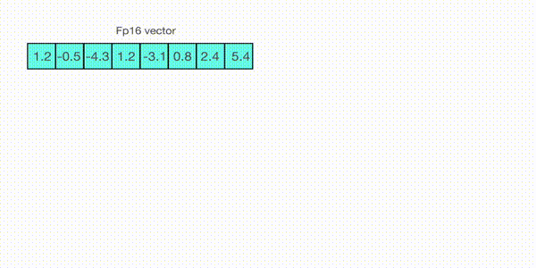

# A Gentle Introduction to 8-bit Matrix Multiplication for transformers at scale using transformers, accelerate and bitsandbytes

    <small>Published August 18, 2022.</small>
    <a target="_blank" class="btn no-underline text-sm mb-5 font-sans" href="https://github.com/huggingface/blog/blob/main/hf-bitsandbytes-integration.md">
        Update on GitHub
    </a>

    <a href="/Maxence">
        
        

            <code>Younes</code>
            Younes Belkada
            guest
        

    </a>

# Introduction

Language models are becoming larger: at the time of writing this blogpost, PaLM has 540B parameters, OPT, GPT-3 and BLOOM have around 176B parameters, and the current thread is clearly centered around large language models. Below is a qualitative diagram showing the size of some recent language models (original content).

Therefore these models are hard to run on easily accessible devices. To properly run OPT-175B you would need to have around 5-6 NVIDIA A100 80GB, with each GPU costing ~15.000€.

Running large models on fewer devices with no performance degradation will be an open challenge for the next few years. In the future, Hugging Face will certainly be hosting these large models as we did it for BLOOM, OPT and YaLM, and we want users to benefit from the most powerful tools to run these models efficiently.

At Hugging Face and BigScience, while training BLOOM-176B we were interested in reducing the main model’s size with the least performance degradation possible. That is how we came out collaborating with bitsandbytes to integrate the recent “GPT3.int8(): 8-bit Matrix Multiplication for Transformers at Scale” paper on transformers. We decided to integrate it since no post-training quantization is required to run this feature and you can reduce the memory footprint of the models at most by 2 for the largest models with few lines of code. Let’s understand in this blogpost how this method works in a nutshell and how to use it in transformers!

# A high level look

Let us start from the beginning. The size of the model is determined by the number of its parameters, and the precision of the model is mostly determined by the precision of the parameters. 
Let’s imagine 1 bit as an available memory case to store a binary value (0 or 1), and 1 byte being a bigger memory that can store 8 bits. With one byte we can make 2^8=256 different patterns. 1 byte numbers have a limited precision and one should store numbers in 2 bytes (float16 or bfloat16), 4 bytes (float32) or 8 bytes (float64) to get more precision - aka to cover more possible patterns and store very precise numbers.

By default, most common Deep Learning models are stored in float32 - fp32 (4 bytes per parameter) but Large language models are usually stored in half-precision, so either fp16 or bf16 precision (2 bytes per parameter) since the performance gap between fp32 models and fp16 is relatively acceptable. 

How is a model's size calculated in practice? For instance BLOOM-176B that has been trained and stored in bf16 has roughly a total size of 176.000.000.000 x 2 bytes = 352GB! Fitting correctly such a high memory requirement into GPU RAM would be quite challenging. 
But what if we can store those weights using less memory using a different precision? A trick called quantization has been widely used in Deep Learning and let’s see how it works! 

# Quantizing models in few words

How can we play with the precision of the parameters and reduce the model’s size? To improve accessibility and for edge device applications, 8-bit quantization methods have been developed and widely used in Deep Learning. In other words, reducing the half-precision model’s precision into 8-bit (instead of 16-bit) leads to significant memory footprint reduction. The most common types of 8-bit quantization techniques are zero-point quantization and absmax quantization.

Zero-point quantization and absmax quantization maps the floating point values into more compact int8 (1 byte) values. To retrieve back the original value you would just need to divide the int8 value by the quantization factor. This has a price since ‘close enough’ floating points will probably be mapped to the same int8 value. Those small errors can be accumulated and propagated across the model’s layers and lead to potential performance degradation. 

(Image taken from: [this blogpost](https://intellabs.github.io/distiller/algo_quantization.html) )

To calculate the mapping between the fp16 number and its corresponding int8 number in absmax quantization you have to first define the quantization factor (this number will depend on the calibration method you chose - e.g. for absmax quantization we chose 255 or 127 divided by the absmax of the vector) and round the multiplication result between this factor and the original fp16 number. To retrieve back the latest, one can just divide in full precision the int8 number with the quantization factor. 

These tricks can be combined in several ways, row-wise or column-wise quantization when it comes to matrix multiplication for more accurate results. 

If you want to read more details about how classic quantization techniques work, we recommend to read this blogpost: https://intellabs.github.io/distiller/algo_quantization.html 

However, these methods are known to degrade performance, and they have been only studied for models with less than 350M parameters. Degradation-free quantization up to 350M parameters is poorly understood and multi-billion parameter quantization remains an open challenge. 

# Mixed int8 matrix multiplication for Large Language Models

In simple words, 8-bit Matrix multiplication at Scale for transformers aims to perform the computation of the matrix multiplication in 3 steps:
1. Given the input hidden states extract the column-wise outliers and non-outliers
2. Perform the matrix multiplication of the outliers in fp16 and the non-outliers in int8
3. Dequantize the non-outliers results and retrieve the full result in fp16
Let’s try here to understand these procedures step by step.

## What is an outlier in this case? 

In general, an outlier stands for a value that is outside the global distribution of some numbers. Given a set of numbers, the outlier is the number that is outside a certain pre-defined range. Outlier detection has been widely used and covered in the current literature and it happens that to perform robust outlier detection the empirical approach seems to be the best one. According to this paper, transformer-based architectures have a distribution such that ~99.9% of the values are inside the range [-6, 6]. 

## Inside the MatMul

Once the hidden states are computed we extract the outliers using a custom threshold (here we use 6.0) and we decompose the matrix in two parts as explained above. 
The outlier part is done in fp16 so it is a classic matrix multiplication whereas the 8bit matrix multiplication is done by quantizing the weights and hidden states using row-wise absmax quantization for the hidden states and column-wise absmax quantization for the weight matrix.
After this step the results are de-quantized and retrieved back in half precision to be able to add it to the first matrix multiplication.

## Why don’t we care about the bias term?

Simply because the output of this algorithm is in fp16 which is the same precision as the bias term!

## What does 0 degradation mean?

How can we properly evaluate the performance degradation of this method? How much quality do we lose in terms of generation when using 8-bit models?
We have ran several common tasks benchmarks with the 8-bit and native model using lm-eval-harness and reported the results:

TODO: add the tables

We indeed observe 0 performance degradation for those models since the absolute difference of the metrics are all below the standard error (except for BLOOM-int8 which is slightly better than the native model on lambada). For more detailed performance evaluation against state of the art approaches you may look closely at the paper!

# How to use it in transformers

By collaborating with bitsandbytes we now support loading models in mixed 8bit as described in the paper cited above. If you match the requirements, you can test this method with a few lines of code and benefit from it, and potentially run large models on your devices! The method has been mainly tested on NLP models including BLOOM, OPT and T5!

## Hardware requirements

Some 8-bit operations are not supported on the CPU. bitsandbytes can be run on 8-bit tensor cores-supported hardwares, which are Turing and Ampere GPUs (RTX 20s, RTX 30s, A40-A100, T4+). For example, Google Colab GPUs are usually NIVIDIA T4 GPUs and the latest generation of GPUs does support 8-bit cores. Our demo is based on Google Colab so check it out below! 

## Installation

Just install the latest version of the libraries using the commands below (make sure that you are using python>=3.8) and run the commands below to try out 

TODO: add the commands

# Scope of improvements

Although this method seems to be great for large models, we have identified several scope of improvements that can be tackled in the future for better usage!

## Inference speed and slowing down on smaller models

We have noticed that we retain the same inference speed on the native model than on the mixed-8bit model for very large language models (BLOOM-176B). However this method can significantly slow down inference speed on small models (<6b parameters models) this is due to the various internal casting steps that occur inside each 8bit-Linear layer. 
As a future work, one could try to improve that and see how the inference speed can be reduced on small models, probably by avoiding the casting operations. 
TODO: add benchmark inference
## Saving 8-bit state dicts on the Hub

For now 8-bit state dicts cannot be pushed on the Hub and loaded directly into the 8-bit model. This is because the statistics (outliers) computed by the model are not stored and considered inside the state dict for now. We believe that being able to save that and push it on the Hub could help for better accessibility (e.g. loading a T5-large or T0pp on Google Colab without using a lot of CPU ram for weight loading). 
## CPU support

As stated in the beginning of this blogpost, CPU devices do not support B-bit cores. But can we overcome that? Being able to run this module on CPUs could also largely help in terms of accessibility and broader usage.  

## Scaling up on other modalities

For now very large models are mainly language models. Very large vision, audio and multi-modal models might become more accessible in the next few years therefore leveraging this method on these models might be an interesting thing to do for better accessibility.
