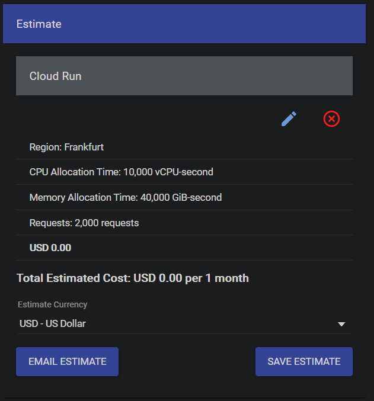

# My Journey to a serverless transformers pipeline on the Google Cloud

This article will talk about my journey to deploy a Transformers pipeline (sentiment-analysis) to Google Cloud. We will start with a quick introduction then directly move to the technical part of the deployment. After that we'll cover the implementation and concludes on what has been achieved.

## The Goal
I wanted to create a system that automatically detects whether a customer review is positive or negative in order to treat it accordingly and improve the customer experience.

## The Transformers library
I have been a bit confused at the beginning when I downloaded the .h5 file, I basically thought it would be compatible with `tensorflow.models.load_model` but it wasn't the case. It was my first time using `transformers`, after a few minutes of research I figured out it was a checkpoint and not a model.
Beside that fact using the pipeline was really easy, I can't think about an easier way.

Below the [official example](https://github.com/huggingface/transformers#quick-tour) from Transformers' GitHub.

```python=
from transformers import pipeline

# Allocate a pipeline for sentiment-analysis
classifier = pipeline('sentiment-analysis')
classifier('We are very happy to include pipeline into the transformers repository.')
[{'label': 'POSITIVE', 'score': 0.9978193640708923}]
```


## Deploying transformers to Google Cloud
> GCP is chosen as it is the cloud environment I am using in my personal organization.

### Step 1 - Research
I already knew that something using flask (an API Service in fact) might be a solution so serve a model. I searched on Google Cloud in the AI section and found a service to host Tensorflow models named [AI-Platform Prediction](https://cloud.google.com/ai-platform/prediction/docs). I also found [App Engine](https://cloud.google.com/appengine) and [Cloud Run](https://cloud.google.com/run) there, but I was concerned regarding the memory usage for appEngine and not really familiar with Docker for the CloudRun.

### Step 2 - Test on AI-Platform Prediction

As the model is not a "pure TensorFlow" saved model but a checkpoint, and I couldn't turn it into a "pure TensorFlow model", I figured out [this page](https://cloud.google.com/ai-platform/prediction/docs/deploying-models) wouldn't work.
From there I saw that I could do some customer code for it, allowing me to load the pipeline instead of having to handle the model, which seemed is easier. I also saw that I could do pre-prediction & post-prediction action, which could be useful in the future if I want to fine-tune it to best suits my use case.
I followed the Google's guide but encountered an issue as the service is still in beta and everything is not stable. This issue is detailed [in your GitHub](https://github.com/huggingface/transformers/issues/9926).

I try to upload the same code as what is[ here](https://github.com/huggingface/transformers/issues/9926#issuecomment-770867976) but without transformers as dependency to see from where the issues come from? It seems like this system is not stable yet to be used with Transformers yet.

### Step 3 - Test on App Engine

I moved to AppEngine as it's a service that I know pretty well but encounter an installation issue with TensorFlow as a system dependency file was missing. I then tried with PyTorch and it worked with a F4_1G instance, but it couldn't handle more than 2 requests on the same instance, which isn't really great performance-wise.

### Step 4 - Test on Cloud Run

Then, I moved to [cloud run](https://cloud.google.com/run) with a docker image of the same thing as I did with AppEngine. I followed [this guide](https://cloud.google.com/run/docs/quickstarts/build-and-deploy#python) to get the idea of how it works. There I could specify a higher memory/more VCPUs to perform the detection with PyTorch. I didn't try Tensorflow there as PyTorch seems to cold boot/load the model faster.


## Implementation

The service is divided into:
- `main.py` handling the request to the pipeline
- `Dockerfile` used to create the image that will be deployed on Cloud Run.
- Model folder having the `pytorch_model.bin`, `config.json` and `vocab.txt`.
- `Requirement.txt` for installing the dependencies

The content on the `main.py` is really simple:
```python=
import os
from flask import Flask, jsonify, request
from transformers import pipeline

app = Flask(__name__)

model_path = "./model"

@app.route('/')
def classifyReview():
review = request.args.get('review')
api_key = request.args.get('api_key')
if review is None or api_key != "MyCustomerApiKey":
return jsonify(code=403, message="bad request")
classify = pipeline("sentiment-analysis", model=model_path, tokenizer=model_path)
return classify("that was great")[0]


if __name__ == '__main__':
    # This is used when running locally only. When deploying to Google App
    # Engine, a webserver process such as Gunicorn will serve the app. This
    # can be configured by adding an `entrypoint` to app.yaml.
    app.run(debug=True, host="0.0.0.0", port=int(os.environ.get("PORT", 8080)))
```

I am getting the review that I need to analyse and return the result with thanks to the classify method of the pipeline.

Then the content of the `DockerFile`
```dockerfile=
# Use Python37
FROM python:3.7
# Copy requirements.txt to the docker image and install packages
COPY requirements.txt /
RUN pip install -r requirements.txt
# Set the WORKDIR to be the folder
COPY . /app
# Expose port 5000
EXPOSE 5000
ENV PORT 5000
WORKDIR /app
# Use gunicorn as the entrypoint
CMD exec gunicorn --bind :$PORT main:app --workers 1 --threads 1 --timeout 0
```

Finally, the `requirement.txt` file
```python=
Flask==1.1.2
torch===1.7.1
transformers~=4.2.0
gunicorn>=20.0.0
```


## Deployment instructions

In order to deploy, we just need to build the image and deploy it to cloud run:

```shell=
gcloud builds submit --tag gcr.io/pro-boost-test-env/ai-customer-review
gcloud run deploy --image gcr.io/pro-boost-test-env/ai-customer-review --platform managed
```

Where `ai-customer-review` is my project name.

You might also need to change the memory allocated from 256 MB to 4Go.


## Performances & Costs

Handling a request takes less than 5 seconds from the moment you send the request, the server cold boot,the model load to the prediction result.

I simulated the cost based on the cloud run instance configuration with [Google pricing simulator](https://cloud.google.com/products/calculator#id=cd314cba-1d9a-4bc6-a7c0-740bbf6c8a78)

I would plan near 1,000 requests per months, if I'm really optimistic, 500 seems more correct for my usage. That's why I worked on 2,000 requests as a security level.
Due to that low number of requests, I didn't bother so much regarding the scalability but might come back into it if my billing increase.

Nevertheless, it's important to stress out that you will pay the storage for each Gigabyte of your build image. It's roughly €0.10 per Gb per months which is fine if you don't keep all your versions on the cloud as my version is slightly above 1 Gb, with Pytorch for 700 Mb & the model for 250 Mb.


## Conclusions

By using Transformers' sentiment analysis pipeline, I won a non-negligible amount of time. Instead of training/fine-tuning a model, I could find one ready to production and start the deployment in my system. I might fine-tune it in the future, but as what it shows on my test, the accuracy was amazing!
I would have liked a "pure TensorFlow" model, or at least a way to load it in TensorFlow without Transformers dependencies to use the AI platform. It would also be great to have a lite version.
