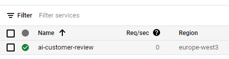
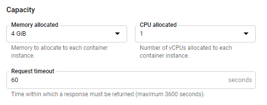
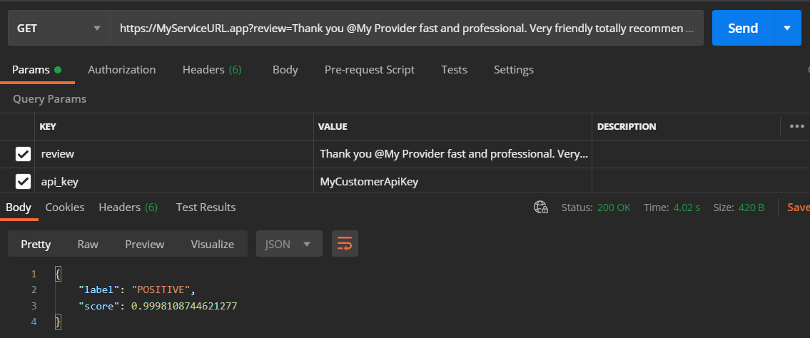

# My Journey to a serverless transformers pipeline on the Google Cloud

This article will talk about my journey to provide a `transformers` pipeline, sentiment-analysis, to [Google Cloud](https://cloud.google.com). We will start with a quick introduction to `transformers` and then move to the technical part of the implementation. In the end, we'll cover the implementation and concludes on what has been achieved.

## The Goal

I wanted to create a micro-service that automatically detects whether a customer review left in Discord is positive or negative in order to treat it accordingly and improve the customer experience. For instance, if the review was negative, I could create a feature which would contact the customer, apologize for the poor quality of service then informing him that our support team will contact him as soon as possible to assist him and hopefully fix the problem. I didn't have any performance constraints especially regarding the time and the scaleability, as I don't plan more than 2,000 requests per month.

## The Transformers library
I have been a bit confused at the beginning when I downloaded the .h5 file, I basically thought it would be compatible with `tensorflow.models.load_model` but it wasn't the case. It was my first time using `transformers`, after a few minutes of research I figured out it was a checkpoint and not a model.
After that, I tried out the API that Hugging Face offers and read a bit more about the pipeline feature they offer. As the results of the API & the pipeline were great, I decided that I could server the model through the pipeline on my own server.

Below the [official example](https://github.com/huggingface/transformers#quick-tour) from Transformers' GitHub.

```python
from transformers import pipeline

# Allocate a pipeline for sentiment-analysis
classifier = pipeline('sentiment-analysis')
classifier('We are very happy to include pipeline into the transformers repository.')
[{'label': 'POSITIVE', 'score': 0.9978193640708923}]
```


## Deploy transformers to Google Cloud
> GCP is chosen as it is the cloud environment I am using in my personal organization.

### Step 1 - Researches
I already knew using an API-Service like `flask` is a solution to serve a `transformers` model. I searched on Google Clouds AI section and found a service to host Tensorflow models named [AI-Platform Prediction](https://cloud.google.com/ai-platform/prediction/docs). I also found [App Engine](https://cloud.google.com/appengine) and [Cloud Run](https://cloud.google.com/run) there, but I was concerned regarding the memory usage for App Engine and not really familiar with Docker for the Cloud-Run.

### Step 2 - Test on AI-Platform Prediction

As the model is not a "pure TensorFlow" saved model but a checkpoint, and I couldn't turn it into a "pure TensorFlow model", I figured out [this page](https://cloud.google.com/ai-platform/prediction/docs/deploying-models) wouldn't work.
From there I saw that I could do some custom code for it, allowing me to load the `pipeline` instead of having to handle the model, which seemed is easier. I also saw that I could do pre-prediction & post-prediction action, which could be useful in the future for pre- or post-processing the data for customers needs.
I followed Google's guide but encountered an issue as the service is still in beta and everything is not stable. This issue is detailed [here](https://github.com/huggingface/transformers/issues/9926).


### Step 3 - Test on App Engine

I moved to [App Engine](https://cloud.google.com/appengine) as it's a service that I am familiar with but encounter an installation issue with TensorFlow as a system dependency file was missing. I then tried with PyTorch and it worked with an F4_1G instance, but it couldn't handle more than 2 requests on the same instance, which isn't really great performance-wise.

### Step 4 - Test on Cloud Run

Lastly, I moved to [Cloud Run](https://cloud.google.com/run) with a docker image. I followed [this guide](https://cloud.google.com/run/docs/quickstarts/build-and-deploy#python) to get an idea of how it works. In Cloud Run, I could configure a higher memory and more vCPUs to perform the prediction with PyTorch. I ditched Tensorflow as PyTorch seems to load the model faster.


## Implementation of the serverless pipeline

the solution consists of four different components: 
- `main.py` handling the request to the pipeline
- `Dockerfile` used to create the image that will be deployed on Cloud Run.
- Model folder having the `pytorch_model.bin`, `config.json` and `vocab.txt`.
    - Model : [DistilBERT base uncased finetuned SST-2
      ](https://huggingface.co/distilbert-base-uncased-finetuned-sst-2-english)
    - To download the model folder, following the instructions in the button. 
    - You don't need to keep the `rust_model.ot` or the `tf_model.h5` as we will use [PyTorch](https://pytorch.org/).
- `requirement.txt` for installing the dependencies

The content on the `main.py` is really simple. The idea is to receive a `GET` request containing two fields. First the review that needs to be analysed, second the API key to "protect" the service. The second parameter is optional, I used it to avoid setting up the oAuth2 of Cloud Run. After these arguments are provided, we load the pipeline which is built based on the model `distilbert-base-uncased-finetuned-sst-2-english` (provided above). In the end, the best match is returned to the client.

which could be optional for you. I am getting the review that I need to analyse and return the result with thanks to the classify method of the pipeline.

```python
import os
from flask import Flask, jsonify, request
from transformers import pipeline

app = Flask(__name__)

model_path = "./model"

@app.route('/')
def classify_review():
    review = request.args.get('review')
    api_key = request.args.get('api_key')
    if review is None or api_key != "MyCustomerApiKey":
        return jsonify(code=403, message="bad request")
    classify = pipeline("sentiment-analysis", model=model_path, tokenizer=model_path)
    return classify("that was great")[0]


if __name__ == '__main__':
    # This is used when running locally only. When deploying to Google Cloud
    # Run, a webserver process such as Gunicorn will serve the app.
    app.run(debug=False, host="0.0.0.0", port=int(os.environ.get("PORT", 8080)))
```

Then the `DockerFile` which will be used to create a docker image of the service. We specify that our service runs with python:3.7, plus that we need to install our requirements. Then we use `gunicorn` to handle our process on the port `5000`.
```dockerfile
# Use Python37
FROM python:3.7
# Allow statements and log messages to immediately appear in the Knative logs
ENV PYTHONUNBUFFERED True
# Copy requirements.txt to the docker image and install packages
COPY requirements.txt /
RUN pip install -r requirements.txt
# Set the WORKDIR to be the folder
COPY . /app
# Expose port 5000
EXPOSE 5000
ENV PORT 5000
WORKDIR /app
# Use gunicorn as the entrypoint
CMD exec gunicorn --bind :$PORT main:app --workers 1 --threads 1 --timeout 0
```

This is important to stress these arguments `--workers 1 --threads 1` which means that I want to execute my app on only one worker (= 1 process) with a single thread. This is due to a billing reason for the process where I don't want to have 2 instances up at once because it might increase the billing. One of the downside is that it will take more time to process if the service receives two requests at once. After that I put the limit to one thread due to the memory usage needed for loading the model into the pipeline. If I were using 4 threads, I might have 4 Gb / 4 = 1 Gb only to perform the full process, which is not enough and would lead to a memory error.

Finally, the `requirement.txt` file
```python
Flask==1.1.2
torch===1.7.1
transformers~=4.2.0
gunicorn>=20.0.0
```


## Deployment instructions

First, you will need to meet some requirements such as having a project on Google Cloud, enabling the billing and installing the `gcloud` cli. You can find more details about it in the [Google's guide - Before you begin](https://cloud.google.com/run/docs/quickstarts/build-and-deploy#before-you-begin), 

Second, we need to build the docker image and deploy it to cloud run by selecting the correct project (replace `PROJECT-ID`) and set the name of the instance such as `ai-customer-review`. You can find more information about the deployment on [Google's guide - Deploying to](https://cloud.google.com/run/docs/quickstarts/build-and-deploy#deploying_to).

```shell
gcloud builds submit --tag gcr.io/PROJECT-ID/ai-customer-review
gcloud run deploy --image gcr.io/PROJECT-ID/ai-customer-review --platform managed
```

After a few minutes, you will also need to upgrade the memory allocated to your Cloud Run instance from 256 MB to 4 Gb. To do so, head over to the [Cloud Run Console](https://console.cloud.google.com/run) of your project.

There you should find your instance, click on it.



After that you will have a blue button labelled "edit and deploy new revision" on top of the screen, click on it and you'll be prompt many configuration fields. At the bottom you should find a "Capacity" section where you can specify the memory.



## Performances


Handling a request takes less than five seconds from the moment you send the request including loading the model into the pipeline, and prediction. The cold start might take up an additional 10 seconds more or less.

We can improve the request handling performance by warming the model, it means loading it on start-up instead on each request (global variable for example), by doing so, we win time and memory usage.

## Costs
I simulated the cost based on the Cloud Run instance configuration with [Google pricing simulator](https://cloud.google.com/products/calculator#id=cd314cba-1d9a-4bc6-a7c0-740bbf6c8a78)


For my micro-service, I would plan near 1,000 requests per months, if I'm really optimistic, 500 seems more correct for my usage. That's why I worked on 2,000 requests as a security level.
Due to that low number of requests, I didn't bother so much regarding the scalability but might come back into it if my billing increase.

Nevertheless, it's important to stress out that you will pay the storage for each Gigabyte of your build image. It's roughly €0.10 per Gb per months which is fine if you don't keep all your versions on the cloud as my version is slightly above 1 Gb, with Pytorch for 700 Mb & the model for 250 Mb.

## Conclusion

By using Transformers' sentiment analysis pipeline, I won a non-negligible amount of time. Instead of training/fine-tuning a model, I could find one ready to production and start the deployment in my system. I might fine-tune it in the future, but as what it shows on my test, the accuracy was amazing!
I would have liked a "pure TensorFlow" model, or at least a way to load it in TensorFlow without Transformers dependencies to use the AI platform. It would also be great to have a lite version.
