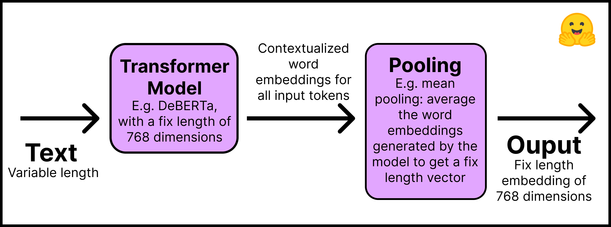
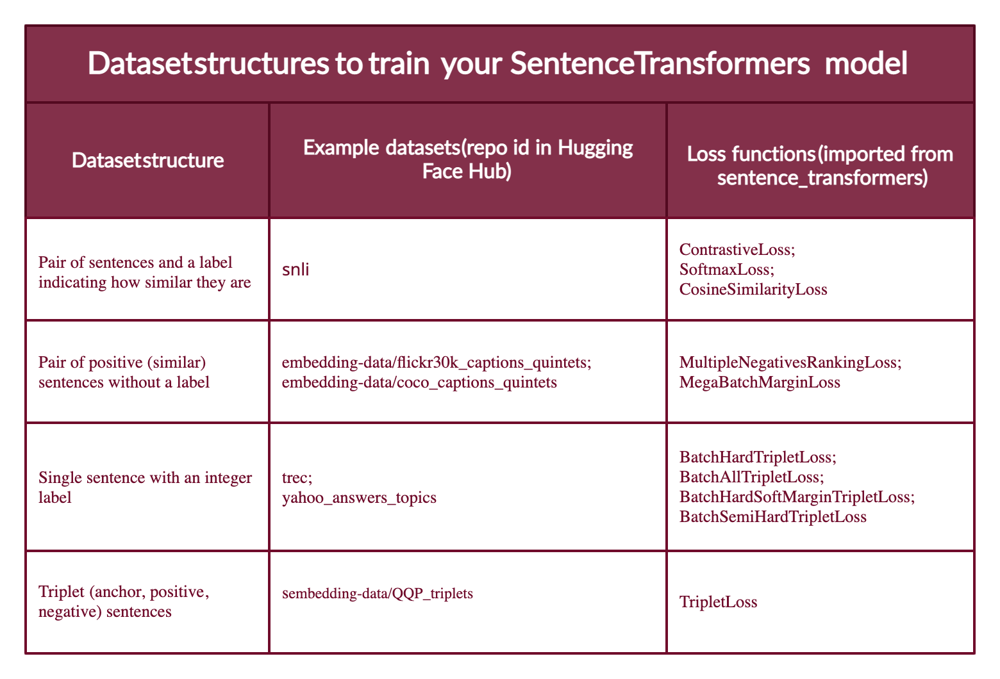

> [!WARNING]
> This guide is only suited for Sentence Transformers before v3.0. Read [Training and Finetuning Embedding Models with Sentence Transformers v3](fine-tune-sentence-transformers-v3) for an updated guide.

# Train and Fine-Tune Sentence Transformers Models


Check out this tutorial with the Notebook Companion:
<a target="_blank" href="https://colab.research.google.com/github/huggingface/blog/blob/main/notebooks/95_Training_Sentence_Transformers.ipynb">
    
</a>

---
---

Training or fine-tuning a Sentence Transformers model highly depends on the available data and the target task. The key is twofold: 
1. Understand how to input data into the model and prepare your dataset accordingly.
2. Know the different loss functions and how they relate to the dataset.
   
In this tutorial, you will:

1. Understand how Sentence Transformers models work by creating one from "scratch" or fine-tuning one from the Hugging Face Hub.
2. Learn the different formats your dataset could have.
3. Review the different loss functions you can choose based on your dataset format.
4. Train or fine-tune your model.
5. Share your model to the Hugging Face Hub.
6. Learn when Sentence Transformers models may not be the best choice.

## How Sentence Transformers models work

In a Sentence Transformer model, you map a variable-length text (or image pixels) to a fixed-size embedding representing that input's meaning. To get started with embeddings, check out our [previous tutorial](https://huggingface.co/blog/getting-started-with-embeddings). This post focuses on text.

This is how the Sentence Transformers models work:

1. **Layer 1** – The input text is passed through a pre-trained Transformer model that can be obtained directly from the [Hugging Face Hub](https://huggingface.co/models?pipeline_tag=fill-mask&sort=downloads). This tutorial will use the "[distilroberta-base](https://huggingface.co/distilroberta-base)" model. The Transformer outputs are contextualized word embeddings for all input tokens; imagine an embedding for each token of the text.
2. **Layer 2** - The embeddings go through a pooling layer to get a single fixed-length embedding for all the text. For example, mean pooling averages the embeddings generated by the model.

This figure summarizes the process:

 

Remember to install the Sentence Transformers library with `pip install -U sentence-transformers`. In code, this two-step process is simple: 

```py
from sentence_transformers import SentenceTransformer, models

## Step 1: use an existing language model
word_embedding_model = models.Transformer('distilroberta-base')

## Step 2: use a pool function over the token embeddings
pooling_model = models.Pooling(word_embedding_model.get_word_embedding_dimension())

## Join steps 1 and 2 using the modules argument
model = SentenceTransformer(modules=[word_embedding_model, pooling_model])
```

From the code above, you can see that Sentence Transformers models are made up of modules, that is, a list of layers that are executed consecutively. The input text enters the first module, and the final output comes from the last component. As simple as it looks, the above model is a typical architecture for Sentence Transformers models. If necessary, additional layers can be added, for example, dense, bag of words, and convolutional.

Why not use a Transformer model, like BERT or Roberta, out of the box to create embeddings for entire sentences and texts? There are at least two reasons.

1. Pre-trained Transformers require heavy computation to perform semantic search tasks. For example, finding the most similar pair in a collection of 10,000 sentences [requires about 50 million inference computations (~65 hours) with BERT](https://arxiv.org/abs/1908.10084). In contrast, a BERT Sentence Transformers model reduces the time to about 5 seconds.
2. Once trained, Transformers create poor sentence representations out of the box. A BERT model with its token embeddings averaged to create a sentence embedding [performs worse than the GloVe embeddings](https://arxiv.org/abs/1908.10084) developed in 2014.

In this section we are creating a Sentence Transformers model from scratch. If you want to fine-tune an existing Sentence Transformers model, you can skip the steps above and import it from the Hugging Face Hub. You can find most of the Sentence Transformers models in the ["Sentence Similarity"](https://huggingface.co/models?pipeline_tag=sentence-similarity) task. Here we load the "sentence-transformers/all-MiniLM-L6-v2" model: 

```py
from sentence_transformers import SentenceTransformer

model_id = "sentence-transformers/all-MiniLM-L6-v2"
model = SentenceTransformer(model_id)
```

Now for the most critical part: the dataset format.

## How to prepare your dataset for training a Sentence Transformers model

To train a Sentence Transformers model, you need to inform it somehow that two sentences have a certain degree of similarity. Therefore, each example in the data requires a label or structure that allows the model to understand whether two sentences are similar or different.

Unfortunately, there is no single way to prepare your data to train a Sentence Transformers model. It largely depends on your goals and the structure of your data. If you don't have an explicit label, which is the most likely scenario, you can derive it from the design of the documents where you obtained the sentences. For example, two sentences in the same report should be more comparable than two sentences in different reports. Neighboring sentences might be more comparable than non-neighboring sentences.

Furthermore, the structure of your data will influence which loss function you can use. This will be discussed in the next section.

Remember the [Notebook Companion](https://colab.research.google.com/github/huggingface/blog/blob/main/notebooks/95_Training_Sentence_Transformers.ipynb) for this post has all the code already implemented.

Most dataset configurations will take one of four forms (below you will see examples of each case):

- Case 1: The example is a pair of sentences and a label indicating how similar they are. The label can be either an integer or a float. This case applies to datasets originally prepared for Natural Language Inference (NLI), since they contain pairs of sentences with a label indicating whether they infer each other or not.
- Case 2: The example is a pair of positive (similar) sentences **without** a label. For example, pairs of paraphrases, pairs of full texts and their summaries, pairs of duplicate questions, pairs of (`query`, `response`), or pairs of (`source_language`, `target_language`). Natural Language Inference datasets can also be formatted this way by pairing entailing sentences. Having your data in this format can be great since you can use the `MultipleNegativesRankingLoss`, one of the most used loss functions for Sentence Transformers models.
- Case 3: The example is a sentence with an integer label. This data format is easily converted by loss functions into three sentences (triplets) where the first is an "anchor", the second a "positive" of the same class as the anchor, and the third a "negative" of a different class. Each sentence has an integer label indicating the class to which it belongs.
- Case 4: The example is a triplet (anchor, positive, negative) without classes or labels for the sentences.

As an example, in this tutorial you will train a Sentence Transformer using a dataset in the fourth case. You will then fine-tune it using the second case dataset configuration (please refer to the [Notebook Companion](https://colab.research.google.com/github/huggingface/blog/blob/main/notebooks/95_Training_Sentence_Transformers.ipynb) for this blog).

Note that Sentence Transformers models can be trained with human labeling (cases 1 and 3) or with labels automatically deduced from text formatting (mainly case 2; although case 4 does not require labels, it is more difficult to find data in a triplet unless you process it as the [`MegaBatchMarginLoss`](https://www.sbert.net/docs/package_reference/losses.html#megabatchmarginloss) function does).

There are datasets on the Hugging Face Hub for each of the above cases. Additionally, the datasets in the Hub have a Dataset Preview functionality that allows you to view the structure of datasets before downloading them. Here are sample data sets for each of these cases:

- Case 1: The same setup as for Natural Language Inference can be used if you have (or fabricate) a label indicating the degree of similarity between two sentences; for example {0,1,2} where 0 is contradiction and 2 is entailment. Review the structure of the [SNLI dataset](https://huggingface.co/datasets/snli).

- Case 2: The [Sentence Compression dataset](https://huggingface.co/datasets/embedding-data/sentence-compression) has examples made up of positive pairs. If your dataset has more than two positive sentences per example, for example quintets as in the [COCO Captions](https://huggingface.co/datasets/embedding-data/coco_captions_quintets) or the [Flickr30k Captions](https://huggingface.co/datasets/embedding-data/flickr30k_captions_quintets) datasets, you can format the examples as to have different combinations of positive pairs.
  
- Case 3: The [TREC dataset](https://huggingface.co/datasets/trec) has integer labels indicating the class of each sentence. Each example in the [Yahoo Answers Topics dataset](https://huggingface.co/datasets/yahoo_answers_topics) contains three sentences and a label indicating its topic; thus, each example can be divided into three.

- Case 4: The [Quora Triplets dataset](https://huggingface.co/datasets/embedding-data/QQP_triplets) has triplets (anchor, positive, negative) without labels.

The next step is converting the dataset into a format the Sentence Transformers model can understand. The model cannot accept raw lists of strings. Each example must be converted to a `sentence_transformers.InputExample` class and then to a `torch.utils.data.DataLoader` class to batch and shuffle the examples.

Install Hugging Face Datasets with `pip install datasets`. Then import a dataset with the `load_dataset` function:

```py
from datasets import load_dataset

dataset_id = "embedding-data/QQP_triplets"
dataset = load_dataset(dataset_id)
```

This guide uses an unlabeled triplets dataset, the fourth case above.

With the `datasets` library you can explore the dataset:

```py
print(f"- The {dataset_id} dataset has {dataset['train'].num_rows} examples.")
print(f"- Each example is a {type(dataset['train'][0])} with a {type(dataset['train'][0]['set'])} as value.")
print(f"- Examples look like this: {dataset['train'][0]}")
```
Output:

```py
- The embedding-data/QQP_triplets dataset has 101762 examples.
- Each example is a <class 'dict'> with a <class 'dict'> as value.
- Examples look like this: {'set': {'query': 'Why in India do we not have one on one political debate as in USA?', 'pos': ['Why can't we have a public debate between politicians in India like the one in US?'], 'neg': ['Can people on Quora stop India Pakistan debate? We are sick and tired seeing this everyday in bulk?'...]
```
You can see that `query` (the anchor) has a single sentence, `pos` (positive) is a list of sentences (the one we print has only one sentence), and `neg` (negative) has a list of multiple sentences.

Convert the examples into `InputExample`'s. For simplicity, (1) only one of the positives and one of the negatives in the [embedding-data/QQP_triplets]((https://huggingface.co/datasets/embedding-data/QQP_triplets)) dataset will be used. (2) We will only employ 1/2 of the available examples. You can obtain much better results by increasing the number of examples.

```py
from sentence_transformers import InputExample

train_examples = []
train_data = dataset['train']['set']
# For agility we only 1/2 of our available data
n_examples = dataset['train'].num_rows // 2

for i in range(n_examples):
  example = train_data[i]
  train_examples.append(InputExample(texts=[example['query'], example['pos'][0], example['neg'][0]]))
```
Convert the training examples to a `Dataloader`.

```py
from torch.utils.data import DataLoader

train_dataloader = DataLoader(train_examples, shuffle=True, batch_size=16)
```

The next step is to choose a suitable loss function that can be used with the data format.

## Loss functions for training a Sentence Transformers model

Remember the four different formats your data could be in? Each will have a different loss function associated with it.

Case 1: Pair of sentences and a label indicating how similar they are. The loss function optimizes such that (1) the sentences with the closest labels are near in the vector space, and (2) the sentences with the farthest labels are as far as possible. The loss function depends on the format of the label. If its an integer use [`ContrastiveLoss`](https://www.sbert.net/docs/package_reference/losses.html#contrastiveloss) or [`SoftmaxLoss`](https://www.sbert.net/docs/package_reference/losses.html#softmaxloss); if its a float you can use [`CosineSimilarityLoss`](https://www.sbert.net/docs/package_reference/losses.html#cosinesimilarityloss). 

Case 2: If you only have two similar sentences (two positives) with no labels, then you can use the [`MultipleNegativesRankingLoss`](https://www.sbert.net/docs/package_reference/losses.html#multiplenegativesrankingloss) function. The [`MegaBatchMarginLoss`](https://www.sbert.net/docs/package_reference/losses.html#megabatchmarginloss) can also be used, and it would convert your examples to triplets `(anchor_i, positive_i, positive_j)` where `positive_j` serves as the negative.

Case 3: When your samples are triplets of the form `[anchor, positive, negative]` and you have an integer label for each, a loss function optimizes the model so that the anchor and positive sentences are closer together in vector space than the anchor and negative sentences. You can use [`BatchHardTripletLoss`](https://www.sbert.net/docs/package_reference/losses.html#batchhardtripletloss), which requires the data to be labeled with integers (e.g., labels 1, 2, 3) assuming that samples with the same label are similar. Therefore, anchors and positives must have the same label, while negatives must have a different one. Alternatively, you can use [`BatchAllTripletLoss`](https://www.sbert.net/docs/package_reference/losses.html#batchalltripletloss), [`BatchHardSoftMarginTripletLoss`](https://www.sbert.net/docs/package_reference/losses.html#batchhardsoftmargintripletloss), or [`BatchSemiHardTripletLoss`](https://www.sbert.net/docs/package_reference/losses.html#batchsemihardtripletloss). The differences between them is beyond the scope of this tutorial, but can be reviewed in the Sentence Transformers documentation.

Case 4: If you don't have a label for each sentence in the triplets, you should use [`TripletLoss`](https://www.sbert.net/docs/package_reference/losses.html#tripletloss). This loss minimizes the distance between the anchor and the positive sentences while maximizing the distance between the anchor and the negative sentences.

This figure summarizes the different types of datasets formats, example dataets in the Hub, and their adequate loss functions.

 

The hardest part is choosing a suitable loss function conceptually. In the code, there are only two lines:

```py
from sentence_transformers import losses

train_loss = losses.TripletLoss(model=model)
```
Once the dataset is in the desired format and a suitable loss function is in place, fitting and training a Sentence Transformers is simple.


## How to train or fine-tune a Sentence Transformer model

> "SentenceTransformers was designed so that fine-tuning your own sentence/text embeddings models is easy. It provides most of the building blocks you can stick together to tune embeddings for your specific task." - [Sentence Transformers Documentation](https://www.sbert.net/docs/training/overview.html#training-overview).

This is what the training or fine-tuning looks like:

```py
model.fit(train_objectives=[(train_dataloader, train_loss)], epochs=10) 
```

Remember that if you are fine-tuning an existing Sentence Transformers model (see [Notebook Companion](https://colab.research.google.com/github/huggingface/blog/blob/main/notebooks/95_Training_Sentence_Transformers.ipynb)), you can directly call the `fit` method from it. If this is a new Sentence Transformers model, you must first define it as you did in the "How Sentence Transformers models work" section.

That's it; you have a new or improved Sentence Transformers model! Do you want to share it to the Hugging Face Hub?

First, log in to the Hugging Face Hub. You will need to create a `write` token in your [Account Settings](http://hf.co/settings/tokens). Then there are two options to log in:

1. Type `huggingface-cli login` in your terminal and enter your token.

2. If in a python notebook, you can use `notebook_login`.

```py
from huggingface_hub import notebook_login

notebook_login()
```

Then, you can share your models by calling the `save_to_hub` method from the trained model. By default, the model will be uploaded to your account. Still, you can upload to an organization by passing it in the `organization` parameter. `save_to_hub` automatically generates a model card, an inference widget, example code snippets, and more details. You can automatically add to the Hub’s model card a list of datasets you used to train the model with the argument `train_datasets`:

```py
model.save_to_hub(
    "distilroberta-base-sentence-transformer", 
    organization= # Add your username
    train_datasets=["embedding-data/QQP_triplets"],
    )
```

In the [Notebook Companion](https://colab.research.google.com/github/huggingface/blog/blob/main/notebooks/95_Training_Sentence_Transformers.ipynb) I fine-tuned this same model using the [embedding-data/sentence-compression](https://huggingface.co/datasets/embedding-data/sentence-compression) dataset and the [`MultipleNegativesRankingLoss`](https://www.sbert.net/docs/package_reference/losses.html#multiplenegativesrankingloss) loss.

## What are the limits of Sentence Transformers?

Sentence Transformers models work much better than the simple Transformers models for semantic search. However, where do the Sentence Transformers models not work well? If your task is classification, then using sentence embeddings is the wrong approach. In that case, the 🤗 [Transformers library](https://huggingface.co/docs/transformers/tasks/sequence_classification) would be a better choice.

## Extra Resources

- [Getting Started With Embeddings](https://huggingface.co/blog/getting-started-with-embeddings).
- [Understanding Semantic Search](https://huggingface.co/spaces/sentence-transformers/Sentence_Transformers_for_semantic_search).
- [Start your first Sentence Transformers model](https://huggingface.co/blog/your-first-ml-project).
- [Generate playlists using Sentence Transformers](https://huggingface.co/blog/playlist-generator).
- [Hugging Face + Sentence Transformers docs](https://www.sbert.net/docs/hugging_face.html).

Thanks for reading! Happy embedding making.
