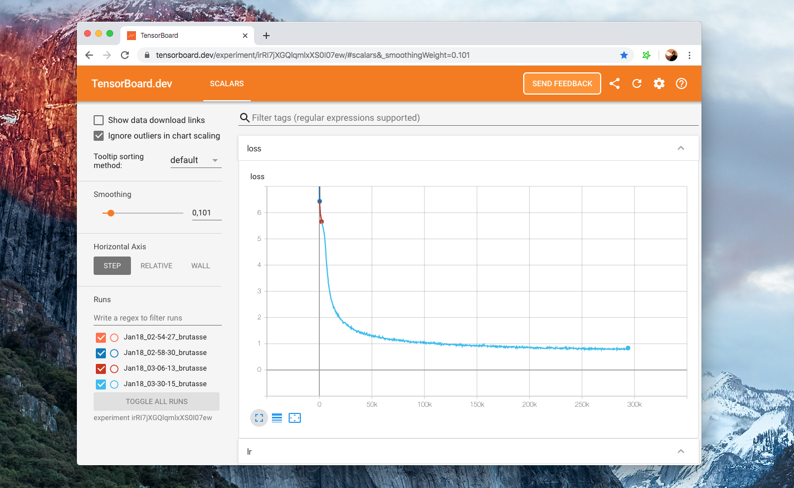

# How to train a new language model from scratch using Transformers and Tokenizers

<div class="blog-metadata">
    <small>Published Feb 14, 2020. Last update Feb 27.</small>
    <a target="_blank" class="btn-readme" href="https://github.com/huggingface/blog/blob/master/how-to-train.md">
        
        Update on GitHub
    </a>
</div>

<a target="_blank" href="https://colab.research.google.com/github/huggingface/blog/blob/master/notebooks/01_how_to_train.ipynb">
    
</a>

Over the past few weeks, we made several improvements to our [`transformers`](https://github.com/huggingface/transformers) and [`tokenizers`](https://github.com/huggingface/tokenizers) libraries, with the goal of making it way easier to **train a new language model from scratch**.

In this post we’ll demo how to train a “small” model (84 M parameters = 6 layers, 768 hidden size, 12 attention heads) – that’s the same number of layers & heads as DistilBERT – on **Esperanto**. We’ll then fine-tune the model on a downstream task of part-of-speech tagging.

Esperanto is a *constructed language* with a goal of being easy to learn. We pick it for this demo for several reasons:
- it is a relatively low-resource language (even though it’s spoken by ~2 million people) so this demo is less boring than training one more English model 😁
- its grammar is highly regular (e.g. all common nouns end in -o, all adjectives in -a) so we should get interesting linguistic results even on a small dataset.
- finally, the overarching goal at the foundation of the language is to bring people closer (fostering world peace and international understanding) which one could argue is aligned with the goal of the NLP community 💚

> N.B. You won’t need to understand Esperanto to understand this post, but if you do want to learn it, [Duolingo](https://www.duolingo.com/enroll/eo/en/Learn-Esperanto) has a nice course with 280k active learners.

Our model is going to be called… wait for it… **EsperBERTo** 😂


## 1. Find a dataset

First, let us find a corpus of text in Esperanto. Here we’ll use the Esperanto portion of the [OSCAR corpus](https://traces1.inria.fr/oscar/) from INRIA.
OSCAR is a huge multilingual corpus obtained by language classification and filtering of [Common Crawl](https://commoncrawl.org/) dumps of the Web.


The Esperanto portion of the dataset is only 299M, so we’ll concatenate with the Esperanto sub-corpus of the [Leipzig Corpora Collection](https://wortschatz.uni-leipzig.de/en/download), which is comprised of text from diverse sources like news, literature, and wikipedia.

The final training corpus has a size of 3 GB, which is still small – for your model, you will get better results the more data you can get to pretrain on. 


## 2. Train a tokenizer

We choose to train a byte-level Byte-pair encoding tokenizer (the same as GPT-2), with the same special tokens as RoBERTa. Let’s arbitrarily pick its size to be 52,000.

We recommend training a byte-level BPE (rather than let’s say, a WordPiece tokenizer like BERT) because it will start building its vocabulary from an alphabet of single bytes, so all words will be decomposable into tokens (no more `<unk>` tokens!).

```python
#! pip install tokenizers==0.4.2

from pathlib import Path

from tokenizers import ByteLevelBPETokenizer

paths = [str(x) for x in Path("./eo_data/").glob("**/*.txt")]

# Initialize a tokenizer
tokenizer = ByteLevelBPETokenizer()

# Customize training
tokenizer.train(files=paths, vocab_size=52_000, min_frequency=2, special_tokens=[
    "<s>",
    "<pad>",
    "</s>",
    "<unk>",
    "<mask>",
])

# Save files to disk
tokenizer.save(".", "esperberto")
```

And here’s a slightly accelerated capture of the output:


<small>On our dataset, training took about ~5 minutes.</small>

🔥🔥 Wow, that was fast! ⚡️🔥

We now have both a `vocab.json`, which is a list of the most frequent tokens ranked by frequency, and a `merges.txt` list of merges.

```json
{
	"<s>": 0,
	"<pad>": 1,
	"</s>": 2,
	"<unk>": 3,
	"<mask>": 4,
	"!": 5,
	"\"": 6,
	"#": 7,
	"$": 8,
	"%": 9,
	"&": 10,
	"'": 11,
	"(": 12,
	")": 13,
	# ...
}

# merges.txt
l a
Ġ k
o n
Ġ la
t a
Ġ e
Ġ d
Ġ p
# ...
```

What is great is that our tokenizer is optimized for Esperanto. Compared to a generic tokenizer trained for English, more native words are represented by a single, unsplit token. Diacritics, i.e. accented characters used in Esperanto – `ĉ`, `ĝ`, `ĥ`, `ĵ`, `ŝ`, and `ŭ` – are encoded natively. We also represent sequences in a more efficient manner. Here on this corpus, the average length of encoded sequences is ~30% smaller as when using the pretrained GPT-2 tokenizer.

Here’s  how you can use it in `tokenizers`, including handling the RoBERTa special tokens – of course, you’ll also be able to use it direcly from `transformers`.

```python
from tokenizers.implementations import ByteLevelBPETokenizer
from tokenizers.processors import BertProcessing


tokenizer = ByteLevelBPETokenizer(
    "./models/EsperBERTo-small/vocab.json",
    "./models/EsperBERTo-small/merges.txt",
)
tokenizer._tokenizer.post_processor = BertProcessing(
    ("</s>", tokenizer.token_to_id("</s>")),
    ("<s>", tokenizer.token_to_id("<s>")),
)
tokenizer.enable_truncation(max_length=512)

print(
    tokenizer.encode("Mi estas Julien.")
)
# Encoding(num_tokens=7, ...)
# tokens: ['<s>', 'Mi', 'Ġestas', 'ĠJuli', 'en', '.', '</s>']
```

## 3. Train a language model from scratch

We will now train our language model using the [`run_language_modeling.py`](https://github.com/huggingface/transformers/blob/master/examples/run_language_modeling.py) script from `transformers` (newly renamed from `run_lm_finetuning.py` as it now supports training from scratch more seamlessly). Just remember to leave `--model_name_or_path` to `None` to train from scratch vs. from an existing model or checkpoint.

> We’ll train a RoBERTa-like model, which is a BERT-like with a couple of changes (check the [documentation](https://huggingface.co/transformers/model_doc/roberta.html) for more details).

As the model is BERT-like, we’ll train it on a task of *Masked language modeling*, i.e. the predict how to fill arbitrary tokens that we randomly mask in the dataset. This is taken care of by the example script.

We just need to do two things:
- implement a simple subclass of `Dataset` that loads data from our text files
	- Depending on your use case, you might not even need to write your own subclass of Dataset, if one of the provided examples (`TextDataset` and `LineByLineTextDataset`) works – but there are lots of custom tweaks that you might want to add based on what your corpus looks like.
- Choose and experiment with different sets of hyperparameters.


Here’s a simple version of our EsperantoDataset.

```python
class EsperantoDataset(Dataset):
    def __init__(self, evaluate: bool = false):
        tokenizer = ByteLevelBPETokenizer(
            "./models/EsperBERTo-small/vocab.json",
            "./models/EsperBERTo-small/merges.txt",
        )
        tokenizer._tokenizer.post_processor = BertProcessing(
            ("</s>", tokenizer.token_to_id("</s>")),
            ("<s>", tokenizer.token_to_id("<s>")),
        )
        tokenizer.enable_truncation(max_length=512)
        # or use the RobertaTokenizer from `transformers` directly.

        self.examples = []

        src_files = Path("./data/").glob("*-eval.txt") if evaluate else Path("./data/").glob("*-train.txt")
        for src_file in src_files:
            print("🔥", src_file)
        lines = src_file.read_text(encoding="utf-8").splitlines()
            self.examples += [x.ids for x in tokenizer.encode_batch(lines)]

    def __len__(self):
        return len(self.examples)

    def __getitem__(self, i):
        # We’ll pad at the batch level.
        return torch.tensor(self.examples[i])
```

If your dataset is very large, you can opt to load and tokenize examples on the fly, rather than as a preprocessing step.

Here is one specific set of **hyper-parameters and arguments** we pass to the script:

```
	--output_dir ./models/EsperBERTo-small-v1
	--model_type roberta
	--mlm
	--config_name ./models/EsperBERTo-small
	--tokenizer_name ./models/EsperBERTo-small
	--do_train
	--do_eval
	--learning_rate 1e-4
	--num_train_epochs 5
	--save_total_limit 2
	--save_steps 2000
	--per_gpu_train_batch_size 16
	--evaluate_during_training
	--seed 42
```

As usual, pick the largest batch size you can fit on your GPU(s). 

**🔥🔥🔥 Let’s start training!! 🔥🔥🔥**

Here you can check our Tensorboard for [one particular set of hyper-parameters](https://tensorboard.dev/experiment/8AjtzdgPR1qG6bDIe1eKfw/#scalars):

[](https://tensorboard.dev/experiment/8AjtzdgPR1qG6bDIe1eKfw/#scalars)

> Our example scripts log into the Tensorboard format by default, under `runs/`. Then to view your board just run `tensorboard dev upload --logdir runs` – this will set up [tensorboard.dev](https://tensorboard.dev/), a Google-managed hosted version that lets you share your ML experiment with anyone.

## 4. Check that the LM actually trained

Aside from looking at the training and eval losses going down, the easiest way to check whether our language model is learning anything interesting is via the `FillMaskPipeline`.

Pipelines are simple wrappers around tokenizers and models, and the 'fill-mask' one will let you input a sequence containing a masked token (here, `<mask>`) and return a list of the most probable filled sequences, with their probabilities.

```python
from transformers import pipeline

fill_mask = pipeline(
    "fill-mask",
    model="./models/EsperBERTo-small",
    tokenizer="./models/EsperBERTo-small"
)

# The sun <mask>.
# =>

result = fill_mask("La suno <mask>.")

# {'score': 0.2526160776615143, 'sequence': '<s> La suno brilis.</s>', 'token': 10820}
# {'score': 0.0999930202960968, 'sequence': '<s> La suno lumis.</s>', 'token': 23833}
# {'score': 0.04382849484682083, 'sequence': '<s> La suno brilas.</s>', 'token': 15006}
# {'score': 0.026011141017079353, 'sequence': '<s> La suno falas.</s>', 'token': 7392}
# {'score': 0.016859788447618484, 'sequence': '<s> La suno pasis.</s>', 'token': 4552}
```

Ok, simple syntax/grammar works. Let’s try a slightly more interesting prompt:

```python
fill_mask("Jen la komenco de bela <mask>.")

# This is the beginning of a beautiful <mask>.
# =>

# {
#     'score':0.06502299010753632
#     'sequence':'<s> Jen la komenco de bela vivo.</s>'
#     'token':1099
# }
# {
#     'score':0.0421181358397007
#     'sequence':'<s> Jen la komenco de bela vespero.</s>'
#     'token':5100
# }
# {
#     'score':0.024884626269340515
#     'sequence':'<s> Jen la komenco de bela laboro.</s>'
#     'token':1570
# }
# {
#     'score':0.02324388362467289
#     'sequence':'<s> Jen la komenco de bela tago.</s>'
#     'token':1688
# }
# {
#     'score':0.020378097891807556
#     'sequence':'<s> Jen la komenco de bela festo.</s>'
#     'token':4580
# }
```

> “**Jen la komenco de bela tago**”, indeed!

With more complex prompts, you can probe whether your language model captured more semantic knowledge or even some sort of (statistical) common sense reasoning.


## 5. Fine-tune your LM on a downstream task

We now can fine-tune our new Esperanto language model on a downstream task of **Part-of-speech tagging.**

As mentioned before, Esperanto is a highly regular language where word endings typically condition the grammatical part of speech. Using a dataset of annotated  Esperanto POS tags formatted in the CoNLL-2003 format (see example below), we can use the [`run_ner.py`](https://github.com/huggingface/transformers/blob/master/examples/run_ner.py) script from `transformers`.

> POS tagging is a token classification task just as NER so we can just use the exact same script.


Again, here’s the hosted **[Tensorboard](https://tensorboard.dev/experiment/lOZn2wOWQo6ixpwtWyyDfQ/#scalars)** for this fine-tuning. We train for 3 epochs using a batch size of 64 per GPU.

Training and eval losses converge to small residual values as the task is rather easy (the language is regular) – it’s still fun to be able to train it end-to-end 😃.

This time, let’s use a `TokenClassificationPipeline`:

```python
from transformers import TokenClassificationPipeline, pipeline


MODEL_PATH = "./models/EsperBERTo-small-pos/"

nlp = pipeline(
    "ner",
    model=MODEL_PATH,
    tokenizer=MODEL_PATH,
)
# or instantiate a TokenClassificationPipeline directly.

nlp("Mi estas viro kej estas tago varma.")

# {'entity': 'PRON', 'score': 0.9979867339134216, 'word': ' Mi'}
# {'entity': 'VERB', 'score': 0.9683094620704651, 'word': ' estas'}
# {'entity': 'VERB', 'score': 0.9797462821006775, 'word': ' estas'}
# {'entity': 'NOUN', 'score': 0.8509314060211182, 'word': ' tago'}
# {'entity': 'ADJ', 'score': 0.9996201395988464, 'word': ' varma'}
```

**Looks like it worked! 🔥**

<small>For a more challenging dataset for NER, <a href="https://github.com/stefan-it">@stefan-it</a> recommended that we could train on the silver standard dataset from WikiANN</small>

## 6. Share your model 🎉

Finally, when you have a nice model, please think about sharing it with the community:

- upload your model using the CLI: `transformers-cli upload`
- write a README.md model card and add it to the repository under `model_cards/`. Your model card should ideally include:
    - a model description,
    - training params (dataset, preprocessing, hyperparameters), 
    - evaluation results,
    - intended uses & limitations
    - whatever else is helpful! 🤓

### **TADA!**

➡️ Your model has a page on http://huggingface.co/models and everyone can load it using `AutoModel.from_pretrained("username/model_name")`.

[](https://huggingface.co/julien-c/EsperBERTo-small)


If you want to take a look at models in different languages, check https://huggingface.co/models

[](https://huggingface.co/models)

## Thank you!


<div class="typeform-widget" data-url="https://clement407383.typeform.com/to/LsohIc" style="width: 100%; height: 500px;"></div> <script> (function() { var qs,js,q,s,d=document, gi=d.getElementById, ce=d.createElement, gt=d.getElementsByTagName, id="typef_orm", b="https://embed.typeform.com/"; if(!gi.call(d,id)) { js=ce.call(d,"script"); js.id=id; js.src=b+"embed.js"; q=gt.call(d,"script")[0]; q.parentNode.insertBefore(js,q) } })() </script>
