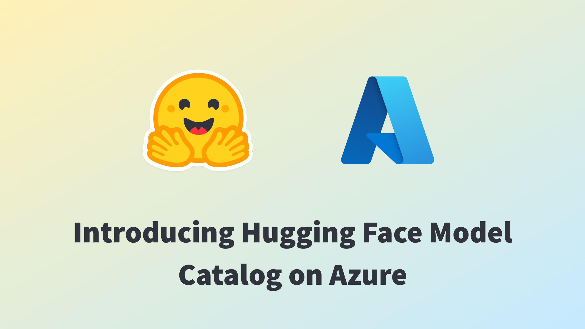
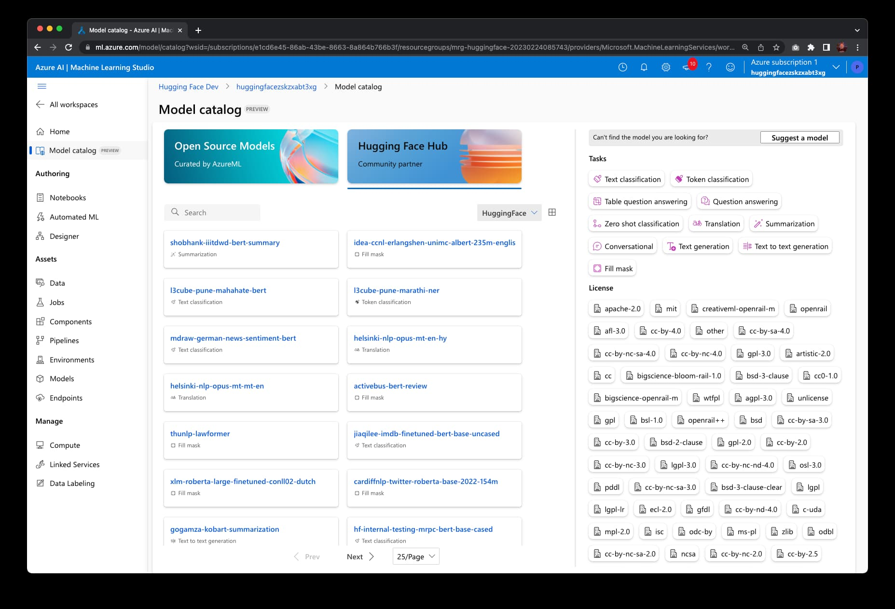
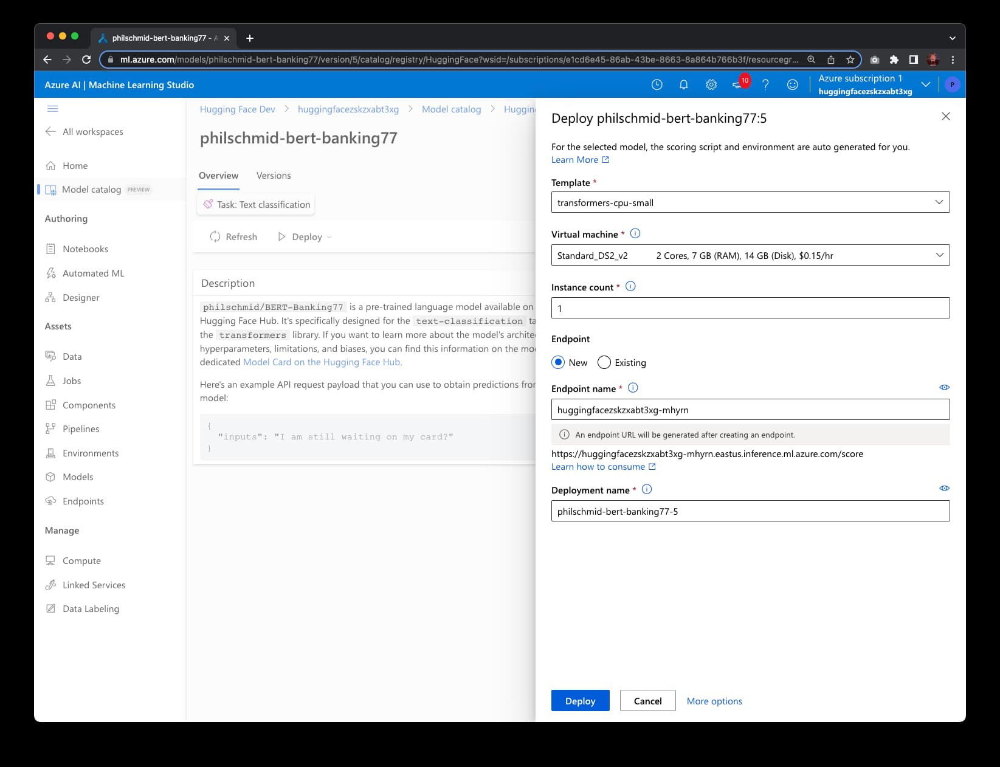
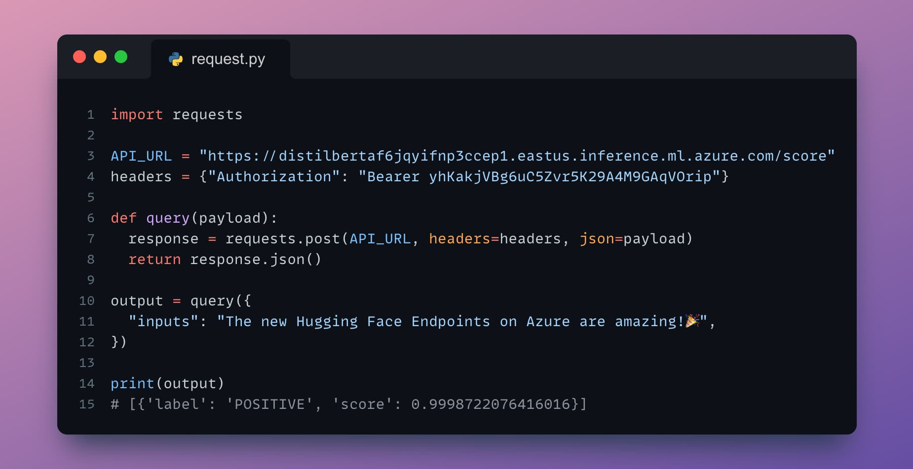
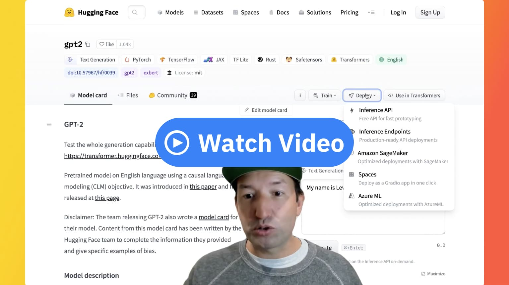

# Hugging Face Collaborates with Microsoft to launch Hugging Face Model Catalog on Azure

Today, we are thrilled to announce that Hugging Face expands its collaboration with Microsoft to bring open-source models from the Hugging Face Hub to Azure Machine Learning. Together we built a new Hugging Face Hub Model Catalog available directly within Azure Machine Learning Studio, filled with thousands of the most popular Transformers models from the [Hugging Face Hub](https://huggingface.co/models). With this new integration, you can now deploy Hugging Face models in just a few clicks on managed endpoints, running onto secure and scalable Azure infrastructure.

This new experience expands upon the strategic partnership we announced last year when we launched Azure Machine Learning Endpoints as a new managed app in Azure Marketplace, to simplify the experience of deploying large language models on Azure. Although our previous marketplace solution was a promising initial step, it had some limitations we could only overcome through a native integration within Azure Machine Learning. To address these challenges and enhance customers experience, we collaborated with Microsoft to offer a fully integrated experience for  Hugging Face users within Azure Machine Learning Studio.

[Hosting over 200,000 open-source models](https://huggingface.co/models), and serving over 1 million model downloads a day, Hugging Face is the go-to destination for all of Machine Learning. But deploying Transformers to production remains a challenge today.

One of the main problems developers and organizations face is how difficult it is to deploy and scale production-grade inference APIs. Of course, an easy option is to rely on cloud-based AI services. Although they’re extremely simple to use, these services are usually powered by a limited set of models that may not support the [task type](https://huggingface.co/tasks) you need, and that cannot be deeply customized, if at all. Alternatively, cloud-based ML services or in-house platforms give you full control, but at the expense of more time, complexity and cost. In addition, many companies have strict security, compliance, and privacy requirements mandating that they only deploy models on infrastructure over which they have administrative control.

_“With the new Hugging Face Hub model catalog, natively integrated within Azure Machine Learning, we are opening a new page in our partnership with Microsoft, offering a super easy way for enterprise customers to deploy Hugging Face models for real-time inference, all within their secure Azure environment.”_ said Julien Simon, Chief Evangelist at Hugging Face. 

_"The integration of Hugging Face's open-source models into Azure Machine Learning represents our commitment to empowering developers with industry-leading AI tools,"_ said John Montgomery, Corporate Vice President, Azure AI Platform at Microsoft. _"This collaboration not only simplifies the deployment process of large language models but also provides a secure and scalable environment for real-time inferencing. It's an exciting milestone in our mission to accelerate AI initiatives and bring innovative solutions to the market swiftly and securely, backed by the power of Azure infrastructure."_

Deploying Hugging Face models on Azure Machine Learning has never been easier:
* Open the Hugging Face registry in Azure Machine Learning Studio. 
* Click on the Hugging Face Model Catalog. 
* Filter by task or license and search the models. 
* Click the model tile to open the model page and choose the real-time deployment option to deploy the model. 
* Select an Azure instance type and click deploy.

Within minutes, you can test your endpoint and add its inference API to your application. It’s never been easier! 

If you'd like to see the service in action, you can click on the image below to launch a video walkthrough.

Hugging Face Model Catalog on Azure Machine Learning is available today in public preview in all Azure Regions where Azure Machine Learning is available. Give the service a try and [let us know your feedback and questions in the forum](https://discuss.huggingface.co/c/azureml/68)!