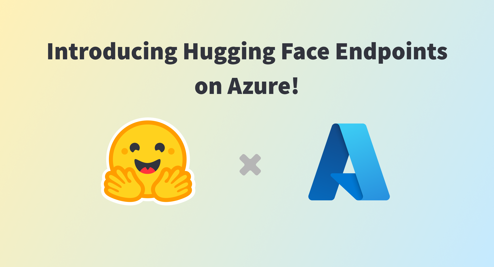
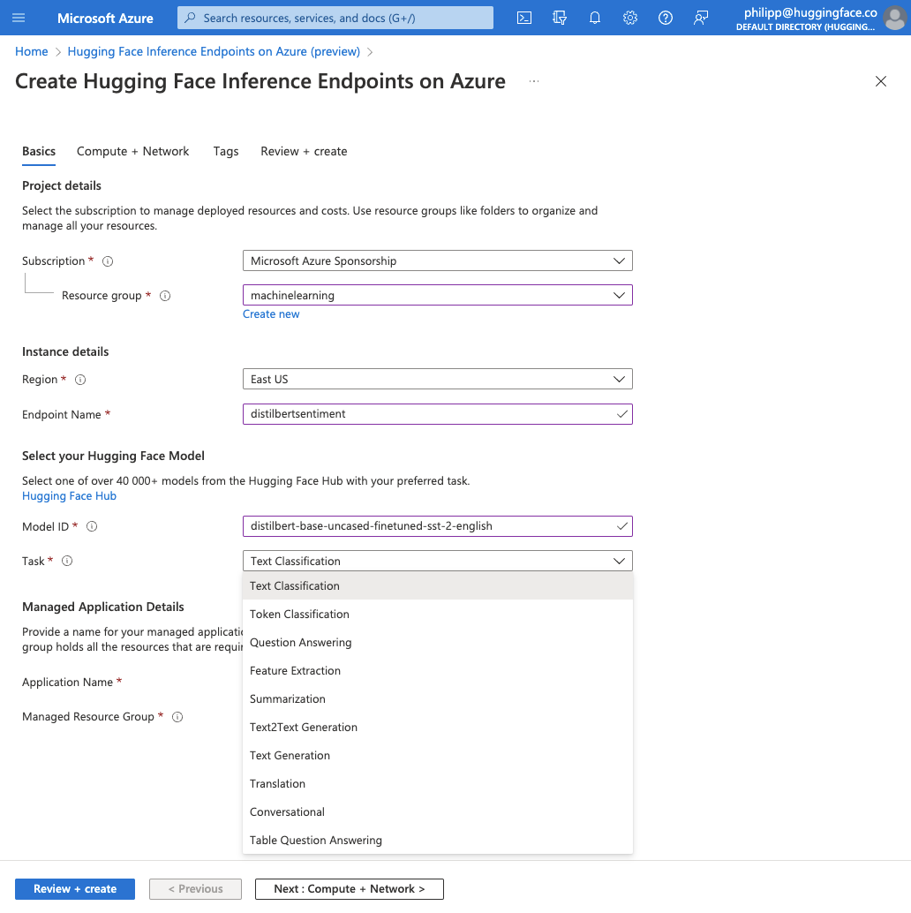
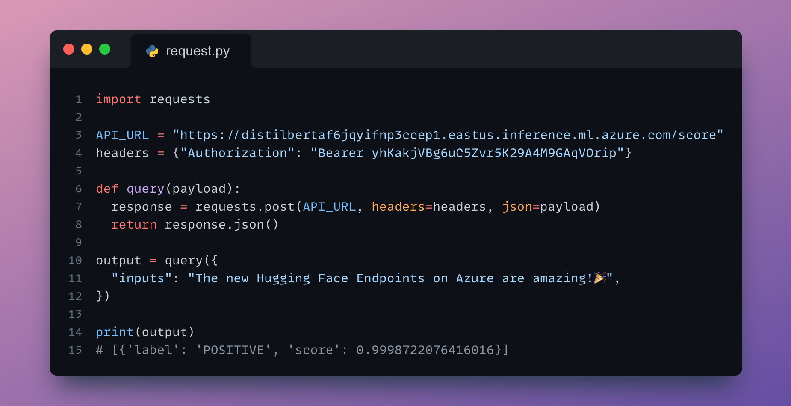
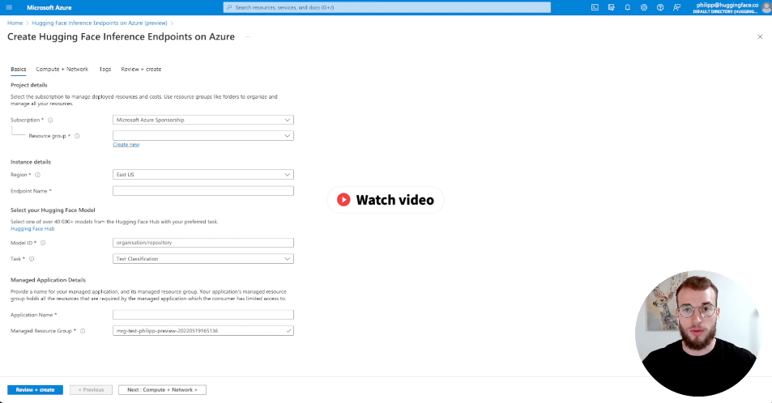

# Hugging Face Collaborates with Microsoft to Launch Hugging Face Endpoints on Azure

{blog_metadata}

{authors}

Today, we’re thrilled to announce that Hugging Face has collaborated with Microsoft to build Hugging Face Endpoints, a new Machine Learning (ML) inference service powered by Azure ML Managed Endpoints. Hugging Face Endpoints let you securely deploy and scale tens of thousands of state-of-the-art Transformer models on Microsoft Azure with just a few clicks. If you can’t wait to test it, you can jump now to the Azure Marketplace.

In recent years, [Transformer](https://github.com/huggingface/transformers) models have proven to be exceptionally efficient over a wide range of ML tasks, including Natural Language Processing (NLP), Computer Vision, and Speech. For example, finance companies use Transformers to extract high-quality insights from stock market filings, analyst reports, or earnings calls. Life sciences and healthcare organizations do the same on research articles, patient files, and medical images. E-commerce companies leverage Transformers to build search engines that help customers find the best product in milliseconds. And the list goes on!

[Hosting over 40,000 models](https://huggingface.co/models) and serving over 1 million downloads a day, Hugging Face is the go-to destination for all things Transformers. True to its mission to democratize good ML, Hugging Face is always looking for innovative ways to help everyone solve complex challenges with Transformers quickly, easily, and regardless of ML expertise.

One of the main problems that developers and organizations face is how difficult it is to deploy and scale production-grade inference APIs. Of course, an easy option is to rely on cloud-based AI services. Although they’re extremely simple to use, these services are usually powered by a limited set of models that may not support the [task type](https://huggingface.co/tasks) you need, and that cannot be deeply customized, if at all. Alternatively, cloud-based ML services or in-house platforms give you full control, but at the expense of more time, complexity and cost. In addition, many companies have strict security, compliance, and privacy requirements mandating that they only deploy models on infrastructure over which they have administrative control.

Accordingly, Hugging Face saw a growing interest in a simple solution that would give you complete freedom to deploy any Transformer model–off the shelf or your own–on infrastructure that you control. As 95% of Fortune 500 companies trust Azure with their business, it made perfect sense for Hugging Face and Microsoft to tackle this problem together. The result is Hugging Face Endpoints on Azure, a simple, scalable, and secure solution that allows you to deploy a model from the [Hugging Face Hub](https://huggingface.co/models) on Azure infrastructure in minutes and with just a few clicks. 

Says Eric Boyd, Corporate Vice President, Microsoft AI Platform: *“Hugging Face has been on a mission to democratize good machine learning. With their Transformers open source library and the Hugging Face Hub, they are enabling the global AI community to build state-of-the-art machine learning models and applications in an open and collaborative way. Every day, over 100,000 people all over the world download more than 1 million models and datasets to solve real business problems with AI. I’m excited we’re bringing together the best of Hugging Face and the Azure platform and to offer to our customers new integrated experiences that build on the secure, compliant, and responsible AI foundation we have in AzureML, our MLops platform."*

Clément Delangue, Co-Founder and Chief Executive Officer at Hugging Face, echoes: *“The mission of Hugging Face is to democratize good machine learning. We’re striving to help every developer and organization build high-quality, ML-powered applications that have a positive impact on society and businesses. With Hugging Face Endpoints, we’ve made it simpler than ever to deploy state-of-the-art models, and we can’t wait to see what Azure customers will build with them!”*

As of today, Hugging Face Endpoints on Azure support:

* All NLP tasks available in the Hugging Face [pipeline API](https://huggingface.co/docs/transformers/main_classes/pipelines): classification, summarization, translation, named entity recognition, etc. Image and audio task types will be available later.
* All corresponding public PyTorch models from the [Hugging Face Hub](https://huggingface.co/models). 
* Inference on a wide range of CPU and GPU Azure instance types.
* Optionally, automatic scaling with Azure Autoscale.
* Azure security and compliance.

All you have to do is pick a model and a task type, select an Azure instance type and create the endpoint.

Within minutes, you can test your endpoint and add its inference API to your application. It’s never been easier! 

Azure customers are already using Hugging Face Endpoints. [Mabu Manaileng](https://www.linkedin.com/in/manailengmj/), a Principal AI Engineer at [Standard Bank Group](https://www.standardbank.com/) is one of them, and here's what he told us: *“Hugging Face Endpoints take care of the most pressing issues when it comes to model deployment. With just a few clicks or a few lines of Azure SDK code, you select a model and a task type, and you can start predicting in minutes. For the first time, I don’t have to worry about infrastructure, or about scaling up and down. This brings a huge opportunity both for testing and production, and it becomes very easy to iterate quickly.”*

If you'd like to see the service in action, you can click on the image below to launch a video walkthrough.

Hugging Face Endpoints on Azure is available today in public beta in all Azure Regions where Azure ML is available. Give the service a try and let us know what you think!
