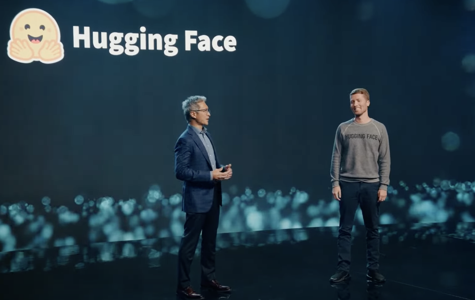

# Hugging Face and AMD partner on accelerating state-of-the-art models for CPU and GPU platforms

<kbd>
  
</kbd>

Whether language models, large language models, or foundation models, transformers require significant computation for pre-training, fine-tuning, and inference. To help developers and organizations get the most performance bang for their infrastructure bucks, Hugging Face has long been working with hardware companies to leverage acceleration features present on their respective chips. 

Today, we're happy to announce that AMD has officially joined our [Hardware Partner Program](https://huggingface.co/hardware). Our CEO Clement Delangue gave a keynote at AMD's [Data Center and AI Technology Premiere](https://www.amd.com/en/solutions/data-center/data-center-ai-premiere.html) in San Francisco to launch this exciting new collaboration.

AMD and Hugging Face work together to deliver state-of-the-art transformer performance on AMD CPUs and GPUs. This partnership is excellent news for the Hugging Face community at large, which will soon benefit from the latest AMD platforms for training and inference. 

The selection of deep learning hardware has been limited for years, and prices and supply are growing concerns. This new partnership will do more than match the competition and help alleviate market dynamics: it should also set new cost-performance standards.

## Supported hardware platforms

On the GPU side, AMD and Hugging Face will first collaborate on the enterprise-grade Instinct MI2xx and MI3xx families, then on the customer-grade Radeon Navi3x family. In initial testing, AMD [recently reported](https://youtu.be/mPrfh7MNV_0?t=462) that the MI250 trains BERT-Large 1.2x faster and GPT2-Large 1.4x faster than its direct competitor.

On the CPU side, the two companies will work on optimizing inference for both the client Ryzen and server EPYC CPUs. As discussed in several previous posts, CPUs can be an excellent option for transformer inference, especially with model compression techniques like quantization.

Lastly, the collaboration will include the [Alveo V70](https://www.xilinx.com/applications/data-center/v70.html) AI accelerator, which can deliver incredible performance with lower power requirements.

## Supported model architectures and frameworks

We intend to support state-of-the-art transformer architectures for natural language processing, computer vision, and speech, such as BERT, DistilBERT, ROBERTA, Vision Transformer, CLIP, and Wav2Vec2.  Of course, generative AI models will be available too (e.g., GPT2, GPT-NeoX, T5, OPT, LLaMA), including our own BLOOM and StarCoder models. Lastly, we will also support more traditional computer vision models, like ResNet and ResNext, and deep learning recommendation models, a first for us.

We'll do our best to test and validate these models for PyTorch, TensorFlow, and ONNX Runtime for the above platforms. Please remember that not all models may be available for training and inference for all frameworks or all hardware platforms.

## The road ahead

Our initial focus will be ensuring the models most important to our community work great out of the box on AMD platforms. We will work closely with the AMD engineering team to optimize key models to deliver optimal performance thanks to the latest AMD hardware and software features. We will integrate the [AMD ROCm SDK](https://www.amd.com/graphics/servers-solutions-rocm) seamlessly in our open-source libraries, starting with the transformers library.

Along the way, we'll undoubtedly identify opportunities to optimize training and inference further, and we'll work closely with AMD to figure out where to best invest moving forward through this partnership. We expect this work to lead to a new [Optimum](https://huggingface.co/docs/optimum/index) library dedicated to AMD platforms to help Hugging Face users leverage them with minimal code changes, if any.

## Conclusion

We're excited to work with a world-class hardware company like AMD. Open-source means the freedom to build from a wide range of software and hardware solutions. Thanks to this partnership, Hugging Face users will soon have new hardware platforms for training and inference with excellent cost-performance benefits. In the meantime, feel free to visit the [AMD page](https://huggingface.co/amd) on the Hugging Face hub. Stay tuned!

*This post is 100% ChatGPT-free.*     

