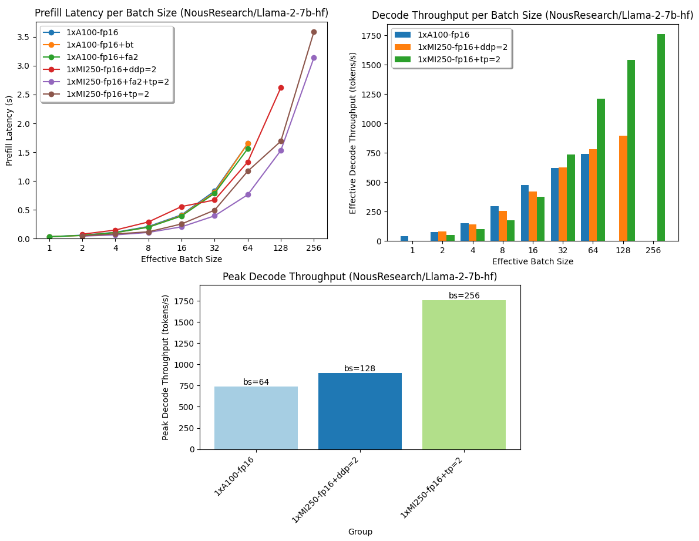

# AMD + 🤗: Large Language Models Out-of-the-Box Acceleration with AMD GPU

Earlier this year, [AMD and Hugging Face announced a partnership](https://huggingface.co/blog/huggingface-and-amd) to accelerate AI models during the AMD's  AI Day event. We have been hard at work to bring this vision to reality, and make it easy for the Hugging Face community to run the latest AI models on AMD hardware with the best possible performance.

AMD is powering some of the most powerful supercomputers in the World, including the fastest European one, [LUMI](https://www.lumi-supercomputer.eu/lumi-retains-its-position-as-europes-fastest-supercomputer/), which operates over 10,000 MI250X AMD GPUs. At this event, AMD revealed their latest generation of server GPUs, the AMD [Instinct™  MI300](https://www.amd.com/fr/graphics/instinct-server-accelerators) series accelerators, which will soon become generally available.

In this blog post, we provide an update on our progress towards providing great out-of-the-box support for AMD GPUs, and improving the interoperability for the latest server-grade AMD Instinct GPUs

## Out-of-the-box Acceleration

Can you spot AMD-specific code changes below? Don't hurt your eyes, there's none compared to running on NVIDIA GPUs 🤗.

```python
from transformers import AutoTokenizer, AutoModelForCausalLM
import torch

model_id = "01-ai/Yi-6B"
tokenizer = AutoTokenizer.from_pretrained(model_id)
with torch.device("cuda"):
	model = AutoModelForCausalLM.from_pretrained(model_id, torch_dtype=torch.float16)

inp = tokenizer(["Today I am in Paris and"], padding=True, return_tensors="pt").to("cuda")
res = model.generate(**inp, max_new_tokens=30)

print(tokenizer.batch_decode(res))
```

One of the major aspects we have been working on is the ability to run Hugging Face Transformers models without any code change. We now support all Transformers models and tasks on AMD Instinct GPUs. And our collaboration is not stopping here, as we explore out-of-the-box support for diffusers models, and other libraries as well as other AMD GPUs.

Achieving this milestone has been a significant effort and collaboration between our teams and companies. To maintain support and performances for the Hugging Face community, we have built integrated testing of Hugging Face open source libraries on AMD Instinct GPUs in our datacenters - and were able to minimize the carbon impact of these new workloads working with Verne Global to deploy the AMD Instinct servers in [Iceland](https://verneglobal.com/about-us/locations/iceland/).

On top of native support, another major aspect of our collaboration is to provide integration for the latest innovations and features available on AMD GPUs. Through the collaboration of Hugging Face team, AMD engineers and open source community members, we are happy to announce [support for](https://huggingface.co/docs/optimum/amd/index):

* Flash Attention v2 from AMD Open Source efforts in [ROCmSoftwarePlatform/flash-attention](https://github.com/ROCmSoftwarePlatform/flash-attention) integrated natively in [Transformers](https://huggingface.co/docs/transformers/perf_infer_gpu_one#flashattention-2) and [Text Generation Inference](https://huggingface.co/docs/text-generation-inference/quicktour).
* Paged Attention from [vLLM](https://github.com/vllm-project/vllm/pull/1313), and various fused kernels available in [Text Generation Inference](https://huggingface.co/docs/text-generation-inference/quicktour) for ROCm.
* [DeepSpeed](https://github.com/microsoft/DeepSpeed) for ROCm-powered GPUs using Transformers is also now officially validated and supported.
* GPTQ, a common weight compression technique used to reduce the model memory requirements, is supported on ROCm GPUs through a direct integration with [AutoGPTQ](https://github.com/PanQiWei/AutoGPTQ) and [Transformers](https://huggingface.co/blog/gptq-integration).
* [Optimum-Benchmark](https://github.com/huggingface/optimum-benchmark), a utility to easily benchmark the performance of Transformers on AMD GPUs, in normal and distributed settings, with supported optimizations and quantization schemes.
* Support of ONNX models execution on ROCm-powered GPUs using ONNX Runtime through the [ROCMExecutionProvider](https://onnxruntime.ai/docs/execution-providers/ROCm-ExecutionProvider.html) using [Optimum library](https://huggingface.co/docs/optimum/onnxruntime/usage_guides/amdgpu).

We are very excited to make these state of the art acceleration tools available and easy to use to Hugging Face users, and offer maintained support and performance with direct integration in our new continuous integration and development pipeline for AMD Instinct GPUs.

One AMD Instinct MI250 GPU with 128 GB of High Bandwidth Memory has two distinct ROCm devices (GPU 0 and 1), each of them having 64 GB of High Bandwidth Memory.

<br>
<figure class="image table text-center m-0 w-full">
  
  <figcaption>MI250 two devices as displayed by `rocm-smi`</figcaption>
</figure>
<br>

This means that with just one MI250 GPU card, we have two PyTorch devices that can be used very easily with tensor and data parallelism to achieve higher throughputs and lower latencies.

In the rest of the blog post, we report performance results for the two steps involved during the text generation through large language models:
* **Prefill latency**: The time it takes for the model to compute the representation for the user's provided input or prompt (also referred to as "Time To First Token").
* **Decoding per token latency**: The time it takes to generate each new token in an autoregressive manner after the prefill step.
* **Decoding throughput**: The number of tokens generated per second during the decoding phase.

Using [`optimum-benchmark`](https://github.com/huggingface/optimum-benchmark) and running [inference benchmarks](https://github.com/huggingface/optimum-benchmark/tree/main/examples/running-llamas) on an MI250 and an A100 GPU with and without optimizations, we get the following results:

<br>
<figure class="image table text-center m-0 w-full">
  
  <figcaption>Inference benchmarks using Transformers and PEFT libraries. FA2 stands for "Flash Attention 2", TP for "Tensor Parallelism", DDP for "Distributed Data Parallel".</figcaption>
</figure>
<br>

In the plots above, we can see how performant the MI250 is, especially for production settings where requests are processed in big batches, delivering more than 2.33x more tokens (decode throughput) and taking half the time to the first token (prefill latency), compared to an A100 card.

Running [training benchmarks](https://github.com/huggingface/optimum-benchmark/tree/main/examples/training-llamas) as seen below, one MI250 card fits larger batches of training samples and reaches higher training throughput.

<br>
<figure class="image table text-center m-0 w-9/12">
  
  <figcaption>Training benchmark using Transformers library at maximum batch size (power of two) that can fit on a given card</figcaption>
</figure>
<br>

## Production Solutions

Another important focus for our collaboration is to build support for Hugging Face production solutions, starting with Text Generation Inference (TGI). TGI provides an end-to-end solution to deploy large language models for inference at scale.

Initially, TGI was mostly driven towards Nvidia GPUs, leveraging most of the recent optimizations made for post Ampere architecture, such as Flash Attention v1 and v2, GPTQ weight quantization and Paged Attention.

Today, we are happy to announce initial support for AMD Instinct MI210 and MI250 GPUs in TGI, leveraging all the great open-source work detailed above, integrated in a complete end-to-end solution, ready to be deployed.

Performance-wise, we spent a lot of time benchmarking Text Generation Inference on AMD Instinct GPUs to validate and discover where we should focus on optimizations. As such, and with the support of AMD GPUs Engineers, we have been able to achieve matching performance compared to what TGI was already offering.

In this context, and with the long-term relationship we are building between AMD and Hugging Face, we have been integrating and testing with the AMD GeMM Tuner tool which allows us to tune the GeMM (matrix multiplication) kernels we are using in TGI to find the best setup towards increased performances. GeMM Tuner tool is expected to be released [as part of PyTorch](https://github.com/pytorch/pytorch/pull/114894) in a coming release for everyone to benefit from it.

With all of the above being said, we are thrilled to show the very first performance numbers demonstrating the latest AMD technologies, putting Text Generation Inference on AMD GPUs at the forefront of efficient inferencing solutions with Llama model family.

<br>
<figure class="image table text-center m-0 w-full">
  
  <figcaption>TGI latency results for Llama 34B, comparing one AMD Instinct MI250 against A100-SXM4-80GB. As explained above one MI250 corresponds to two PyTorch devices.</figcaption>
</figure>
<br>

<br>
<figure class="image table text-center m-0 w-full">
  
  <figcaption>TGI latency results for Llama 70B, comparing two AMD Instinct MI250 against two A100-SXM4-80GB (using tensor parallelism)</figcaption>
</figure>
<br>

Missing bars for A100 correspond to out of memory errors, as Llama 70B weights 138 GB in float16, and enough free memory is necessary for intermediate activations, KV cache buffer (>5GB for 2048 sequence length, batch size 8), CUDA context, etc. The Instinct MI250 GPU has 128 GB global memory while an A100 has 80GB which explains the ability to run larger workloads (longer sequences, larger batches) on MI250.

Text Generation Inference is [ready to be deployed](https://huggingface.co/docs/text-generation-inference/quicktour) in production on AMD Instinct GPUs through the docker image `ghcr.io/huggingface/text-generation-inference:1.2-rocm`. Make sure to refer to the [documentation](https://huggingface.co/docs/text-generation-inference/supported_models#supported-hardware) concerning the support and its limitations.

## What's next?

We hope this blog post got you as excited as we are at Hugging Face about this partnership with AMD. Of course, this is just the very beginning of our journey, and we look forward to enabling more use cases on more AMD hardware.

In the coming months, we will be working on bringing more support and validation for AMD Radeon GPUs, the same GPUs you can put in your own desktop for local usage, lowering down the accessibility barrier and paving the way for even more versatility for our users.

Of course we'll soon be working on performance optimization for the MI300 lineup, ensuring that both the Open Source and the Solutions provide with the latest innovations at the highest stability level we are always looking for at Hugging Face.

Another area of focus for us will be around AMD Ryzen AI technology, powering the latest generation of AMD laptop CPUs, allowing to run AI at the edge, on the device. At the time where Coding Assistant, Image Generation tools and Personal Assistant are becoming more and more broadly available, it is important to offer solutions which can meet the needs of privacy to leverage these powerful tools. In this context, Ryzen AI compatible models are already being made available on the [Hugging Face Hub](https://huggingface.co/models?other=RyzenAI) and we're working closely with AMD to bring more of them in the coming months.
