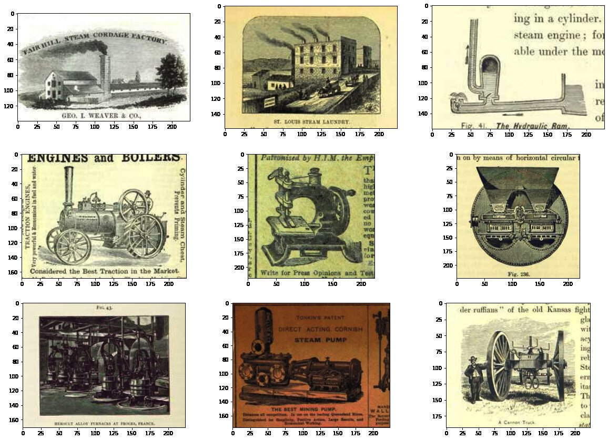
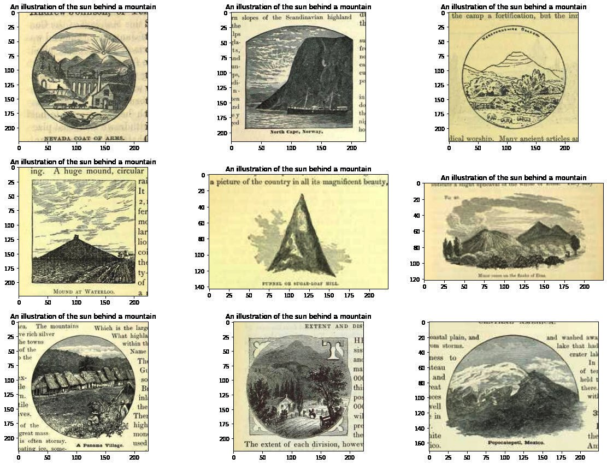
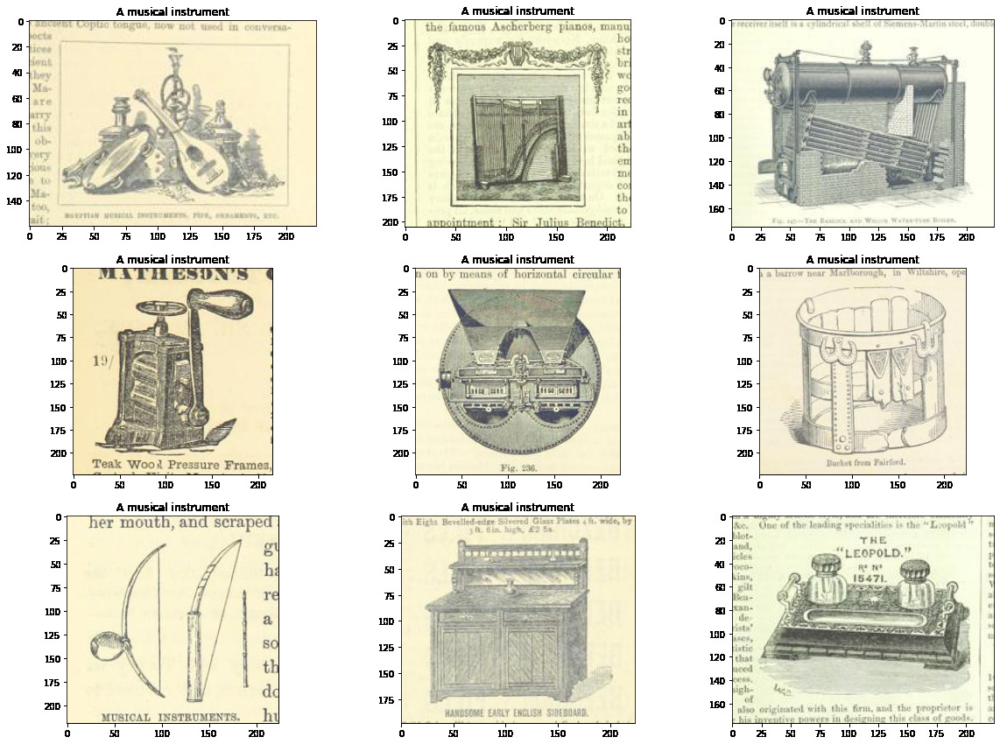
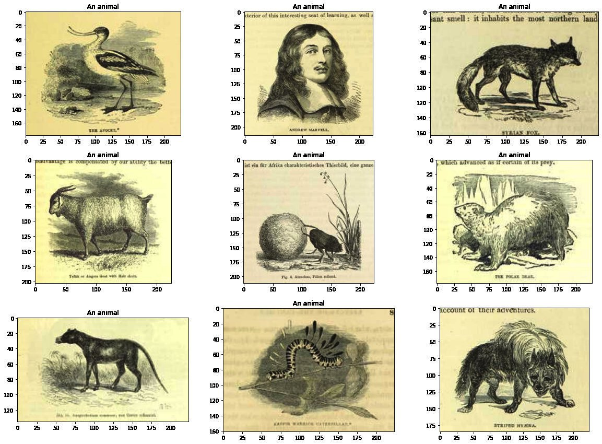
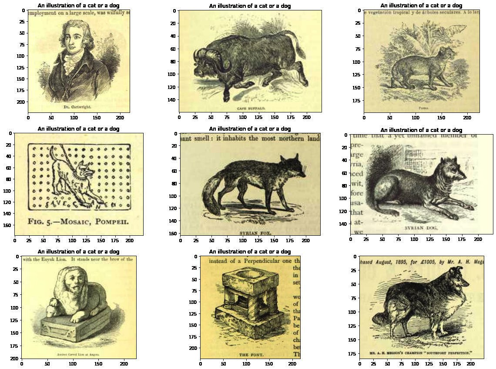
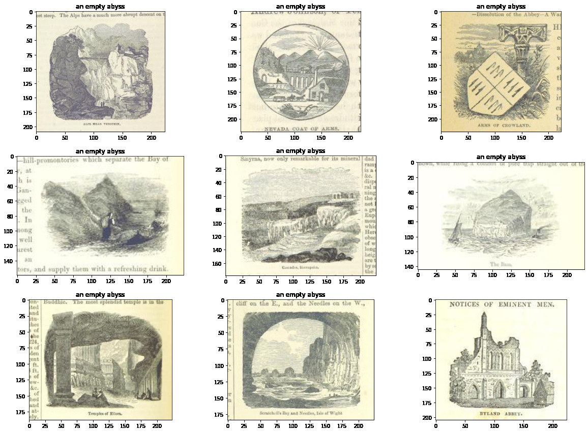
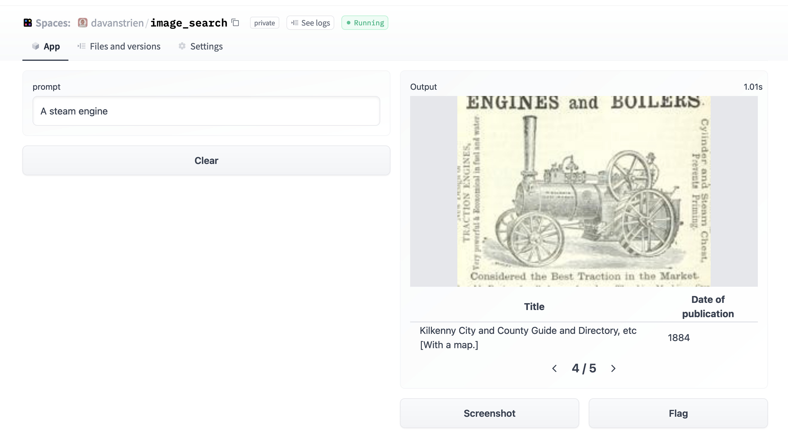

<h1> Image search with 🤗 datasets </h1> 

<div class="blog-metadata">
    <small>Published March 8, 2022.</small>
    <a target="_blank" class="btn no-underline text-sm mb-5 font-sans" href="https://github.com/huggingface/blog/blob/master/image-search-datasets.md">
        Update on GitHub
    </a>
</div>

<div class="author-card">
    <a href="/davanstrien">
        
        <div class="bfc">
            <code>davanstrien</code>
            <span class="fullname">Daniel van Strien</span>
            <span class="bg-gray-100 rounded px-1 text-gray-600 text-sm font-mono">guest</span>
        </div>
    </a>
</div>

<a target="_blank" href="https://colab.research.google.com/gist/davanstrien/e2c29fbbed20dc767e5a74e210f4237b/hf_blog_image_search.ipynb">
    
</a>

🤗 [`datasets`](https://huggingface.co/docs/datasets/) is a library that makes it easy to access and share datasets. It also makes it easy to process data efficiently -- including working with data which doesn't fit into memory.

When `datasets` was first launched it was more usually associated with text data. However, recently, `datasets` has added increased support for images. In particular, there is now a `datasets` [feature type for images](https://huggingface.co/docs/datasets/package_reference/main_classes.html?highlight=image#datasets.Image). A previous [blog post](https://huggingface.co/blog/fine-tune-vit) showed how `datasets` can be used with 🤗 `transformers` to train an image classification model. In this blog post, we'll see how we can combine `datasets` and a few other libraries to create an image search application.

First, we'll install `datasets`. Since we're going to be working with images, we'll also install [`pillow`](https://pillow.readthedocs.io/en/stable/). We'll also need `sentence_transformers` and `faiss`. We'll introduce those in more detail below. We also install [`rich`](https://github.com/Textualize/rich) - we'll only briefly use it here, but it's a super handy package to have around -- I'd really recommend exploring it further!

``` python
!pip install datasets pillow rich faiss-gpu sentence_transformers 
```

To start, let's take a look at the image feature. We can use the wonderful [rich](https://rich.readthedocs.io/) library to poke around python
objects (functions, classes etc.)

``` python
from rich import inspect
import datasets
```

``` python
inspect(datasets.Image, help=True)
```

<pre style="white-space:pre;overflow-x:auto;line-height:normal;font-family:Menlo,'DejaVu Sans Mono',consolas,'Courier New',monospace"><span style="color: #000080; text-decoration-color: #000080">╭───────────────────────── </span><span style="color: #000080; text-decoration-color: #000080; font-weight: bold">&lt;</span><span style="color: #ff00ff; text-decoration-color: #ff00ff; font-weight: bold">class</span><span style="color: #000000; text-decoration-color: #000000"> </span><span style="color: #008000; text-decoration-color: #008000">'datasets.features.image.Image'</span><span style="color: #000080; text-decoration-color: #000080; font-weight: bold">&gt;</span><span style="color: #000080; text-decoration-color: #000080"> ─────────────────────────╮</span>
<span style="color: #000080; text-decoration-color: #000080">│</span> <span style="color: #00ffff; text-decoration-color: #00ffff; font-style: italic">class </span><span style="color: #800000; text-decoration-color: #800000; font-weight: bold">Image</span><span style="font-weight: bold">(</span>decode: bool = <span style="color: #00ff00; text-decoration-color: #00ff00; font-style: italic">True</span>, id: Union<span style="font-weight: bold">[</span>str, NoneType<span style="font-weight: bold">]</span> = <span style="color: #800080; text-decoration-color: #800080; font-style: italic">None</span><span style="font-weight: bold">)</span> -&gt; <span style="color: #800080; text-decoration-color: #800080; font-style: italic">None</span>:                <span style="color: #000080; text-decoration-color: #000080">│</span>
<span style="color: #000080; text-decoration-color: #000080">│</span>                                                                                           <span style="color: #000080; text-decoration-color: #000080">│</span>
<span style="color: #000080; text-decoration-color: #000080">│</span> <span style="color: #008080; text-decoration-color: #008080">Image feature to read image data from an image file.</span>                                      <span style="color: #000080; text-decoration-color: #000080">│</span>
<span style="color: #000080; text-decoration-color: #000080">│</span>                                                                                           <span style="color: #000080; text-decoration-color: #000080">│</span>
<span style="color: #000080; text-decoration-color: #000080">│</span> <span style="color: #008080; text-decoration-color: #008080">Input: The Image feature accepts as input:</span>                                                <span style="color: #000080; text-decoration-color: #000080">│</span>
<span style="color: #000080; text-decoration-color: #000080">│</span> <span style="color: #008080; text-decoration-color: #008080">- A :obj:`str`: Absolute path to the image file </span><span style="color: #008080; text-decoration-color: #008080; font-weight: bold">(</span><span style="color: #008080; text-decoration-color: #008080">i.e. random access is allowed</span><span style="color: #008080; text-decoration-color: #008080; font-weight: bold">)</span><span style="color: #008080; text-decoration-color: #008080">.</span>          <span style="color: #000080; text-decoration-color: #000080">│</span>
<span style="color: #000080; text-decoration-color: #000080">│</span> <span style="color: #008080; text-decoration-color: #008080">- A :obj:`dict` with the keys:</span>                                                            <span style="color: #000080; text-decoration-color: #000080">│</span>
<span style="color: #000080; text-decoration-color: #000080">│</span>                                                                                           <span style="color: #000080; text-decoration-color: #000080">│</span>
<span style="color: #000080; text-decoration-color: #000080">│</span> <span style="color: #008080; text-decoration-color: #008080">    - path: String with relative path of the image file to the archive file.</span>              <span style="color: #000080; text-decoration-color: #000080">│</span>
<span style="color: #000080; text-decoration-color: #000080">│</span> <span style="color: #008080; text-decoration-color: #008080">    - bytes: Bytes of the image file.</span>                                                     <span style="color: #000080; text-decoration-color: #000080">│</span>
<span style="color: #000080; text-decoration-color: #000080">│</span>                                                                                           <span style="color: #000080; text-decoration-color: #000080">│</span>
<span style="color: #000080; text-decoration-color: #000080">│</span> <span style="color: #008080; text-decoration-color: #008080">  This is useful for archived files with sequential access.</span>                               <span style="color: #000080; text-decoration-color: #000080">│</span>
<span style="color: #000080; text-decoration-color: #000080">│</span>                                                                                           <span style="color: #000080; text-decoration-color: #000080">│</span>
<span style="color: #000080; text-decoration-color: #000080">│</span> <span style="color: #008080; text-decoration-color: #008080">- An :obj:`np.ndarray`: NumPy array representing an image.</span>                                <span style="color: #000080; text-decoration-color: #000080">│</span>
<span style="color: #000080; text-decoration-color: #000080">│</span> <span style="color: #008080; text-decoration-color: #008080">- A :obj:`PIL.Image.Image`: PIL image object.</span>                                             <span style="color: #000080; text-decoration-color: #000080">│</span>
<span style="color: #000080; text-decoration-color: #000080">│</span>                                                                                           <span style="color: #000080; text-decoration-color: #000080">│</span>
<span style="color: #000080; text-decoration-color: #000080">│</span> <span style="color: #008080; text-decoration-color: #008080">Args:</span>                                                                                     <span style="color: #000080; text-decoration-color: #000080">│</span>
<span style="color: #000080; text-decoration-color: #000080">│</span> <span style="color: #008080; text-decoration-color: #008080">    decode </span><span style="color: #008080; text-decoration-color: #008080; font-weight: bold">(</span><span style="color: #008080; text-decoration-color: #008080">:obj:`bool`, default ``</span><span style="color: #00ff00; text-decoration-color: #00ff00; font-style: italic">True</span><span style="color: #008080; text-decoration-color: #008080">``</span><span style="color: #008080; text-decoration-color: #008080; font-weight: bold">)</span><span style="color: #008080; text-decoration-color: #008080">: Whether to decode the image data. If `</span><span style="color: #ff0000; text-decoration-color: #ff0000; font-style: italic">False</span><span style="color: #008080; text-decoration-color: #008080">`,</span> <span style="color: #000080; text-decoration-color: #000080">│</span>
<span style="color: #000080; text-decoration-color: #000080">│</span> <span style="color: #008080; text-decoration-color: #008080">        returns the underlying dictionary in the format </span><span style="color: #008080; text-decoration-color: #008080; font-weight: bold">{</span><span style="color: #008000; text-decoration-color: #008000">"path"</span><span style="color: #008080; text-decoration-color: #008080">: image_path, </span><span style="color: #008000; text-decoration-color: #008000">"bytes"</span><span style="color: #008080; text-decoration-color: #008080">: </span>    <span style="color: #000080; text-decoration-color: #000080">│</span>
<span style="color: #000080; text-decoration-color: #000080">│</span> <span style="color: #008080; text-decoration-color: #008080">image_bytes</span><span style="color: #008080; text-decoration-color: #008080; font-weight: bold">}</span><span style="color: #008080; text-decoration-color: #008080">.</span>                                                                             <span style="color: #000080; text-decoration-color: #000080">│</span>
<span style="color: #000080; text-decoration-color: #000080">│</span>                                                                                           <span style="color: #000080; text-decoration-color: #000080">│</span>
<span style="color: #000080; text-decoration-color: #000080">│</span>  <span style="color: #808000; text-decoration-color: #808000; font-style: italic">decode</span> = <span style="color: #00ff00; text-decoration-color: #00ff00; font-style: italic">True</span>                                                                            <span style="color: #000080; text-decoration-color: #000080">│</span>
<span style="color: #000080; text-decoration-color: #000080">│</span>   <span style="color: #808000; text-decoration-color: #808000; font-style: italic">dtype</span> = <span style="color: #008000; text-decoration-color: #008000">'PIL.Image.Image'</span>                                                               <span style="color: #000080; text-decoration-color: #000080">│</span>
<span style="color: #000080; text-decoration-color: #000080">│</span>      <span style="color: #808000; text-decoration-color: #808000; font-style: italic">id</span> = <span style="color: #800080; text-decoration-color: #800080; font-style: italic">None</span>                                                                            <span style="color: #000080; text-decoration-color: #000080">│</span>
<span style="color: #000080; text-decoration-color: #000080">│</span> <span style="color: #808000; text-decoration-color: #808000; font-style: italic">pa_type</span> = <span style="color: #800080; text-decoration-color: #800080; font-weight: bold">StructType</span><span style="font-weight: bold">(</span>struct<span style="font-weight: bold">&lt;</span><span style="color: #ff00ff; text-decoration-color: #ff00ff; font-weight: bold">bytes:</span><span style="color: #000000; text-decoration-color: #000000"> binary, path: string</span><span style="font-weight: bold">&gt;)</span>                                 <span style="color: #000080; text-decoration-color: #000080">│</span>
<span style="color: #000080; text-decoration-color: #000080">╰───────────────────────────────────────────────────────────────────────────────────────────╯</span>
</pre>

We can see there a few different ways in which we can pass in our images. We'll come back to this in a little while.

A really nice feature of the `datasets` library (beyond the functionality for processing data, memory mapping etc.) is that you get
some nice things 'for free'. One of these is the ability to add a [`faiss`](https://github.com/facebookresearch/faiss) index to a dataset. [`faiss`](https://github.com/facebookresearch/faiss) is a ["library for efficient similarity search and clustering of dense
vectors"](https://github.com/facebookresearch/faiss).

The `datasets` [docs](https://huggingface.co/docs/datasets) show an [example](https://huggingface.co/docs/datasets/faiss_es.html#id1) of using a `faiss` index for text retrieval. In this post we'll see if we can do the same for images.

## The dataset: "Digitised Books - Images identified as Embellishments. c. 1510 - c. 1900"

This is a dataset of images which have been pulled from a collection of digitised books from the British Library. These images come from books across a wide time period and from a broad range of domains. The images were extracted using information contained in the OCR output for each book. As a result, it's known which book the images came from but not necessarily anything else about that image i.e. what it is of.

Some attempts to help overcome this have included uploading the images to [flickr](https://www.flickr.com/photos/britishlibrary/albums). This allows people to tag the images or put them into various different categories.

There have also been projects to tag the dataset [using machine learning](https://blogs.bl.uk/digital-scholarship/2016/11/sherlocknet-update-millions-of-tags-and-thousands-of-captions-added-to-the-bl-flickr-images.html). This work makes it possible to search by tags, but we might want a 'richer' ability to search. For this particular experiment, we'll work with a subset of the collections which contain "embellishments". This dataset is a bit smaller, so it will be better for experimenting with. We can get the full data from the British Library's data repository: [https://doi.org/10.21250/db17](http://localhost:5564/blog/image-search-datasets). Since the full dataset is still fairly large, you'll probably want to start with a smaller sample.

## Creating our dataset 

Our dataset consists of a folder containing subdirectories inside which are images. This is a fairly standard format for sharing image datasets. Thanks to a recently merged [pull request](https://github.com/huggingface/datasets/pull/2830) we can directly load this dataset using `datasets` `ImageFolder` loader 🤯

```python
from datasets import load_dataset
dataset = load_dataset("imagefolder", data_files="https://zenodo.org/record/6224034/files/embellishments_sample.zip?download=1")
```

Let's see what we get back.

```python
dataset
```

```
DatasetDict({
    train: Dataset({
        features: ['image', 'label'],
        num_rows: 10000
    })
})
```

We can get back a `DatasetsDict` and we have a `Dataset` with `image` and `label` features. 

Since we don't have any train/validation splits here let's just grab the `train` part of our dataset. 

Let's also take a look at one example from our dataset to see what this looks like.

```python
dataset[0]
```
```python
{'image': <PIL.JpegImagePlugin.JpegImageFile image mode=RGB size=358x461 at 0x7F9488DBB090>,
 'label': 208}
```
Let's start with the label column. This contains the parent folder for our images in this case this represents the year of publication for the books from which the images are taken. We can see the mappings for this using  `dataset.features`

```python
dataset.features['label']
```

In this particular dataset the image filenames also contains some metadata, in particular about the book from which the image was taken. There are a few ways we can get this information. 

When we look at one example from our dataset that the `image` feature was a `PIL.JpegImagePlugin.JpegImageFile`. Since `PIL.Images` have a filename attribute, one way in which we can grab our filenames is by accessing this. 

```python
dataset[0]['image'].filename
```
```python
/root/.cache/huggingface/datasets/downloads/extracted/f324a87ed7bf3a6b83b8a353096fbd9500d6e7956e55c3d96d2b23cc03146582/embellishments_sample/1920/000499442_0_000579_1_[The Ring and the Book  etc ]_1920.jpg
```

Since we might want easy access to this information later let's create a new column where we extract the filename. For this we'll use the `map` method.

```python
dataset = dataset.map(lambda example: {"fname": example['image'].filename.split("/")[-1]})
```

We can look at one example to see what this looks like now.

```python
dataset[0]
```

```python
{'fname': '000499442_0_000579_1_[The Ring and the Book  etc ]_1920.jpg',
 'image': <PIL.JpegImagePlugin.JpegImageFile image mode=RGB size=358x461 at 0x7F94862A9650>,
 'label': 208}

```

We've got our metadata now. Let's see some pictures already! If we access an example and index into the `image` column we'll see our image 😃

``` python
dataset[10]['image']
```


> **Note** in an [earlier version](https://danielvanstrien.xyz/metadata/deployment/huggingface/ethics/huggingface-datasets/faiss/2022/01/13/image_search.html) of this blog post the steps to download and load the images was much more convoluted. The new `ImageFolder` loader makes this process much easier 😀 In particular we didn't actually need to worry about how to load our images since `datasets` took care of this for us. 

## Push all the things to the hub!


One of the super awesome things about the 🤗 ecosystem is the huggingface hub. We can use the hub to access models and datasets. Often this is used for sharing work with others but it can also be a useful tool for work in progress. `datasets` recently added a `push_to_hub` method that allows you to push a dataset to the 🤗 hub with minimal fuss. This can be really helpful by allowing you to pass around a dataset with all the transforms etc. already done.

For now we'll push the dataset to the hub and keep it private initially.

Depending on where you are running the code you may need to login using the `huggingface-cli login` command.

``` python
huggingface-cli login
```


``` python
dataset.push_to_hub('davanstrien/embellishments-sample', private=True)
```


> **Note**: in a [previous version](https://danielvanstrien.xyz/metadata/deployment/huggingface/ethics/huggingface-datasets/faiss/2022/01/13/image_search.html) of this blog post we had to do a few more steps to ensure images were embedded when using `push_to_hub`. Thanks to [this pull request](https://github.com/huggingface/datasets/pull/3685) we no longer need to worry about these extra steps. We just need to make sure `embed_external_files=True` (which is the default behaviour).

### Switching machines

At this point I've created a dataset and moved it to the huggingface hub. This means it is possible to pickup the work/dataset elsewhere.

In this particular example, having access to a GPU is important. Using the 🤗 hub as a way to pass around our data we could start on a laptop
and pick up the work on Google Colab.


If we've moved to a new machine you may need to login again. Once we've done this we can load our dataset

``` python
from datasets import load_dataset

dataset = load_dataset("davanstrien/embellishments-sample", use_auth_token=True)
```
## Creating embeddings 🕸 
We now have a dataset with a bunch of images in it. To begin creating our image search app we need to create some embeddings for these images. There are various ways in which we can try and do this but one possible way is to use the clip models via the `sentence_transformers` library. The [clip model](https://openai.com/blog/clip/) from OpenAI learns a joint representation for both images and text which is very useful for what we want to do since we want to be able to input text and get back an image.

We can download the model using the `SentenceTransformer` class.

``` python
from sentence_transformers import SentenceTransformer, util

model = SentenceTransformer('clip-ViT-B-32')
```

This model will take as input either an image or some text and return an embedding. We can use the `datasets` `map` method to encode all our images using this model. When we call map we return a dictionary with the key `embeddings` containing the embeddings returned by the embedding model. We also pass `device='cuda'` when we call model, this ensures that we're doing the encoding on the GPU.

``` python
ds_with_embeddings = dataset.map(
    lambda example: {'embeddings':model.encode(example['image'], device='cuda')}, batch_size=32)
```

We can 'save' our work by pushing back to the 🤗 hub using
`push_to_hub`.

``` python
ds_with_embeddings.push_to_hub('davanstrien/embellishments-sample', private=True)
```

If we were to move to a different machine we could grab our work again by loading it from the hub 😃

``` python
from datasets import load_dataset

ds_with_embeddings = load_dataset("davanstrien/embellishments-sample", use_auth_token=True)
```

We now have a new column which contains the embeddings for our images. We could manually search through these and compare it to some input embedding but datasets has an `add_faiss_index` method. This uses the [faiss](https://github.com/facebookresearch/faiss) library to create an efficient index for searching embeddings. For more background on this library you can watch this [YouTube video](https://www.youtube.com/embed/sKyvsdEv6rk)

``` python
ds_with_embeddings['train'].add_faiss_index(column='embeddings')
```

``` 
Dataset({
        features: ['fname', 'year', 'path', 'image', 'embeddings'],
        num_rows: 10000
    })
```

## Image search

> **Note** that these examples were generated from the full version of the dataset so you may get slightly different results.

We now have everything we need to create a simple image search. We can use the same model we used to encode our images to encode some input text. This will act as the prompt we try and find close examples for. Let's start with 'a steam engine'.

``` python
prompt = model.encode("A steam engine")
```

We can use another method from the datasets library `get_nearest_examples` to get images which have an embedding close to our input prompt embedding. We can pass in a number of results we want to get back.

``` python
scores, retrieved_examples = ds_with_embeddings['train'].get_nearest_examples('embeddings', prompt,k=9)
```

We can index into the first example this retrieves:

``` python
retrieved_examples['image'][0]
```


This isn't quite a steam engine but it's also not a completely weird result. We can plot the other results to see what was returned.

``` python
import matplotlib.pyplot as plt
```

``` python
plt.figure(figsize=(20, 20))
columns = 3
for i in range(9):
    image = retrieved_examples['image'][i]
    plt.subplot(9 / columns + 1, columns, i + 1)
    plt.imshow(image)
```



Some of these results look fairly close to our input prompt. We can wrap
this in a function so can more easily play around with different prompts

``` python
def get_image_from_text(text_prompt, number_to_retrieve=9):
    prompt = model.encode(text_prompt)
    scores, retrieved_examples = ds_with_embeddings['train'].get_nearest_examples('embeddings', prompt,k=number_to_retrieve)
    plt.figure(figsize=(20, 20))
    columns = 3
    for i in range(9):
        image = retrieved_examples['image'][i]
        plt.title(text_prompt)
        plt.subplot(9 / columns + 1, columns, i + 1)
        plt.imshow(image)
```

``` python
get_image_from_text("An illustration of the sun behind a mountain")
```



### Trying a bunch of prompts ✨

Now we have a function for getting a few results we can try a bunch of
different prompts:

- For some of these I'll choose prompts which are a broad 'category' i.e. 'a musical instrument' or 'an animal', others are specific i.e. 'a guitar'.

- Out of interest I also tried a boolean operator: "An illustration of a cat or a dog".

- Finally I tried something a little more abstract: \"an empty abyss\"

``` python
prompts = ["A musical instrument", "A guitar", "An animal", "An illustration of a cat or a dog", "an empty abyss"]
```

``` python
for prompt in prompts:
    get_image_from_text(prompt)
```












We can see these results aren't always right but they are usually some reasonable results in there. It already seems like this could be useful for searching for a the semantic content of an image in this dataset. However we might hold off on sharing this as is...

## Creating a huggingface space? 🤷🏼 

One obvious next step for this kind of project is to create a hugginface [spaces](https://huggingface.co/spaces) demo. This is what I've done for other [models](https://huggingface.co/spaces/BritishLibraryLabs/British-Library-books-genre-classifier-v2)

It was a fairly simple process to get a [Gradio app setup](https://gradio.app/) from the point we got to here. Here is a screenshot of this app:



However, I'm a little bit vary about making this public straightaway. Looking at the model card for the CLIP model we can look at the primary intended uses:

> ### Primary intended uses
>
> We primarily imagine the model will be used by researchers to better understand robustness, generalization, and other capabilities, biases,  and constraints of computer vision models.
> [source](https://huggingface.co/openai/clip-vit-base-patch32)

This is fairly close to what we are interested in here. Particularly we might be interested in how well the model deals with the kinds of images in our dataset (illustrations from mostly 19th century books). The images in our dataset are (probably) fairly different from the training data. The fact that some of the images also contain text might help CLIP since it displays some [OCR ability](https://openai.com/blog/clip/).

However, looking at the out-of-scope use cases in the model card:

> ### Out-of-Scope Use Cases
>
> Any deployed use case of the model - whether commercial or not - is currently out of scope. Non-deployed use cases such as image search in  a constrained environment, are also not recommended unless there is thorough in-domain testing of the model with a specific, fixed class  taxonomy. This is because our safety assessment demonstrated a high need for task specific testing especially given the variability of  CLIP's performance with different class taxonomies. This makes untested and unconstrained deployment of the model in any use case > currently potentially harmful.  > [source](https://huggingface.co/openai/clip-vit-base-patch32)

suggests that 'deployment' is not a good idea. Whilst the results I got are interesting, I haven't played around with the model enough yet (and haven't done anything more systematic to evaluate its performance and biases) to be confident about 'deploying' it. Another additional consideration is the target dataset itself. The images are drawn from books covering a variety of subjects and time periods. There are plenty of books which represent colonial attitudes and as a result some of the images included may represent certain groups of people in a negative way. This could potentially be a bad combo with a tool which allows any arbitrary text input to be encoded as a prompt.

There may be ways around this issue but this will require a bit more thought.

## Conclusion

Although we don't have a nice demo to show for it, we've seen how we can use `datasets` to:

- load images into the new `Image` feature type
- 'save' our work using `push_to_hub` and use this to move data between machines/sessions
- create a `faiss` index for images that we can use to retrieve images from a text (or image) input
