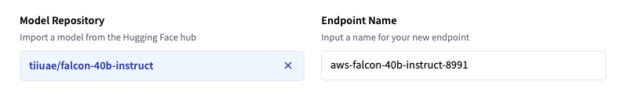
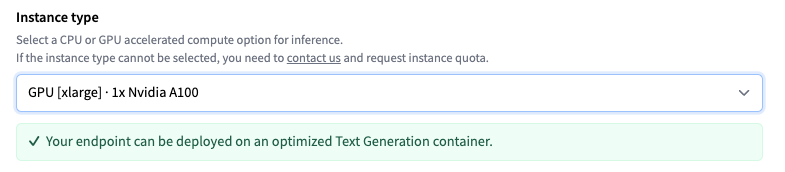
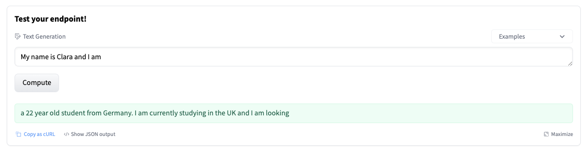

# Deploy LLMs with Hugging Face Inference Endpoints


Open-source LLMs like [Falcon](https://huggingface.co/tiiuae/falcon-40b), [(Open-)LLaMA](https://huggingface.co/openlm-research/open_llama_13b), [X-Gen](https://huggingface.co/Salesforce/xgen-7b-8k-base), [StarCoder](https://huggingface.co/bigcode/starcoder) or [RedPajama](https://huggingface.co/togethercomputer/RedPajama-INCITE-7B-Base), have come a long way in recent months and can compete with closed-source models like ChatGPT or GPT4 for certain use cases. However, deploying these models in an efficient and optimized way still presents a challenge.

In this blog post, we will show you how to deploy open-source LLMs to [Hugging Face Inference Endpoints](https://ui.endpoints.huggingface.co/), our managed SaaS solution that makes it easy to deploy models. Additionally, we will teach you how to stream responses and test the performance of our endpoints. So let's get started!

1. [How to deploy Falcon 40B instruct](#1-how-to-deploy-falcon-40b-instruct)
2. [Test the LLM endpoint](#2-test-the-llm-endpoint)
3. [Stream responses in Javascript and Python](#3-stream-responses-in-javascript-and-python)

Before we start, let's refresh our knowledge about Inference Endpoints. 

## What is Hugging Face Inference Endpoints

[Hugging Face Inference Endpoints](https://ui.endpoints.huggingface.co/) offers an easy and secure way to deploy Machine Learning models for use in production. Inference Endpoints empower developers and data scientists alike to create AI applications without managing infrastructure: simplifying the deployment process to a few clicks, including handling large volumes of requests with autoscaling, reducing infrastructure costs with scale-to-zero, and offering advanced security. 

Here are some of the most important features for LLM deployment:

1. [Easy Deployment](https://huggingface.co/docs/inference-endpoints/index): Deploy models as production-ready APIs with just a few clicks, eliminating the need to handle infrastructure or MLOps.
2. [Cost Efficiency](https://huggingface.co/docs/inference-endpoints/autoscaling): Benefit from automatic scale to zero capability, reducing costs by scaling down the infrastructure when the endpoint is not in use, while paying based on the uptime of the endpoint, ensuring cost-effectiveness.
3. [Enterprise Security](https://huggingface.co/docs/inference-endpoints/security): Deploy models in secure offline endpoints accessible only through direct VPC connections, backed by SOC2 Type 2 certification, and offering BAA and GDPR data processing agreements for enhanced data security and compliance.
4. [LLM Optimization](https://huggingface.co/text-generation-inference): Optimized for LLMs, enabling high throughput with Paged Attention and low latency through custom transformers code and Flash Attention power by Text Generation Inference
5. [Comprehensive Task Support](https://huggingface.co/docs/inference-endpoints/supported_tasks): Out of the box support for 🤗 Transformers, Sentence-Transformers, and Diffusers tasks and models, and easy customization to enable advanced tasks like speaker diarization or any Machine Learning task and library.

You can get started with Inference Endpoints at: [https://ui.endpoints.huggingface.co/](https://ui.endpoints.huggingface.co/)

## 1. How to deploy Falcon 40B instruct

To get started, you need to be logged in with a User or Organization account with a payment method on file (you can add one **[here](https://huggingface.co/settings/billing)**), then access Inference Endpoints at **[https://ui.endpoints.huggingface.co](https://ui.endpoints.huggingface.co/endpoints)**

Then, click on “New endpoint”. Select the repository, the cloud, and the region, adjust the instance and security settings, and deploy in our case `tiiuae/falcon-40b-instruct`.



Inference Endpoints suggest an instance type based on the model size, which should be big enough to run the model. Here `4x NVIDIA T4` GPUs. To get the best performance for the LLM, change the instance to `GPU [xlarge] · 1x Nvidia A100`.

*Note: If the instance type cannot be selected, you need to [contact us](mailto:api-enterprise@huggingface.co?subject=Quota%20increase%20HF%20Endpoints&body=Hello,%0D%0A%0D%0AI%20would%20like%20to%20request%20access/quota%20increase%20for%20{INSTANCE%20TYPE}%20for%20the%20following%20account%20{HF%20ACCOUNT}.) and request an instance quota.*



You can then deploy your model with a click on “Create Endpoint”. After 10 minutes, the Endpoint should be online and available to serve requests. 

## 2. Test the LLM endpoint

The Endpoint overview provides access to the Inference Widget, which can be used to manually send requests. This allows you to quickly test your Endpoint with different inputs and share it with team members. Those Widgets do not support parameters - in this case this results to a “short” generation. 



The widget also generates a cURL command you can use. Just add your `hf_xxx` and test. 

```python
curl https://j4xhm53fxl9ussm8.us-east-1.aws.endpoints.huggingface.cloud \
-X POST \
-d '{"inputs":"Once upon a time,"}' \
-H "Authorization: Bearer <hf_token>" \
-H "Content-Type: application/json"
```

You can use different parameters to control the generation, defining them in the `parameters` attribute of the payload. As of today, the following parameters are supported:

- `temperature`: Controls randomness in the model. Lower values will make the model more deterministic and higher values will make the model more random. Default value is 1.0.
- `max_new_tokens`: The maximum number of tokens to generate. Default value is 20, max value is 512.
- `repetition_penalty`: Controls the likelihood of repetition. Default is `null`.
- `seed`: The seed to use for random generation. Default is `null`.
- `stop`: A list of tokens to stop the generation. The generation will stop when one of the tokens is generated.
- `top_k`: The number of highest probability vocabulary tokens to keep for top-k-filtering. Default value is `null`, which disables top-k-filtering.
- `top_p`: The cumulative probability of parameter highest probability vocabulary tokens to keep for nucleus sampling, default to `null`
- `do_sample`: Whether or not to use sampling; use greedy decoding otherwise. Default value is `false`.
- `best_of`: Generate best_of sequences and return the one if the highest token logprobs, default to `null`.
- `details`: Whether or not to return details about the generation. Default value is `false`.
- `return_full_text`: Whether or not to return the full text or only the generated part. Default value is `false`.
- `truncate`: Whether or not to truncate the input to the maximum length of the model. Default value is `true`.
- `typical_p`: The typical probability of a token. Default value is `null`.
- `watermark`: The watermark to use for the generation. Default value is `false`.

## 3. Stream responses in Javascript and Python

Requesting and generating text with LLMs can be a time-consuming and iterative process. A great way to improve the user experience is streaming tokens to the user as they are generated. Below are two examples of how to stream tokens using Python and JavaScript. For Python, we are going to use the [client from Text Generation Inference](https://github.com/huggingface/text-generation-inference/tree/main/clients/python), and for JavaScript, the [HuggingFace.js library](https://huggingface.co/docs/huggingface.js/main/en/index)

### Streaming requests with Python

First, you need to install the `huggingface_hub` library:

```python
pip install -U huggingface_hub
```

We can create a `InferenceClient` providing our endpoint URL and credential alongside the hyperparameters we want to use

```python
from huggingface_hub import InferenceClient

# HF Inference Endpoints parameter
endpoint_url = "https://YOUR_ENDPOINT.endpoints.huggingface.cloud"
hf_token = "hf_YOUR_TOKEN"

# Streaming Client
client = InferenceClient(endpoint_url, token=hf_token)

# generation parameter
gen_kwargs = dict(
    max_new_tokens=512,
    top_k=30,
    top_p=0.9,
    temperature=0.2,
    repetition_penalty=1.02,
    stop_sequences=["\nUser:", "<|endoftext|>", "</s>"],
)
# prompt
prompt = "What can you do in Nuremberg, Germany? Give me 3 Tips"

stream = client.text_generation(prompt, stream=True, details=True, **gen_kwargs)

# yield each generated token
for r in stream:
    # skip special tokens
    if r.token.special:
        continue
    # stop if we encounter a stop sequence
    if r.token.text in gen_kwargs["stop_sequences"]:
        break
    # yield the generated token
    print(r.token.text, end = "")
    # yield r.token.text
```

Replace the `print` command with the `yield` or with a function you want to stream the tokens to. 


### Streaming requests with JavaScript

First, you need to install the `@huggingface/inference` library.

```python
npm install @huggingface/inference
```

We can create a `HfInferenceEndpoint` providing our endpoint URL and credential alongside the hyperparameter we want to use.

```jsx
import { HfInferenceEndpoint } from '@huggingface/inference'

const hf = new HfInferenceEndpoint('https://YOUR_ENDPOINT.endpoints.huggingface.cloud', 'hf_YOUR_TOKEN')

//generation parameter
const gen_kwargs = {
  max_new_tokens: 512,
  top_k: 30,
  top_p: 0.9,
  temperature: 0.2,
  repetition_penalty: 1.02,
  stop_sequences: ['\nUser:', '<|endoftext|>', '</s>'],
}
// prompt
const prompt = 'What can you do in Nuremberg, Germany? Give me 3 Tips'

const stream = hf.textGenerationStream({ inputs: prompt, parameters: gen_kwargs })
for await (const r of stream) {
  // # skip special tokens
  if (r.token.special) {
    continue
  }
  // stop if we encounter a stop sequence
  if (gen_kwargs['stop_sequences'].includes(r.token.text)) {
    break
  }
  // yield the generated token
  process.stdout.write(r.token.text)
}
```

Replace the `process.stdout` call with the `yield` or with a function you want to stream the tokens to. 


## Conclusion

In this blog post, we showed you how to deploy open-source LLMs using Hugging Face Inference Endpoints, how to control the text generation with advanced parameters, and how to stream responses to a Python or JavaScript client to improve the user experience. By using Hugging Face Inference Endpoints you can deploy models as production-ready APIs with just a few clicks, reduce your costs with automatic scale to zero, and deploy models into secure offline endpoints backed by SOC2 Type 2 certification.

---

Thanks for reading! If you have any questions, feel free to contact me on [Twitter](https://twitter.com/_philschmid) or [LinkedIn](https://www.linkedin.com/in/philipp-schmid-a6a2bb196/).
