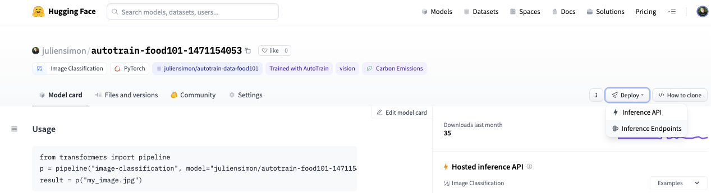
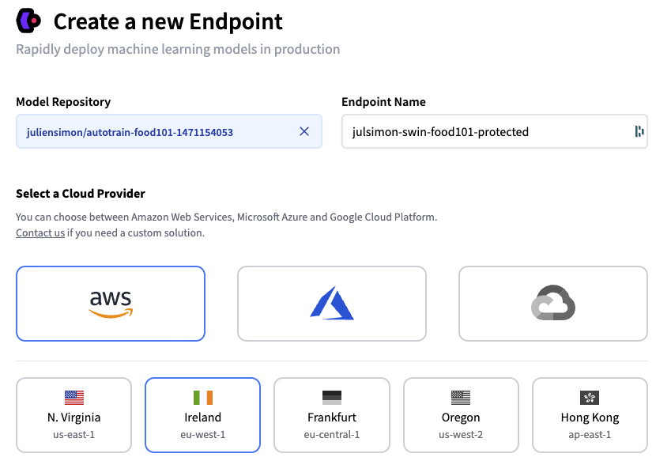
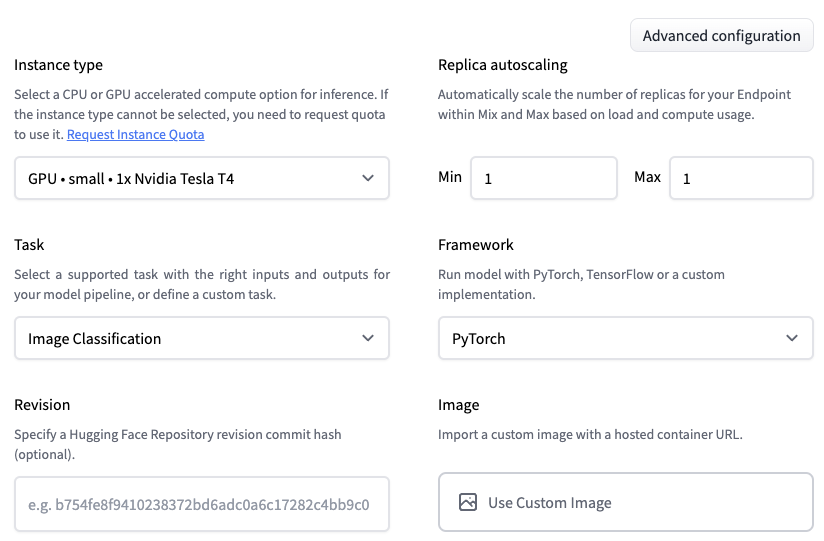
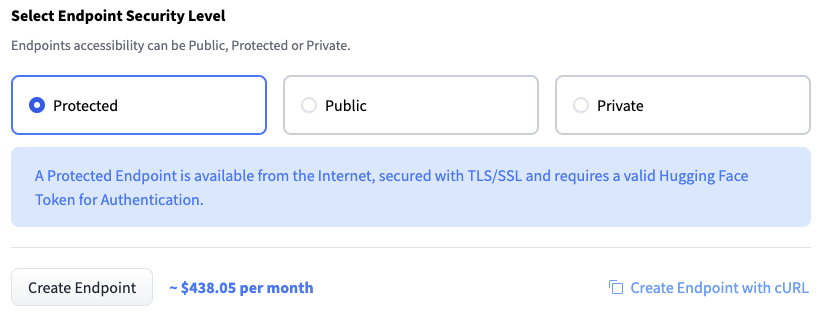
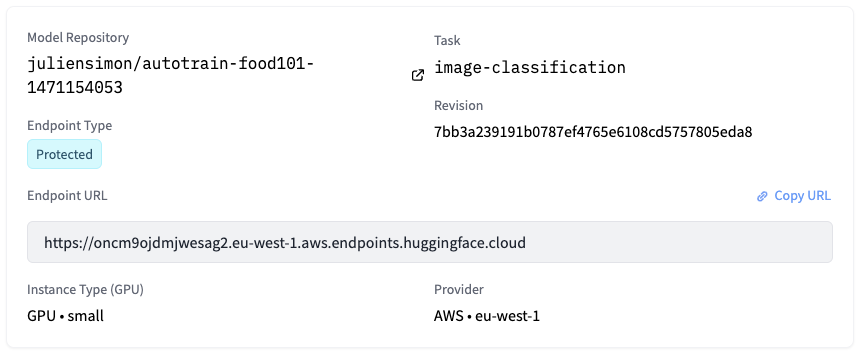
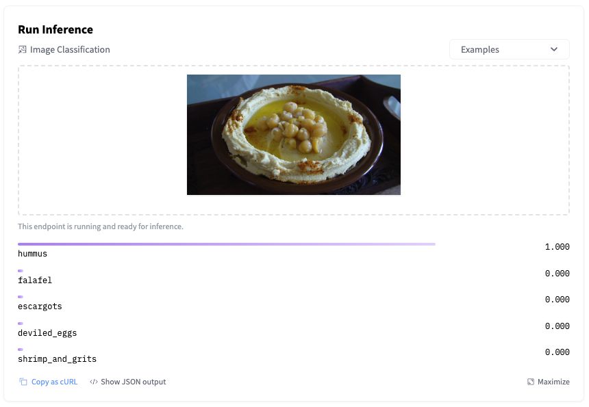
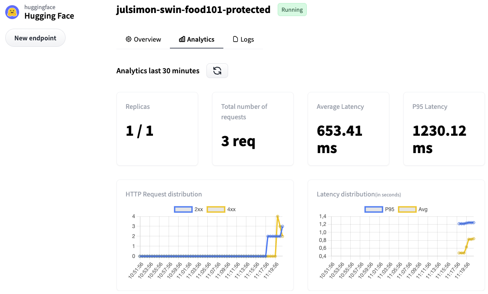
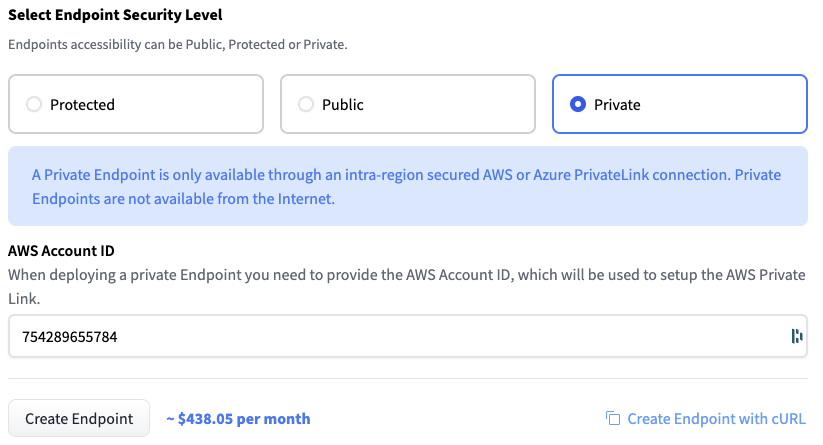
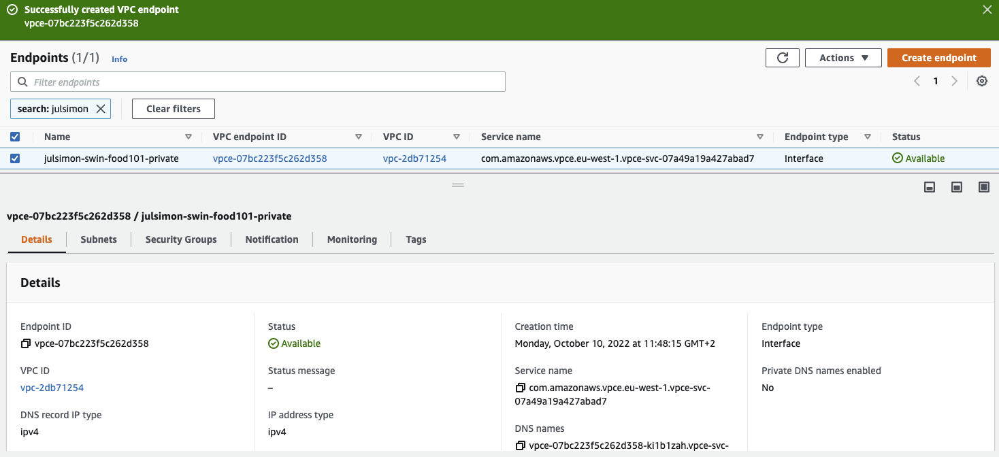

<h1>
Getting Started with Hugging Face Inference Endpoints
</h1>

<div class="blog-metadata">
    <small>Published October 11, 2022.</small>
    <a target="_blank" class="btn no-underline text-sm mb-5 font-sans" href="https://github.com/huggingface/blog/blob/main/inference-endpoints.md">
        Update on GitHub
    </a>
</div>

<div class="author-card">
    <a href="https://twitter.com/julsimon">
        
        <div class="bfc">
            <code>juliensimon</code>
            <span class=fullname">Julien Simon</span>
        </div>
    </a>
</div>

Training machine learning models has become quite simple, especially with the rise of pre-trained models and transfer learning. OK, sometimes it's not *that* simple, but at least, training models will never break critical applications, and make customers unhappy about your quality of service. Deploying models, however... Yes, we've all been there.

Deploying models in production usually requires jumping through a series of hoops. Packaging your model in a container, provisioning the infrastructure, creating your prediction API, securing it, scaling it, monitoring it, and more. Let's face it: building all this plumbing takes valuable time away from doing actual machine learning work. Unfortunately, it can also go awfully wrong.

We strive to fix this problem with the newly launched Hugging Face [Inference Endpoints](https://huggingface.co/inference-endpoints). In the spirit of making machine learning ever simpler without compromising on state-of-the-art quality, we've built a service that lets you deploy machine learning models directly from the [Hugging Face hub](https://huggingface.co) to managed infrastructure on your favorite cloud in just a few clicks. Simple, secure, and scalable: you can have it all.

Let me show you how this works!

### Deploying a model on Inference Endpoints


Looking at the list of [tasks](https://huggingface.co/docs/inference-endpoints/supported_tasks) that Inference Endpoints support, I decided to deploy a Swin image classification model that I recently fine-tuned with [AutoTrain](https://huggingface.co/autotrain) on the [food101](https://huggingface.co/datasets/food101) dataset. If you're interested in how I built this model, this [video](https://youtu.be/uFxtl7QuUvo) will show you the whole process.

Starting from my [model page](https://huggingface.co/juliensimon/autotrain-food101-1471154053), I click on `Deploy` and select `Inference Endpoints`.


<kbd>
  
</kbd>

This takes me directly to the [endpoint creation](https://ui.endpoints.huggingface.co/new) page.

<kbd>
  
</kbd>

I decide to deploy the latest revision of my model on a single GPU instance, hosted on AWS in the `eu-west-1` region. Optionally, I could set up autoscaling, and I could even deploy the model in a [custom container](https://huggingface.co/docs/inference-endpoints/guides/custom_container).

<kbd>
  
</kbd>

Next, I need to decide who can access my endpoint. From least secure to most secure, the three options are:

* **Public**: the endpoint runs in a public Hugging Face subnet, and anyone on the Internet can access it without any authentication. Think twice before selecting this!
* **Protected**: the endpoint runs in a public Hugging Face subnet, and anyone on the Internet with the appropriate organization token can access it.
* **Private**: the endpoint runs in a private Hugging Face subnet. It's not accessible on the Internet. It's only available in your AWS account through a VPC Endpoint created with [AWS PrivateLink](https://aws.amazon.com/privatelink/). You can control which VPC and subnet(s) in your AWS account have access to the endpoint.

Let's first deploy a protected endpoint, and then we'll deploy a private one.

### Deploying a Protected Inference Endpoint

I simply select `Protected` and click on `Create Endpoint`.

<kbd>
  
</kbd>

After a few minutes, the endpoint is up and running, and its URL is visible.

<kbd>
  
</kbd>

I can immediately test it by uploading an [image](assets/109_inference_endpoints/food.jpg) in the inference widget.

<kbd>
  
</kbd>

Of course, I can also invoke the endpoint directly with a few lines of Python code, and I authenticate with my Hugging Face API token (you'll find yours in your account settings on the hub).

```
import requests, json

API_URL = "https://oncm9ojdmjwesag2.eu-west-1.aws.endpoints.huggingface.cloud"

headers = {
  "Authorization": "Bearer MY_API_TOKEN",
  "Content-Type": "image/jpg"
}

def query(filename):
    with open(filename, "rb") as f:
        data = f.read()
    response = requests.request("POST", API_URL, headers=headers, data=data)
    return json.loads(response.content.decode("utf-8"))

output = query("food.jpg")
```

As you would expect, the predicted result is identical.

```
[{'score': 0.9998438358306885,    'label': 'hummus'},
 {'score': 6.674625183222815e-05, 'label': 'falafel'}, 
 {'score': 6.490697160188574e-06, 'label': 'escargots'}, 
 {'score': 5.776922080258373e-06, 'label': 'deviled_eggs'}, 
 {'score': 5.492902801051969e-06, 'label': 'shrimp_and_grits'}]
```

Moving to the `Analytics` tab, I can see endpoint metrics. Some of my requests failed because I deliberately omitted the `Content-Type` header.

<kbd>
  
</kbd>

For additional details, I can check the full logs in the `Logs` tab.

```
5c7fbb4485cd8w7 2022-10-10T08:19:04.915Z 2022-10-10 08:19:04,915 | INFO | POST / | Duration: 142.76 ms
5c7fbb4485cd8w7 2022-10-10T08:19:05.860Z 2022-10-10 08:19:05,860 | INFO | POST / | Duration: 148.06 ms
5c7fbb4485cd8w7 2022-10-10T09:21:39.251Z 2022-10-10 09:21:39,250 | ERROR | Content type "None" not supported. Supported content types are: application/json, text/csv, text/plain, image/png, image/jpeg, image/jpg, image/tiff, image/bmp, image/gif, image/webp, image/x-image, audio/x-flac, audio/flac, audio/mpeg, audio/wave, audio/wav, audio/x-wav, audio/ogg, audio/x-audio, audio/webm, audio/webm;codecs=opus
5c7fbb4485cd8w7 2022-10-10T09:21:44.114Z 2022-10-10 09:21:44,114 | ERROR | Content type "None" not supported. Supported content types are: application/json, text/csv, text/plain, image/png, image/jpeg, image/jpg, image/tiff, image/bmp, image/gif, image/webp, image/x-image, audio/x-flac, audio/flac, audio/mpeg, audio/wave, audio/wav, audio/x-wav, audio/ogg, audio/x-audio, audio/webm, audio/webm;codecs=opus
```

Now, let's increase our security level and deploy a private endpoint.
 
### Deploying a Private Inference Endpoint

Repeating the steps above, I select `Private` this time.

This opens a new box asking me for the identifier of the AWS account in which the endpoint will be visible. I enter the appropriate ID and click on `Create Endpoint`. 

Not sure about your AWS account id? Here's an AWS CLI one-liner for you: `aws sts get-caller-identity --query Account --output text`

<kbd>
  
</kbd>

After a few minutes, the Inference Endpoints user interface displays the name of the VPC service name. Mine is `com.amazonaws.vpce.eu-west-1.vpce-svc-07a49a19a427abad7`. 

Next, I open the AWS console and go to the [VPC Endpoints](https://console.aws.amazon.com/vpc/home?#Endpoints:) page. Then, I click on `Create endpoint` to create a VPC endpoint, which will enable my AWS account to access my Inference Endpoint through AWS PrivateLink.

In a nutshell, I need to fill in the name of the VPC service name displayed above, select the VPC and subnets(s) allowed to access the endpoint, and attach an appropriate Security Group. Nothing scary: I just follow the steps listed in the [Inference Endpoints documentation](https://huggingface.co/docs/inference-endpoints/guides/private_link).

Once I've created the VPC endpoint, my setup looks like this.

<kbd>
  
</kbd>

Returning to the Inference Endpoints user interface, the private endpoint runs a minute or two later. Let's test it! 

Launching an Amazon EC2 instance in one of the subnets allowed to access the VPC endpoint, I use the inference endpoint URL to predict my test image.

```
curl https://oncm9ojdmjwesag2.eu-west-1.aws.endpoints.huggingface.cloud \
-X POST --data-binary '@food.jpg' \
-H "Authorization: Bearer MY_API_TOKEN" \
-H "Content-Type: image/jpeg"

[{"score":0.9998466968536377,     "label":"hummus"},
 {"score":0.00006414744711946696, "label":"falafel"},
 {"score":6.4065129663504194e-6,  "label":"escargots"},
 {"score":5.819705165777123e-6,   "label":"deviled_eggs"},
 {"score":5.532585873879725e-6,   "label":"shrimp_and_grits"}]
```

This is all there is to it. Once I'm done testing, I delete the endpoints that I've created to avoid unwanted charges. I also delete the VPC Endpoint in the AWS console.

### Now it's your turn!

Thanks to Inference Endpoints, you can deploy production-grade, scalable, secure endpoints in minutes, in just a few clicks. Why don't you [give it a try](https://ui.endpoints.huggingface.co/new)?

We have plenty of ideas to make the service even better, and we'd love to hear your feedback in the [Hugging Face forum](https://discuss.huggingface.co/).


Thank you for reading and have fun with Inference Endpoints!

