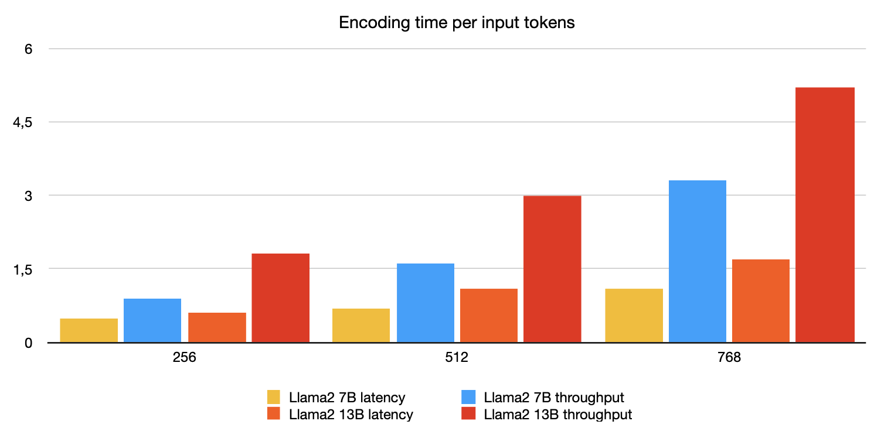
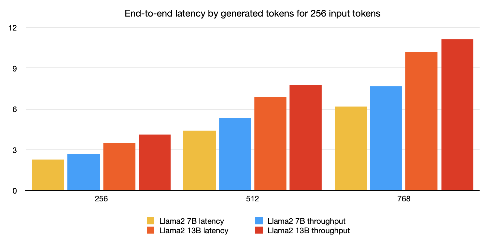
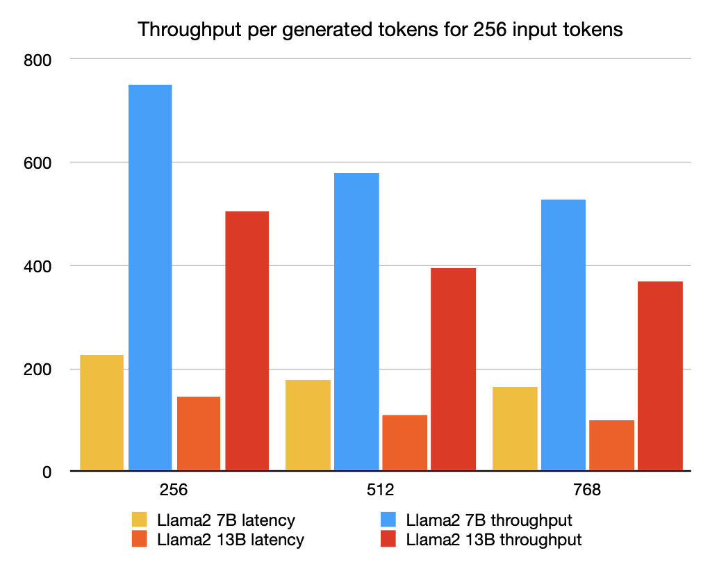

# Make your llama generation time fly with AWS Inferentia2

In a [previous post on the Hugging Face blog](https://huggingface.co/blog/accelerate-transformers-with-inferentia2), we introduced [AWS Inferentia 2](https://aws.amazon.com/ec2/instance-types/inf2/), the second-generation AWS Inferentia accelerator, and explained how you could use [optimum-neuron](https://huggingface.co/docs/optimum-neuron/index) to quickly deploy Hugging Face models for standard text and vision tasks on AWS Inferencia 2 instances.

In a further step of of integration with the [AWS Neuron SDK](https://github.com/aws-neuron/aws-neuron-sdk), it is now possible to use 🤗 [optimum-neuron](https://huggingface.co/docs/optimum-neuron/index) to deploy LLM models for text generation on AWS Inferentia 2.

And what better model could we choose for that demonstration than [llama2](https://huggingface.co/meta-llama/Llama-2-13b-hf), one of the most popular model on the [Hugging Face hub](https://huggingface.co/models).

## Setup 🤗 `optimum-neuron` on your Inferentia2 instance

Our recommendation is to use the [Hugging Face Neuron Deep Learning AMI](https://aws.amazon.com/marketplace/pp/prodview-gr3e6yiscria2) (DLAMI). The DLAMI comes with all required libraries pre-packaged for you, including the Optimum Neuron, Neuron Drivers, Transformers, Datasets, and Accelerate.

These components can also be installed manually on a fresh Inferentia instance following the `optimum-neuron` [installation instructions](https://huggingface.co/docs/optimum-neuron/installation).

## Export the Llama2 model to Neuron

As explained in the [optimum-neuron documentation](https://huggingface.co/docs/optimum-neuron/guides/export_model#why-compile-to-neuron-model), models need to be compiled and exported to a serialized format before running them on Neuron devices.

Fortunately, 🤗 `optimum-neuron` offers a [very simple API](https://huggingface.co/docs/optimum-neuron/guides/models#configuring-the-export-of-a-generative-model) to export standard 🤗 [transformers models](https://huggingface.co/docs/transformers/index) to the Neuron format.

```
>>> from optimum.neuron import NeuronModelForCausalLM

>>> compiler_args = {"num_cores": 1, "auto_cast_type": 'fp16'}
>>> input_shapes = {"batch_size": 1, "sequence_length": 2048}
>>> model = NeuronModelForCausalLM.from_pretrained(
        "meta-llama/Llama-2-13b-hf",
        export=True,
        **compiler_args,
        **input_shapes)
```

This deserves a little explaination:
- using `compiler_args`, we specify on how many cores we want the model to be deployed (each neuron device has two cores), and with which precision (here `float16`),
- using `input_shape`, we set the static input and output dimensions of the model. All model compilers require static shapes, and neuron makes no exception. Note that the
`sequence_length` not only constrains the length of the input context, but also the length of the KV cache, and thus, the output length.

Depending on your choice of parameters and inferentia host, this may take from a few minutes to more than an hour.

Fortunately, you will need to do this only once because you can save your model and reload it later.

```
>>> model.save_pretrained("a_local_path_for_compiled_neuron_model")
```

Even better, you can push it to the [Hugging Face hub](https://huggingface.co/models).

```
>>> model.push_to_hub(
        "a_local_path_for_compiled_neuron_model",
        repository_id="my-neuron-repo",
        use_auth_token=True)
```

## Generate text using a neuron model on AWS Inferentia 2

Once your model has been exported, you can generate text using the transformers library, as it has been described in [details in this previous post](https://huggingface.co/blog/how-to-generate).

```
>>> from transformers import AutoTokenizer

>>> tokenizer = AutoTokenizer.from_pretrained("meta-llama/Llama-2-13b-hf")
>>> tokenizer.pad_token_id = tokenizer.eos_token_id
>>> tokenizer.padding_side = "left"

>>> inputs = tokenizer("What is deep-learning ?", return_tensors="pt", padding=True)
>>> outputs = model.generate(**inputs,
                             max_new_tokens=128,
                             do_sample=True,
                             temperature=0.9,
                             top_k=50,
                             top_p=0.9)
>>> tokenizer.batch_decode(outputs, skip_special_tokens=True)
['<s> What is deep-learning ?\nThe term “deep-learning” refers to a type of machine-learning
that aims to model high-level abstractions of the data in the form of a hierarchy of multiple
layers of increasingly complex processing nodes.']
```

Note however that a few restrictions apply.

Only the following generation strategies are supported:

- greedy search,
- multinomial sampling with top-k, top-p with temperature.

Most logits pre-processing/filters (such as repetition penalty) are however supported.

## All-in-one with `optimum-neuron` pipelines

For those who like to keep it simple, there is an even simpler way to use an LLM model on AWS inferentia 2 using [optimum-neuron pipelines](https://huggingface.co/docs/optimum-neuron/guides/pipelines).


Using them is as simple as:

```
>>> from optimum.neuron import pipeline

>>> p = pipeline('text-generation', 'dacorvo/Llama-2-7b-hf-neuron-budget')
>>> p("My favorite place on earth is", max_new_tokens=64, do_sample=True, top_k=50)
[{'generated_text': 'My favorite place on earth is the ocean. It is where I feel most
at peace. I love to travel and see new places. I have a'}]
```

## Benchmarks

But how much efficient is text-generation on Inferentia 2 ?  Let's figure out !

We have uploaded on the hub pre-compiled versions of the LLama2 7B and 13B models with different configurations:

| Model type              | num cores | batch_size | Hugging Face Hub model                 |
|-------------------------|-----------|------------|----------------------------------------|
| Llama2 7B - budget      | 2         | 1          |dacorvo/Llama-2-7b-hf-neuron-budget     |
| Llama2 7B - latency     | 24        | 1          |dacorvo/Llama-2-7b-hf-neuron-latency    |
| Llama2 7B - throughput  | 24        | 4          |dacorvo/Llama-2-7b-hf-neuron-throughput |
| Llama2 13B - latency    | 24        | 1          |dacorvo/Llama-2-13b-hf-neuron-latency   |
| Llama2 13B - throughput | 24        | 4          |dacorvo/Llama-2-13b-hf-neuron-throughput|

*Note: all models are compiled with a maximum sequence length of 2048.*

The `llama2 7B` "budget" model is meant to be deployed on the entry-level `inf2.8xlarge` instance that has only one neuron device, and enough `cpu` memory to load the model.

All other models are compiled to use the full extent of cores available on the high-end `inf2.48xlarge` instance.

*Note: please refer to the [inferentia2 product page](https://aws.amazon.com/ec2/instance-types/inf2/) for details on the available instances.*

We created two "latency" oriented configurations for the `llama2 7B` and `llama2 13B` models that can serve only one request at a time, but at full speed.

We also created two "throughput" oriented configuration to serve up to four requests in parallel.

To evaluate the models, we generate tokens up to a total sequence length of 1024, starting from
256 input tokens (i.e. we generate 256, 512 and 768 tokens).

*Note: the "budget" model numbers are reported but not included in the graphs for a better readability.*

### Encoding time

The encoding time is the time in seconds required to process the input tokens and generate the first output token,

It is a very important metric, as it corresponds to the latency directly perceived by the user when streaming generated tokens.

We test the encoding time for increasing context sizes, 256 input tokens corresponding roughly to a typical Q/A usage,
while 768 is more typical of a Retrieval Augmented Generation (RAG) use-case.

|   input tokens  |   Llama2 7B latency  |   Llama2 7B throughput  |   Llama2 13B latency  |   Llama2 13B throughput  |   Llama2 7B budget  |
|-----------------|----------------------|-------------------------|-----------------------|--------------------------|---------------------|
|   256           |   0,5                |   0,9                   |   0,6                 |   1,8                    |   0,3               |
|   512           |   0,7                |   1,6                   |   1,1                 |   3,0                    |   0,4               |
|   768           |   1,1                |   3,3                   |   1,7                 |   5,2                    |   0,5               |



We can see that all deployed models exhibit excellent response times, even for long contexts.

### End-to-end Latency

The end-to-end latency corresponds to the total time in seconds to reach a sequence length of 1024 tokens.

It therefore includes the encoding and generation time.


|   new tokens  |   Llama2 7B latency  |   Llama2 7B throughput  |   Llama2 13B latency  |   Llama2 13B throughput  |   Llama2 7B budget  |
|---------------|----------------------|-------------------------|-----------------------|--------------------------|---------------------|
|   256         |   2,3                |   2,7                   |   3,5                 |   4,1                    |   15,9              |
|   512         |   4,4                |   5,3                   |   6,9                 |   7,8                    |   31,7              |
|   768         |   6,2                |   7,7                   |   10,2                |   11,1                   |   47,3              |



All models deployed on the high-end instance exhibit a good latency, even those actually configured to optimize throughput.

The "budget" deployed model latency is significantly higher, but still ok.

### Throughput

We adopt the same convention as other benchmarks to evaluate the throughput, by dividing the end-to-end
latency by the sum of both input and output tokens.
In other words, we divide the end-to-end latency by `batch_size * sequence_length` to obtain the number of generated tokens per second.

|   new tokens  |   Llama2 7B latency  |   Llama2 7B throughput  |   Llama2 13B latency  |   Llama2 13B throughput  |   Llama2 7B budget  |
|---------------|----------------------|-------------------------|-----------------------|--------------------------|---------------------|
|   256         |   227                |   750                   |   145                 |   504                    |   32                |
|   512         |   177                |   579                   |   111                 |   394                    |   24                |
|   768         |   164                |   529                   |   101                 |   370                    |   22                |



Again, the models deployed on the high-end instance have a very good throughput, even those optimized for latency.

The "budget" model has a much lower throughput, but still ok for a streaming use-case, considering that an average reader reads around 5 words per-second.

## Conclusion

We have illustrated how easy it is to deploy `llama2` models from the [Hugging Face hub](https://huggingface.co/models) on
[AWS Inferentia 2](https://aws.amazon.com/ec2/instance-types/inf2/) using 🤗 [optimum-neuron](https://huggingface.co/docs/optimum-neuron/index).

The deployed models demonstrate very good performance in terms of encoding time, latency and throughput.

Interestingly, the deployed models latency is not too sensitive to the batch size, which opens the way for their deployment on inference endpoints
serving multiple requests in parallel.
