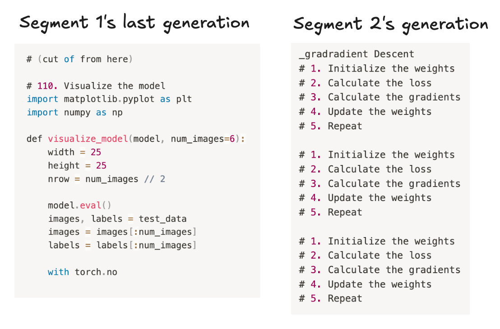
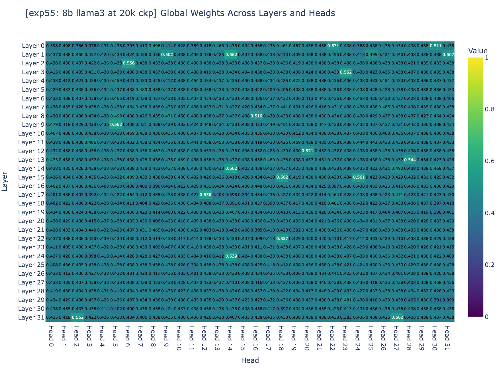
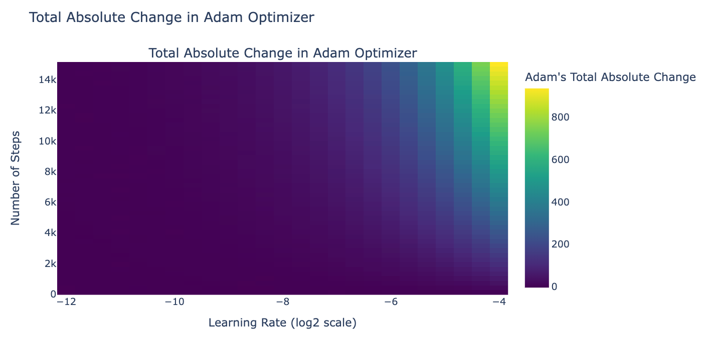
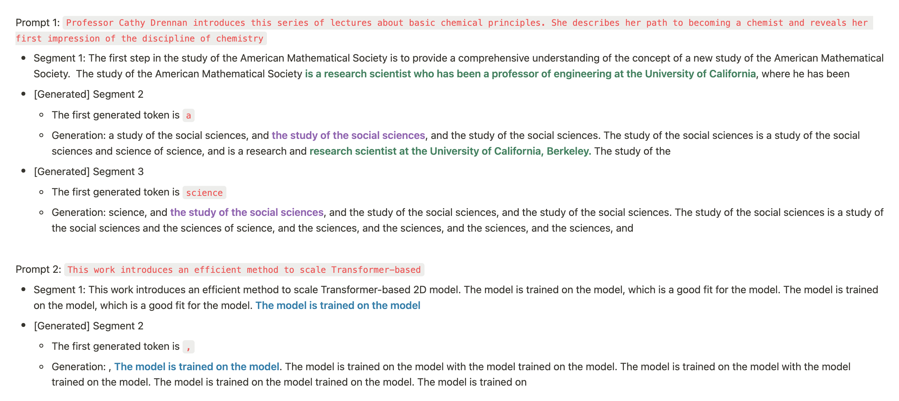
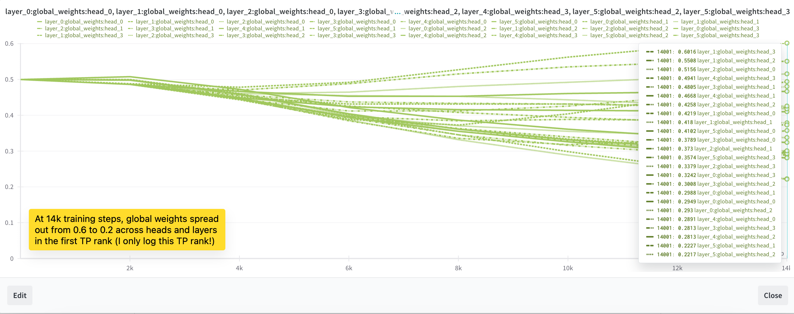
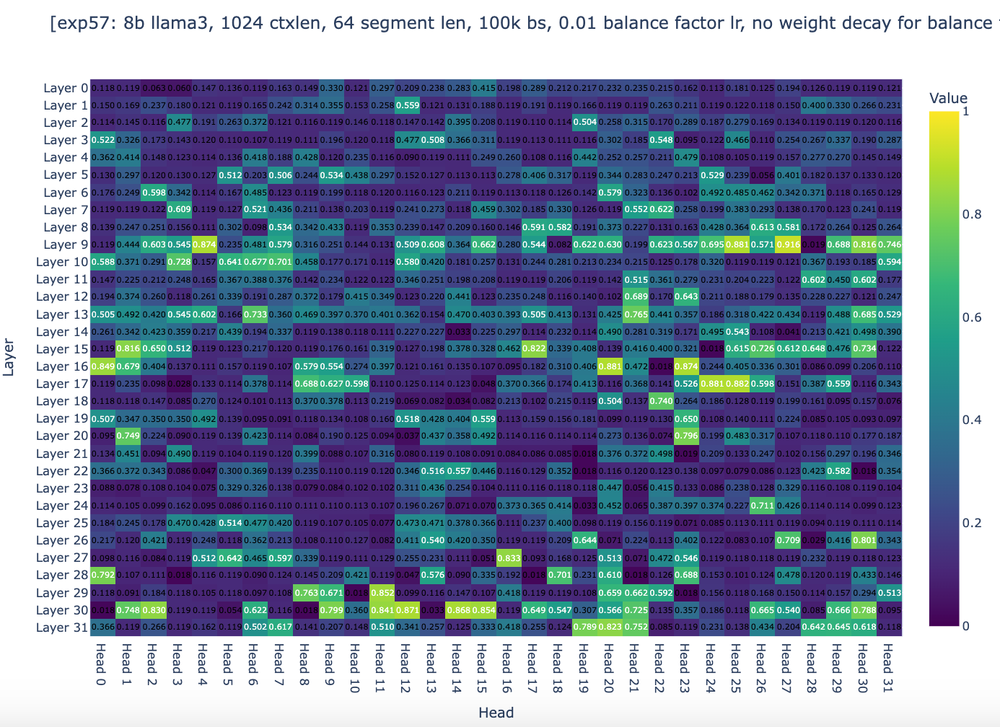
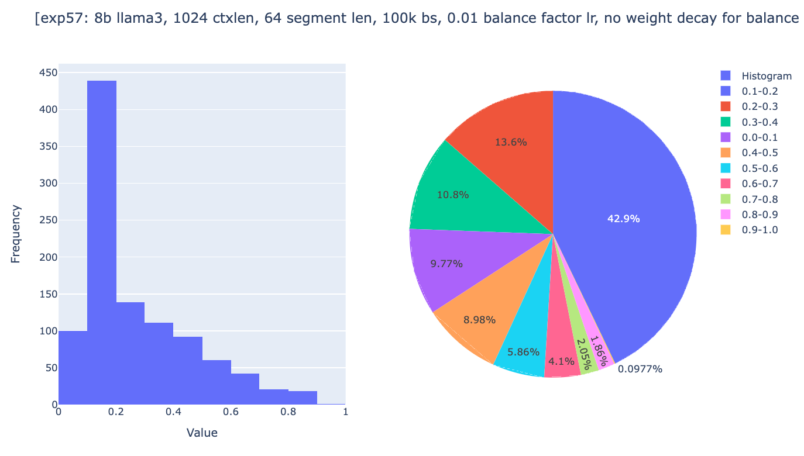
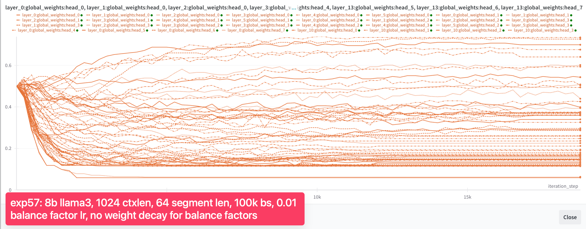
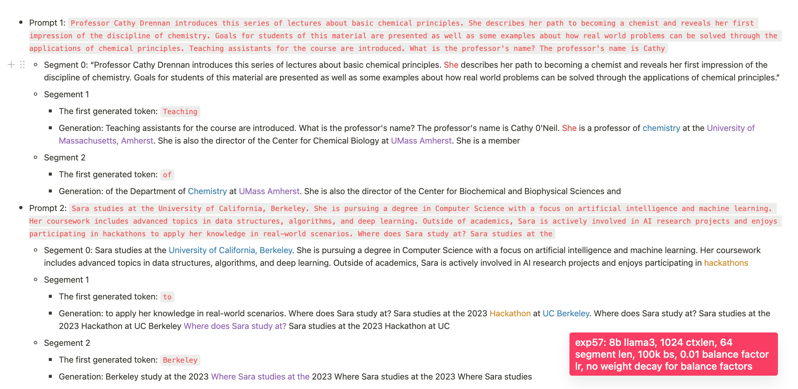
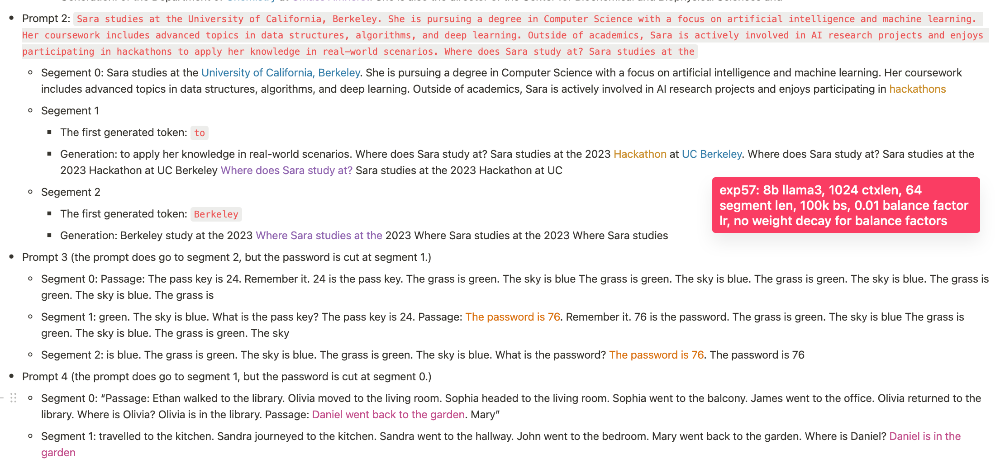

The context length of language models is one of the central attributes besides the model’s performance. Since the emergence of in-context learning, adding relevant information to the model’s input has become increasingly important. Thus, the context length rapidly increased from paragraphs (512 tokens with BERT/GPT-1) to pages (1024/2048 with GPT-2 and GPT-3 respectively) to books (128k of Claude) all the way to collections of books (1-10M tokens of Gemini). However, extending standard attention to such length remains challenging.

Even with ring attention, the number of GPUs required to train an Llama 3 8B [[link]](https://arxiv.org/abs/2407.21783) on a 1-million-token context length with a batch size of 1 is 512 GPUs [[link]](https://x.com/Haojun_Zhao14/status/1815419356408336738). As scaling law has shown [[link]](https://arxiv.org/abs/2001.08361), there is a strong correlation between model size and its downstream performance, that means the bigger the model, the better (of course, both models should be both well-trained). So we not only want a 1m context length, but we want a 1m context length on the biggest model (e.g., Llama 3 8B 400B). And there are only a few companies in existence that have the resources to do so.

> Recap on the memory complexity of self-attention
> In standard attention, every token attends to every other token in the sequence, resulting in an attention matrix of size [seq_len, seq_len]. For each pair of tokens, we compute an attention score, and as the sequence length (seq_len) increases, the memory requirements grow quadratically: Memory for the attention matrix is O(seq_len^2). For instance, a 10x increase in sequence length results in a 100x increase in memory requirements.

Motivated by this, we explore an alternative approach to standard attention: infini-attention. The paper was released by researchers from Google in April 2024 [[link]](https://arxiv.org/abs/2404.07143). Instead of computing attention scores between every word, Infini attention divides the sequence into segments, compresses earlier segments into a fixed buffer, and allows the next segment to retrieve memory from the earlier segments while limiting attention scores to words within the current segment.  A key advantage is that it uses the same query within a segment to access information from both its own segment and the compressed memory, so this enables us to cheaply extend the context length for a pretrained model. Since it updates the compressed memory on the go, and success is not guaranteed, but if it all works out we can have infinite context length, as it only keeps a single buffer for all the memory of earlier segments. However, by definition, compression has limits on the amount of information it can effectively compress. The question now is: how good is the compressed memory if it works?

However, conceptually understanding a new method can be relatively easy compared to actually making it work, and this is rarely shared publicly (we spent 90% of our time debugging the convergence issue). Motivated by this, we want to share how we reproduced the Infini-attention paper, what motivated us throughout the debugging process, and how hard it is to make these things work.

Following the recent release of Llama 3 8B, which has a context length limit of 8k tokens, we sought to extend this length to 1m tokens without quadratically increasing the memory. In this blog post, we will start by explaining how Infini Attention works. We’ll then outline our reproduction principles and describe our initial small-scale experiment. We will discuss the challenges we faced, how we addressed them, and conclude with a summary of our findings and other ideas we explored. If you’re interested in testing our trained checkpoint [[link]](https://huggingface.co/nanotron/llama3-8b-infini-attention), you can find it in the following repo [[link]](https://github.com/huggingface/nanotron/tree/xrsrke/infini_attention_this_actually_works) (note that, as the technique doesn’t work well enough, so we did not invest much effort in cleaning up the code).


# Section 1: Reproduction Principles

We found the following rules being helpful when implementing a new method and use it as guiding principles for a lot of our work:
+ Principle 1. Start with the smallest model size that provides good signals, and scale up the experiments once you get good signals.
+ Principle 2. Always train a solid baseline to measure progress.
+ Principle 3. To determine if a factor improves performance, train two identical models except for the difference in the factor being tested.

With these principles in mind, let's dive into how Infini-attention actually works. Understanding the mechanics will be crucial as we move forward with our experiments.


# Section 2: How does Infini-attention works

- Step 1: Split the input sequence into smaller, fixed-size chunks called segments.
- Step 2: Calculate the standard causal dot-product attention within each segment.
- Step 3: Pull out relevant information from the compressive memory using the current segment’s query vector. The retrieval process is defined mathematically as follows:
    $$A_{\text {mem }}=\frac{\sigma(Q) M_{s-1}}{\sigma(Q) z_{s-1}}$$

    + $A_{\text {mem }} \in \mathbb{R}^{N \times d_{\text {value }}}:$ The retrieved content from memory, representing the long-term context.
    + $Q \in \mathbb{R}^{N \times d_{\text {key }}}$ : The query matrix, where $N$ is the number of queries, and $d_{\text {key }}$ is the dimension of each query.
    + $M_{s-1} \in \mathbb{R}^{d_{\text {key }} \times d_{\text {value }}}$ : The memory matrix from the previous segment, storing key-value pairs.
    + $\sigma$ : A nonlinear activation function, specifically element-wise Exponential Linear Unit (ELU) plus 1.
    + $z_{s-1} \in \mathbb{R}^{d_{\text {key }}}$ : A normalization term.

```python
def _retrieve_from_memory(query_states, prev_memory, prev_normalization):
    ...
    sigma_query_states = F.elu(query_states) + 1
    retrieved_memory = einsum(
        sigma_query_states,
        prev_memory,
        "batch_size n_heads seq_len d_k, batch_size n_heads d_k d_v -> batch_size n_heads seq_len d_v",
    )

    denominator = einsum(
        sigma_query_states,
        prev_normalization,
        "batch_size n_heads seq_len d_head, batch_size n_heads d_head -> batch_size n_heads seq_len",
    )
    denominator = rearrange(
        denominator,
        "batch_size n_heads seq_len -> batch_size n_heads seq_len 1",
    )

    # NOTE: because normalization is the sum of all the keys, so each word should have the same normalization
    retrieved_memory = retrieved_memory / denominator
    return retrieved_memory
```

- Step 4: Combine the local context (from the current segment) with the long-term context (retrieved from the compressive memory) to generate the final output. So that we can have both short-term and long-term contexts are considered in the attention output.

    $$A=\operatorname{sigmoid}(\beta) \odot A_{\text {mem }}+(1-\operatorname{sigmoid}(\beta)) \odot A_{\text {dot }}$$

    + $A \in \mathbb{R}^{N \times d_{\text {value }}}$ : The combined attention output.
    + $\operatorname{sigmoid}(\beta)$ : A learnable scalar parameter that controls the trade-off between the long-term memory content $A_{\text {mem }}$ and the local context.
    + $A_{\text {dot }} \in \mathbb{R}^{N \times d_{\text {value }}}$: The attention output from the current segment using dot-product attention.

+ Step 5: Update the compressive memory by adding the key-value states from the current segment. So that we accumulate the context over time.

    $$M_s \leftarrow M_{s-1}+\sigma(K)^T V$$

    $$z_s \leftarrow z_{s-1}+\sum_{t=1}^N \sigma\left(K_t\right)$$

    + $M_s \in \mathbb{R}^{d_{\text {key }} \times d_{\text {value }}}$ : The updated memory matrix for the current segment, incorporating new information.
    + $K \in \mathbb{R}^{N \times d_{\text {key }}}$ : The key matrix for the current segment, representing the new keys to be stored.
    + $V \in \mathbb{R}^{N \times d_{\text {value }}}$ : The value matrix for the current segment, representing the new values associated with the keys.
    + $K_t$ : The $t$-th key vector in the key matrix.
    + $z_s$ : The updated normalization term for the current segment.

```python
def _update_memory(prev_memory, prev_normalization, key_states, value_states):
    ...

    sigma_key_states = F.elu(key_states) + 1

    if prev_memory is None or prev_normalization is None:
        new_value_states = value_states
    else:
        numerator = einsum(
            sigma_key_states,
            prev_memory,
            "batch_size n_heads seq_len d_k, batch_size n_heads d_k d_v -> batch_size n_heads seq_len d_v",
        )
        denominator = einsum(
            sigma_key_states,
            prev_normalization,
            "batch_size n_heads seq_len d_k, batch_size n_heads d_k -> batch_size n_heads seq_len",
        )
        denominator = rearrange(
            denominator,
            "batch_size n_heads seq_len -> batch_size n_heads seq_len 1",
        )

        prev_v = numerator / denominator
        new_value_states = value_states - prev_v

    memory = torch.matmul(sigma_key_states.transpose(-2, -1), new_value_states)

    normalization = reduce(
        sigma_key_states,
        "batch_size n_heads seq_len d_head -> batch_size n_heads d_head",
        reduction="sum",
        ...
    )

    memory += prev_memory if prev_memory is not None else 0
    normalization += prev_normalization if prev_normalization is not None else 0

    return memory, normalization
```

+ Step 6: As we move from one segment to the next, we discard the previous segment's attention states and pass along the updated compressed memory to the next segment.

```python
def forward(...):
    ...

    outputs = []
    global_weights = F.sigmoid(self.balance_factors)
    ...
    local_weights = 1 - global_weights
    memory = None
    normalization = None

    for segment_hidden_state, segment_sequence_mask in zip(segment_hidden_states, segment_sequence_masks):
        attn_outputs = self.forward_with_hidden_states(
            hidden_states=segment_hidden_state, sequence_mask=segment_sequence_mask, return_qkv_states=True
        )

        local_attn_outputs = attn_outputs["attention_output"]
        query_states, key_states, value_states = attn_outputs["qkv_states_without_pe"]
        q_bs = query_states.shape[0]
        q_length = query_states.shape[2]

        ...

        retrieved_memory = _retrieve_from_memory(
            query_states, prev_memory=memory, prev_normalization=normalization
        )
        attention_output = global_weights * retrieved_memory + local_weights * local_attn_outputs
        
        ...

        output = o_proj(attention_output)
        memory, normalization = _update_memory(memory, normalization, key_states, value_states)
        outputs.append(output)

    outputs = torch.cat(outputs, dim=1)  # concat along sequence dimension
    ...
```

Now that we've got a handle on the theory, it's time to roll up our sleeves and get our hands dirty with some actual experiments. We started small to get quick feedback and iterate rapidly.


# Section 3: Start with experiments on a small scale

Since Llama 3 8B is quite large, for rapid experimental feedback, we initially pretrained Infini Attention from scratch on a 200M Llama using Nanotron [[link]](https://github.com/huggingface/nanotron) with the Fineweb dataset [[link]](https://huggingface.co/datasets/HuggingFaceFW/fineweb), and once we obtained good results with the 200M model, we proceeded with continual pretraining on Llama 3 8B. We used a batch size of 2 million tokens, a context length of 256, gradient clipping of 1, and weight decay of 0.1, the first 5,000 iterations were a linear warmup, while the remaining steps were cosine decay, with a learning rate of 3e-5. 

**The evaluation**

The passkey retrieval task was first introduced by researchers from EPFL [[link]](https://arxiv.org/abs/2305.16300). This task is designed to evaluate a model's ability to retrieve information from long contexts where the location of the information is controllable. The input format for prompting a model is structured as follows:

There is important info hidden inside a lot of irrelevant text. Find it and memorize them. I will quiz you about the important information there. The grass is green. The sky is blue. The sun is yellow. Here we go. There and back again. (repeat x times) The pass key is 9054. Remember it. 9054 is the pass key. The grass is green. The sky is blue. The sun is yellow. Here we go. There and back again. (repeat y times) What is the pass key? The pass key is

We consider the model successful at this task if its output contains the "needle" and unsuccessful if it does not. In our experiments, we place the needle at various positions within the context, specifically at 0%, 5%, 10%, ..., 95%, and 100% of the total context length. For instance, if the context length is 1024 tokens, placing the needle at 10% means it is located around the 102nd token. At each depth position, we test the model with 10 different samples and calculate the mean success rate.

**The results**



As you can see it somewhat works, and if you look at these sample generations, you can see that Infini attention generates content related to the earlier segment.

Since Infini attention predicts the first token in the second segment by conditioning on the entire content of the first segment, which it generated as "_grad" for the first token, this provides a good signal. To validate whether this signal is a false positive, we hypothesize that Infini attention generates content related to its earlier segment because when given "_grad" as the first generated token of the second segment, it consistently generates PyTorch-related tutorials, which happen to relate to its earlier segment. Therefore, we conducted a sanity test where the only input token was "_grad", and it generated [text here]. This suggests it does use the memory, but just doesn’t use it well enough (to retrieve the exact needle or continue the exact content of its earlier segment). The generation:

> _graduate_education.html
> Graduate Education
> The Department of Physics and Astronomy offers a program leading to the Master of Science degree in physics. The program is designed to provide students with a broad background in

Based on these results, it suggests that the model does use compressed memory, so we decided to scale up our experiments by continually pretraining a Llama 3 8B. Unfortunately, the model failed to pass the needle evaluation when the needle was placed in an earlier segment. This led us to inspect the balance factors across all layers, and based on Figure 3a, and Figure 3b, we found that 95% of the weights are centered around 0.5. Recall that for a weight to converge to an ideal range, it depends on two general factors: the step size and the magnitude of the gradients. However, since Adam normalizes the gradients to a magnitude of 1, the question now is: are we setting up the training to allow it to converge?




# Section 4: Convergable?

So we simulated how the amount of weight would change during training given gradients are in a good range (L2 norm is 0.01), and found that, given the config of the last 8B LLaMA3 fine-tuning experiment, the total of absolute changes in the weight would be 0.03. Since we initialize balance factors at 0 (it doesn’t matter in this case), the weights at the end would be in the range [0 - 0.03, 0 + 0.03] = [-0.03, 0.03].

An educated guess for ininfi attention to work well is its global weights spread out in the range 0 and 1 as in the paper. Given the weight above, sigmoid([-0.03, 0.03]) = tensor([0.4992, 0.5008]) (this fits with our previous experiment results that the balance factor is ~0.5). The next step is to use a higher learning rate for balance factors (and all other parameters use Llama 3 8B's learning rate), and a total number of training steps that allow the balance factors to change by at least 4, so that we allow global weights to reach the ideal weights if gradient descent wants (sigmoid(-4) ≈ 0, sigmoid(4) ≈ 1).



And also note that since the gradients don't always go in the same direction, cancellations occur. This means you should aim for a learning rate and training steps that are significantly larger than the total absolute changes. Recall that the learning rate for Llama 3 8B is 3.0x10^-4, which means if we use this as a global learning rate, the gating cannot converge by any means.

> Conclusion: with a global learning rate of  3.0x10^-4, and a gating learning rate of 0.01, this allows the gating function to converge.

Now the balance factors in infini attention are trainable, but 200m llama's loss went NaN after 20B tokens (we tried learning rates from 0.001 to 1.0e-6). So, we ran some generation at the 20B tokens checkpoint (10k training steps), as you can see in the Figure 4a, now it can continue the exact content and recall identities (if knock out the memory, it generated trash). But it isn't able to recall the needle in the 1st segment (it does so reliably within the segment).





But needle evaluation fails completely when the needle is placed in the 1st segment (100% success when placed in the 2nd segment, out of 2 segments total). And based on Figure 4b, after 5,000 steps, the balance factors stopped changing.  While we made some progress, we weren't out of the woods yet. The balance factors were still not behaving as we hoped, so we had to dig deeper and make some more adjustments.


# Section 5: No weight decay on balance factors

So we inspected the balance factor once again and saw some progress: approximately 95% of the heads now show a global weight ranging from 0.4 to 0.5, and none of the heads have a global weight greater than 0.6, but the weights still aren't in the ideal range. Another reason could be weight decay, which encourages a small L2 norm of balance factors, leading sigmoid values close to zero to center around 0.5.

Another reason could be that we used too small a rollout. In the 200m experiment, we only used 4 rollouts *, and in the 8b experiment, we only used 2 rollouts (8192**2). It makes sense that using a larger rollout would pressure the model to learn how to compress and use the memory well. So we decided to increase the number of rollouts to 16 and use no weight decay.  So we decided to scale down the context length to 1024 context length, with 16 rollouts, so the segment length is 64.







As you see, the global weights are now distributed across the range from 0 to 1, with 10% of heads having a global weight between 0.9 and 1.0, even though after 18k steps, most heads stopped changing their global weights. But now we are quite confident in saying that we have set up the experiments to allow convergence if gradient descent wants to. The only question now is whether Infini Attention works well enough.

The following valuations were run at 1.5B tokens.





- 0-short: In the prompt 2, it recalls where a person studies (the 8b model yesterday failed at this), but fails at the needle passkey (not comprehensively run yet; will run).
- 1-short
    + Prompt 3: It identifies where a person locates.
    + Prompt 4: It passes the needle pass key

And now it continues the exact content of earlier segments. (Before this, it didn't continue the exact content of an earlier segment and only generated something related; this model is way better than the last one.)


# Section 6: Conclusion

Unfortunately, Infini Attention doesn’t work well enough. To the best of our knowledge, ring attention [[link]](https://x.com/Haojun_Zhao14/status/1815419356408336738), YaRN [[link]](https://arxiv.org/abs/2309.00071) and rope scaling [[link]](https://arxiv.org/abs/2309.16039) are still the best ways for extending a pretrained model to longer context length. However, it requires a massive amount of resources for very large model sizes (e.g., 400B and beyond). Therefore, we will leave it here and encourage researchers to explore other attention compression techniques or figure out where we went wrong.

**Recaps**

- What it means to train a neural network: give it good data, set up the architecture and training to receive good gradient signals, and allow it to converge.
- Infini attention's long context performance decreases as the number of times we compresses the memory.
- Gating is important; tweaking the training to allow the gating to converge improves Infini attention’s long context performance (but not good enough).
- Always train a good reference model as a baseline to measure progress.
- There is another bug that messes up the dimensions in the attention output, resulting in a situation where, even though the loss decreases throughout training, the model still can't generate coherent text within its segment length. Lesson learned: Even if you condition the model poorly, gradient descent can still find a way to decrease the loss. However, the model won't work as expected, so always run evaluations.


# Acknowledgements 

Thanks to Leandro von Werra and Thomas Wolf for their guidance on the project, and to Tsendsuren Munkhdalai for sharing additional details on the original experiments. We also appreciate Leandro's feedback on the blog post and are grateful to Hugging Face’s science cluster for the compute.
