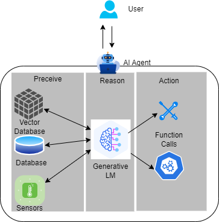
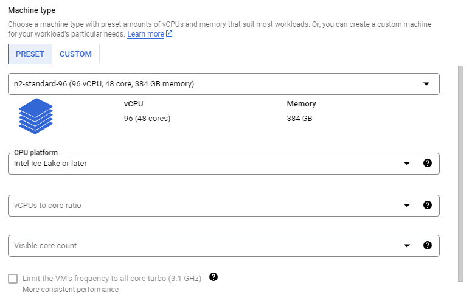
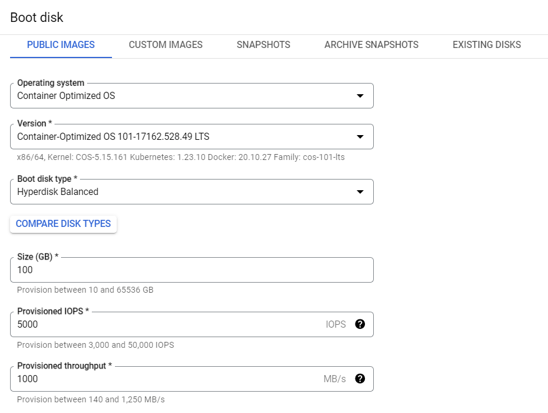
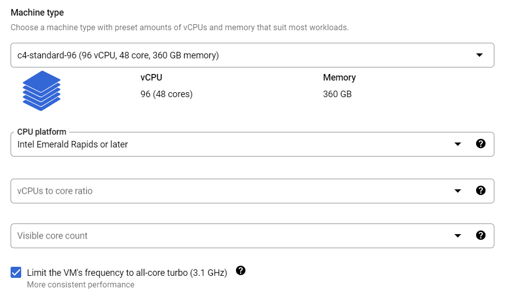
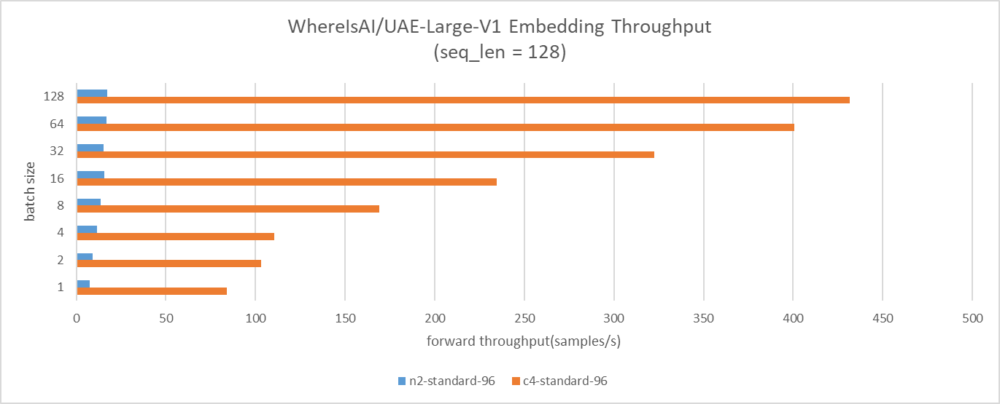
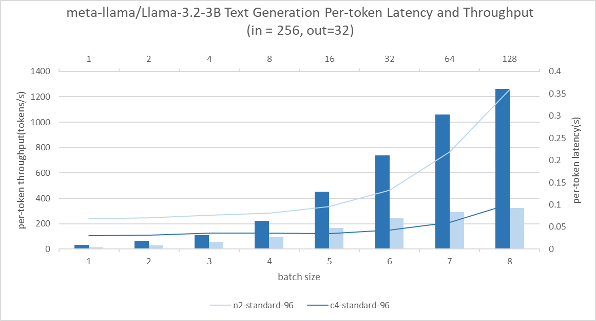

# Benchmarking Language Model Performance on 5th Gen Xeon at GCP

**TL;DR**: We benchmark 2 representative agentic AI workload components, text embedding and text generation, on two Google Cloud Compute Engine Xeon-based CPU instances, namely N2 and C4. The results consistently shows that C4 has 10x to 24x higher throughput over N2 in text embedding and 2.3x to 3.6x higher throughput over N2 in text generation. Taking price into consideration, C4's hourly price is about 1.3x of N2, in this sense, C4 keeps 7x ~ 19x TCO(Total Cost of Ownership) advantage over N2 in text embedding and 1.7x ~ 2.9x TCO advantage in text generation. The results indicate that it is possible to deploy light-weight Agentic AI solutions wholly on CPUs.

## Introduction

People believe the next frontier of artificial intelligence lies in agentic AI. The new paradigm uses the `perceive - reason - action` pipeline to combine LLM's sophisticated reasoning and iterative planning capabilities with a strong context understanding enhancement. The context understanding capability is provided by tools like vector databases and sensor input, to ceate more context-aware AI systems which can autonomously solve complex, multi-step problems. Moreover, the function calling capability of LLMs make it possible for the AI agent to directly take the action, going far beyond the chatting a chatbot offers. Agentic AI offers exciting prospects to enhance productivity and operations across industries.

<kbd>
  
</kbd>

People are bringing more and more tools into agentic AI systems, and most of these tools are now work on CPU, this brings a concern that there will be non-negligible host-accelerator traffic overheads in this paradigm. At the same time, model builders and vendors are building Small Language Models (SLMs) that are smaller yet powerful, the latest examples being Meta's 1B and 3B llama3.2 models, advanced multilingual text generation and tool calling capabilities. Further, CPUs are evolving and beginning to offer increased AI support, Intel Advanced Matrix Extensions (AMX), a new AI tensor accelerator, was introduced in its 4th generation of Xeon CPUs. Putting these 3 threads together, it would be interesting to see the potential of CPU to host the whole agentic AI systems, especially when it uses SLMs.

In this post, we will benchmark 2 representative components of agentic AI: text embedding and text generation and compare the gen-on-gen performance boost of CPU on these 2 components. We picked Google Cloud Compute Engine C4 instance and N2 instance for comparison. The logic behind is: C4 is powered by [5th generation Intel Xeon processors](https://www.intel.com/content/www/us/en/products/docs/processors/xeon/5th-gen-xeon-scalable-processors.html) (code-named Emerald Rapids) , the latest generatiton of Xeon CPU available on Google Cloud which integrates Intel AMX to boost AI performance; and N2 is powered by [3rd generation Intel Xeon processors](https://www.intel.com/content/www/us/en/products/docs/processors/xeon-accelerated/3rd-gen-xeon-scalable-processors.html) (code-named Ice Lake), the previous generation of Xeon CPU on Google Cloud which only has AVX-512 and no AMX. We'll demonstrate the benefits of AMX.

We will use [`optimum-benchmark`](https://github.com/huggingface/optimum-benchmark), Hugging Face's unified benchmark library for multi-backends and multi-devices, to measure the performance. The benchmark runs on [`optimum-intel`](https://github.com/huggingface/optimum-intel) backend. `optimum-intel` is an Hugging Face acceleration library to accelerate end-to-end pipelines on Intel architectures (CPU, GPU). Our benchmark cases are as below:
- for text embedding, we use [`WhereIsAI/UAE-Large-V1`](https://huggingface.co/WhereIsAI/UAE-Large-V1) model with input sequence length 128, and we sweep batch size from 1 to 128
- for text generation, we use [`meta-llama/Llama-3.2-3`](https://huggingface.co/meta-llama/Llama-3.2-3B) model with input sequence length 256 and output sequence length 32, and we sweep batch size from 1 to 64

## Create instance
### N2
Visit [google cloud console](https://console.cloud.google.com/) and click on `create a VM` under your project. Then, follow the below steps to create a single 96-vcpu instance which corresponds to one Intel Ice Lake CPU socket.

1. pick N2 in `Machine configuration` tab and specify `Machine type` as `n2-standard-96`. Then you need set `CPU platform` as below image:
   
2. configure `OS and storage` tab as below:
   
3. keep other configurations as default
4. click `CREATE` button

Now, you have one N2 instance.
## C4
Follow the below steps to create a 96-vcpu instance which corresponds to one Intel Emerald Rapids socket. Please note that we use the same CPU core count between C4 and N2 in this post to ensure an iso-core-count benchmark.

1. pick C4 in `Machine configuration` tab and specify `Machine type` as `c4-standard-96`. You can also set `CPU platform` and turn on all-core turbo to make performance more stable:
   
2. configure `OS and storage` as N2
3. keep other configurations as default
4. click `CREATE` button

Now, you have one C4 instance.

## Set up environment
Follow below steps to set up the environment easily.

1. SSH connect to instance
2. `$ git clone https://github.com/huggingface/optimum-benchmark.git`
3. `$ cd ./optimum-benchmark/docker/cpu`
4. `$ sudo docker build . -t <your_docker_image_tag>`
5. `$ sudo docker run -it --rm --privileged -v /home/<your_home_folder>:/workspace <your_docker_image_tag> /bin/bash`
6. `$ pip install huggingface-hub`
7. `$ cd /workspace/optimum-benchmark`
8. `$ pip install -e .[ipex]`
9.  `export OMP_NUM_THREADS=48`
10. `export KMP_AFFINITY=granularity=fine,compact,1,0`
11. `export KMP_BLOCKTIME=1`

## Benchmark
### text embedding
You need update `examples/ipex_bert.yaml` in `optimum-benchmark` directory as below to benchmark `WhereIsAI/UAE-Large-V1`. We change numa binding to `0,1` because both N2 and C4 have 2 NUMA domains per socket, you can double check with `lscpu`. 

```
--- a/examples/ipex_bert.yaml
+++ b/examples/ipex_bert.yaml
@@ -11,8 +11,8 @@ name: ipex_bert
 launcher:
   numactl: true
   numactl_kwargs:
-    cpunodebind: 0
-    membind: 0
+    cpunodebind: 0,1
+    membind: 0,1
 
 scenario:
   latency: true
@@ -26,4 +26,4 @@ backend:
   no_weights: false
   export: true
   torch_dtype: bfloat16
-  model: bert-base-uncased
+  model: WhereIsAI/UAE-Large-V1
```
Then, run benchmark:
`$ optimum-benchmark --config-dir examples/ --config-name ipex_bert`

### text generation
You can update `examples/ipex_llama.yaml` as below to benchmark `meta-llama/Llama-3.2-3`.

```
--- a/examples/ipex_llama.yaml
+++ b/examples/ipex_llama.yaml
@@ -11,8 +11,8 @@ name: ipex_llama
 launcher:
   numactl: true
   numactl_kwargs:
-    cpunodebind: 0
-    membind: 0
+    cpunodebind: 0,1
+    membind: 0,1
 
 scenario:
   latency: true
@@ -34,4 +34,4 @@ backend:
   export: true
   no_weights: false
   torch_dtype: bfloat16
-  model: TinyLlama/TinyLlama-1.1B-Chat-v1.0
+  model: meta-llama/Meta-Llama-3-8B
```
Then, run benchmark:
`$ optimum-benchmark --config-dir examples/ --config-name ipex_llama`

## Results and Conclusion
### Text Embedding Results
The GCP C4 instance delivers approximately 10x to 24x higher throughput over N2 in the text embedding benchmark cases.


### Text Generation Results
Consistently, the C4 instance shows approximately 2.3x to 3.6x higher throughput over N2 in the text generation benchmark. Across batch sizes of 1 to 16, throughput is 13x better without significantly compromising latency. It enables concurrent query serving without needing to sacrifice user experience.


### Conclusion
In this post, we benchmarked 2 representative workloads of agentic AI on Google Cloud Compute Engine CPU instances: C4 and N2. The results show prominent performance boost thanks to AMX and memory capability improvements on Intel Xeon CPUs. Intel released [Xeon 6 processors with P-cores](https://www.intel.com/content/www/us/en/products/details/processors/xeon/xeon6-product-brief.html) (code-named Granite Rapids) one month ago, and it [offers ~2x performance boost in Llama 3](https://www.intel.com/content/www/us/en/developer/articles/technical/accelerate-meta-llama3-with-intel-ai-solutions.html). We believe, with the new Granite Rapids CPU, we can explore to deploy light-weight Agentic AI solutions wholly on CPU, to avoid intensive host-accelerator traffic overheads. We will benchmark it once Google Cloud Compute Engine has Granite Rapids instance and report results.

Thanks for reading!