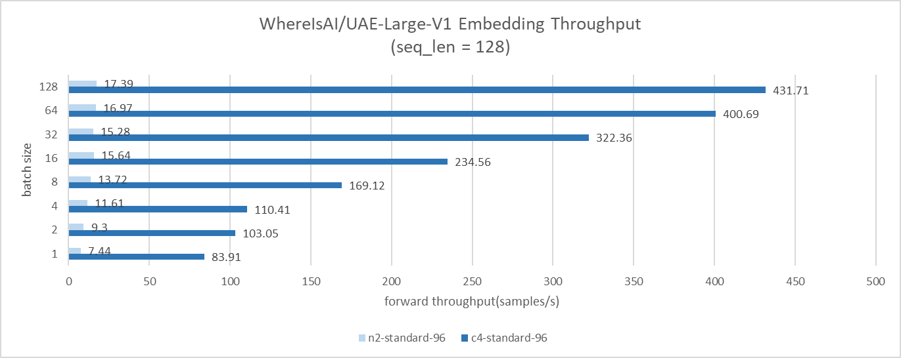

# Benchmarking language model performance on 5th Gen Intel Xeon powered GCP C4

## Introduction

People believe the next frontier of artificial intelligence lies in agentic AI. The new paradigm uses the `perceive - reason - action` pipeline to combine LLM's sophisticated reasoning and iterative planning capability with a strong context understanding enhancement provisioned by perceptual tools like vector databases or other sensors, and leads to a more context-aware AI system which can autonomously solve complex, multi-step problems. Moreover, the function calling capability of LLM makes the AI agent can directly take the action, far beyond a chatbot which can only talk. Agentic AI offers exciting prospects to enhance productivity and operations across industries.

<kbd>
  
</kbd>

Agentic AI is bringing and will bring more and more tools into the solution, and most of these tools are now working on CPU, this brings a concern that there will be unnegligible host-accelerator traffic overheads in this paradigm. At the same time, model leaders are building small yet powerful languange models, the latest example is Meta released 1B and 3B llama3.2 models which are claimed to be highly capable with multilingual text generation and tool calling. Also, CPU's AI capability is fast evolving, Intel integrates Advanced Matrix Extensions (AMX), a new AI tensor accelerator, from 4th generation of Xeon CPUs, which greatly boosted AI performance on CPU. Putting these 3 thread together, it would be interesting to see the potential of CPU to host the whole agentic AI system, especially when it uses SLM like llama-3.2-3B.

In this post, we will benchmark 2 heaviest components of agentic AI: embedding and text generation, and compare the gen-on-gen performance leap of CPU on these 2 components. We picked Google Cloud Compute Engine C4 instance and N2 instance for comparision. The logic to pick these 2 instances is: C4 is powered by [5th generation Intel Xeon processors](https://www.intel.com/content/www/us/en/products/docs/processors/xeon/5th-gen-xeon-scalable-processors.html) (code-named Emerald Rapids) , the latest generaiton of Xeon CPU on Google Cloud which equiped with Intel AMX to boost AI performance; and N2 is powered by [3rd generation Intel Xeon processors](https://www.intel.com/content/www/us/en/products/docs/processors/xeon-accelerated/3rd-gen-xeon-scalable-processors.html) (code-named Ice Lake), the last generation of Xeon CPU on Google Cloud which only have AVX-512 and no AMX. We'll demostrate what benefits AMX bring.

We will use `optimum-benchmark` to measure the performance:
- for text embedding, we use `WhereIsAI/UAE-Large-V1` model with input sequence length 128, and we sweep batch size from 1 to 128
- for text generation, we use `meta-llama/Llama-3.2-3` model with input sequence length 256 and output sequence length 32, and we sweep batch size from 1 to 64

## Create instance
### N2
you need go to [google cloud console](https://console.cloud.google.com/) and click `create a VM` under your project. Then, just follow below steps to create a 96-vcpu instance which coresponds to one Ice Lake CPU socket.

1. pick N2 in `Machine configuration` tab, and specify `Machine type` as `n2-standard-96`. Then you need set `CPU platform` as below image:
   
2. configure `OS and storage` tab as below:
   
3. keep other configurations as default
4. click `CREATE` button, then you'll have a C4 instance
## C4
Follow below steps to create a 96-vcpu instance which has the same CPU core count as N2, and also corrsponds to one Emerald Rapids socket.

1. pick C4 in `Machine configuration` tab, and specify `Machine type` as `c4-standard-96`. You can also set `CPU platform` and trun on all-core turbo to make performance more stable:
   
2. configure `OS and storage` as N2
3. keep other configurations as default
4. click `CREATE` button, then you'll have a C4 instance

## Set up environment
Follow below steps to easily setup the environment.
1. SSH connect to instance
2. `$ git clone https://github.com/huggingface/optimum-benchmark.git`
3. `$ cd ./optimum-benchmark/docker/cpu`
4. `$ sudo docker build . -t <your_docker_image_tag>`
5. `$ sudo docker run -it --rm --privileged -v /home/<your_home_folder>:/workspace <your_docker_image_tag> /bin/bash`
6. `$ cd /workspace/optimum-benchmark`
7. `$ pip install huggingface-hub`
8. `$ pip install -e .[ipex]`
9.  `export OMP_NUM_THREADS=48`
10. `export KMP_AFFINITY=granularity=fine,compact,1,0`
11. `export KMP_BLOCKTIME=1`

## Benchmark
### text embedding
You need update `examples/ipex_bert.yaml` in `optimum-benchmark` directory as below to benchmark `WhereIsAI/UAE-Large-V1`. change numa binding to `0,1` because both N2 and C4 have 2 numa domains per socket, you can double check with `lscpu`. 

```
--- a/examples/ipex_bert.yaml
+++ b/examples/ipex_bert.yaml
@@ -11,8 +11,8 @@ name: ipex_bert
 launcher:
   numactl: true
   numactl_kwargs:
-    cpunodebind: 0
-    membind: 0
+    cpunodebind: 0,1
+    membind: 0,1
 
 scenario:
   latency: true
@@ -26,4 +26,4 @@ backend:
   no_weights: false
   export: true
   torch_dtype: bfloat16
-  model: bert-base-uncased
+  model: WhereIsAI/UAE-Large-V1
```
Then, you can run benchmark:
`$ optimum-benchmark --config-dir examples/ --config-name ipex_bert`

### text generation

You can update `examples/ipex_llama.yaml` as below to benchmark `meta-llama/Llama-3.2-3`.

```
--- a/examples/ipex_llama.yaml
+++ b/examples/ipex_llama.yaml
@@ -11,8 +11,8 @@ name: ipex_llama
 launcher:
   numactl: true
   numactl_kwargs:
-    cpunodebind: 0
-    membind: 0
+    cpunodebind: 0,1
+    membind: 0,1
 
 scenario:
   latency: true
@@ -34,4 +34,4 @@ backend:
   export: true
   no_weights: false
   torch_dtype: bfloat16
-  model: TinyLlama/TinyLlama-1.1B-Chat-v1.0
+  model: meta-llama/Meta-Llama-3-8B
```
Then, you can run benchmark:
`$ optimum-benchmark --config-dir examples/ --config-name ipex_llama`

## Results and Conclusion
### Text Embedding Results
C4 demonstrates approximately 10x to 25x higher throughput of N2 in text embedding benchmark.


### Text Generation Results
Consistently, C4 shows approximately 2.3x to 3.8x higher throughput of N2 in text generation benchmark. And we can see, through batch size 1 to 16, C4 keep the same per-token latency while throughput keeps improving 13x. This brings benefits to concurrent serving queries while no need to sacrifice user experience.


### Conclusion
In this post, we benchmarked 2 heaviest workload of agentic AI on Google Cloud Compute Engine instances: C4 and N2. The results shows prominent performance leap thanks to the advancement of AMX and memory capability of Intel Xeon CPU. Intel released [Xeon 6 processors with P-cores](https://www.intel.com/content/www/us/en/products/details/processors/xeon/xeon6-product-brief.html) (code-named Granite Rapids) one months ago, and it [offers ~2x performance boost in Llama 3](https://www.intel.com/content/www/us/en/developer/articles/technical/accelerate-meta-llama3-with-intel-ai-solutions.html). We belive, with the new Granite Rapids CPU, we can place light-weight Agentic AI solution on CPU, so we can avoid intensive host-accelerator traffic overheads. We will benchmark it once Google Cloud Compute Engine have Granite Rapids instance and report results.

Thanks for reading!