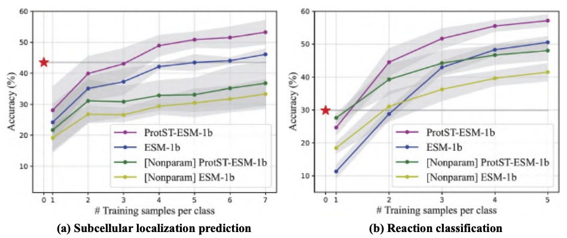
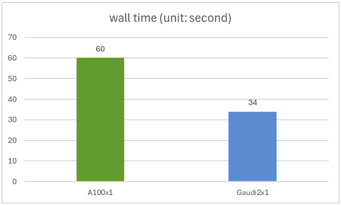
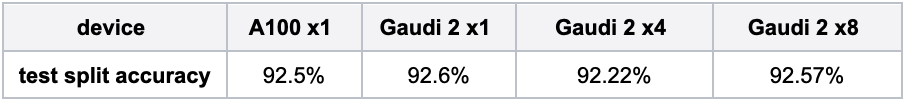
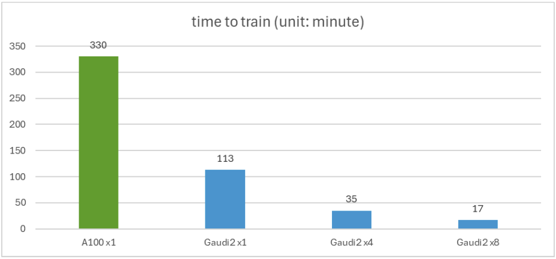

# Accelerating Protein Language Model ProtST on Intel Gaudi 2

  

## Introduction

Protein Language Models (PLMs) have emerged as potent tools for predicting and designing protein structure and function. At the International Conference on Machine Learning 2023 (ICML), MILA and Intel Labs released [ProtST](https://proceedings.mlr.press/v202/xu23t.html), a pioneering multi-modal language model for protein design based on text prompts. Since then, ProtST has been well-received in the research community, accumulating more than 40 citations in less than a year, showing the scientific strength of the work.

One of PLM's most popular tasks is predicting the subcellular location of an amino acid sequence. In this task, users feed an amino acid sequence into the model, and the model outputs a label indicating the subcellular location of this sequence. Out of the box, zero-shot ProtST-ESM-1b outperforms state-of-the-art few-shot classifiers.

<kbd>
  
</kbd>

To make ProtST more accessible, Intel and MILA have re-architected and shared the model on the Hugging Face Hub. You can download the models and datasets [here](https://huggingface.co/mila-intel). 

This post will show you how to run ProtST inference efficiently and fine-tune it with Intel Gaudi 2 accelerators and the Optimum for Intel Gaudi open-source library. [Intel Gaudi 2](https://habana.ai/products/gaudi2/) is the second-generation AI  accelerator that Intel designed. Check out our [previous blog post](https://huggingface.co/blog/habana-gaudi-2-bloom#habana-gaudi2) for an in-depth introduction and a guide to accessing it through the [Intel Developer Cloud](https://cloud.intel.com). Thanks to the [Optimum for Intel Gaudi library](https://github.com/huggingface/optimum-habana), you can port your transformers-based scripts to Gaudi 2 with minimal code changes.

## Inference with ProtST

Common subcellular locations include the nucleus, cell membrane, cytoplasm, mitochondria, and others as described in [this dataset](https://huggingface.co/datasets/mila-intel/subloc_template) in greater detail.

We compare ProtST's inference performance on NVIDIA A100 80GB PCIe and Gaudi 2 accelerator using the test split of the ProtST-SubcellularLocalization dataset. This test set contains 2772 amino acid sequences, with variable sequence lengths ranging from 79 to 1999.

You can reproduce our experiment using [this script](https://github.com/huggingface/optimum-habana/tree/main/examples/protein-folding#single-hpu-inference-for-zero-shot-evaluation), where we run the model in full bfloat16 precision with batch size 1. We get an identical accuracy of 0.44 on the Nvidia A100 and Intel Gaudi 2, with Gaudi2 delivering 1.76x faster inferencing speed than the A100. The wall time for a single A100 and a single Gaudi 2 is shown in the figure below. 

<kbd>
  
</kbd>

## Fine-tuning ProtST

Fine-tuning the ProtST model on downstream tasks is an easy and established way to improve modeling accuracy. In this experiment, we specialize the model for binary location, a simpler version of subcellular localization, with binary labels indicating whether a protein is membrane-bound or soluble.

You can reproduce our experiment using [this script](https://github.com/huggingface/optimum-habana/tree/main/examples/protein-folding#multi-hpu-finetune-for-sequence-classification-task). Here, we fine-tune the [ProtST-ESM1b-for-sequential-classification](https://huggingface.co/mila-intel/protst-esm1b-for-sequential-classification) model in bfloat16 precision on the [ProtST-BinaryLocalization](https://huggingface.co/datasets/mila-intel/ProtST-BinaryLocalization) dataset.  The table below shows model accuracy on the test split with different training hardware setups, and they closely match the results published in the paper (around 92.5% accuracy).

<kbd>
  
</kbd>

The figure below shows fine-tuning time. A single Gaudi 2 is 2.92x faster than a single A100. The figure also shows how distributed training scales near-linearly with 4 or 8 Gaudi 2 accelerators.

<kbd>
  
</kbd>

## Conclusion

In this blog post, we have demonstrated the ease of deploying ProtST inference and fine-tuning on Gaudi 2 based on Optimum for Intel Gaudi Accelerators. In addition, our results show competitive performance against A100, with a 1.76x speedup for inference and a 2.92x speedup for fine-tuning.
The following resources will help you get started with your models on the Intel Gaudi 2 accelerator:

* Optimum for Intel Gaudi Accelerators [repository](https://github.com/huggingface/optimum-habana)
* Intel Gaudi [documentation](https://docs.habana.ai/en/latest/index.html) 

Thank you for reading! We look forward to seeing your innovations built on top of ProtST with Intel Gaudi 2 accelerator capabilities.

