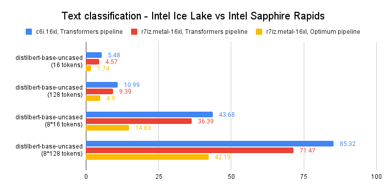
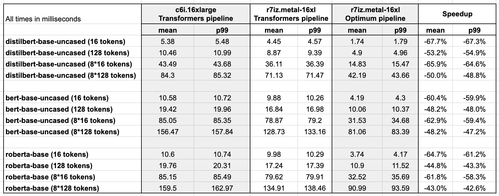

<h1>
Accelerating PyTorch Transformers with Intel Sapphire Rapids, part 2</h1>


<div class="blog-metadata">
    <small>Published February 6, 2023.</small>
    <a target="_blank" class="btn no-underline text-sm mb-5 font-sans" href="https://github.com/juliensimon/blog/blob/main/intel-sapphire-rapids.md">
        Update on GitHub
    </a>
</div>

<div class="author-card">
    <a href="https://twitter.com/julsimon">
        
        <div class="bfc">
            <code>juliensimon</code>
            <span class=fullname">Julien Simon</span>
        </div>
    </a>
</div>

In a [recent post](https://huggingface.co/blog/intel-sapphire-rapids), we introduced you to the fourth generation of Intel Xeon CPUs, code-named [Sapphire Rapids](https://en.wikipedia.org/wiki/Sapphire_Rapids), and its new Advanced Matrix Extensions ([AMX](https://en.wikipedia.org/wiki/Advanced_Matrix_Extensions)) instruction set. Combining a cluster of Sapphire Rapids servers running on Amazon EC2 and Intel libraries like the [Intel Extension for PyTorch](https://github.com/intel/intel-extension-for-pytorch), we showed you how to efficiently run distributed training at scale, achieving an 8-fold speedup compared to the previous Xeon generation (Ice Lake) with near-linear scaling.

In this post, we're going to focus on inference. Working with popular HuggingFace transformers implemented with PyTorch, we'll first measure their performance on an Ice Lake server for short and long NLP token sequences. Then, we'll do the same with a Sapphire Rapids server and the latest version of Hugging Face [Optimum Intel](https://github.com/huggingface/optimum-intel), an open-source library dedicated to hardware acceleration for Intel platforms.

Let's get started!


## Why You Should Consider CPU-based Inference

There are several factors to consider when deciding whether to run deep learning inference on a CPU or GPU. The most important one is certainly the size of the model. In general, larger models may benefit more from the additional computational power provided by a GPU, while smaller models can run efficiently on a CPU.

Another factor to consider is the level of parallelism in the model and the inference task. GPUs are designed to excel at massively parallel processing, so they may be more efficient for tasks that can be parallelized effectively. On the other hand, if the model or inference task does not have a very high level of parallelism, a CPU may be a more effective choice.

Cost is also an important factor to consider. GPUs can be expensive, and using a CPU may be a more cost-effective option, particularly if your business use case doesn't require extremely low latency. In addition, if you need the ability to easily scale up or down the number of inference workers, or if you need to be able to run inference on a wide variety of hardware, using CPUs may be a more flexible option.

Now, let's set up our test servers.

## Setting up our Test Servers
Just like in the previous post, we're going to use Amazon EC2 instances:

* a `c6i.16xlarge` instance, based on the Ice Lake architecture,
* a `r7iz.16xlarge-metal` instance, based on the Sapphire Rapids architecture. You can read more about the new r7iz family on the [AWS website](https://aws.amazon.com/ec2/instance-types/r7iz/).

Both instances have 32 physical cores (thus, 64 vCPUs). We will set them up in the same way: 

* Ubuntu 22.04 with Linux 5.15.0 (`ami-0574da719dca65348`), 
* PyTorch 1.13 with Intel Extension for PyTorch 1.13, 
* Transformers 4.25.1.

The only difference will be the addition of the Optimum Intel Library on the r7iz instance.

Here are the setup steps. As usual, we recommend using a virtual environment to keep things nice and tidy.

```
sudo apt-get update

# Add libtcmalloc for extra performance
sudo apt install libgoogle-perftools-dev -y
export LD_PRELOAD="/usr/lib/x86_64-linux-gnu/libtcmalloc.so"

sudo apt-get install python3-pip -y
pip install pip --upgrade
export PATH=/home/ubuntu/.local/bin:$PATH
pip install virtualenv
virtualenv inference_env
source inference_env/bin/activate

pip3 install torch==1.13.0 -f https://download.pytorch.org/whl/cpu
pip3 install intel_extension_for_pytorch==1.13.0 -f https://developer.intel.com/ipex-whl-stable-cpu
pip3 install transformers

# Only needed on the r7iz instance
pip3 install optimum[intel]
```

Once we've completed these steps on the two instances, we can start running our tests.

## Benchmarking Popular NLP models

In this example, we're going to benchmark several NLP models on a text classification task: [distilbert-base-uncased](https://huggingface.co/distilbert-base-uncased), [bert-base-uncased](https://huggingface.co/bert-base-uncased) and [roberta-base](https://huggingface.co/roberta-base). You can find the [full script](https://gist.github.com/juliensimon/7ae1c8d12e8a27516e1392a3c73ac1cc) on Github. Feel free to try it with your models!

```
models = ["distilbert-base-uncased", "bert-base-uncased", "roberta-base"]
```

Using both 16-token and 128-token sentences, we will measure mean and p99 prediction latency for single inference and batch inference. This should give us a decent view of the speedup we can expect in real-life scenarios.

```
sentence_short = "This is a really nice pair of shoes, I am completely satisfied with my purchase"
sentence_short_array = [sentence_short] * 8

sentence_long = "These Adidas Lite Racer shoes hit a nice sweet spot for comfort shoes. Despite being a little snug in the toe box, these are very comfortable to wear and provide nice support while wearing. I would stop short of saying they are good running shoes or cross-trainers because they simply lack the ankle and arch support most would desire in those type of shoes and the treads wear fairly quickly, but they are definitely comfortable. I actually walked around Disney World all day in these without issue if that is any reference. Bottom line, I use these as the shoes they are best; versatile, inexpensive, and comfortable, without expecting the performance of a high-end athletic sneaker or expecting the comfort of my favorite pair of slippers."
sentence_long_array = [sentence_long] * 8
```

The benchmarking function is very simple. After a few warmup iterations, we run 1,000 predictions with the pipeline API, store the prediction times, and compute both their mean and p99 values.

```
import time
import numpy as np

def benchmark(pipeline, data, iterations=1000):
    # Warmup
    for i in range(100):
        result = pipeline(data)
    times = []
    for i in range(iterations):
        tick = time.time()
        result = pipeline(data)
        tock = time.time()
        times.append(tock - tick)
    return "{:.2f}".format(np.mean(times) * 1000), "{:.2f}".format(
        np.percentile(times, 99) * 1000
    )
```

On the c6i (Ice Lake) instance, we only use a vanilla Transformers pipeline. 

```
from transformers import pipeline

for model in models:
    print(f"Benchmarking {model}")
    pipe = pipeline("sentiment-analysis", model=model)
    result = benchmark(pipe, sentence_short)
    print(f"Transformers pipeline, short sentence: {result}")
    result = benchmark(pipe, sentence_long)
    print(f"Transformers pipeline, long sentence: {result}")
    result = benchmark(pipe, sentence_short_array)
    print(f"Transformers pipeline, short sentence array: {result}")
    result = benchmark(pipe, sentence_long_array)
    print(f"Transformers pipeline, long sentence array: {result}")
```

On the r7iz (Sapphire Rapids) instance, we use both a vanilla pipeline and an Optimum pipeline. In the Optimum pipeline, we enable `bfloat16` mode to leverage the AMX instructions. We also set `jit` to `True` to further optimize the model with just-in-time compilation. 


```
   import torch
	from optimum.intel import inference_mode
	
	with inference_mode(pipe, dtype=torch.bfloat16, jit=True) as opt_pipe:
	    result = benchmark(opt_pipe, sentence_short)
	    print(f"Optimum pipeline, short sentence: {result}")
	    result = benchmark(opt_pipe, sentence_long)
	    print(f"Optimum pipeline, long sentence: {result}")
	    result = benchmark(opt_pipe, sentence_short_array)
	    print(f"Optimum pipeline, short sentence array: {result}")
	    result = benchmark(opt_pipe, sentence_long_array)
	    print(f"Optimum pipeline, long sentence array: {result}")
```

For the sake of brevity, we'll just look at the p99 results for [distilbert-base-uncased](https://huggingface.co/distilbert-base-uncased). You'll find all the other results at the end of the post. 

<kbd>
  
</kbd>

As you can see in the graph above, single predictions run **60-65%** faster compared to the previous generation of Xeon CPUs. In other words, thanks to the combination of Intel Sapphire Rapids and Hugging Face Optimum, you can accelerate your predictions 3x with only tiny changes to your code.

This lets you achieve reach **single-digit prediction latency** even with long text sequences, which was only possible with GPUs so far.

## Conclusion

The fourth generation of Intel Xeon CPUs delivers excellent inference performance, especially when combined with Hugging Face Optimum. This is yet another step on the way to making Deep Learning more accessible and more cost-effective, and we're looking forward to continuing this work with our friends at Intel.

Here are some additional resources to help you get started:

* [Intel IPEX](https://github.com/intel/intel-extension-for-pytorch) on GitHub
* [Hugging Face Optimum](https://github.com/huggingface/optimum) on GitHub


If you have questions or feedback, we'd love to read them on the [Hugging Face forum](https://discuss.huggingface.co/).

Thanks for reading!


## Appendix: full results


<kbd>
  
</kbd>

*Ubuntu 22.04 with libtcmalloc, Linux 5.15.0 patched for Intel AMX support, PyTorch 1.13 with Intel Extension for PyTorch, Transformers 4.25.1, Optimum 1.6.1, Optimum Intel 1.7.0.dev0*
 
