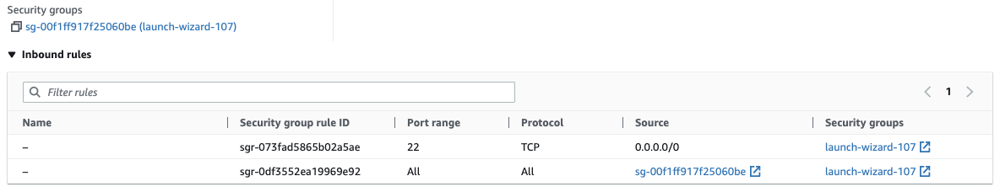
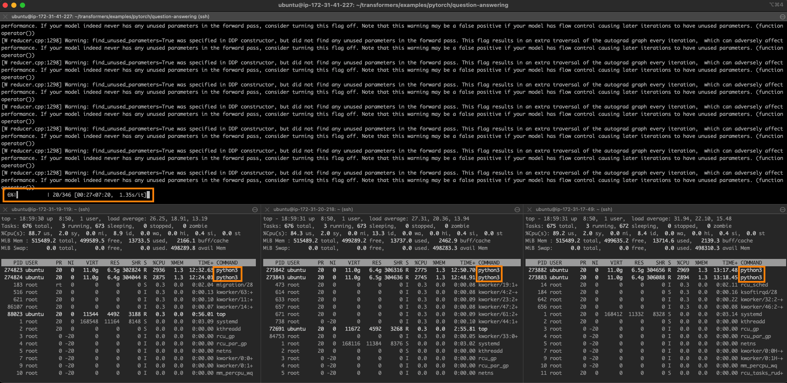

<h1>
Accelerating PyTorch Transformers with Intel Sapphire Rapids, part 1</h1>


<div class="blog-metadata">
    <small>Published January 2, 2023.</small>
    <a target="_blank" class="btn no-underline text-sm mb-5 font-sans" href="https://github.com/juliensimon/blog/blob/main/intel-sapphire-rapids.md">
        Update on GitHub
    </a>
</div>

<div class="author-card">
    <a href="https://twitter.com/julsimon">
        
        <div class="bfc">
            <code>juliensimon</code>
            <span class=fullname">Julien Simon</span>
        </div>
    </a>
</div>

About a year ago, we [showed you](https://huggingface.co/blog/accelerating-pytorch) how to distribute the training of Hugging Face transformers on a cluster or third-generation [Intel Xeon Scalable](https://www.intel.com/content/www/us/en/products/details/processors/xeon/scalable.html) CPUs (aka Ice Lake). Recently, Intel has launched the fourth generation of Xeon CPUs, code-named Sapphire Rapids, with exciting new instructions that speed up operations commonly found in deep learning models.

In this post, you will learn how to accelerate a PyTorch training job with a cluster of Sapphire Rapids servers running on AWS. We will use the [Intel oneAPI Collective Communications Library](https://www.intel.com/content/www/us/en/developer/tools/oneapi/oneccl.html) (CCL) to distribute the job, and the [Intel Extension for PyTorch](https://github.com/intel/intel-extension-for-pytorch) (IPEX) library to automatically put the new CPU instructions to work. As both libraries are already integrated with the Hugging Face transformers library, we will be able to run our sample scripts out of the box without changing a line of code.

In a follow-up post, we'll look at inference on Sapphire Rapids CPUs and the performance boost that they bring.

## Why You Should Consider Training On CPUs

Training a deep learning (DL) model on Intel Xeon CPUs can be a cost-effective and scalable approach, especially when using techniques such as distributed training and fine-tuning on small and medium datasets. 

Xeon CPUs support advanced features such as Advanced Vector Extensions ([AVX-512](https://en.wikipedia.org/wiki/AVX-512)) and Hyper-Threading, which help improve the parallelism and efficiency of DL models. This enables faster training times as well as better utilization of hardware resources.

In addition, Xeon CPUs are generally more affordable and widely available compared to specialized hardware such as GPUs, which are typically required for training large deep learning models. Xeon CPUs can also be easily repurposed for other production tasks, from web servers to databases, making them a versatile and flexible choice for your IT infrastructure.

Finally, cloud users can further reduce the cost of training on Xeon CPUs with spot instances. Spot instances are built from spare compute capacities and sold at a discounted price. They can provide significant cost savings compared to using on-demand instances, sometimes up to 90%. Last but not least, CPU spot instances also are generally easier to procure than GPU instances.

Now, let's look at the new instructions in the Sapphire Rapids architecture.


## Advanced Matrix Extensions: New Instructions for Deep Learning

The Sapphire Rapids architecture introduces the Intel Advanced Matrix Extensions ([AMX](https://en.wikipedia.org/wiki/Advanced_Matrix_Extensions)) to accelerate DL workloads. Using them is as easy as installing the latest version of IPEX. There is no need to change anything in your Hugging Face code.

The AMX instructions accelerate matrix multiplication, an operation central to training DL models on data batches. They support both Brain Floating Point ([BF16](https://en.wikipedia.org/wiki/Bfloat16_floating-point_format)) and 8-bit integer (INT8) values, enabling acceleration for different training scenarios.
 
AMX introduces new 2-dimensional CPU registers, called tile registers. As these registers need to be saved and restored during context switches, they require kernel support: On Linux, you'll need [v5.16](https://discourse.ubuntu.com/t/kinetic-kudu-release-notes/27976) or newer.
 
Now, let's see how we can build a cluster of Sapphire Rapids CPUs for distributed training.

## Building a Cluster of Sapphire Rapids CPUs

At the time of writing, the simplest way to get your hands on Sapphire Rapids servers is to use the new Amazon EC2 [R7iz](https://aws.amazon.com/ec2/instance-types/r7iz/) instance family. As it's still in preview, you have to [sign up](https://pages.awscloud.com/R7iz-Preview.html) to get access. In addition, virtual servers don't yet support AMX, so we'll use bare metal instances (`r7iz.metal-16xl`, 64 vCPU, 512GB RAM).


To avoid setting up each node in the cluster manually, we will first set up the master node and create a new Amazon Machine Image ([AMI](https://docs.aws.amazon.com/AWSEC2/latest/UserGuide/AMIs.html)) from it. Then, we will use this AMI to launch additional nodes.

From a networking perspective, we will need the following setup:

* Open port 22 for ssh access on all instances for setup and debugging.

* Configure [password-less ssh](https://www.redhat.com/sysadmin/passwordless-ssh) from the master instance (the one you'll launch training from) to all other instances (master included). In other words, the ssh public key of the master node must be authorized on all nodes.

* Allow all network traffic inside the cluster, so that distributed training runs unencumbered. AWS provides a safe and convenient way to do this with [security groups](https://docs.aws.amazon.com/vpc/latest/userguide/VPC_SecurityGroups.html). We just need to create a security group that allows all traffic from instances configured with that same security group and make sure to attach it to all instances in the cluster. Here's how my setup looks.

<kbd>
  
</kbd>


Let's get to work and build the master node of the cluster.

## Setting Up the Master Node

We first create the master node by launching an `r7iz.metal-16xl` instance with an Ubunutu 20.04 AMI (`ami-07cd3e6c4915b2d18`) and the security group we created earlier. This AMI includes Linux v5.15.0, but Intel and AWS have fortunately patched the kernel to add AMX support. Thus, we don't need to upgrade the kernel to v5.16.

Once the instance is running, we ssh to it and check with `lscpu` that AMX are indeed supported. You should see the following in the flags section:

```
amx_bf16 amx_tile amx_int8
```

Then, we install native and Python dependencies.

```
sudo apt-get update 

# Install tcmalloc for extra performance (https://github.com/google/tcmalloc)
sudo apt install libgoogle-perftools-dev -y

# Create a virtual environment
sudo apt-get install python3-pip -y
pip install pip --upgrade
export PATH=/home/ubuntu/.local/bin:$PATH
pip install virtualenv

# Activate the virtual environment
virtualenv cluster_env
source cluster_env/bin/activate

# Install PyTorch, IPEX, CCL and Transformers
pip3 install torch==1.13.0 -f https://download.pytorch.org/whl/cpu
pip3 install intel_extension_for_pytorch==1.13.0 -f https://developer.intel.com/ipex-whl-stable-cpu
pip3 install oneccl_bind_pt==1.13 -f https://developer.intel.com/ipex-whl-stable-cpu
pip3 install transformers==4.24.0

# Clone the transformers repository for its example scripts
git clone https://github.com/huggingface/transformers.git
cd transformers
git checkout v4.24.0
```

Next, we create a new ssh key pair called 'cluster' with `ssh-keygen` and store it at the default location (`~/.ssh`).

Finally, we create a [new AMI](https://docs.aws.amazon.com/AWSEC2/latest/UserGuide/creating-an-ami-ebs.html) from this instance.

## Setting Up the Cluster

Once the AMI is ready, we use it to launch 3 additional `r7iz.16xlarge-metal` instances, without forgetting to attach the security group created earlier.

While these instances are starting, we ssh to the master node to complete the network setup. First, we edit the ssh configuration file at `~/.ssh/config` to enable password-less connections from the master to all other nodes, using their private IP address and the key pair created earlier. Here's what my file looks like.

```
Host 172.31.*.*
   StrictHostKeyChecking no

Host node1
    HostName 172.31.10.251
    User ubuntu
    IdentityFile ~/.ssh/cluster

Host node2
    HostName 172.31.10.189
    User ubuntu
    IdentityFile ~/.ssh/cluster

Host node3
    HostName 172.31.6.15
    User ubuntu
    IdentityFile ~/.ssh/cluster
```

At this point, we can use `ssh node[1-3]` to connect to any node without any prompt.

On the master node sill, we create a `~/hosts` file with the names of all nodes in the cluster, as defined in the ssh configuration above. We use `localhost` for the master as we will launch the training script there. Here's what my file looks like.

```
localhost
node1
node2
node3
```

The cluster is now ready. Let's start training!

## Launching a Distributed Training Job

In this example, we will fine-tune a [DistilBERT](https://huggingface.co/distilbert-base-uncased) model for question answering on the [SQUAD](https://huggingface.co/datasets/squad) dataset. Feel free to try other examples if you'd like.

```
source ~/cluster_env/bin/activate
cd ~/transformers/examples/pytorch/question-answering
pip3 install -r requirements.txt
```

As a sanity check, we first launch a local training job. Please note several important flags: 

* `no_cuda` makes sure the job is ignoring any GPU on this machine,
* `use_ipex` enables the IPEX library and thus the AVX and AMX instructions, 
* `bf16` enables BF16 training.
	

```
export LD_PRELOAD="/usr/lib/x86_64-linux-gnu/libtcmalloc.so"
python run_qa.py --model_name_or_path distilbert-base-uncased \
--dataset_name squad --do_train --do_eval --per_device_train_batch_size 32 \
--num_train_epochs 1  --output_dir /tmp/debug_squad/ \
--use_ipex --bf16 --no_cuda
```

No need to let the job run to completion, We just run for a minute to make sure that all dependencies have been correctly installed. This also gives us a baseline for single-instance training: 1 epoch takes about **26 minutes**. For reference, we clocked the same job on a comparable Ice Lake instance (`c6i.16xlarge`) with the same software setup at **3 hours and 30 minutes** per epoch. That's an **8x speedup**. We can already see how beneficial the new instructions are!

Now, let's distribute the training job on four instances. An `r7iz.16xlarge` instance has 32 physical CPU cores, which we prefer to work with directly instead of using vCPUs (`KMP_HW_SUBSET=1T`).  We decide to allocate 24 cores for training (`OMP_NUM_THREADS`) and 2 for CCL communication (`CCL_WORKER_COUNT`), leaving the last 6 threads to the kernel and other processes. The 24 training threads support 2 Python processes (`NUM_PROCESSES_PER_NODE`). Hence, the total number of Python jobs running on the 4-node cluster is 8 (`NUM_PROCESSES`).

```
# Set up environment variables for CCL
oneccl_bindings_for_pytorch_path=$(python -c "from oneccl_bindings_for_pytorch import cwd; print(cwd)")
source $oneccl_bindings_for_pytorch_path/env/setvars.sh

export MASTER_ADDR=172.31.3.190
export NUM_PROCESSES=8
export NUM_PROCESSES_PER_NODE=2
export CCL_WORKER_COUNT=2
export CCL_WORKER_AFFINITY=auto
export KMP_HW_SUBSET=1T
```

Now, we launch the distributed training job.

```
# Launch distributed training
mpirun -f ~/hosts \
 -n $NUM_PROCESSES -ppn $NUM_PROCESSES_PER_NODE  \
 -genv OMP_NUM_THREADS=24 \
 -genv LD_PRELOAD="/usr/lib/x86_64-linux-gnu/libtcmalloc.so" \
 python3 run_qa.py \
 --model_name_or_path distilbert-base-uncased \
 --dataset_name squad \
 --do_train \
 --do_eval \
 --per_device_train_batch_size 32  \
 --num_train_epochs 1  \
 --output_dir /tmp/debug_squad/ \
 --overwrite_output_dir \
 --no_cuda \
 --xpu_backend ccl \
 --bf16
```

One epoch now takes **7 minutes and 30 seconds**. 

Here's what the job looks like. The master node is at the top, and you can see the two training processes running on each one of the other 3 nodes.

<kbd>
  
</kbd>

Perfect linear scaling on 4 nodes would be 6 minutes and 30 seconds (26 minutes divided by 4). We're very close to this ideal value, which shows how scalable this approach is.

## Conclusion

As you can see, training Hugging Face transformers on a cluster of Intel Xeon CPUs is a flexible, scalable, and cost-effective solution, especially if you're working with small or medium-sized models and datasets.

Here are some additional resources to help you get started:

* [Intel IPEX](https://github.com/intel/intel-extension-for-pytorch) on GitHub
* Hugging Face documentation: "[Efficient training on CPU](https://huggingface.co/docs/transformers/perf_train_cpu)" and "[Efficient training on many CPUs](https://huggingface.co/docs/transformers/perf_train_cpu_many)".

If you have questions or feedback, we'd love to read them on the [Hugging Face forum](https://discuss.huggingface.co/).

Thanks for reading!


 