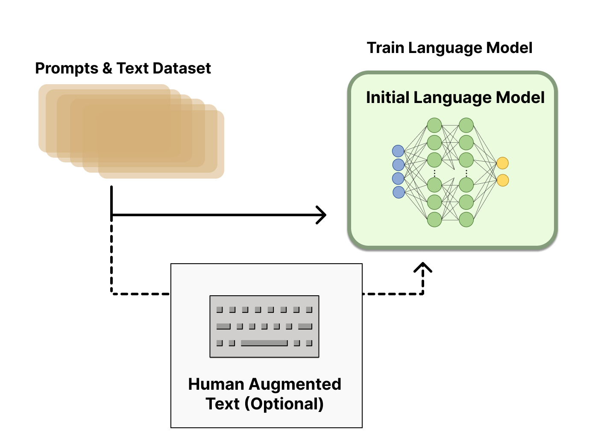

# Illustrating Reinforcement Learning from Human Feedback (RLHF)

    <small>Published December 8, 2022.</small>
    <a target="_blank" class="btn no-underline text-sm mb-5 font-sans" href="https://github.com/huggingface/blog/blob/main/rlhf.md">
        Update on GitHub
    </a>

    <a href="/natolambert"> 
        
        

            <code>natolambert</code>
            Nathan Lambert
        

    </a>
   <a href="https://twitter.com/lcastricato">
        
        

            <code>lcastricato</code>
            Louis Castricato
            guest
        

    </a>
    <a href="/lvwerra">
        
        

            <code>lvwerra</code>
            Leandro von Werra
        

    </a>
	 <a href="https://twitter.com/Dahoas1">
        
        

            <code>Dahoas1</code>
            Alex Havrilla
            guest
        

    </a>

[ChatGPT](https://openai.com/blog/chatgpt/) was the next iteration in the rapid progress of LLMs. This model, according to [users](https://www.theverge.com/2022/12/8/23499728/ai-capability-accessibility-chatgpt-stable-diffusion-commercialization), has taken another huge step in language model performance and alignment. Therein, it comes as the most recent verification of reinforcement learning from human feedback (RLHF) being a valuable tool to optimize large models on diverse tasks that are challenging to specify numerically.
    
This success comes in the presence of an ambiguity in defining the tasks that language models need to do. The promise of language models has always been clear – a fast way to generate diverse and compelling text on any topic, but their development has often been intertwined with questions of how to define “good” performance. Good performance for a language model is inherently a human problem, which would be understanding what is a loss function that defines any of the following artifacts: a good story, the flavor of informative text, short code snippets in multiple languages, and more.

These questions that define how “good” the application of a language model is are ultimately expressions of human preferences. Human preferences are historically very challenging to encode in computing systems, due to a complex web of ethics and values that are not clear nor equal across populations. **Reinforcement Learning from Human Feedback** (RLHF) has emerged as the technique that can map from high-quality, human annotations to models that better match sets of desirable behavior. RLHF has enabled language models to begin to  align a model trained on a general corpus of text data to that of complex human values.

This power of alignment is immensely promising, but often confused by complex system details and interconnected ML models. This blog post attempts to provide a comprehensive conceptual overview of how RLHF operates.

# RLHF: Let’s take it step by step

Reinforcement learning from Human Feedback (also referenced as RL from human preferences) is a challenging concept because it involves a multiple model training process and different stages of deployment. In this blog post, we’ll break down the training process into three core steps:

1. Pretraining a Language Model (LM),
2. gathering data and training a reward model, and
3. fine-tuning the LM with reinforcement learning.

### LM Model Pretraining

The initial step to RLHF is to have a language model (LM) that one would like to fine-tune or to [train one from scratch](https://huggingface.co/blog/how-to-train) with unsupervised learning. OpenAI used a smaller version of GPT-3 for its first popular RLHF model, [InstructGPT](https://openai.com/blog/instruction-following/), Anthropic used 10M-52Billion parameter transformer models trained for this task, and DeepMind used their 280Billion parameter model [Gopher](https://arxiv.org/abs/2112.11446).

This initial model *can* also be fine-tuned on additional text or conditions, but does not necessarily need to be. For example, OpenAI fine-tuned on human-generated text that was “preferable” and Anthropic generated their initial policy for RLHF by distilling the original LM on context clues for their “helpful, honest, and harmless” criteria.

In general, there is not a clear answer on “which model” is the best for the starting point of RLHF. This will be a common trend – the design space of options in RLHF training are not thoroughly explored.

Next, with a language model, one needs to generate data to train a **preference model**.

    

### Reward Model Training
    
Generating a reward model (RM, also referred to as a preference model) calibrated with human preferences is where the relatively new research in RLHF begins. The underlying goal is to get a model or system that takes in a sequence of text, normally in the form of {prompt-generation} input batches, and returns a batch of scalar rewards. The system can be an end-to-end LM, or a modular system outputting a reward (e.g. a model ranks outputs, and the ranking is converted to reward). The output being a **scalar** **reward** is crucial for existing RL algorithms being integrated seamlessly later in the RLHF process.

These LMs for reward modeling can be both another fine-tuned LM or a LM trained from scratch on the preference data. For example, Anthropic uses a specialized method to train these models from scratch because it was found to be more sample efficient than fine-tuning, but no one variation of reward modeling is considered the clear best choice today.

The training dataset of prompt-generation pairs for the RM is generated by sampling a set of prompts from a predefined dataset (Anthropic’s data generated primarily with a chat tool on Amazon Mechanical Turk is [available](https://huggingface.co/datasets/Anthropic/hh-rlhf) on the Hub, and OpenAI used prompts submitted by users to the GPT API). The prompts are passed through the language model trained in the previous section to new text to generate new text.

Human annotators are used to rank the new text outputs from the LM. There are multiple methods for ranking the text. One method that has been successful is to have users compare generated text from two language models conditioned on the same prompt. By comparing model outputs in head-to-head matchups, an [ELO](https://en.wikipedia.org/wiki/Elo_rating_system) system can be used to generate a ranking of the models and outputs relative to each-other. This ELO score, which can also be represented in a preference probability or other forms, is a scalar value that can be used as the target in supervised learning of the preference model. In practice, it’s normal for the reward to be a normalized version of the ELO ranking, which is better regularized for training.

An interesting artifact of this process is that the successful RLHF systems to date have all used language model architectures of similar sizes to the text generation model for the reward model. An intuition would be that these preference models need to have similar capacity to understand the text given to them as a model would need in order to generate said text.

At this point in the RLHF system, we have an initial language model that can be used to generate text and a preference model that takes in any text and assigns it a score of how well humans perceive it. Next, we use **reinforcement learning (RL)** to optimize the original language model with respect to the reward model.

    

### Fine-tuning with RL

Training a language model with reinforcement learning was, for a long time, something that people would have thought is impossible both for engineering and algorithmic reasons. What multiple organizations seem to have gotten to work is fine-tuning **some parameters** of a **copy of the initial LM** with a policy-gradient RL algorithm, Proximal Policy Optimization (PPO). Parameters of the LM are frozen because fine-tuning an entire 10B or 100B+ parameter model is prohibitively expensive (for more, see Low-Rank Adaptation ([LoRA](https://arxiv.org/abs/2106.09685)) for LMs or the [Sparrow](https://arxiv.org/abs/2209.14375) LM from DeepMind). PPO has been around for a relatively long time – there are [tons](https://spinningup.openai.com/en/latest/algorithms/ppo.html) of [guides](https://huggingface.co/blog/deep-rl-ppo) on how it works. The relative maturity of this method made it a favorable choice for scaling up to the new application of distributed training for RLHF. It turns out that many of the core RL advancements to do RLHF have been figuring out how to update such a large model with a familiar algorithm (more on that later).

In order to formulate this fine-tuning as a RL problem, we need to make a few components of the system clear. First, the **policy** is a language model that takes in a prompt and returns a sequence of text (or just probability distributions over text). The **action space** of this policy is all the tokens corresponding to the vocabulary of the language model (often on the order of 50k tokens) and the **observation space** is the possible input token sequences, which is also quite large. The **reward function** is a combination of the preference model and a constraint on policy shift.

The reward function is where the system combines all of the models we have discussed into one RLHF process. Given a prompt, *x*,  from the dataset, two texts, *y1*, *y2*, are generated – one from the initial language model and one from the current iteration of the fine-tuned policy. The text from the current policy is passed to the preference model, which returns a scalar notion of “preferability”, rθ. This text is compared to the text from the initial model to compute a penalty on the difference between them. In multiple papers from OpenAI, Anthropic, and DeepMind, this penalty has been designed as a scaled version of the Kullback–Leibler ****[(KL) divergence](https://en.wikipedia.org/wiki/Kullback%E2%80%93Leibler_divergence) between these sequences of distributions over tokens, rKL. The KL divergence term penalizes the RL policy from moving substantially away from the pretrained model with each training batch, which can be useful to make sure the model outputs reasonably coherent text snippets. In practice, the KL divergence is approximated via sampling from both distributions (explained by John Schulman [here](http://joschu.net/blog/kl-approx.html), and being implemented by CarperAI [here](https://github.com/CarperAI/trlx/issues/53)). The final reward sent to the RL update rule is r = rθ - λrKL.

Some RLHF systems have added additional terms to the reward function. For example, OpenAI experimented successfully on InstructGPT by mixing in additional pre-training gradients (from the human annotation set) into the update rule for PPO. It is likely as RLHF is better understood, the formulation of this reward function will continue to evolve.

Finally, the **update rule** is the parameter update from PPO that maximizes the reward metrics in the current batch of data (PPO is on-policy, which means the parameters are only updated from the current batch of prompt-generation pairs, not all of the previous data in a replay buffer). PPO is a trust region optimization algorithm, where it uses constraints on the gradient to ensure the update step does not destabilize the learning process. DeepMind used a similar reward setup for Gopher, but used [synchronous advantage actor-critic](http://proceedings.mlr.press/v48/mniha16.html?ref=https://githubhelp.com) (A2C) to optimize the gradients, which is notably different, but has not been reproduced externally.

    

Optionally, RLHF can continue from this point by iteratively updating the reward model and the policy together. As the RL policy updates, users can continue to rank these outputs versus earlier versions of the model. Most papers do not discuss implementing this operation, as the deployment mode needed to collect this type of data only works for dialogue agents with access to an engaged user base. Anthropic discusses this option as *Iterated Online RLHF* (see the original [paper](https://arxiv.org/abs/2204.05862)), where iterations of the policy are included in the ELO ranking system across models. This introduces complex dynamics of the policy and reward model evolving over time, which represents a complex and open research question.

# Open-source tools for RLHF

There are already a few well-maintained repositories for RLHF. The primary repositories are Transformers Reinforcement Learning ([TRL](https://github.com/lvwerra/trl)), [TRLX](https://github.com/CarperAI/trlx) which originated as a fork of TRL, and Reinforcement Learning for Language models ([RL4LM](https://github.com/allenai/RL4LMs)).

TRL is designed to fine-tune pretrained LMs in the HuggingFace ecosystem with PPO, and TRLX is an expanded fork of TRL built by [CarperAI](https://carper.ai/) to handle larger models for both online and offline training. At the moment, TRLX is the only API that is capable of production-ready RLHF at the scales required for LLM deployment (e.g. 33Billion parameters). Future versions of TRLX will allow for language models up to 200B parameters. As such, interfacing with TRLX is optimized for machine learning engineers with experience at this scale.

RL4LM offers a wide variety of RL algorithms, natural language processing benchmarks, and metrics for evaluating models. RL4LM, like TRL, does not have the distributed training code required to operate PPO on large models (e.g. 10B+ parameters).

# What’s next for RLHF?

While these techniques are extremely promising, extremely impactful, and have caught the attention of the biggest research labs in AI, there are still clear limitations. The models, while better, can still output text that is harmful or factually inaccurate without any notion of uncertainty. This imperfection represents a long-term challenge and motivation for RLHF – operating in an inherently human problem domain means there will never be a clear final line to cross for the model to be labeled as *complete*.

When deploying a system using RLHF, gathering the human preference data is quite expensive due to the mandatory and thoughtful human component. RLHF performance is only as good as the quality of its human annotations, which takes on two varieties: human generated text, such as for fine-tuning the initial LM in IntstructGPT, and labels of human preferences between model outputs.

Generating well-written human text answering specific prompts is very costly, as it often requires hiring part-time staff (rather than being able to rely on product users or crowdsourcing). Thankfully, the scale of data used in training the reward model for most applications of RLHF (~50k labeled preference samples) is not as expensive, but it is still a higher cost than academic labs would likely be able to afford. Currently there only exists one large-scale dataset for RLHF on a general language model (from [Anthropic](https://huggingface.co/datasets/Anthropic/hh-rlhf)) and a couple smaller scale task specific datasets (such as summarization data from [OpenAI](https://github.com/openai/summarize-from-feedback)). A second challenge of data for RLHF is that human annotators can often disagree, adding a substantial potential variance to the training data without a ground truth.

With these limitations, there are still huge swaths of unexplored design options that could enable RLHF to take substantial strides. Many of these fall within the domain of improving the RL optimizer. PPO is a relatively old algorithm, but there are no structural reasons that other algorithms could offer benefits and permutations on the existing RLHF workflow. One large cost of the feedback portion fine-tuning the LM policy is that every generated piece of text from the policy needs to be evaluated on the reward model (as it acts like part of the environment in the standard RL framework). To avoid these costly forward passes of a large model, offline RL could be used as a policy optimizer. Recently, new algorithms have emerged, such as [implicit language Q-learning](https://arxiv.org/abs/2206.11871) (ILQL), that fit particularly well with this type of optimization. Other core trade-offs in the RL process like exploration-exploitation balance have also not been documented. Exploring these directions would at least develop substantial understanding for how RLHF functions, if not additionally providing improved performance.

### Further reading

Here is a list of the most prevalent papers on RLHF to date. The field emerged from the first paper on Deep RL (Christiano et al. 2017) and has grown into a broader study of the applications of LLMs from many large technology companies.

- [Deep Reinforcement Learning from Human Preferences](https://proceedings.neurips.cc/paper/2017/hash/d5e2c0adad503c91f91df240d0cd4e49-Abstract.html) (Christiano et al. 2017): RLHF applied on preferences between Atari trajectories.
- [Fine-Tuning Language Models from Human Preferences](https://arxiv.org/abs/1909.08593) (Zieglar et al. 2019): An early paper that studies the impact of reward learning on four specific tasks.
- [Learning to summarize with human feedback](https://proceedings.neurips.cc/paper/2020/hash/1f89885d556929e98d3ef9b86448f951-Abstract.html) (Stiennon et al., 2020): RLHF applied to the task of summarizing text. Also, [Recursively Summarizing Books with Human Feedback](https://arxiv.org/abs/2109.10862) (OpenAI Alignment Team 2021), follow on work summarizing books.
- [WebGPT: Browser-assisted question-answering with human feedback](https://arxiv.org/abs/2112.09332) (OpenAI, 2021): Using RLHF to train an agent to navigate the web [[Talk](https://youtu.be/fGq4np3brbs) at CarperAI].
- InstructGPT: [Training language models to follow instructions with human feedback](https://arxiv.org/abs/2203.02155) (OpenAI Alignment Team 2022): RLHF applied to a general language model [[Blog post](https://openai.com/blog/instruction-following/) on InstructGPT].
- GopherCite: [Teaching language models to support answers with verified quotes](https://www.deepmind.com/publications/gophercite-teaching-language-models-to-support-answers-with-verified-quotes) (Menick et al. 2022): Train a LM with RLHF to return answers with specific citations.
- Sparrow: [Improving alignment of dialogue agents via targeted human judgements](https://arxiv.org/abs/2209.14375) (Glaese et al. 2022): Fine-tuning a dialogue agent with RLHF
- [ChatGPT: Optimizing Language Models for Dialogue](https://openai.com/blog/chatgpt/) (OpenAI 2022): Training a LM with RLHF for suitable use as an all-purpose chat bot.
- [Scaling Laws for Reward Model Overoptimization](https://arxiv.org/abs/2210.10760) (Gao et al. 2022): studies the scaling properties of the learned preference model in RLHF.
- [Training a Helpful and Harmless Assistant with Reinforcement Learning from Human Feedback](https://arxiv.org/abs/2204.05862) (Anthropic, 2022): A detailed documentation of training a LM assistant with RLHF.
- [Red Teaming Language Models to Reduce Harms: Methods, Scaling Behaviors, and Lessons Learned](https://arxiv.org/abs/2209.07858) (Ganguli et al. 2022): A detailed documentation of efforts to “discover, measure, and attempt to reduce [language models] potentially harmful outputs.”
- [Dynamic Planning in Open-Ended Dialogue using Reinforcement Learning](https://arxiv.org/abs/2208.02294) (Cohen at al. 2022): Using RL to enhance the conversational skill of an open-ended dialogue agent.