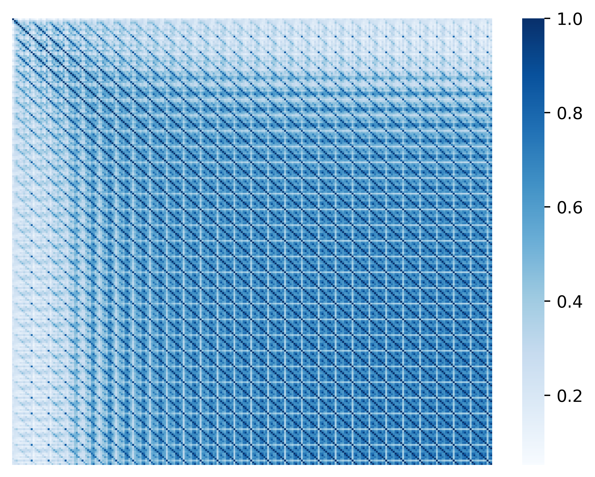
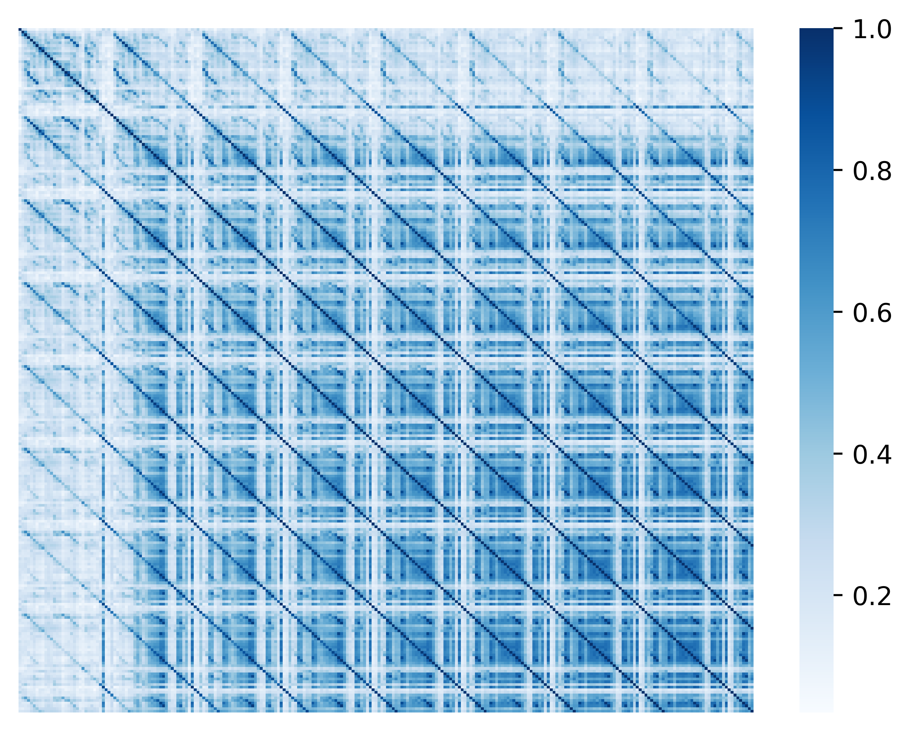
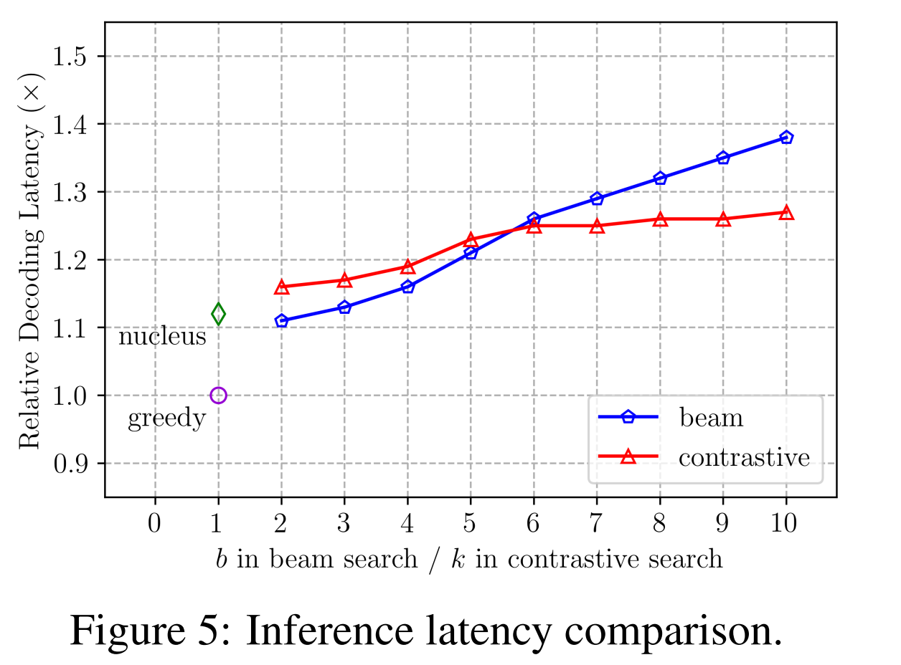

<h1>Geneate coherent and fluent text with contrastive search in Transformers</h1>

<div class="blog-metadata">
    <small>Published September 02, 2022.</small>
    <a target="_blank" class="btn no-underline text-sm mb-5 font-sans" href="https://github.com/huggingface/blog/blob/main/decision-transformers-train.md">
        Update on GitHub
    </a>
</div>

<div class="author-card">
    <a href="/GMFTBY"> 
        
        <div class="bfc">
            <code>gmftbyGMFTBY</code>
            <span class="fullname">Tian Lan</span>
        </div>
    </a>
</div>

### 1. Problems of Existing Decoding Methods

Natural language generation (i.e. text generation) aims at generating text that is human-like and it is one of the core tasks in natural language processing (NLP). With recent advance in generative pre-trained language models (e.g. [OPT](https://arxiv.org/pdf/2205.01068.pdf) and [GPT-J](https://github.com/kingoflolz/mesh-transformer-jax)), text generation has attracted increasing interest in the research community. While these large language models (LMs) have become increasingly powerful, their potentials are still limited by the problems of existing decoding methods.

Existing decoding methods that are widely-used could be divided into two categories: 
* (1) Deterministic Methods
* (2) Stochastic Methods

**(i) Deteriminstic methods** (e.g. greedy search and beam search) aim at selecting the text continuation with the highest probability based on language model's probability distribution. However, when generating text, deteriminstic methods often lead to the problem of model degeneration <a href='#references'>[1]</a>, 

However, these deteriminstic methods often lead to the **degeneration problem**, i.e., the generated text is unnatual and contains undesirable repetitions.
For example, let us see the generations provided by the greedy search model.

```python
from transformers import AutoTokenizer, GPT2LMHeadModel
tokenizer = AutoTokenizer.from_pretrained('gpt2-large')
input_ids = tokenizer('DeepMind Company is', return_tensors='pt').input_ids.cuda()
model = GPT2LMHeadModel.from_pretrained('gpt2-large').cuda()

greedy_output = model.generate(input_ids, max_length=128)
print("Output:\n" + 100 * '-')
print(tokenizer.decode(greedy_output[0], skip_special_tokens=True))
```

<div class="output stream stdout">

    Output:
    ----------------------------------------------------------------------------------------------------
    DeepMind Company is a leading AI research company, with a focus on deep learning and deep learning-based systems.
    The company's research is focused on the development of deep learning-based systems that can learn from large amounts of data, and that can be used to solve real-world problems.
    
    DeepMind's research is also used by the UK government to develop new technologies for the UK's National Health Service.
    
    DeepMind's research is also used by the UK government to develop new technologies for the UK's National Health Service.
    
    DeepMind's research is also used by the UK government to develop new technologies

</div>

It can be observed that the generation of the greedy search quickly repeats itself, leading to the weired and unsatisfactory results.

To address the degeneration problem, **stochastic methods** introduce the random sampling during the auto-regressive decoding.
The [Top-K sampling](https://arxiv.org/abs/1805.04833) and [Nucleus sampling](https://arxiv.org/abs/1904.09751) are two widely used stochastic decoding methods. Let us see the generations of the nucleus sampling.

```python
from transformers import AutoTokenizer, GPT2LMHeadModel
tokenizer = AutoTokenizer.from_pretrained('gpt2-large')
input_ids = tokenizer('DeepMind Company is', return_tensors='pt').input_ids
model = GPT2LMHeadModel.from_pretrained('gpt2-large')

torch.manual_seed(0.)
greedy_output = model.generate(input_ids, do_sample=True, max_length=128, top_p=0.95, top_k=0)
print("Output:\n" + 100 * '-')
print(tokenizer.decode(greedy_output[0], skip_special_tokens=True))
```

<div class="output stream stdout">

    Output:
    ----------------------------------------------------------------------------------------------------
    DeepMind Company is a leading provider of AI-based research, development, and delivery of AI solutions for security, infrastructure, machine learning, communications, and so on."
    'AI is not journalism'
    Worse still was the message its researchers hoped would reach the world's media — that it was not really research, but rather a get-rich-quick scheme to profit from living forces' ignorance.
    "The thing is, we know that people don't consciously assess the value of the others' information. They understand they will get the same on their own."
    One example? Given the details of today

Although their generations are almost free from the degeneration problem, they often **lack coherence**. For example, the generated context after **'AI is not journalism'** is incoherent with the prefix **DeepMind Company**.

### 2. Contrastive Search

In order to generate the fluent and coherent text continuations, in this blog, we introduce a simple yet effective decoding methods, named [Contrastive Search](https://arxiv.org/abs/2202.06417), which is recent published by NeurIPS 2022 paper, "A Contrastive Framework for Neural Text Generation".

Before we get into the details of the contrastive search, let us analyze some interesting properties of the degenerations.

The following figures show the heatmap of the cosine similarities between each pair of the token in the greedy search and beam search generations. Note that the cosine similarities is computed given the token's last layer hidden state.

<center class="half">
    
</center>

For the greedy search that shown in the left figure, given the prefix **"Kobe Bryant is"**, the gpt2-large model with the  greedy search decoding method generates the text continuation:

```
Kobe Bryant is the best player in the world. He's the best player in the world. He's the best player in the world. He's the best player in the world. He's the best
 player in the world. He's the best player in the world. He's the best player in the world. He's the best player in the world. He's the best player in the world. H
e's the best player in the world. He's the best player in the world. He's the best player in the world. He's the best player in the world. He's the best player in 
the world. He's the best player in the world. He's the best player in the world. He's the best player in the world. He's the best player in the world. He's the bes
t player in the world. He's the best player in the world. He's the best player in the world. He's the best player in the world. He's the best player in the world. 
He's the best player in the world. He's the best player in the world. He's the best player in the world. He's the best player in the world. He's the best player in
 the world. He's
```

Besides, it can be observed that the degeneration problem is very severe in this case, and the heatmap demonstrates that the repetitive tokens has very high cosine similairty with previous tokens.

For the beam search that shown in the right figure, given the prefix **"Kobe Bryant is"**, the gpt2-large model with the beam search decoding method (`beam_size=5`) generates the text continuation:

```
Kobe Bryant is one of the greatest basketball players of all time, but he's also one of the most polarizing figures in the NBA.

Bryant is one of the greatest basketball players of all time, but he's also one of the most polarizing figures in the NBA.

Bryant is one of the greatest basketball players of all time, but he's also one of the most polarizing figures in the NBA.

Bryant is one of the greatest basketball players of all time, but he's also one of the most polarizing figures in the NBA.

Bryant is one of the greatest basketball players of all time, but he's also one of the most polarizing figures in the NBA.

Bryant is one of the greatest basketball players of all time, but he's also one of the most polarizing figures in the NBA.

Bryant is one of the greatest basketball players of all time, but he's also one of the most polarizing figures in the NBA.

Bryant is one of the greatest basketball players of all time, but he's also one of the most polarizing figures in the NBA.

Bryant is one of the greatest
```

Similar to the greedy search method, the generation also contains lots of repetive phrases, and the repetive tokens has very high cosine similarities with previous tokens.

From these cases and figures, it is easy to find that the degeneration problems happened when the next token's hidden state is very close to the previous tokens.

Thus, a simple yet effective solution could be proposed: **"the cosine similarities can be used as the degeneration penalty to punish the next token that could lead to the degeneration problem"**. That is the core principle behind the contrastive search.

To implement this principle in the auto-regressive decoding , we design two steps in the contrastive search, simply named as the (1) candidate token recall; (2) candidate token re-rank.

#### 2.1 Candidate token recall

Specifically, we first recall Top-$k$ candidate tokens based on the probabilities. The code snippets are shown as follows:

```python
# process the prefix and obtain the last layer hidden state and logits
prev_hidden_states, logits = model(input_ids)
_, seqlen, embed_dim = prev_hidden_states.size()
_, _, vocab_size = logits.size()
logit_for_next_step = logits[:,-1,:]

# get top-k candidates and their logits
next_probs = F.softmax(logit_for_next_step, dim = -1)
_, top_k_ids = torch.topk(logit_for_next_step, dim = -1, k = beam_width)
top_k_probs = torch.gather(next_probs, dim = 1, index=top_k_ids)
```

`beam_width` saves the top-k value. The top-k candidate tokens are saved in `top_k_ids` and its probability (model confidence) is saved in `top_k_probs`. With `top_k` increasing, more potential candidate tokens will particilate in the subsequent re-ranking stage. If the `top_k=1`, the contrastive search will degrade into the simple greedy search.

#### 2.2 Candidate token re-rank

Then, we concatenate each candidate token with the prefix and feed them into the language model to obtain their hidden states.

```python
expanded_context = [input_ids for _ in range(beam_width)]
expanded_context = torch.cat(expanded_context, dim = 0)
top_k_ids = top_k_ids.view(beam_width, 1)
next_input_ids = torch.cat([expanded_context, top_k_ids], dim = -1)
new_hidden_states, next_logits = model(next_input_ids)

context_hidden = new_hidden_states[:,:seqlen,:]
next_hidden = new_hidden_states[:,seqlen:,:]
```

`context_hidden` saves the hidden states of previous tokens and `next_hidden` saves the hidden states of top-k candidate tokens, which will be used to compute the cosine similarities.

Finally, the final score for each candidate token can be computed in the next formulation: 

<center class="half">
    
</center>

where $V^{(k)}$ is the set of top-k candidate tokens from the model's probability distribution, and $p_{\theta}(v|x_{\textless t})$ is its probability. $\alpha$ is the hyper-parameter that balances the model confidence and the degeneration penalty scores. If $\alpha$ becomes bigger, the penalty for each token will become larger. The coressponding code snippets of the formulation are shown as follows:

```python
beam_width, context_len, embed_dim = context_hidden.size()
norm_context_hidden = context_hidden / context_hidden.norm(dim=2, keepdim=True)
norm_next_hidden = next_hidden / next_hidden.norm(dim=2, keepdim=True)
# compute the cosine similarites between the next token hidden and the previous tokens' hidden states
cosine_matrix = torch.matmul(norm_context_hidden, norm_next_hidden.transpose(1,2)).squeeze(-1)
scores, _ = torch.max(cosine_matrix, dim = -1)
next_top_k_probs = next_top_k_probs.view(-1)

# the formulation
scores = (1.0 - alpha) * next_top_k_probs - alpha * scores 

# the top-1 token is selected in this turn
_, selected_idx = torch.topk(scores, k = 1)
selected_idx = selected_idx.unsqueeze(0)
next_id = torch.gather(next_top_k_ids, dim = 0, index=selected_idx)
```

The candidate token `next_id` whose score is highest is chosen as the next token.

Unlike the stochastic methods, such as Top-K and nucleus sampling, contrastive search intergrates the model confidence into the $s(x_i)$ to make sure the coherence with the prefix. Meanwhile the degeneration penalty effectively reduce the score of the tokens that may raise the degeneration problem.

### 3. Some interesting cases

After we introducing the details of the contrastive search, let us show some cases provided by the contrastive search. 

First of all, let's prepare the environment for running the contrastive search in `transformers`:

```bash
pip install -q git+https://github.com/huggingface/transformers.git
# if CUDA devices are available, make sure your torch version is compatible with your CUDA driver.
pip install torch
```

#### 3.1 GPT2-Large cases

Load the model and tokenizer

```python
import torch
from transformers import GPT2Tokenizer, GPT2LMHeadModel, OPTForCausalLM

tokenizer = GPT2Tokenizer.from_pretrained('gpt2-large')
model = GPT2LMHeadModel.from_pretrained('gpt2-large', pad_token_id=tokenizer.eos_token_id)
```

##### 3.1.1 Generate with the prefix "DeepMind Company is"

The `penalty_alpha` is 0.6, and `top_k` is 4 for the contrastive search.

```python
inputs = tokenizer('DeepMind Company is', return_tensors='pt')
contrastive_search_output = model.generate(**inputs, penalty_alpha=0.6, top_k=4, max_length=256)
print('Output:\n' + 100 * '-')
print(tokenizer.decode(contrastive_search_output[0], skip_special_tokens=True))
```

<div class="output stream stdout">

    Output:
    ----------------------------------------------------------------------------------------------------
    DeepMind Company is a leader in artificial intelligence (AI). We have a long history of working with companies such as Google, Facebook, Amazon, and Microsoft to build products that improve people's lives, and today we are excited to announce that DeepMind's AlphaGo program has won the game of Go, becoming the first program to defeat a professional Go player.
    
    The victory is a testament to the power of deep learning, and to the incredible work of our research team, which has been at the forefront of AI research for the past five years. AlphaGo is one of the most advanced Go programs ever created, and its performance is an important step towards the goal of human-level AI.
    
    "This is the culmination of a decade of hard work," said Andy Ng, co-founder and CTO of DeepMind. "We are thrilled to have achieved this milestone and look forward to continuing to develop AI that can be used in a wide range of applications and to help people live better lives."
    
    DeepMind's work on Go began in 2010, when it began to train a neural network to play Go using millions of games played by top Go players around the world. Since then, the team has refined the algorithm, adding more and more layers of reinforcement

</div>

Good! The generation of contrastive search seems very fluent, coherent and interesting! Now, let us compare it with the generations produced by the greedy search, beam search, Top-K sampling, and nucleus sampling.

Generate with the greedy search and beam search:

```python
inputs = tokenizer('DeepMind Company is', return_tensors='pt')
greedy_search_output = model.generate(**inputs, max_length=256)
print('Output:\n' + 100 * '-')
print(tokenizer.decode(greedy_search_output[0], skip_special_tokens=True))
```

<div class="output stream stdout">

    Output:
    ----------------------------------------------------------------------------------------------------
    DeepMind Company is a leading AI research company, with a focus on deep learning and deep learning-based systems.
    
    The company's research is focused on the development of deep learning-based systems that can learn from large amounts of data, and that can be used to solve real-world problems.
    DeepMind's research is also used by the UK government to develop new technologies for the UK's National Health Service.
    
    DeepMind's research is also used by the UK government to develop new technologies for the UK's National Health Service.
    
    DeepMind's research is also used by the UK government to develop new technologies for the UK's National Health Service.
    
    DeepMind's research is also used by the UK government to develop new technologies for the UK's National Health Service.
    
    DeepMind's research is also used by the UK government to develop new technologies for the UK's National Health Service.
    
    DeepMind's research is also used by the UK government to develop new technologies for the UK's National Health Service.
    
    DeepMind's research is also used by the UK government to develop new technologies for the UK's National Health Service.
    
    DeepMind's research is also used by the UK government to develop new technologies for the UK

</div>

```python
inputs = tokenizer('DeepMind Company is', return_tensors='pt')
beam_search_output = model.generate(**inputs, num_beams=5, early_stopping=True, max_length=256)
print('Output:\n' + 100 * '-')
print(tokenizer.decode(beam_search_output[0], skip_special_tokens=True))
```

<div class="output stream stdout">

    Output:
    ----------------------------------------------------------------------------------------------------
    DeepMind Company is one of the world's leading artificial intelligence (AI) companies. The company was founded in 2012 by DeepMind's co-founder, Demis Hassabis.
    
    DeepMind has developed a number of AI-based products, including AlphaGo, which beat the world's best Go player, Lee Sedol, in 2016, and AlphaGo Zero, which beat the world's best Go player, Lee Sedol, in 2017.
    
    DeepMind has also developed a number of AI-based products, including AlphaGo, which beat the world's best Go player, Lee Sedol, in 2016, and AlphaGo Zero, which beat the world's best Go player, Lee Sedol, in 2017.
    
    DeepMind has developed a number of AI-based products, including AlphaGo, which beat the world's best Go player, Lee Sedol, in 2016, and AlphaGo Zero, which beat the world's best Go player, Lee Sedol, in 2017.
    
    DeepMind has developed a number of AI-based products, including AlphaGo, which beat the world's best Go player, Lee Sedol, in 2016, and AlphaGo Zero, which beat the world's best Go player, Lee Sedol, in 2017

</div>

The model quickly starts repeating the phrases in greedy search and beam search settings, leading to the unnatural and dull generations.

What about stochastic methods? Let us generate text continuations with the Top-K and nucleus sampling.

```python
inputs = tokenizer('DeepMind Company is', return_tensors='pt')
nucleus_sampling_output = model.generate(**inputs, do_sample=True, top_p=0.92, top_k=0, max_length=256)
print('Output:\n' + 100 * '-')
print(tokenizer.decode(nucleus_samplingh_output[0], skip_special_tokens=True))
```

<div class="output stream stdout">

    Output:
    ----------------------------------------------------------------------------------------------------
    DeepMind Company is a leading provider of AI-based research, development, and delivery of AI solutions for security, infrastructure, machine learning, communications, and so on."
    
    'AI is not a threat to global security'
    
    One key claim was that the material gave insights into a "wide range of applications that had not previously been expected or exploited."
    
    Patrick Moorhead, chairman and chief scientist at Encrypted Manifesto and former chief technology officer of Blockstack, said the material "brought new perspective to the online communities which will make the world safe and secure."
    
    One example? "Windows 7 has been released in over 50 countries and operating systems like Internet Explorer 11, Internet Explorer 11.1, Google Chrome, Mozilla Firefox, and Microsoft Edge are not shown to be vulnerable to this vulnerability," the agency's press release reads.
    
    The United Nations stated in August that cyber attacks "have been a growing concern for global and regional security, and they have the potential to seriously undermine and cripple a wide range of nation states and other actors in a variety of ways."
    
    A widespread, and determined, attack is it's "working as intended."
    
    This story, "A secret Microsoft new report on NSA spying cites over 100

</div>

```python
torch.manual_seed(1.)
inputs = tokenizer('DeepMind Company is', return_tensors='pt')
topk_sampling_output = model.generate(**inputs, do_sample=True, top_k=50, max_length=256)
print('Output:\n' + 100 * '-')
print(tokenizer.decode(topk_sampling_output[0], skip_special_tokens=True))
```

<div class="output stream stdout">

    Output:
    ----------------------------------------------------------------------------------------------------
    DeepMind Company is an international AI research and consultancy company based in Cambridge, UK, led by the UK-based artificial intelligence pioneer and CEO Demis Hassabis.
    
    Demis is co-founder and director emeritus of DeepMind and has held numerous leading board roles, including chair of OpenAI's board of directors. He is founder and long-time director of Palantir Technologies, a venture capital firm co-founded by Chris Wanstrath, co-founder of Palantir Technologies. He also serves on the AI Policy Advisory Board, along with senior AI officials from the US National Security Council. Prior to joining Palantir, Demis served as the Chief Scientist with Oracle for the past ten years.
    
    Demis leads the worldwide product design for Amazon Web Services, in addition to co-founding Palantir Technologies. Prior to the formation of Palantir, Demis was a co-founder of the Silicon Graphics Corporation, in Sunnyvale, California, where he held numerous senior technical positions.
    
    Demis is the founder and co-director of the New York-based AI firm OpenAI. Under his leadership, OpenAI has raised over $125m in seed and seed capital funding, and has been a key player in

</div>

Although the degeneration problem is well addressed by these stochastic methods,
the generation results lack cohrerence. 
For example, the topic of the Top-K sampling's generation shift from the DeepMind to the Demis and OpenAI, leading to the inconsistent and topic shift problem.

##### 3.1.2 Generate with the prefix "Microsoft Office, or simply Office, is a family of"

The contrastive search generations (`penalty_alpha=0.5`, and `top_k=5`):

```
Microsoft Office, or simply Office, is a family of applications that allows you to create, edit, and share documents, spreadsheets, presentations, and other types 
of documents.

In this article, we look at the most common ways of using Office, as well as some of the features that you can use to make your life easier.

What is Office?

Office is a suite of applications that includes Word, Excel, PowerPoint, OneNote, Outlook, and Publisher. It is available for Windows, Mac OS X, and Linux.

How do I use Office?

There are a number of ways to use Office. For example, you can use it to create documents, spreadsheets, presentations, and other types of documents. You can also 
use it to edit documents, and you can use it to share documents with others.

The following table lists the most common ways of using Office.

Note: If you are a business user, you can use Office for all of your business-related work, regardless of whether you are an individual or a business user.

Office Ways of Using Office 1. Create a document 2. Edit a document 3. Share a document 4. Edit a presentation 5. Share a presentation
```

Good, fluent and coherent!

The Top-K sampling generation (`top_k=50`, random seed is 0):

```
Microsoft Office, or simply Office, is a family of products created by Microsoft Office and Microsoft Office Applications software for use on various platforms inc
luding corporate and personal Linux OSes and Windows-based computers. The full features of Office in a Linux distribution can be found here.

Linux on the desktop

Office 2012 Server Edition as a server product is the first product available for Linux on the desktop, and the first version of the full versions of Microsoft Office that are also suitable for Linux users.
Office 2012 on the Desktop includes a free version that is designed to support a desktop environment, and Office on the Desktop 2013 and later both come with bund$ed version of the full versions of the full version of Office 2007 and 2007. Both Office on the Desktop 2013 and later, and Office 2013 Server Edition Edition inc$ude full versions of the full versions of Microsoft Office 2007 for Linux OSes, including support for LibreOffice. Additionally, all of the Office 2011 and earlie$ applications are available on the Microsoft Windows operating system.
Note: The product "Office 2012" is often abbreviated to simply, "Office 2013".
Office 2016 for Linux

Office 2016, Office 2016 for desktops and mobile, comes as part of the Windows Insider program. It is built with new
```

Seems a little bit worse than the generation of the contrastive search.

The nucleus sampling generation (`top_p=0.95`, random seed is 0):

```
Microsoft Office, or simply Office, is a family of products created by Microsoft Office and taken to "Live" (or fully hosted) targets and stored in pre-defined locations. In a general sense, it is a collection of software designed to provide an all-in-one solution. Office provides a suite of Office applications as well as a set of core research and development tools that get a piece of the action and can be extended with Office enhancements (OpenOffice.org and Word/Easier Apps extensions). Among the most commonly used of the many existing applications for managing spreadsheets, pictures, and documents are Excel and Word. This article goes in-depth into the assumptions and similarities of each operating system and their issues and alternatives. It is intended to give some insights on how a shared operating system approach differs from an individual one. Use of the terms 'common' and'similar' to refer to both approaches here are provided in the text so you may decide for yourself.

Whether you are talking about Windows Server 2008 R2 or newer, existing consumers of Microsoft Windows or the win32 (Win32 applications) are likely to have some familiarity with Office or Office-like applications in the environment. The difference between Windows Server 2008, Windows Server 2008 R2
```

Still, worse than the generations of the contrastive search.

##### 3.1.3 Generate with the prefix "Kobe Bryant is"

The contrastive search generations (`penalty_alpha=0.6`, and `top_k=4`):

```
Kobe Bryant is the best player in the world.

I know this is a bold statement to make, but it's true. He may have won a lot of games, but his impact on the game is immeasurable. Kobe is one of the most popular players in the world, and that's no small feat when you consider how many people play video games, watch sports, listen to music, and have social media accounts.

Kobe has made a career out of being a role model for young people, and he does an amazing job of that every time he steps on the court. His career stats are impressive, but what makes him stand out is the way he goes about his business. When he's on the court, he's the center of attention, and it's easy to see why.

The Lakers' All-Star point guard wears a smile on his face like no other. He's always in the right place at the right time, making the right play at the right time, and doing the right thing in the right way. He's not afraid to get his hands dirty, and he never shies away from a physical confrontation.

Kobe's personality is something that can't be taught, and it's
```

Good, fluent and coherent!

The Top-K sampling generation (`top_k=50`, random seed is set as 0):

```
Kobe Bryant is a guy that I have had an impact on the way I look at the game, and he did that with us in L.A. He helped us get it in a better place. He changed that culture of who we are. We went from a bad team with a ton of issues to a really good team with a ton of issues, and he helped that happen.

"You go to a good team and it happens so fast. It happens because of the way he interacts with others. It was just a matter of time and things went in the right direction. It's just a matter of time before he gets over there.

"The reason that we feel that way is because he's so easy on people. Nobody likes bad news. Even guys that have good opinions. He's not an angry guy. He's not that type of person. He's in your face. Whether you're on the right side of an argument, he will tell you. If you're on the left side of an argument, he will tell you.

"We love him. We love him like crazy. We're going to miss him. But we're hoping he gets the chance to come back to Los Angeles, and it will help
```

The first paragraph seems good. But the following paragraphes is inconsistent with the topic "Kobe Bryant".

The nucleus sampling generation (`top_p=0.95`, random seed is set as 0):

```
Kobe Bryant is a gritty seven-footer that is "like a 10-foot-tall, 270-pound pre-cancer baby," according to general manager Mitch Kupchak. But he's also an all-around player who takes regular measures to compete.

"He has the ability to play physically, defensively and on the other end, obviously he's an offensive threat," Kupchak said. "The thing that he does best is he has his whole body in a blizzard. He's got tremendous strength. Even when he was on crutches the other night, he was still able to bulk up and he was able to play through pain. The way he's playing is just huge for our defensive group because that's his real strength. He's also incredibly good on the rebounds. We just got to be just careful to him there. We tried to get in tonight and he's extremely athletic. But we've got to guard him in every way you can. Don't just move him around to change the offense, because he's great in that sense."

But looking back, it's hard to ignore it now. We watched the Lakers target areas of Bryant's body all year long. He went after his Achilles tendonsStill, worse than the generations of the contrastive search.
```

Much worse than the generation of the contrastive search and the Top-K sampling.

#### 3.2 OPT Case

OPT model OPT was first introduced in [Open Pre-trained Transformer Language Models](https://arxiv.org/abs/2205.01068) and first released in [metaseq's repository](https://github.com/facebookresearch/metaseq) on May 3rd 2022 by Meta AI. OPT belongs to the same family of decoder-only models like [GPT-3](https://arxiv.org/abs/2005.14165). As such, it was pretrained using the self-supervised causal language modedling objective. In this subsection, we show some cases of OPT-1.3b model on contrastive search and other baselines.

Build the model and the tokenizer for OPT model first:

```python
import torch
from transformers import GPT2Tokenizer, GPT2LMHeadModel, OPTForCausalLM

tokenizer = GPT2Tokenizer.from_pretrained('facebook/opt-1.3b')
model = OPTForCausalLM.from_pretrained('facebook/opt-1.3b', pad_token_id=tokenizer.eos_token_id)
```

Given the prefix **"DeepMind Technologies is a British artificial intelligence subsidiary of Alphabet Inc. and research laboratory founded in 2010. DeepMind was acquired by Google in 2014. The company is based"**. Generate the text continuation with contrastive search (`penalty_alpha=0.6`, `top_k=4`):

```python
inputs = tokenizer('DeepMind Technologies is a British artificial intelligence subsidiary of Alphabet Inc. and research laboratory founded in 2010. DeepMind was acquired by Google in 2014. The company is based', return_tensors='pt')
contrastive_search_output = model.generate(**inputs, penalty_alpha=0.6, top_k=4, max_length=256)
print('Output:\n' + 100 * '-')
print(tokenizer.decode(contrastive_search_output[0], skip_special_tokens=True))
```

```
Output:
----------------------------------------------------------------------------------------------------
DeepMind Technologies is a British artificial intelligence subsidiary of Alphabet Inc. and research laboratory founded in 2010. DeepMind was acquired by Google in 2014. The company is based in London.[1]
ContentsOn 1 January 2014, Google announced it had acquired DeepMind for £400 million (US$542 million), a deal that would create a world-renowned AI company and the most valuable privately held company in the world by market capitalization at the time of the announcement. In a blog post, Sergey Brin, co-founder of Google, said: "We are excited to have reached this point in our journey to create AI that can think like humans. It is our goal to help solve some of the world’s biggest challenges, from health care to climate change, and make the world a better place by doing so."[2]Google has invested heavily in DeepMind, hiring a string of high-calibre scientists and mathematicians from Oxford University to work on the project. The company's founders are Demis Hassabis, a computer scientist who was awarded the Turing Award in 2013 for his work on language processing, and Mustafa Suleyman, a neuroscientist who has worked on brain-computer interfaces for over
```

Generate the text continuation with the Top-K sampling (`top_k=50`, random seed is set as 1):

```python
torch.manual_seed(1)
inputs = tokenizer('DeepMind Technologies is a British artificial intelligence subsidiary of Alphabet Inc. and research laboratory founded in 2010. DeepMind was acquired by Google in 2014. The company is based', return_tensors='pt')
topk_sampling_output = model.generate(**inputs, do_sample=True, top_k=50, max_length=256)
print('Output:\n' + 100 * '-')
print(tokenizer.decode(topk_sampling_output[0], skip_special_tokens=True))
```

```
Output:
----------------------------------------------------------------------------------------------------
DeepMind Technologies is a British artificial intelligence subsidiary of Alphabet Inc. and research laboratory founded in 2010. DeepMind was acquired by Google in 2014. The company is based in London, U.K.

DeepMind Technologies is a British artificial intelligence subsidiary of Alphabet Inc. and research laboratory founded in 2010. DeepMind was acquired by Google in 2014. The company is based in London, U.K.

DeepMind Technologies is a British artificial intelligence subsidiary of Alphabet Inc. and research laboratory founded in 2010. DeepMind was acquired by Google in 2014. The company is based in London, U.K.

DeepMind Technologies is a British artificial intelligence subsidiary of Alphabet Inc. and research laboratory founded in 2010. DeepMind was acquired by Google in 2014. The company is based in London, U.K.

DeepMind Technologies is a British artificial intelligence subsidiary of Alphabet Inc. and research laboratory founded in 2010. DeepMind was acquired by Google in 2014. The company is based in London, U.K.

DeepMind Technologies is a British artificial intelligence subsidiary of Alphabet Inc. and research laboratory founded in 2010. DeepMind was acquired by Google in 2014. The company is based in London, U.K.

DeepMind Technologies
```

Seems the Top-K sampling also face the degeneration problem in this normal case.

Generate the text continuation with the nucleus sampling (`p=0.92`, random seed is set as 0):

```python
torch.manual_seed(0)
inputs = tokenizer('DeepMind Technologies is a British artificial intelligence subsidiary of Alphabet Inc. and research laboratory founded in 2010. DeepMind was acquired by Google in 2014. The company is based', return_tensors='pt')
topk_sampling_output = model.generate(**inputs, do_sample=True, top_p=0.95, top_k=0, max_length=256)
print('Output:\n' + 100 * '-')
print(tokenizer.decode(topk_sampling_output[0], skip_special_tokens=True))
```

```
Output:
----------------------------------------------------------------------------------------------------
DeepMind Technologies is a British artificial intelligence subsidiary of Alphabet Inc. and research laboratory founded in 2010.  DeepMind was acquired by Google in 2014.  The company is based in London, England, but is referred to as a research laboratory in orders and reports.

The company was originally formed out of a group of ex-Stanford computer scientists led by and former Google employee Sergei Brin.  It went public in 2014 on the London Stock Exchange and was valued at £18.7 billion ($24.8 billion) at the time.  (About $21.3 billion as of the time of this writing.)
```

### 4. How to speedup contrastive search?

To compute the degeneration penalty for each candidate token, contrastive search needs to concatenate each candidate token with the prefix to obtain its hidden state. Although contrastive search significantly outperforms previous works, its main drawback is the inference efficiency.

Is there any solution to address problem? The answer is **Yes**. 

In our implementation in the `transformers` library, we apply the cache enlarge and cache selection operations to reuse the `past_key_values` computed in the previous round of the candidate re-ranking stage.

#### 4.1 Cache enlarge operation

To compute the hidden states of candidate tokens, the concatenation of each candidate token and prefix should be computed, leading to the high computation cost.

For example, the shape of the `input_ids` (prefix) is `[1, S]`, where `S` is the sequence length. If the `top_k` is set as 4, we need to build the next `input_ids` for the model to compute the hidden states, whose shape is `[4, S+1]`.

To speedup this process, we reuse the `past_key_values` and expand it for speedup.

The code snippets are shown as follows:

```python
# enlarge the past_key_values
new_key_values = []
for layer in past_key_values:
    items = []
    # item is either the key or the value matrix
    for item in layer:
        bsz, num_head, seq_len, esz = item.size()
        item = (
            item.unsqueeze(1)
            .expand(-1, top_k, -1, -1, -1)
            .reshape(bsz * top_k, num_head, seq_len, esz)
            .contiguous()
        )  # [bsz*beam, num_head, seq_len, esz]
        items.append(item)
    new_key_values.append(items)
past_key_values = new_key_values
```

For each key or value (the shape is `[batch_size, num_head, seq_len, embed_size]`) in the `past_key_valyes`, we simply expand its first dimension to packup all of the candidate tokens in a batch.

#### 4.2 Cache selection operation

After the re-ranking stage in the contrastive search, the Top-1 candidate token is selected as the next token to generate. Thus, we must select its corresponding `past_key_values` for the next turn generation. The code snippets are shown as follows:

```python
# select the past_key_value
new_key_values = []
for layer in past_key_values:
    items = []
    # item is either the key or the value matrix
    for item in layer:
        bsz_and_beam, num_head, seq_len, esz = item.size()
        bsz = int(bsz_and_beam // top_k)
        item = torch.stack(torch.split(item, top_k, dim=0))  # [B, K, num_head, seq_len, esz]
        item = item[range(bsz), selected_idx, :, :, :]  # [B, num_head, seq_len, esz]
        items.append(item)
    new_key_values.append(items)
past_key_values = new_key_values
```

As a result, our inference efficiency is slightly better than the beam search with the same `top_k` parameter.

<center class="half">
    
</center>

### Resources

1. Find more details about the contrastive search, please refer to our [paper](https://arxiv.org/abs/2202.06417).

2. Find the original implementation of the contrastive search and more interesting cases, please refer to our [code](https://github.com/yxuansu/SimCTG).

3. Play with contrastive search with online [demo](https://huggingface.co/spaces/joaogante/contrastive_search_generation) to compare the existing decoding methods with the contrastive search. Many thanks to the contribution of [Joao Gante](https://huggingface.co/joaogante).
    
    
<span id='references'/>
    
### Reference:
> [1] Fan et al., 2018 ["Hierarchical Neural Story Generation"](https://arxiv.org/abs/1805.04833), ACL 2018
