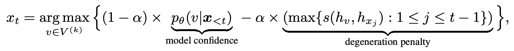
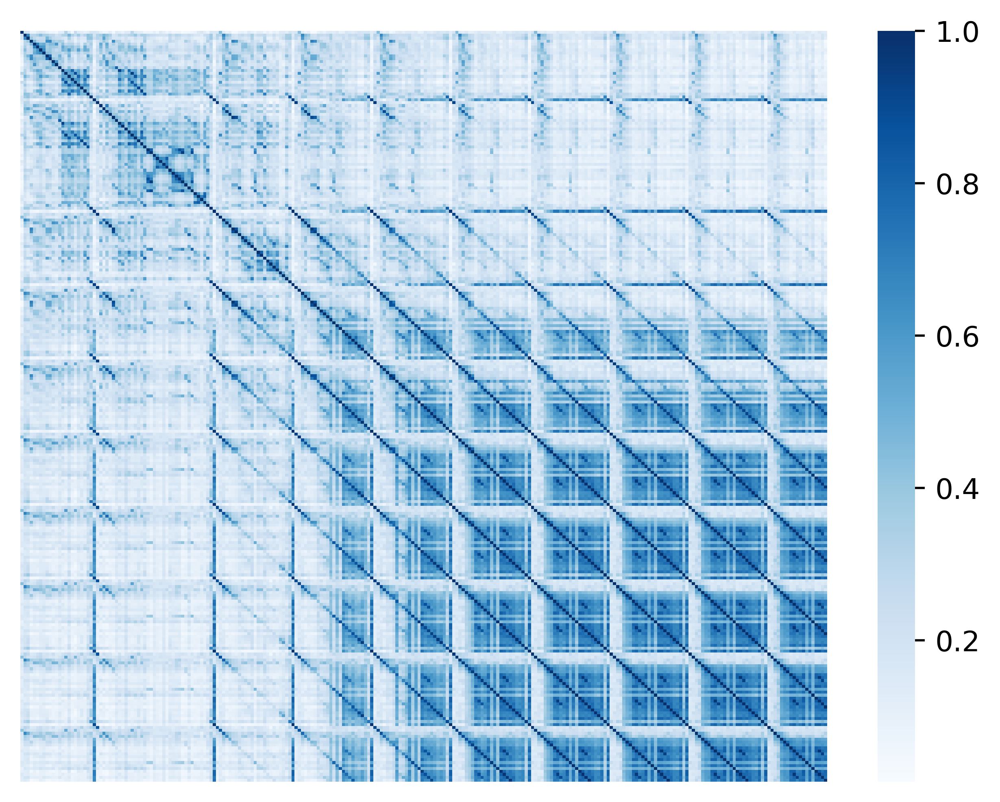
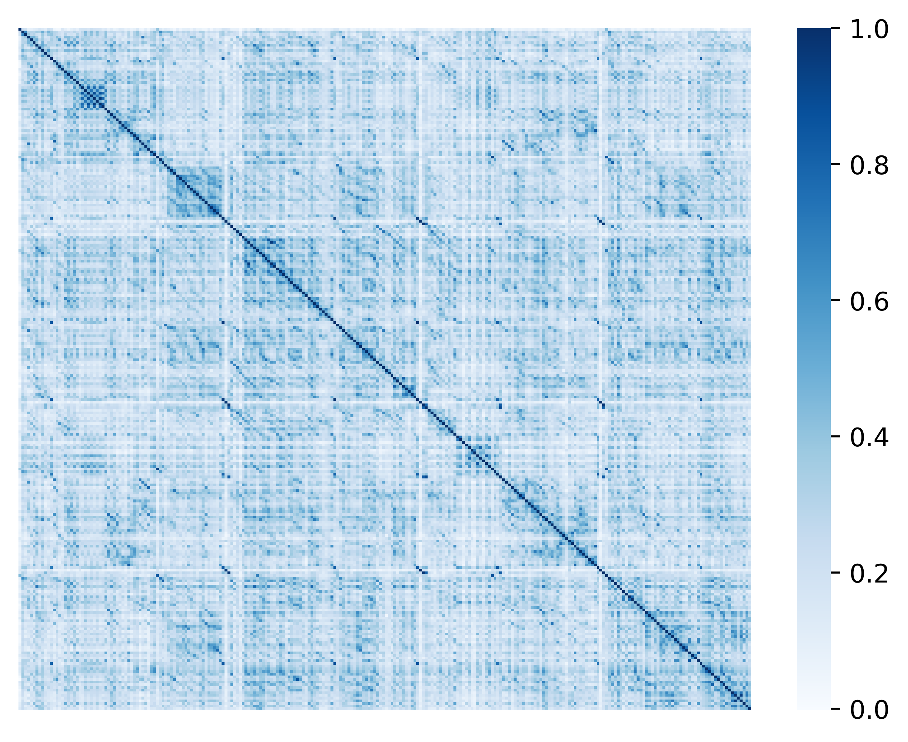

<h1>Generating Human-level Text with Contrastive Search in Transformers 🤗</h1>

<div class="blog-metadata">
    <small>Published September 02, 2022.</small>
    <a target="_blank" class="btn no-underline text-sm mb-5 font-sans" href="https://github.com/huggingface/blog/blob/main/decision-transformers-train.md">
        Update on GitHub
    </a>
</div>

<div class="author-card">
    <a href="/GMFTBY"> 
        
        <div class="bfc">
            <code>gmftbyGMFTBY</code>
            <span class="fullname">Tian Lan</span>
        </div>
    </a>
</div>

****

<a target="_blank" href="./notebooks/introducing_contrastive_search.ipynb">
    
</a>

### 1. Introduction: 

Natural language generation (i.e. text generation) is one of the core tasks in natural language processing (NLP). In this blog, we introduce the current state-of-the-art decoding method, i.e. ___Contrastive Search___, for neural text generation. Contrastive search is originally proposed in _"A Contrastive Framework for Neural Text Generation"_ <a href='#references'>[1]</a> ([[Paper]](https://arxiv.org/abs/2202.06417)[[Official Implementation]](https://github.com/yxuansu/SimCTG)) at NeurIPS 2022. Moreover, in this follow-up work, i.e. _"Contrastive Search Is What You Need For Neural Text Generation"_ <a href='#references'>[2]</a> ([[Paper]](https://arxiv.org/abs/2210.14140) [[Official Implementation]](https://github.com/yxuansu/Contrastive_Search_Is_What_You_Need)), the authors further demonstrate that contrastive search is able to generate human-level text using **off-the-shelf** across **16** languages.

**[Remark]** For users who are not familiar with text generation, please refer more details to this [[blog]](https://huggingface.co/blog/how-to-generate). 
****

<span id='demo'/>

### 2. Huggingface Demo of Contrastive Search: 

:hugs: Check out this awesome [[demo]](https://huggingface.co/spaces/joaogante/contrastive_search_generation) which directly compares contrastive search with other popular decoding methods (e.g. beam search, top-k sampling <a href='#references'>[3]</a>, and nucleus sampling <a href='#references'>[4]</a>).

****

<span id='installation'/>

### 3. Environment Installation: 

Before running the experiments in the following sections, please install the update-to-date version of `transformers` as
```yaml
pip install torch
pip install "transformers>=4.24.0"
```

****

<span id='problems_of_decoding_methods'/>

### 4. Problems of Existing Decoding Methods: 

By far, the most widely-used decoding methods can be divided into two categories: (i) deterministic methods and (ii) stochastic methods.


<span id='deterministic_methods'/>

#### 4.1. Deteriminstic Methods:

Deteriminstic methods, e.g. greedy search and beam search, generate text by selecting the text continuation with the highest likelihood as measured by the language model. However, as widely discussed in previous studies <a href='#references'>[3]</a><a href='#references'>[4]</a>, deteriminstic methods often lead to the problem of _model degeneration_, i.e. the generated text is unnatual and contains undesirable repetitions.

Below, let's see an example of generated text from greedy search using GPT-2 model.

```python
import torch
from transformers import AutoTokenizer, GPT2LMHeadModel
tokenizer = AutoTokenizer.from_pretrained('gpt2-large')
input_ids = tokenizer('DeepMind Company is', return_tensors='pt').input_ids
model = GPT2LMHeadModel.from_pretrained('gpt2-large')

output = model.generate(input_ids, max_length=128)
print("Output:\n" + 100 * '-')
print(tokenizer.decode(output[0], skip_special_tokens=True))
print("" + 100 * '-')
```

<details open>
<summary><b>Model Output:</b></summary>
  
```
Output:
----------------------------------------------------------------------------------------------------  
DeepMind Company is a leading AI research company, with a focus on deep learning and deep 
learning-based systems.

The company's research is focused on the development of deep learning-based systems that 
can learn from large amounts of data, and that can be used to solve real-world problems.

DeepMind's research is also used by the UK government to develop new technologies for the 
UK's National Health Service.

DeepMind's research is also used by the UK government to develop new technologies for the 
UK's National Health Service.

DeepMind's research is also used by the UK government to develop new technologies
----------------------------------------------------------------------------------------------------
```
</details>

**[Remark]** From the result generated by greedy search, we can see obvious pattern of repetitions.

<span id='stochastic_methods'/>

#### 4.2. Stochastic Methods:

To address the issues posed by deterministic methods, stochastic methods generate text by introducing randomness during the decoding process. Two widely-used stochastic methods are (i) top-k sampling <a href='#references'>[3]</a> and (ii) nucleus sampling <a href='#references'>[4]</a>.

Below, we illustrate an example of generated text by nucleus sampling (p=0.95) using GPT-2 model.

```python
import torch
from transformers import AutoTokenizer, GPT2LMHeadModel
tokenizer = AutoTokenizer.from_pretrained('gpt2-large')
input_ids = tokenizer('DeepMind Company is', return_tensors='pt').input_ids
model = GPT2LMHeadModel.from_pretrained('gpt2-large')

torch.manual_seed(0.)
output = model.generate(input_ids, do_sample=True, max_length=128, top_p=0.95, top_k=0)
print("Output:\n" + 100 * '-')
print(tokenizer.decode(output[0], skip_special_tokens=True))
print("" + 100 * '-')
```

<details open>
<summary><b>Model Output:</b></summary>
  
```
Output:
----------------------------------------------------------------------------------------------------  
DeepMind Company is a leading provider of AI-based research, development, and delivery of 
AI solutions for security, infrastructure, machine learning, communications, and so on."

'AI is not journalism'

Worse still was the message its researchers hoped would reach the world's media — that it 
was not really research, but rather a get-rich-quick scheme to profit from living forces' 
ignorance.

"The thing is, we know that people don't consciously assess the value of the others' 
information. They understand they will get the same on their own."

One example? Given the details of today
----------------------------------------------------------------------------------------------------
```
</details>

**[Remark]** While nucleus sampling is able to generate text that is free of repetitions, the semantic coherence of the generated text is not well-maintained. For instance, the generated phrase _'AI is not journalism'_ is incoherent with respect to the given prefix, i.e. _'DeepMind Company'_.

****

<span id='contrastive_search'/>

### 5. Contrastive Search: 

In section, we introduce the new decoding method, i.e. ___Contrastive Search___, in details.

<span id='contrastive_objective'/>

#### 5.1. Decoding Objective:

Given the prefix text $x_{\textless t}$, the selection of the output token $x_{t}$ follows 

<center class="half">
    
</center>

where $V^{(k)}$ is the set of top-k predictions from the language model's probability distribution $p_{\theta}(v|x_{\textless t})$. The first term, i.e. _model confidence_, is the probability of the candidate $v$ predicted by the language model. The second term, _degeneration penalty_, measures how discriminative of $v$ with respect to the previous context $x_{\textless t}$ and the function $s(\cdot, \cdot)$ computes the cosine similarity between the token representations. More specifically, the degeneration penalty is defined as the maximum cosine similarity between the token representation of $v$, i.e. $h_{v}$, and that of all tokens in the context $x_{\textless t}$. Here, the candidate representation $h_{v}$ is computed by the language model given the concatenation of $x_{\textless t}$ and $v$. Intuitively, a larger degeneration penalty of $v$ means it is more similar (in the representation space) to the context, therefore more likely leading to the problem of model degeneration. The hyperparameter $\alpha$ regulates the importance of these two components. When $\alpha=0$, contrastive search degenerates to the vanilla greedy search.

**[Remark]** When generating output, contrastive search jointly considers (i) the probability predicted by the language model, to maintain the semantic coherence between the generated text and the prefix text; and (ii) the similarity with respect to the previous context, to avoid model degeneration.


<span id='contrastive_generation'/>

#### 5.2. Generating Text with Contrastive Search:

Below, we use the same prefix text (i.e. _"DeepMind Company is"_) as in Section <a href='#deterministic_methods'>4.1</a> and <a href='#stochastic_methods'>4.2</a>, and generate the text with contrastive search (k=4 and $\alpha=0.6$). To fully demonstrate the superior capability of contrastive search, we let the language model generate a **long** document with **512** tokens as

```python
import torch
from transformers import GPT2Tokenizer, GPT2LMHeadModel
model_name = 'gpt2-large'
tokenizer = GPT2Tokenizer.from_pretrained(model_name)
model = GPT2LMHeadModel.from_pretrained(model_name, pad_token_id=tokenizer.eos_token_id)
model.eval()

# prepare the prefix
prefix_text = r'DeepMind Company is'
inputs = tokenizer(prefix_text, return_tensors='pt').input_ids

# generate the result with contrastive search
output = model.generate(input_ids, penalty_alpha=0.6, top_k=4, max_length=512)
print("Output:\n" + 100 * '-')
print(tokenizer.decode(output[0], skip_special_tokens=True))
print("" + 100 * '-')
```

The arguments are as follows:
* `--top_k`: The hyperparameter $k$ in contrastive search.
* `--penalty_alpha`: The hyperparameter $\alpha$ in contrastive search.

<details open>
<summary><b>Model Output:</b></summary>
  
```
Output:
----------------------------------------------------------------------------------------------------  
DeepMind Company is a leader in artificial intelligence (AI). We have a long history of working
with companies such as Google, Facebook, Amazon, and Microsoft to build products that improve
people's lives, and today we are excited to announce that DeepMind's AlphaGo program has won the
game of Go, becoming the first program to defeat a professional Go player.

The victory is a testament to the power of deep learning, and to the incredible work of our
research team, which has been at the forefront of AI research for the past five years. AlphaGo
is one of the most advanced Go programs ever created, and its performance is an important step
towards the goal of human-level AI.

"This is the culmination of a decade of hard work," said Andy Ng, co-founder and CTO of DeepMind.
"We are thrilled to have achieved this milestone and look forward to continuing to develop AI that
can be used in a wide range of applications and to help people live better lives."

DeepMind's work on Go began in 2010, when it began to train a neural network to play Go using
millions of games played by top Go players around the world. Since then, the team has refined the
algorithm, adding more and more layers of reinforcement learning to make it better at recognizing
patterns and making decisions based on those patterns. In the past year and a half, the team has
made significant progress in the game, winning a record-tying 13 games in a row to move into the
top four of the world rankings.

"The game of Go is a complex game in which players have to be very careful not to overextend their
territory, and this is something that we have been able to improve over and over again," said
Dr. Demis Hassabis, co-founder and Chief Scientific Officer of DeepMind. "We are very proud of our
team's work, and we hope that it will inspire others to take the next step in their research and
apply the same techniques to other problems."

In addition to the win in Go, DeepMind has also developed an AI system that can learn to play a
number of different games, including poker, Go, and chess. This AI system, called Tarsier, was
developed in partnership with Carnegie Mellon University and the University of California, 
Berkeley, and is being used to teach computer vision and machine learning to identify objects in
images and recognize speech in natural language. Tarsier has been trained to play the game of Go
and other games on a
----------------------------------------------------------------------------------------------------
```
</details>

**[Remark]** We see that the generated text is of exceptionally high quality. The entire document is grammatically fluent as well as semantically coherent. Meanwhile, the generated text also well maintains its factually correctness. For instance, in the first paragraph, it elaborates _"AlphaGo"_ as the _"first program to defeat a professional Go player"_.


<span id='contrastive_visual_demonstration'/>

#### 5.3. Visual Demonstration of Contrastive Search:

To better understand how contrastive search works, we provide visual comparison between greedy search (<a href='#deterministic_methods'>Section 4.1</a>) and contrastive search. Specifically, we visualize the token similarity matrix of the generated text from greedy search and contrastive search, respectively. The similarity between two tokens are defined as the cosine similarity between their token representations (i.e. the hiddent states of the last transformer layer). The results of greedy search (left) and contrastive search (right) are shown in the Figure below.

<center class="half">
    
</center>

**[Remark]** From the result of greedy search, we see high similarities scores in the off-diagonal entries which clearly indicates the generated repetitions by greedy search. On the contrary, in the result of contrastive search, the high similarity scores mostly appear in the diagonal entries which verifies that the degeneration problem is successfully addressed. This nice property of contrastive search is achieved by the introduction of degeneration penalty (see <a href='#contrastive_objective'>Section 5.1</a>) during the decoding process.


****

<span id='more_examples'/>

### 6. More Generated Examples: 

In this section, we provide more generated examples to compare different decoding methods.

<span id='gpt2_example_one'/>

#### 6.1. Example One - GPT-2: 

In this part, we use GPT-2 to generate text with the prefix text from the original [OpenAI blog](https://openai.com/blog/better-language-models/) that releases GPT-2.

> _In a shocking finding, scientist discovered a herd of unicorns living in a remote, previously unexplored valley, in the Andes Mountains. Even more surprising to the researchers was the fact that the unicorns spoke perfect English._


<details open>
<summary><b> Load the language model and prepare the prefix text:</b></summary>

```python
import torch
from transformers import AutoTokenizer, GPT2LMHeadModel
tokenizer = AutoTokenizer.from_pretrained('gpt2-large')
model = GPT2LMHeadModel.from_pretrained('gpt2-large')
prefix_text = r"In a shocking finding, scientist discovered a herd of unicorns living in a remote, previously unexplored valley, in the Andes Mountains. Even more surprising to the researchers was the fact that the unicorns spoke perfect English."
input_ids = tokenizer(prefix_text, return_tensors='pt').input_ids
```
</details>

<span id='gpt2_greedy_example_one'/>

##### 6.1.1. Generating Text with Greedy Search: 

<details>
<summary><b>Code: [click to expand]</b></summary>

```python
output = model.generate(input_ids, max_length=512)
print("Output:\n" + 100 * '-')
print(tokenizer.decode(output[0], skip_special_tokens=True))
print("" + 100 * '-')
```
</details>

<details>
<summary><b>Model Output: [click to expand]</b></summary>

```
Output:
----------------------------------------------------------------------------------------------------  
In a shocking finding, scientist discovered a herd of unicorns living in a remote, previously 
unexplored valley, in the Andes Mountains. Even more surprising to the researchers was the fact 
that the unicorns spoke perfect English.

The researchers, led by Dr. David R. Williams of the University of California, Santa Cruz, 
discovered the unicorns in the Andes Mountains of Peru. The area is known for its unique geology 
and is home to a number of rare species of animals.

The researchers found the unicorns in the Andes Mountains of Peru.

"We were surprised to find that the unicorns were able to communicate with each other," Williams 
said. "We were also surprised to find that they were able to communicate in English."

The researchers believe that the unicorns are descendants of the ancient Incas, who lived in the 
area around 2,000 years ago.

"The Incas were the first people to use the Andes Mountains as a refuge from the harsh climate of 
the Andes," Williams said. "They were also the first people to use the Andes Mountains as a place 
to hunt and gather food."

The researchers believe that the unicorns are descendants of the ancient Incas, who lived in the 
area around 2,000 years ago.

"The Incas were the first people to use the Andes Mountains as a refuge from the harsh climate of 
the Andes," Williams said. "They were also the first people to use the Andes Mountains as a place 
to hunt and gather food."

The researchers believe that the unicorns are descendants of the ancient Incas, who lived in the 
area around 2,000 years ago.

"The Incas were the first people to use the Andes Mountains as a refuge from the harsh climate of
the Andes," Williams said. "They were also the first people to use the Andes Mountains as a place 
to hunt and gather food."

The researchers believe that the unicorns are descendants of the ancient Incas, who lived in the 
area around 2,000 years ago.

"The Incas were the first people to use the Andes Mountains as a refuge from the harsh climate of
the Andes," Williams said. "They were also the first people to use the Andes Mountains as a place
to hunt and gather food."

The researchers believe that the unicorns are descendants of the ancient Incas, who lived in the
area around 2,000 years ago
----------------------------------------------------------------------------------------------------
```
</details>

<span id='gpt2_nucleus_example_one'/>

##### 6.1.2. Generating Text with Nucleus Sampling:

<details>
<summary><b>Code: [click to expand]</b></summary>

```python
torch.manual_seed(0.)
output = model.generate(input_ids, do_sample=True, max_length=512, top_p=0.95, top_k=0)
print("Output:\n" + 100 * '-')
print(tokenizer.decode(output[0], skip_special_tokens=True))
print("" + 100 * '-')
```
</details>


<details>
<summary><b>Model Output: [click to expand]</b></summary>

```
Output:
----------------------------------------------------------------------------------------------------  
In a shocking finding, scientist discovered a herd of unicorns living in a remote, previously 
unexplored valley, in the Andes Mountains. Even more surprising to the researchers was the fact 
that the unicorns spoke perfect English. The study was published in the Journal of Zoology in 
March 2016.

Polygynous mammals such as unicorns have remained largely unknown to science. Professor Gustavo 
Giacota, from the University of Oxford who led the study, said that they had been documented as 
far as Eastern Siberia in Russia, but had only been seen a handful of times in the Gobi Desert.

Tiny animals with pale and shiny coats live in the presence of human beings and are hardly likely 
to be victims of any cruelty. However, there is some evidence of the condition occurring in both 
humans and animals in remote regions, which might have similarities to "black moles" that coexist 
on the skin.

It is thought that Unicorns could be inside themselves, that they have different scents depending 
on their current environment, or just fall out and there are plenty of legends of how they have 
survived. Experts speculate that the moths and other animals could be remnants of the Yezidi Isis 
and Charon, which literally is both the word which means great bird, and the Greek word for sound. 
It is said that the Isis and Charon taught their young the use of voice in the form of calling out 
to others.

The scientists think that it could be ancient folklore that has survived and is no longer attributed 
to a real entity
----------------------------------------------------------------------------------------------------
```
</details>


<span id='gpt2_contrastive_example_one'/>

##### 6.1.3. Generating Text with Contrastive Search:

<details open>
<summary><b>Code:</b></summary>

```python
output = model.generate(input_ids, max_length=512, penalty_alpha=0.6, top_k=4)
print("Output:\n" + 100 * '-')
print(tokenizer.decode(output[0], skip_special_tokens=True))
print("" + 100 * '-')
```
</details>

<details open>
<summary><b>Model Output:</b></summary>

```
Output:
----------------------------------------------------------------------------------------------------  
In a shocking finding, scientist discovered a herd of unicorns living in a remote, previously unexplored
valley, in the Andes Mountains. Even more surprising to the researchers was the fact that the unicorns 
spoke perfect English.

According to the BBC, a team of scientists led by Dr David MacKay, from the University of Bristol, spent 
two years searching for the unicorn herd, which they discovered during a survey of the area.

"It's a very rare find," MacKay told the BBC. "There are a few in the Himalayas, but this is the first 
time we've been able to find one in such a remote area."

The team was surprised to find a herd of unicorns living in a region that has been known to be a hotbed 
of poaching, with many of the animals poached for their horns, which are used in traditional Chinese 
medicine to treat everything from rheumatism to cancer.

"We knew that the area was rich in rhino horn, but we had no idea how many there were, or what they were 
doing there," MacKay said. "This is an area of high poaching pressure, and we wanted to find out what was 
going on."

In order to do so, the team used GPS collars to track the animals as they moved around the mountain and 
the surrounding area. The GPS data was then compared with information gathered from local villagers, who 
had a wealth of information about the animals' movements, including where they were eating, what they were 
doing at night, and how much time they spent in the mountains each day.

After analyzing the data, the team determined that the herd consisted of at least three species of unicorns,
including a male and two females. One of the females was the mother of the male, and the other two were her
daughters. All three had the same horn color, which is believed to be a sign of purity in the animal kingdom.

While the discovery is exciting, it's not the first time scientists have discovered an animal that speaks
English. Last year, scientists discovered a species of porcupine that can be heard by humans, and has been 
dubbed "Porcupine Man" for his ability to converse with the human race.
----------------------------------------------------------------------------------------------------
```
</details>


<span id='opt_example_two'/>

#### 6.2. Example Two - OPT: 

In this part, we use the OPT model <a href='#references'>[5]</a> which is recently released by Meta to generate text by taking the first two sentences from the abstract of the prestigious ResNet paper <a href='#references'>[6]</a>.

> Deeper neural networks are more difficult to train. We present a residual learning framework to ease the training of networks that are substantially deeper than those used previously.


<details open>
<summary><b> Load the language model and prepare the prefix text:</b></summary>

```python
import torch
from transformers import AutoTokenizer, OPTForCausalLM
model_name = r'facebook/opt-1.3b'
tokenizer = AutoTokenizer.from_pretrained(model_name)
model = OPTForCausalLM.from_pretrained(model_name)

prefix_text = r"Deeper neural networks are more difficult to train. We present a residual learning framework to ease the training of networks that are substantially deeper than those used previously."
input_ids = tokenizer(prefix_text, return_tensors='pt').input_ids
```
</details> 


<span id='opt_greedy_example_two'/>

##### 6.2.1. Generating Text with Greedy Search:

<details>
<summary><b>Code: [click to expand]</b></summary>

```python
output = model.generate(input_ids, max_length=256)
print("Output:\n" + 100 * '-')
print(tokenizer.decode(output[0], skip_special_tokens=True))
print("" + 100 * '-')
```
</details>

<details>
<summary><b>Model Output: [click to expand]</b></summary>

```
Output:
----------------------------------------------------------------------------------------------------  
Deeper neural networks are more difficult to train. We present a residual learning framework to ease 
the training of networks that are substantially deeper than those used previously. We show that the 
residual learning framework can be used to train deep neural networks that are significantly more 
difficult to train than those used previously. We also show that the residual learning framework can 
be used to train deep neural networks that are significantly more difficult to train than those used 
previously.

The paper presents a new residual learning framework for deep neural networks that is based on the 
concept of residuals. The residuals are the residuals of the network that are not used in the training 
process. The residuals are computed by taking the residuals of the network that are used in the training 
process and subtracting the residuals of the network that are not used in the training process. The 
residuals are then used to train the network. The residuals are computed by taking the residuals of 
the network that are used in the training process and subtracting the residuals of the network that 
are not used in the training process. The residuals are then used to train the network. The residuals 
are computed by taking the residuals of the network that are used in the training process and 
subtracting the residuals of the
----------------------------------------------------------------------------------------------------
```
</details>


<span id='opt_greedy_example_two'/>

##### 6.2.2. Generating Text with Nucleus Sampling:

<details>
<summary><b>Code: [click to expand]</b></summary>

```python
torch.manual_seed(0.)
output = model.generate(input_ids, do_sample=True, max_length=256, top_p=0.95, top_k=0)
print("Output:\n" + 100 * '-')
print(tokenizer.decode(output[0], skip_special_tokens=True))
print("" + 100 * '-')
```
</details>


<details>
<summary><b>Model Output: [click to expand]</b></summary>

```
Output:
----------------------------------------------------------------------------------------------------  
Deeper neural networks are more difficult to train. We present a residual learning framework to ease the 
training of networks that are substantially deeper than those used previously. The theory focuses on 
several aspects of learning, including the dynamics of replicative and non-replicative aspects of learning. 
This framework emphasizes learning by entropy. New randomized algorithms enable training networks with 
residual learning, so that deep networks can be deployed as reliably and as efficiently as their more 
conventional counterparts.
----------------------------------------------------------------------------------------------------
```
</details>


<span id='opt_contrastive_example_two'/>

##### 6.2.3. Generating Text with Contrastive Search:

<details open>
<summary><b>Code:</b></summary>

```python
output = model.generate(input_ids, max_length=256, penalty_alpha=0.6, top_k=6)
print("Output:\n" + 100 * '-')
print(tokenizer.decode(output[0], skip_special_tokens=True))
print("" + 100 * '-')
```
</details>

<details open>
<summary><b>Model Output:</b></summary>

```
Output:
----------------------------------------------------------------------------------------------------  
Deeper neural networks are more difficult to train. We present a residual learning framework to ease 
the training of networks that are substantially deeper than those used previously.

In this paper, we propose a model-based residual learning (MBRL) framework that is based on neural 
networks trained on data that is sparse in terms of dimensionality (e.g., 1, 2, 3, etc.). The network 
parameters are chosen such that there is a high probability of convergence, i.e., the number of 
iterations is large enough to minimize the variance of the residuals. This is achieved by training 
the network on a set of training data, in which the data is sparse in terms of dimensionality, and 
then discarding the nonparametric part of the data after training is complete.

We show that MBRL outperforms other methods for deep reinforcement learning (RL) and deep convolutional 
neural networks (CNNs) by a factor of at least 2. In addition, we show that, compared to CNNs, MBRL 
performs better in two-dimensional (2D) and three-dimensional (3D) cases.
----------------------------------------------------------------------------------------------------
```
</details>

****

<span id='resources'/>  

### 7. Resources: 

For more details of contrastive search, please check our papers and code as
* **A Contrastive Framework for Neural Text Generation**: (1) [Paper](https://arxiv.org/abs/2202.06417) and (2) [Official Implementation](https://github.com/yxuansu/SimCTG).
* **Contrastive Search Is What You Need For Neural Text Generation**: (1) [Paper](https://arxiv.org/abs/2210.14140) and (2) [Official Implementation](https://github.com/yxuansu/Contrastive_Search_Is_What_You_Need).

****
    
<span id='citation'/>   
 
### 8. Citation: 
    
```bibtex
@inproceedings{su2022a,
   title={A Contrastive Framework for Neural Text Generation},
   author={Yixuan Su and Tian Lan and Yan Wang and Dani Yogatama and Lingpeng Kong and Nigel Collier},
   booktitle={Advances in Neural Information Processing Systems},
   editor={Alice H. Oh and Alekh Agarwal and Danielle Belgrave and Kyunghyun Cho},
   year={2022},
   url={https://openreview.net/forum?id=V88BafmH9Pj}
}
    
@article{su2022contrastiveiswhatyouneed,
  title={Contrastive Search Is What You Need For Neural Text Generation},
  author={Su, Yixuan and Collier, Nigel},
  journal={arXiv preprint arXiv:2210.14140},
  year={2022}
}
```
    


****
    
<span id='references'/>
    
## Reference:
> [1] Su et al., 2022 ["A Contrastive Framework for Neural Text Generation"](https://arxiv.org/abs/2202.06417), NeurIPS 2022

> [2] Su and Collier, 2022 ["Contrastive Search Is What You Need For Neural Text Generation"](https://arxiv.org/abs/2210.14140), Arxiv 2022

> [3] Fan et al., 2018 ["Hierarchical Neural Story Generation"](https://arxiv.org/abs/1805.04833), ACL 2018

> [4] Holtzman et al., 2020 ["The Curious Case of Neural Text Degeneration"](https://arxiv.org/abs/1904.09751), ICLR 2020

> [5] Zhang et al., 2022 ["OPT: Open Pre-trained Transformer Language Models"](https://arxiv.org/abs/2205.01068), Arxiv 2022

> [6] He et al., 2016 ["Deep Residual Learning for Image Recognition"](https://arxiv.org/abs/1512.03385), CVPR 2016

****

*- Written by Yixuan Su and Tian Lan*

****
    


<span id='acknowledgements'/>


## Acknowledgements:

We would like to thank Joao Gante ([@joaogante](https://huggingface.co/joaogante)), Patrick von Platen ([@patrickvonplaten](https://huggingface.co/patrickvonplaten)), and Sylvain Gugger ([@sgugger](https://github.com/sgugger)) for their help and guidance in adding contrastive search mentioned in this blog post into the `transformers` library.


