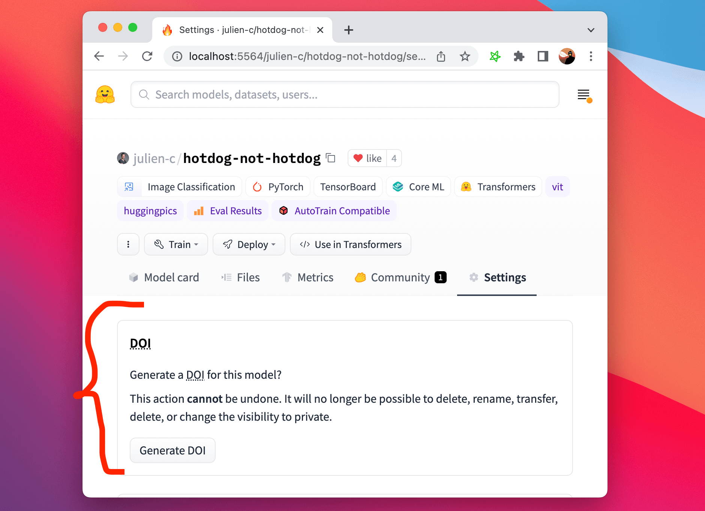
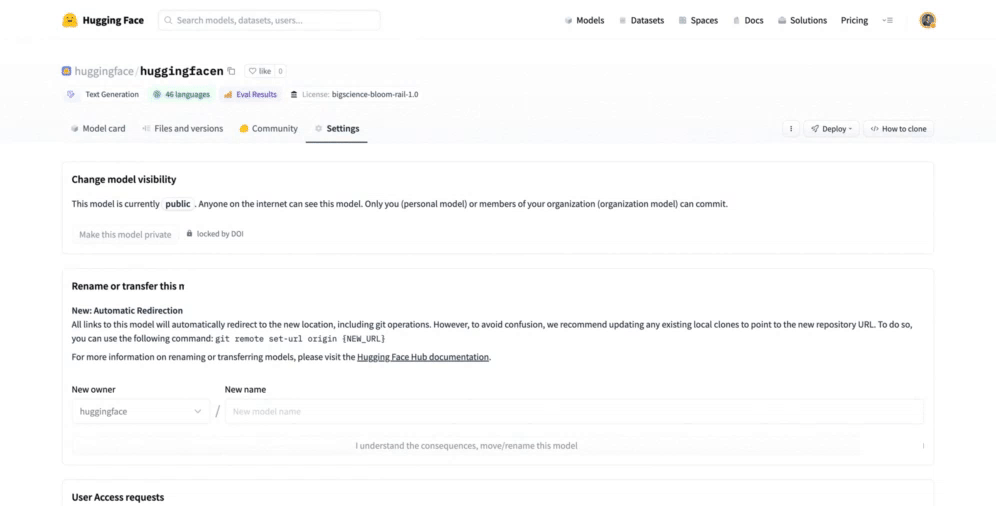
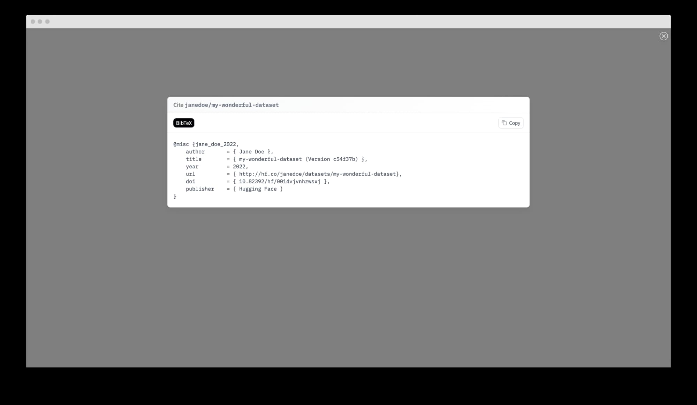

  

# Introducing DOI: the Digital Object Identifier to Datasets and Models

<!-- {blog_metadata} -->
<!-- {authors} -->

Our mission at Hugging Face is to democratize good machine learning. That includes best practices that make ML models and datasets more reproducible, better documented, and easier to use and share.

To solve this challenge, **we're excited to announce that you can now generate a DOI for your model or dataset directly from the Hub**!

DOIs can be generated directly from your repo settings, and anyone will then be able to cite your work by clicking "Cite this model/dataset" on your model or dataset page 🔥.

<kbd>
  
</kbd>

## DOIs in a nutshell and why do they matter?

DOIs (Digital Object Identifiers) are strings uniquely identifying a digital object, anything from articles to figures, including datasets and models. DOIs are tied to object metadata, including the object's URL, version, creation date, description, etc. They are a commonly accepted reference to digital resources across research and academic communities; they are analogous to a book's ISBN.

DOIs make finding information about a model or dataset easier and sharing them with the world via a permanent link that will never expire or change. As such, datasets/models with DOIs are intended to persist perpetually and may only be deleted upon filing a request with our support.

## How are DOIs being assigned by Hugging Face? 

We have partnered with [DataCite](https://datacite.org) to allow registered Hub users to request a DOI for their model or dataset. Once they’ve filled out the necessary metadata, they receive a shiny new DOI 🌟!

<kbd>
  
</kbd>

If ever there’s a new version of a model or dataset, the DOI can easily be updated, and the previous version of the DOI gets outdated. This makes it easy to refer to a specific version of an object, even if it has changed.

Have ideas for more improvements we can make? Many features, just like this, come directly from community feedback. Please drop us a note or tweet us at [@HuggingFace](https://twitter.com/huggingface) to share yours or open an issue on [huggingface/hub-docs](https://github.com/huggingface/hub-docs/issues) 🤗

Thanks DataCite team for this partnership! Thanks also Alix Leroy, Bram Vanroy, Daniel van Strien and Yoshitomo Matsubara for starting and fostering the discussion on [this `hub-docs` GitHub issue](https://github.com/huggingface/hub-docs/issues/25).
