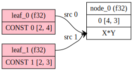

# Introduction to ggml

[ggml](https://github.com/ggerganov/ggml) is a machine learning (ML) library written in C and C++ with a focus on Transformer inference. The project is open-source and is being actively developed by a growing community. ggml is similar to ML libraries such as PyTorch and TensorFlow, though it is still in it's early stages of development and some of it's fundamentals are still changing rapidly.

Over time, ggml has gained popularity alongside other projects like [llama.cpp](https://github.com/ggerganov/llama.cpp) and [whisper.cpp](https://github.com/ggerganov/whisper.cpp). Many other projects also use ggml under the hood to enable on-device LLM, including [ollama](https://github.com/ollama/ollama), [jan](https://github.com/janhq/jan), [LM Studio](https://github.com/lmstudio-ai).

The main reasons people choose to use ggml over other libraries are:

1. **Minimalism**: The core library is self-contained in less than 5 files. While you may want to include additional files for GPU support, it's optional.
2. **Easy compilation**: You don't need fancy build tools. Without GPU support, you only need GCC or Clang!
3. **Lightweight**: The compiled binary size is less than 1MB, which is tiny compared to PyTorch (which usually takes hundreds of MB).
4. **Good compatibility**: It supports many types of hardware, including x86_64, ARM, Apple Silicon, CUDA, etc.
5. **Support for quantized tensors**: Tensors can be quantized to save memory (similar to JPEG compression) and in certain cases to improve performance.
6. **Extremely memory efficient**: This is both an advantage and a disadvantage. Overhead for storing tensors and performing computations is minimal.

However, ggml also comes with some disadvantages that you need to keep in mind when using it (Attention: this list may change in future versions of ggml):
- Not all tensor operations are supported on all backends. For example, some may work on CPU but won't work on CUDA.
- Coding may not be straightforward and may require deep knowledge of low-level programming.
- The project is in active development, so breaking changes are expected.

In this article, we will focus on the fundamentals of ggml for developers looking to get started with the library. It does not cover higher-level tasks such as LLM inference with llama.cpp, which builds upon ggml. Instead, we'll explore the core concepts and basic usage of ggml to provide a solid foundation for further learning and development.

## Getting started

Great, so how do you start?

For simplicity, this guide will show you how to compile ggml on **Ubuntu**. In reality, you can compile ggml on virtually any platform (including Windows, macOS, and BSD).

```sh
# Start by installing build dependencies
# "gdb" is optional, but is recommended
sudo apt install build-essential cmake git gdb

# Then, clone the repository
git clone https://github.com/ggerganov/ggml.git
cd ggml

# Try compiling one of the examples
cmake -B build
cmake --build build --config Release --target simple-ctx

# Run the example
./build/bin/simple-ctx
```

Expected output:

```
mul mat (4 x 3) (transposed result):
[ 60.00 55.00 50.00 110.00
 90.00 54.00 54.00 126.00
 42.00 29.00 28.00 64.00 ]
```

If you see the expected result, that means we're good to go!

## Terminology and concepts

Before diving deep into ggml, we should understand some key concepts. If you're coming from high-level libraries like PyTorch or TensorFlow, these may seem challenging to grasp. However, keep in mind that ggml is a **low-level** library. Understanding these terms can give you much more control over performance:

- [ggml_context](https://github.com/ggerganov/ggml/blob/18703ad600cc68dbdb04d57434c876989a841d12/src/ggml.c#L1792): A "container" that holds objects such as tensors, graphs, and optionally data
- [ggml_cgraph](https://github.com/ggerganov/ggml/blob/18703ad600cc68dbdb04d57434c876989a841d12/include/ggml.h#L652): Represents a computational graph. Think of it as the "order of computation" that will be transferred to the backend.
- [ggml_backend](https://github.com/ggerganov/ggml/blob/18703ad600cc68dbdb04d57434c876989a841d12/src/ggml-backend-impl.h#L80): Represents an interface for executing computation graphs. There are many types of backends: CPU (default), CUDA, Metal (Apple Silicon), Vulkan, RPC, etc.
- [ggml_backend_buffer_type](https://github.com/ggerganov/ggml/blob/18703ad600cc68dbdb04d57434c876989a841d12/src/ggml-backend-impl.h#L18): Represents a buffer type. Think of it as a "memory allocator" connected to each `ggml_backend`. For example, if you want to perform calculations on a GPU, you need to allocate memory on the GPU via `buffer_type` (usually abbreviated as `buft`).
- [ggml_backend_buffer](https://github.com/ggerganov/ggml/blob/18703ad600cc68dbdb04d57434c876989a841d12/src/ggml-backend-impl.h#L52): Represents a buffer allocated by `buffer_type`. Remember: a buffer can hold the data of multiple tensors.
- [ggml_gallocr](https://github.com/ggerganov/ggml/blob/18703ad600cc68dbdb04d57434c876989a841d12/src/ggml-alloc.c#L354): Represents a memory allocator, used by `ggml_cgraph` to dynamically allocate memory for computation.
- [ggml_backend_sched](https://github.com/ggerganov/ggml/blob/18703ad600cc68dbdb04d57434c876989a841d12/src/ggml-backend.c#L1048): A backend scheduler that allows using multiple backends simultaneously. For example, if a model is too large, some tensors and operations can be processed on the GPU, while others can be handled by the CPU. This is also useful when working with multiple GPUs.

## Simple example

In this example, we want to create 2 random matrices, multiply them and get the result. Using PyTorch, the code looks like this:

```py
import torch

# Create two random matrices
matrix1 = torch.rand(3, 4)
matrix2 = torch.rand(4, 2)

# Perform matrix multiplication
result = torch.matmul(matrix1, matrix2)
```

With ggml, these steps must be done to achieve the same result:
1. Allocate `ggml_context` to store tensor data
2. Create tensors and set data
3. Create a `ggml_cgraph` for mul_mat operation
4. Run the computation
5. Retrieve results (output tensors)
6. Free memory and exit

**NOTE**: In this example, we will allocate the tensor data **inside** the `ggml_context` for simplicity. In practice, memory should be allocated as a device buffer, as we'll see in the next section.

To get started, let's create a new directory `examples/demo`

```sh
cd ggml # make sure you're in the project root

# create cpp and CMakeLists file
touch examples/demo/demo.cpp
touch examples/demo/CMakeLists.txt
```

The code for this example is based on [simple-ctx.cpp](https://github.com/ggerganov/ggml/blob/6c71d5a071d842118fb04c03c4b15116dff09621/examples/simple/simple-ctx.cpp)

Edit `examples/demo/demo.cpp` with the content below:

```cpp
#include "ggml.h"
#include <string.h>
#include <stdio.h>

int main(void) {
    // initialize data of matrices to perform matrix multiplication
    const int rows_A = 4, cols_A = 2;
    float matrix_A[rows_A * cols_A] = {
        2, 8,
        5, 1,
        4, 2,
        8, 6
    };
    const int rows_B = 3, cols_B = 2;
    float matrix_B[rows_B * cols_B] = {
        10, 5,
        9, 9,
        5, 4
    };

    // 1. Allocate `ggml_context` to store tensor data
    // Calculate the size needed to allocate
    size_t ctx_size = 0;
    ctx_size += rows_A * cols_A * ggml_type_size(GGML_TYPE_F32); // tensor a
    ctx_size += rows_B * cols_B * ggml_type_size(GGML_TYPE_F32); // tensor b
    ctx_size += 2 * ggml_tensor_overhead(), // tensors
    ctx_size += ggml_graph_overhead(); // compute graph
    ctx_size += 1024; // some overhead

    // Allocate `ggml_context` to store tensor data
    struct ggml_init_params params = {
        /*.mem_size   =*/ ctx_size,
        /*.mem_buffer =*/ NULL,
        /*.no_alloc   =*/ false,
    };
    struct ggml_context * ctx = ggml_init(params);

    // 2. Create tensors and set data
    struct ggml_tensor * tensor_a = ggml_new_tensor_2d(ctx, GGML_TYPE_F32, cols_A, rows_A);
    struct ggml_tensor * tensor_b = ggml_new_tensor_2d(ctx, GGML_TYPE_F32, cols_B, rows_B);
    memcpy(tensor_a->data, matrix_A, ggml_nbytes(tensor_a));
    memcpy(tensor_b->data, matrix_B, ggml_nbytes(tensor_b));


    // 3. Create a `ggml_cgraph` for mul_mat operation
    struct ggml_cgraph * gf = ggml_new_graph(ctx);

    // result = a*b^T
    // Pay attention: ggml_mul_mat(A, B) ==> B will be transposed internally
    // the result is transposed
    struct ggml_tensor * result = ggml_mul_mat(ctx, tensor_a, tensor_b);

    // Mark the "result" tensor to be computed
    ggml_build_forward_expand(gf, result);

    // 4. Run the computation
    int n_threads = 1; // Optional: number of threads to perform some operations with multi-threading
    ggml_graph_compute_with_ctx(ctx, gf, n_threads);

    // 5. Retrieve results (output tensors)
    float * result_data = (float *) result->data;
    printf("mul mat (%d x %d) (transposed result):\n[", (int) result->ne[0], (int) result->ne[1]);
    for (int j = 0; j < result->ne[1] /* rows */; j++) {
        if (j > 0) {
            printf("\n");
        }

        for (int i = 0; i < result->ne[0] /* cols */; i++) {
            printf(" %.2f", result_data[j * result->ne[0] + i]);
        }
    }
    printf(" ]\n");

    // 6. Free memory and exit
    ggml_free(ctx);
    return 0;
}
```

For the `examples/demo/CMakeLists.txt`:

```
set(TEST_TARGET demo)
add_executable(${TEST_TARGET} demo)
target_link_libraries(${TEST_TARGET} PRIVATE ggml)
```

Edit the `examples/CMakeLists.txt`, add this line at the end:

```
add_subdirectory(demo)
```

Compile and run it:

```sh
cmake -B build
cmake --build build --config Release --target demo

# Run it
./build/bin/demo
```

Expected result:

```
mul mat (4 x 3) (transposed result):
[ 60.00 55.00 50.00 110.00
 90.00 54.00 54.00 126.00
 42.00 29.00 28.00 64.00 ]
```

## Example with backend

"Backend" in ggml refers to a device that can handle tensor operations. Backend can be CPU, CUDA, Vulkan, etc.

In reality, most programs using ggml will store tensors in a backend, even if the backend is CPU. The advantages of this approach are:
- Developer can re-use the same code for other backend. For example, if the code works with CPU, then you can run it on GPU.
- Tensors for result and intermediate operations are allocated automatically.

When doing a computation or inference with backend, common steps that need to be done are:
1. Initialize `ggml_backend`
2. Allocate `ggml_context` to store tensor metadata (we **don't need** to allocate tensor data right away)
3. Create tensors metadata (only their shapes and data types)
4. Allocate a `ggml_backend_buffer` to store all tensors
5. Copy tensor data from main memory (RAM) to backend buffer
6. Create a `ggml_cgraph` for mul_mat operation
7. Create a `ggml_gallocr` for cgraph computation
8. Optionally: schedule the cgraph using `ggml_backend_sched`
9. Run the computation
10. Retrieve results (output tensors)
11. Free memory and exit

The code for this example is based on [simple-backend.cpp](https://github.com/ggerganov/ggml/blob/6c71d5a071d842118fb04c03c4b15116dff09621/examples/simple/simple-backend.cpp)

```cpp
#include "ggml.h"
#include "ggml-alloc.h"
#include "ggml-backend.h"
#include <string.h>
#include <stdio.h>

int main(void) {
    // initialize data of matrices to perform matrix multiplication
    const int rows_A = 4, cols_A = 2;
    float matrix_A[rows_A * cols_A] = {
        2, 8,
        5, 1,
        4, 2,
        8, 6
    };
    const int rows_B = 3, cols_B = 2;
    float matrix_B[rows_B * cols_B] = {
        10, 5,
        9, 9,
        5, 4
    };

    // 1. Initialize backend
    ggml_backend_t backend = NULL;
#ifdef GGML_USE_CUDA
    fprintf(stderr, "%s: using CUDA backend\n", __func__);
    backend = ggml_backend_cuda_init(0); // init device 0
    if (!backend) {
        fprintf(stderr, "%s: ggml_backend_cuda_init() failed\n", __func__);
    }
#endif
    // if there aren't GPU Backends fallback to CPU backend
    if (!backend) {
        backend = ggml_backend_cpu_init();
    }

    // Calculate the size needed to allocate
    size_t ctx_size = 0;
    ctx_size += 2 * ggml_tensor_overhead(); // tensors
    // no need to allocate anything else!

    // 2. Allocate `ggml_context` to store tensor data
    struct ggml_init_params params = {
        /*.mem_size   =*/ ctx_size,
        /*.mem_buffer =*/ NULL,
        /*.no_alloc   =*/ true, // the tensors will be allocated later by ggml_allocr_alloc_graph()
    };
    struct ggml_context * ctx = ggml_init(params);

    // Create tensors metadata (only there shapes and data type)
    struct ggml_tensor * tensor_a = ggml_new_tensor_2d(ctx, GGML_TYPE_F32, cols_A, rows_A);
    struct ggml_tensor * tensor_b = ggml_new_tensor_2d(ctx, GGML_TYPE_F32, cols_B, rows_B);

    // 4. Allocate a `ggml_backend_buffer` to store all tensors
    ggml_backend_buffer_t buffer = ggml_backend_alloc_ctx_tensors(ctx, backend);

    // 5. Copy tensor data from main memory (RAM) to backend buffer
    ggml_backend_tensor_set(tensor_a, matrix_A, 0, ggml_nbytes(tensor_a));
    ggml_backend_tensor_set(tensor_b, matrix_B, 0, ggml_nbytes(tensor_b));

    // 6. Create a `ggml_cgraph` for mul_mat operation
    struct ggml_cgraph * gf = NULL;
    struct ggml_context * ctx_cgraph = NULL;
    {
        // create a temporally context to build the graph
        struct ggml_init_params params0 = {
            /*.mem_size   =*/ ggml_tensor_overhead()*GGML_DEFAULT_GRAPH_SIZE + ggml_graph_overhead(),
            /*.mem_buffer =*/ NULL,
            /*.no_alloc   =*/ true, // the tensors will be allocated later by ggml_allocr_alloc_graph()
        };
        ctx_cgraph = ggml_init(params0);
        gf = ggml_new_graph(ctx_cgraph);

        // result = a*b^T
        // Pay attention: ggml_mul_mat(A, B) ==> B will be transposed internally
        // the result is transposed
        struct ggml_tensor * result0 = ggml_mul_mat(ctx_cgraph, tensor_a, tensor_b);

        // Mark the "result" tensor to be computed
        ggml_build_forward_expand(gf, result0);
    }

    // 7. Create a `ggml_gallocr` for cgraph computation
    ggml_gallocr_t allocr = ggml_gallocr_new(ggml_backend_get_default_buffer_type(backend));

    // (we skip step 8. Optionally: schedule the cgraph using `ggml_backend_sched`)

    // 9. Run the computation
    int n_threads = 1; // Optional: number of threads to perform some operations with multi-threading
    if (ggml_backend_is_cpu(backend)) {
        ggml_backend_cpu_set_n_threads(backend, n_threads);
    }
    ggml_gallocr_alloc_graph(allocr, gf);
    ggml_backend_graph_compute(backend, gf);

    // 10. Retrieve results (output tensors)
    // in this example, output tensor is always the last tensor in the graph
    struct ggml_tensor * result = gf->nodes[gf->n_nodes - 1];
    float * result_data = new float[ggml_nelements(result)];
    // because the tensor data is stored in device buffer, we need to copy it back to RAM
    ggml_backend_tensor_get(result, result_data, 0, ggml_nbytes(result));
    printf("mul mat (%d x %d) (transposed result):\n[", (int) result->ne[0], (int) result->ne[1]);
    for (int j = 0; j < result->ne[1] /* rows */; j++) {
        if (j > 0) {
            printf("\n");
        }

        for (int i = 0; i < result->ne[0] /* cols */; i++) {
            printf(" %.2f", result_data[j * result->ne[0] + i]);
        }
    }
    printf(" ]\n");

    // 11. Free memory and exit
    delete[] result_data;
    ggml_free(ctx_cgraph);
    ggml_gallocr_free(allocr);
    ggml_free(ctx);
    ggml_backend_buffer_free(buffer);
    ggml_backend_free(backend);
    return 0;
}
```

Compile and run it, you should get the same result as the last example:

```sh
cmake -B build
cmake --build build --config Release --target demo

# Run it
./build/bin/demo
```

Expected result:

```
mul mat (4 x 3) (transposed result):
[ 60.00 55.00 50.00 110.00
 90.00 54.00 54.00 126.00
 42.00 29.00 28.00 64.00 ]
```

## Printing the computational graph

When working with a bigger cgraph, you can print out the graph for debugging.

You can add `ggml_graph_print` to do that:

```cpp
...

// Mark the "result" tensor to be computed
ggml_build_forward_expand(gf, result0);

// Print the cgraph
ggml_graph_print(gf);
```

Run it:

```
=== GRAPH ===
n_nodes = 1
 -   0: [     4,     3,     1]          MUL_MAT  
n_leafs = 2
 -   0: [     2,     4]     NONE           leaf_0
 -   1: [     2,     3]     NONE           leaf_1
========================================
```

Additionally, you can draw the cgraph as graphviz dot format:

```cpp
ggml_graph_dump_dot(gf, NULL, "debug.dot");
```

You can use the `dot` command or this [online website](https://dreampuf.github.io/GraphvizOnline) to render `debug.dot` into a final image:



## Conclusion

In this introductory post, we've covered the basics of ggml, including its key concepts, a simple example, and how to work with backends. This foundation should give you a good starting point for working with ggml in your projects.

In upcoming posts, we'll dive deeper into more advanced topics such as GGUF format, working with different backends, and implementing more complex models using ggml. Stay tuned for more in-depth explorations of this powerful library!
