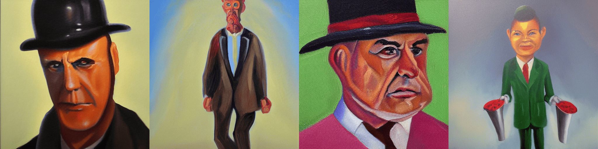
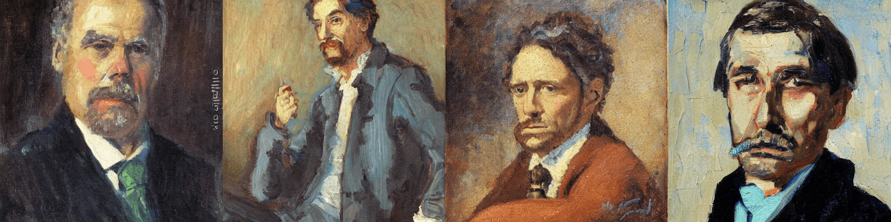
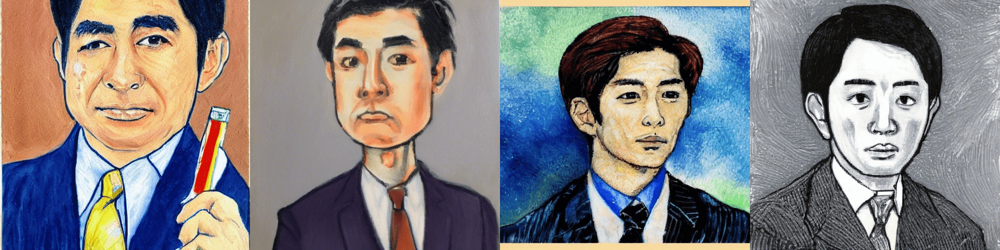

# Japanese Stable Diffusion

<div class="blog-metadata">
    <small>Published October 01, 2022.</small>
    <a target="_blank" class="btn no-underline text-sm mb-5 font-sans" href="https://github.com/huggingface/blog/blob/main/japanese-stable-diffusion.md">
        Update on GitHub
    </a>
</div>

<div class="author-card">
    <a href="/mshing"> 
        
        <div class="bfc">
            <code>mshing</code>
            <span class="fullname">Makoto Shing<sup>*</sup></span>
            <span class="bg-gray-100 dark:bg-gray-700 rounded px-1 text-gray-600 text-sm font-mono">guest</span>
        </div>
    </a>
    <a href="/keisawada"> 
        
        <div class="bfc">
            <code>keisawada</code>
            <span class="fullname">Kei Sawada<sup>*</sup></span>
            <span class="bg-gray-100 dark:bg-gray-700 rounded px-1 text-gray-600 text-sm font-mono">guest</span>
        </div>
    </a>
</div>

<a target="_blank" href="https://colab.research.google.com/github/rinnakk/japanese-stable-diffusion/blob/master/scripts/txt2img.ipynb" target="_parent"></a>

Stable Diffusion, developed by [CompVis](https://github.com/CompVis), [Stability AI](https://stability.ai/), and [LAION](https://laion.ai/), has generated a great deal of interest due to its ability to generate highly accurate images by simply entering text prompts. Stable Diffusion mainly uses the English subset [LAION2B-en](https://huggingface.co/datasets/laion/laion2B-en) of the [LAION-5B](https://laion.ai/blog/laion-5b/) dataset for its training data and, as a result, requires English text prompts to be entered producing images that tend to be more oriented towards Western culture.


[rinna Co., Ltd](https://rinna.co.jp/). has developed a Japanese-specific text-to-image model named "Japanese Stable Diffusion" by fine-tuning Stable Diffusion on Japanese-captioned images. Japanese Stable Diffusion accepts Japanese text prompts and generates images that reflect the culture of the Japanese-speaking world which may be difficult to express through translation.

In this blog, we will discuss the background of the development of Japanese Stable Diffusion and its learning methodology.
Japanese Stable Diffusion is available on Hugging Face and GitHub. The code is based on  [🧨 Diffusers](https://huggingface.co/docs/diffusers/index).

- Hugging Face model card: https://huggingface.co/rinna/japanese-stable-diffusion
- Hugging Face Spaces: https://huggingface.co/spaces/rinna/japanese-stable-diffusion
- GitHub: https://github.com/rinnakk/japanese-stable-diffusion

## Stable Diffusion
Recently diffusion models have been reported to be very effective in artificial synthesis, even more so than GANs (Generative Adversarial Networks) for images. Hugging Face explains how diffusion models work in the following articles:
- [The Annotated Diffusion Model](https://huggingface.co/blog/annotated-diffusion)
- [Getting started with 🧨 Diffusers](https://colab.research.google.com/github/huggingface/notebooks/blob/main/diffusers/diffusers_intro.ipynb)

Generally, a text-to-image model consists of a text encoder that interprets text and a generative model that generates an image from its output.

Stable Diffusion uses CLIP, the language-image pre-training model from OpenAI, as its text encoder and a latent diffusion model, which is an improved version of the diffusion model, as the generative model. Stable Diffusion was trained on mainly the English subset of LAION-5B and can generate high-performance images simply by entering text prompts. In addition to its high-performance, Stable Diffusion is also easy to use with inference running at a computing cost of about 10GB VRAM GPU.

<p align="center">

</p>

*from [Stable Diffusion with 🧨 Diffusers](https://huggingface.co/blog/stable_diffusion)*

## Japanese Stable Diffusion

### Why do we need Japanese Stable Diffusion?

Stable Diffusion is a very powerful text-to-image model not only in terms of quality but also in terms of computational cost. Because Stable Diffusion was trained on an English dataset, it is required to translate non-English prompts to English first. Surprisingly, Stable Diffusion can sometimes generate proper images even when using non-English prompts.

So, why do we need a language-specific Stable Diffusion? The answer is because we want a text-to-image model that can understand Japanese culture, identity, and unique expressions including slang. For example, one of the more common Japanese terms re-interpreted from the English word businessman is "salary man" which we most often imagine as a man wearing a suit. Stable Diffusion cannot understand such Japanese unique words correctly because Japanese is not their target.

<p align="center">

</p>

*"salary man, oil painting" from the original Stable Diffusion*

So, this is why we made a language-specific version of Stable Diffusion. Japanese Stable Diffusion can achieve the following points compared to the original Stable Diffusion.

- Generate Japanese-style images
- Understand Japanese words adapted from English
- Understand Japanese unique onomatope
- Understand Japanese proper noun

### Training Data

We used approximately 100 million images with Japanese captions, including the Japanese subset of [LAION-5B](https://laion.ai/blog/laion-5b/). In addition, to remove noise data, we used [japanese-cloob-vit-b-16](https://huggingface.co/rinna/japanese-cloob-vit-b-16) published by rinna Co., Ltd. as a preprocessing step to remove noise data whose scores were lower than a certain threshold.

### Training Details

The biggest challenge in making a Japanese-specific text-to-image model is the size of the dataset. Non-English datasets are much smaller than English datasets, and this causes performance degradation in deep learning-based models. In fact, the dataset Japanese Stable Diffusion trained on is 1/20th the size of the dataset that Stable Diffusion is trained on. In order to make a good model with such a small dataset, we fine-tuned the powerful [Stable Diffusion](https://huggingface.co/CompVis/stable-diffusion-v1-4) trained on the English dataset, rather than training a text-to-image model from scratch.

To make a good language-specific text-to-image model, we did not simply fine-tune but applied 2 training stages following the idea of [PITI](https://arxiv.org/abs/2205.12952).

#### 1st stage: Train a Japanese-specific text encoder 
In the 1st stage, the latent diffusion model is fixed and we replaced the English text encoder with a Japanese-specific text encoder, which is trained. At this time, our Japanese sentencepiece tokenizer is used as the tokenizer. If the CLIP tokenizer is used as it is, Japanese texts are tokenized bytes, which makes it difficult to learn the token dependency, and the number of tokens becomes unnecessarily large. For example, if we tokenize "サラリーマン 油絵", we get `['ãĤ', 'µ', 'ãĥ©', 'ãĥª', 'ãĥ¼ãĥ', 'ŀ', 'ãĥ³</w>', 'æ', '²', '¹', 'çµ', 'µ</w>']` which are uninterpretable tokens.
```python
from transformers import CLIPTokenizer
tokenizer = CLIPTokenizer.from_pretrained("openai/clip-vit-large-patch14")
text = "サラリーマン 油絵"
tokens = tokenizer(text, add_special_tokens=False)['input_ids']
print("tokens:", tokenizer.convert_ids_to_tokens(tokens))
# tokens: ['ãĤ', 'µ', 'ãĥ©', 'ãĥª', 'ãĥ¼ãĥ', 'ŀ', 'ãĥ³</w>', 'æ', '²', '¹', 'çµ', 'µ</w>']
print("decoded text:", tokenizer.decode(tokens))
# decoded text: サラリーマン 油絵
```

On the other hand, by using our Japanese tokenizer, the prompt is split into interpretable tokens and the number of tokens is reduced. For example, "サラリーマン 油絵" can be tokenized as `['▁', 'サラリーマン', '▁', '油', '絵']`, which is correctly tokenized in Japanese.
```python
from transformers import T5Tokenizer
tokenizer = T5Tokenizer.from_pretrained("rinna/japanese-stable-diffusion", subfolder="tokenizer", use_auth_token=True)
tokenizer.do_lower_case = True
tokens = tokenizer(text, add_special_tokens=False)['input_ids']
print("tokens:", tokenizer.convert_ids_to_tokens(tokens))
# tokens: ['▁', 'サラリーマン', '▁', '油', '絵']
print("decoded text:", tokenizer.decode(tokens))
# decoded text: サラリーマン 油絵
```

This stage enables the model to understand Japanese prompts but does not still output Japanese-style images because the latent diffusion model has not been changed at all. In other words, the Japanese word "salary man" can be interpreted as the English word "businessman," but the generated result is a businessman with a Western face, as shown below.

<p align="center">

</p>

*"サラリーマン 油絵", which means exactly "salary man, oil painting", from the 1st-stage Japanese Stable Diffusion*


Therefore, in the 2nd stage, we train to output more Japanese-style images.

#### 2nd stage: Fine-tune the text encoder and the latent diffusion model jointly
In the 2nd stage, we will train both the text encoder and the latent diffusion model to generate Japanese-style images. This stage is important to make the model become a more language-specific model. After this, the model is finally able to generate a businessman with a Japanese face, as shown in the image below.

<p align="center">

</p>

*"サラリーマン 油絵", which means exactly "salary man, oil painting", from the 2nd-stage Japanese Stable Diffusion*

## rinna’s Open Strategy
Numerous research institutes are releasing their research results based on the idea of democratization of AI, aiming for a world where anyone can easily use AI. In particular, recently, pre-trained models with a large number of parameters based on large-scale training data have become the mainstream and there are concerns about a monopoly of high-performance AI by research institutes with computational resources, but fortunately, many pre-trained models have been released and are contributing to the development of AI technology. However, pre-trained models on text often target English, which is the most popular language in the world. For a world in which anyone can easily use AI, we believe that it is desirable to be able to use state-of-the-art AI in languages other than English.

Therefore, rinna Co., Ltd. has released [GPT](https://huggingface.co/rinna/japanese-gpt-1b), [BERT](https://huggingface.co/rinna/japanese-roberta-base), and [CLIP](https://huggingface.co/rinna/japanese-clip-vit-b-16), which are specialized for Japanese, and now have also released [Japanese Stable Diffusion](https://huggingface.co/rinna/japanese-stable-diffusion). By releasing a pre-trained model specialized for Japanese, we hope to make AI that is not biased towards the cultures of the English-speaking world but also incorporates the culture of the Japanese-speaking world. Making it available to everyone will help lead to the democratization of an AI that guarantees Japanese cultural identity.

## What’s Next?
Compared to Stable Diffusion, Japanese Stable Diffusion is not as versatile and still has some accuracy issues. However, through the development and release of Japanese Stable Diffusion, we hope to communicate to the research community the importance and potential of language-specific model development.

rinna Co., Ltd. has released GPT and BERT models for Japanese text, and CLIP, CLOOB, and Japanese Stable Diffusion models for Japanese text and images. We will continue to improve these models and next we will consider releasing models based on self-supervised learning specialized for Japanese speech.
