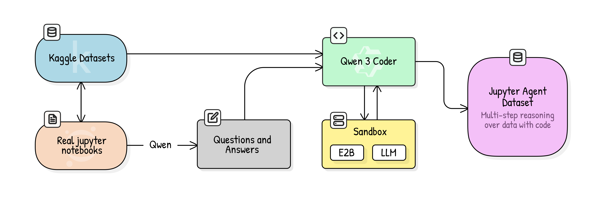
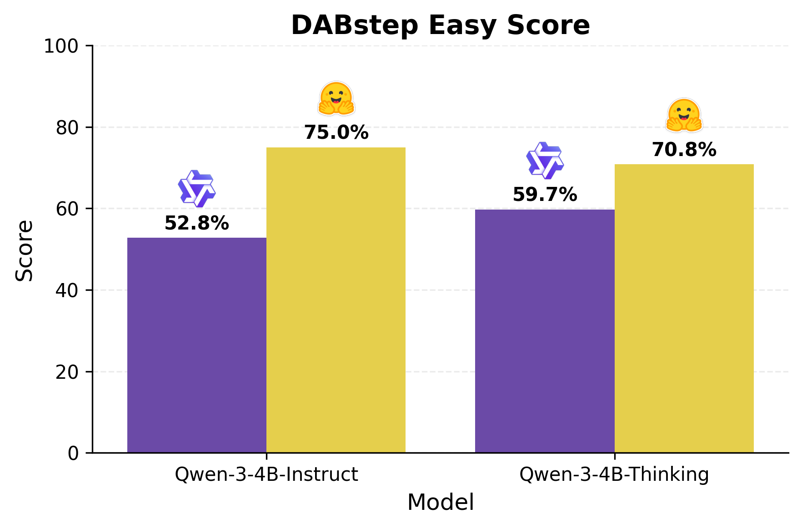
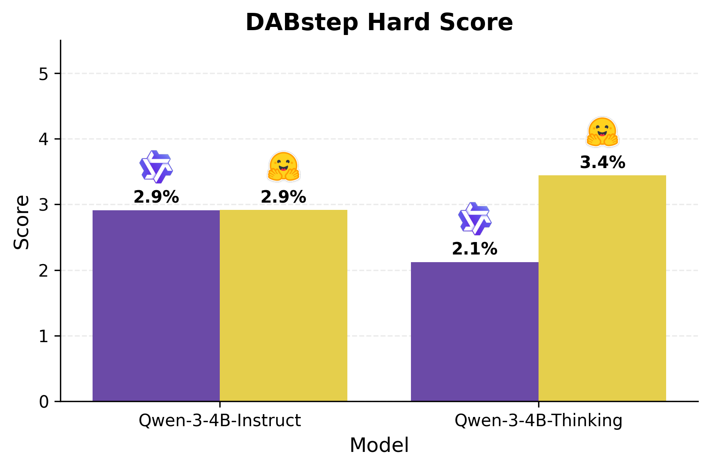

# Creating a Data Science Agent from Scratch

Check out our new demo here: [huggingface.co/spaces/lvwerra/jupyter-agent-2](https://huggingface.co/spaces/lvwerra/jupyter-agent-2).  
This is a follow-up to our earlier work on [jupyter-agent (v1)](https://huggingface.co/spaces/lvwerra/jupyter-agent).

The **Jupyter Agent** is a data science agent that can execute code directly inside a Jupyter notebook. Think of it like *Cursor*, but living natively inside your data science workflow.  
For this demo we use **QwenCoder**, currently one of the strongest coding models.


## 🏁 Primer: the DABStep Benchmark

Last year, in partnership with Adyen, we introduced the **DABStep benchmark**: a way to evaluate data science agents. The setup is simple: provide the LLM with datasets and ask it to answer non-trivial data questions.  

Example tasks:

| Question | Answer |
|----------|---------|
| Which card scheme had the highest average fraud rate in 2023? | SwiftCharge |
| For the year 2023, focusing on the merchant *Crossfit Hanna*, if we incentivize users to switch to a different Authorization Characteristics Indicator, which option would be the most cost-effective? | E:346.49 |

This benchmark remains challenging for today’s LLMs — especially for smaller models.  
You can explore the live leaderboard here: [huggingface.co/spaces/adyen/DABstep](https://huggingface.co/spaces/adyen/DABstep).

---

## 🎯 Our Objective

We set out to **train a small data agent model** that could perform better on DABStep.  

Our first choice was **Qwen-4B**: extremely small (fast to iterate with, easy to run), yet strong enough to act in agentic scenarios.  

Baseline results:  
- *Easy tasks:* **26.6%**  
- *Hard tasks:* **0%**  

Not great — but a promising starting point, since it left a lot of room for improvement.  

---

## 🔧 Primer on Scaffolding

DABStep uses [smolagents](https://github.com/huggingface/smolagents) to execute code. Smolagents comes with predefined behaviors, prompting structures, and expected formats.  

We also studied the **Qwen-Agent** codebase, where the authors recommend tailoring scaffolding to the model. This makes sense: Claude Code, for example, works shockingly well with Claude Sonnet because their scaffolding is aligned.  

So, we restructured our scaffolding:  
- Stripped it down to ~200 lines of code.  
- No external dependencies.  
- Inspired by the spirit of [**tiny-agents**](https://huggingface.co/blog/tiny-agents).  

👉 Check it out here: [utils.py](https://huggingface.co/spaces/lvwerra/jupyter-agent-2/blob/main/utils.py).

**Results:** accuracy jumped from **26.6% → 66% (easy split)**. 🚀  

**Our loop:**  
- While loop with two tools: *code execution* and *final_answer*.  
- We differ from Qwen-Agent by explicitly adding a **final_answer** tool — which improved performance.  

Interestingly, this trend also shows up on the [Gaia benchmark](https://h2o.ai/blog/2024/h2o-ai-tops-gaia-leaderboard/): top models succeed with minimal scaffolding. This is the bitter lesson at play here, showing that moving complexity into the model is the way to go instead of doing handcrafted scaffolding heuristics that quickly become obsolete with each new model release.


## ⚙️ Training Pipeline

With simplified scaffolding in place, we focused on fine-tuning Qwen-4B for **data science agentic tasks**.  

**Datasets:**  
- **Kaggle Notebooks dataset**: ~2TB of notebooks.  
- Rich metadata for each notebook (authors, datasets used, etc.).  


## ⚙️ Processing Pipeline

We designed a multi-stage pipeline using [Datatrove](https://github.com/huggingface/datatrove) to clean and prepare Kaggle notebooks at scale.  



Here’s how each step worked:

### 1. Large-scale deduplication
We started with ~2TB of Kaggle notebooks and reduced it to ~250GB reusing our work from the BigScience project.  
Most Kaggle notebooks are small variations or near-identical copies, so this step was essential.  
*Key insight:* ~90% of raw notebooks are duplicates, which would have skewed training if left unfiltered.

### 2. Downloading linked datasets
Notebooks usually reference external datasets through Kaggle metadata.  
We built a pipeline to automatically fetch these datasets, ensuring the code inside notebooks could actually run. The goal was to later train the model on actual code execution.

### 3. Edu scoring
We scored notebooks based on educational quality using Qwen-32B. We saw that using the whole notebook was not optimal, as many contained trivial or broken code.  
This is similar to the insight from the [*BeyondWeb* paper](https://huggingface.co/papers/2508.10975), which showed that using high-quality data is better for synthetic data generation — a step we relied on for QA (Question-Answer) generation.  
This helped the model learn from “high quality” notebooks instead of noisy ones.

### 4. Filtering irrelevant notebooks
We excluded notebooks about training LLMs or unrelated to data analysis.  
We also removed notebooks that didn’t actually use datasets (detected via an LLM filter).  
This ensured we trained only on relevant data science tasks.

### 5. QA generation
From the cleaned notebooks, we generated question–answer pairs using [Qwen-3-32B](https://huggingface.co/Qwen/Qwen3-32B).  
**Prompt design:** we asked the LLM to produce natural questions that could realistically be asked of the dataset, then validated whether the notebook provided a correct answer.  

*Challenge:* We had to try many prompts to get higher-difficulty questions because LLMs tended to generate trivial ones like "what is the size of the dataset".  
*Insight:* We broke this into two steps because LLMs tended to hallucinate answers:  
1. Generate the question and answer.  
2. Ask another LLM (with access to the notebook) to check whether the answer was correct. 

### 6. Trace generation
We executed the notebooks to generate reasoning traces.  
We have prompted [Qwen-3-Coder-480B](https://huggingface.co/Qwen/Qwen3-Coder-480B-A35B-Instruct) model to generate a jupyter notebook code to answer the question from the previously generated synthetic QA pair. 
Traces captured step-by-step code execution, including intermediate outputs, which are crucial for agent training.  

We used [E2B](https://e2b.dev/) for our agent to solve the synthetic QA pairs, which required fetching Kaggle datasets so the code could actually run via E2B.  

*Challenge 1:* Many datasets were unavailable.  
*Trick:* Since LLMs are strong at code and have a decent world model, we prompted them to **act as a code interpreter** when the dataset was missing.  

Beginning of the prompt:
```
You are a stateful Python code interpreter that executes code in a persistent environment. Your role is to execute Python code while maintaining state across multiple code cells, similar to a Jupyter notebook environment.
[REST OF THE PROMPT]
```

*Challenge 2:* Qwen-Coder model does not support thinking mode - how can we extract code commentary? Qwen-Coder is trained to generate code and not text output!  
*Trick:* When switching from Qwen-3 to Qwen-3-Coder we noticed that often output message content was empty. This turns out to be a previously known quirk of Qwen-Coder models in which when using tool calling the model would not return an empty assistant response. We enforce some text commentary through tooling by passing 'comment' as a required field in the code execution tool call. This way when non-reasoning model is used for code cell generation it will by default output some description of its actionns from 1st POV, emulating the thinking traces structure.

**Note:** the generated final answer in the notebook may vary from the answer specified in the QA pair. This is caused by the fact that the agent model could use data preprocessing methods and steps different from the original Kaggle notebook and the synthetic question would not usually specify them. This discrepancy is normal and lays foundation for a new exciting research direction of how language models tend to treat data analysis and whether they do it differently from humans. For full transparency we keep both LLM-generated final answer and original answer from the real Kaggle notebook as a signal of model's performance.

### 7. Final curation
We truncated overly long outputs and filtered out trivial traces to prevent content length issues and keep only high-quality traces.  
We kept non-trivial, multi-turn traces aligned with DABStep-style tasks.  
The resulting dataset became the foundation for SFT on Qwen3-4B models with 51k synthetic notebooks and almost 2B tokens.


## 🏃‍♂️ Training Pipeline (Highlights)

Some training steps were particularly interesting:  

- For trace generation, we used LLMs to generate QA pairs, which gave us a **verifiable environment**.  
- Finally, we fine-tuned **Qwen-4B** with [TRL](https://huggingface.co/docs/trl).  
  - Used `assistant_loss_only=True` → small performance boost.
  - Added netfune noise for full-parameter multi-epoch training → avoids overfitting.  

**Challenges:**  
- Prompting models for tool calling is tricky: not all prompts deliver the same performance ([Qwen docs](https://qwen.readthedocs.io/en/latest/framework/function_call.html#vllm)).  
- We had to manually test each one to find what worked best.  
- There’s no standardization in response formats for tool calling, making it difficult to switch between models.  
- Native Qwen's generation prompt is not adapted to `assistant_loss_only=True` training mode in TRL which requires to have generation tokens by default. Thus, we adapt the original chat templates by wrapping the assistant response part in the generation tags.
- Training thinking models on short reasoning texts may disrupt model capabilities → full-parameter training works better comparing to PEFT in this case. 


## 📊 Results

**Qwen-3-4B**
- **Easy accuracy:** 72% (baseline: 26.6%)  
- **Hard accuracy:** 5% (baseline: 0%)  

We further compare other trained models with implemented scaffolding like Qwen-3-4B-Thinking-2507 and Qwen-3-4B-Instruct-2507 to define the pure impact of our training dataset:

**Qwen-3-4B-Thinking-2507**
- **Easy accuracy:** 72% (baseline: 26.6%)  
- **Hard accuracy:** 5% (baseline: 0%)  

**Qwen-3-4B-Instruct-2507**
- **Easy accuracy:** 72% (baseline: 26.6%)  
- **Hard accuracy:** 5% (baseline: 0%) 

In summary, we can see up to 22% boost on DABStep easy score:



We can also see, that the hard score can increase too even though our dataset is focused on easier questions:



This makes Qwen-4B (with our pipeline + scaffolding) a state-of-the-art small-model agent on DABStep.

In practice, the model can now solve a wide range of realistic Kaggle-style data analysis tasks with consistent execution.  
It’s not yet strong enough for the hardest queries, but we’ve shown that even small models can become powerful agents when paired with the right data and scaffolding.


## 🔮 Next Steps

- *Harder tasks:* Generate more challenging, multi-step questions that better reflect real-world analysis.  
- *Scaling up:* Train on larger volumes of curated traces to push beyond the current 5% performance on the hard split.  
- *Distillation:* Investigate knowledge distillation, which has shown strong results for improving small models.  
- *Reinforcement Learning (RL):* Build an RL environment, which has been shown to achieve state-of-the-art performance on agentic tasks. Since our QA setup already provides a verifiable environment, we could leverage it directly for RL training.

Maybe this will lead to… **Jupyter-Agent 3.** 😉  