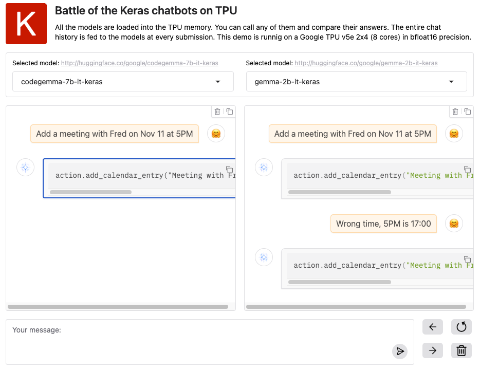

# How good are LLMs at fixing their mistakes?
## A chatbot arena experiment with Keras and TPUs

**<center>👉 You can play with the Keras chatbot arena<br/>while you read. [Click here](https://huggingface.co/spaces/huggingface/keras-chatbot-arena) to open it in a new tab. 👈</center>**

**Table of contents**<br/>
&nbsp;&nbsp;&nbsp;[1. Introduction](#1-introduction)<br/>
&nbsp;&nbsp;&nbsp;[2. The experiment](#2-the-experiment)<br/>
&nbsp;&nbsp;&nbsp;[3. Keras chatbot arena tech: Spaces, Gradio, TPUs, JAX and Keras](#3-keras-chatbot-arena-tech-spaces-gradio-tpus-jax-and-keras)<br/>
&nbsp;&nbsp;&nbsp;&nbsp;&nbsp;&nbsp;[3.1 Why TPUs?](#31-why-tpus)<br/>
&nbsp;&nbsp;&nbsp;&nbsp;&nbsp;&nbsp;[3.2 Why JAX and Keras?](#32-why-jax-and-keras)<br/>
&nbsp;&nbsp;&nbsp;&nbsp;&nbsp;&nbsp;[3.3 Sharding Models?](#33-sharding-models)<br/>
&nbsp;&nbsp;&nbsp;&nbsp;&nbsp;&nbsp;[3.4 Which models?](#34-which-models)<br/>
&nbsp;&nbsp;&nbsp;[4. Results](#4-results)<br/>
&nbsp;&nbsp;&nbsp;&nbsp;&nbsp;&nbsp;[4.1 Reliability](#41-reliability)<br/>
&nbsp;&nbsp;&nbsp;&nbsp;&nbsp;&nbsp;[4.2 The complete chat - fixing mistakes](#42-the-complete-chat---fixing-mistakes)<br/>
&nbsp;&nbsp;&nbsp;&nbsp;&nbsp;&nbsp;[4.3 More mistake fixing](#43-more-mistake-fixing)<br/>
&nbsp;&nbsp;&nbsp;[5. Recap](#5-recap)<br/>


## 1. Introduction

I'm not interested in having LLMs solve big problems, quite the opposite. I want them to dispatch drudgery, and if they don't get it right
on the first try, a short English sentence should be enough to fix it. In short, I want an assistant, like the
[computers](https://en.wikipedia.org/wiki/HAL_9000) in old sci-fi movies, minus the "[I'm sorry Dave, I'm afraid I can't do that](https://youtu.be/ARJ8cAGm6JE?si=LnI39hH7EhiXunw6)" bit 😅.

[This paper](https://arxiv.org/abs/2411.03562) explores such a tool for coding. Setting aside the creative title claim (No, [AI is not
beating Kaggle gandmasters](https://x.com/martin_gorner/status/1857042235524632894) yet), what the paper authors did was to
manually break various Kaggle problems into micro-tasks, have an LLM generate code for them and iterate until unit tests pass. An example micro-task could be,
for an image classification problem, to "figure out the format of the input data and reformat it into a CSV with columns 'id', 'image_filename' and 'class'".

I like that approach because that's how I would like to work on my projects with AI in the future. Have AI generate the boring pieces of code, like data reformatting,
so I can focus on the interesting bits: correctly framing the problem and devising the steps that will lead to a solution.

But this interactive coding assistant must be able to listen to feedback in plain English and fix mistakes in its code. With LLM's ability to infer information
from knowledge and context, this could be a very efficient computer interface. But if LLM's quirks like hallucinations or lack of formal logic get in the way, we could end up
with a case of "artificial stupidity" rather than AI.

So I decided to run a little test with today's LLMs. A super-simplified one, to see how effectively LLMs fix their mistakes when you point them out to them.

## 2. The experiment

Here is the scenario:

System prompt:
>You are a helpful vocal assistant on a mobile device. Your job is to translate user requests into API calls using this Python API:
>```
>action.add_calendar_entry(title, date="YYYY-MM-DD", time="HH:MM", duration=m) # duration in minutes
>action.remove_calendar_entry(title, date, time)
>```
>You can use 30 minutes as the default duration for new events. Respond to every request with a single line of executable code.

| Dialog prompts | Expected output |
|:---|:---|
|**Add a meeting with Fred on Nov 11 at 5PM**|`action.add_calendar_entry("Meeting with Fred", date="2023-11-11", time="17:00", duration=30)`|
|**The current year is 2024.**|`action.add_calendar_entry("Meeting with Fred", date="2024-11-11", time="17:00", duration=30)`|
|**I'm going to a rock concert in the evening of<br/>the same day at 8pm. Add a calendar entry for that.**|`action.add_calendar_entry("Rock Concert", date="2024-11-11", time="20:00", duration=30)`|
|**Set the duration to 3 hours.**|`action.add_calendar_entry("Rock Concert", date="2024-11-11", time="20:00", duration=60*3)`|
|**Add a meeting with Paul on the next day at 8am. 1/2h.**|`action.add_calendar_entry("Meeting with Paul", date="2024-11-12", time="08:00", duration=30)`|
|**Cancel the meeting with Fred.**|`action.remove_calendar_entry("Meeting with Fred", "2024-11-11", "17:00")`|

That's it. Very simple, but can LLMs handle this? And when they make a mistake, can you simply tell them what it is and expect a fix?

To test this, I needed an environment to quickly interact with multiple chatbots at once, here is how I set it up.

## 3. Keras chatbot arena tech: Spaces, Gradio, TPUs, JAX and Keras

To experiment with this scenario, I wanted to be able to conduct two conversations at once, with different LLMs,
and pause one side while asking another to fix a mistake in its output. Here is what it looks like.
It is built with Gradio on Spaces and uses Keras, JAX and TPUs:

[](https://huggingface.co/spaces/huggingface/keras-chatbot-arena)

A couple of notes on how this was built before we go back to the serious matter of chit-chatting with LLMs.

### 3.1 Why TPUs?

For their fast inference and large memory. A [TPU v5e 2x4](https://cloud.google.com/tpu/docs/v5e) has 8 cores and 16GB of
RAM per core for an aggregate 128GB of memory. With this much memory, we can load multiple LLMs at once, provided we shard
them across all cores, and switch between them at will in the UI. In this experiment, I have been able to load five ∼8B params models (one more would OOM) and three ∼2B models for a total of 7 LLMs in memory at once, in bfloat16 format.

### 3.2 Why JAX and Keras?

JAX is the preferred ML environment for TPUs, thanks to its powerful XLA compiler. Keras, which now runs natively on top of JAX (as well as PyTorch and TensorFlow)
is my favorite modeling environment and it has a nice selection of pretrained LLMs in its sister library KerasHub. It can even load selected non-Keras checkpoints
from Hugging Face, which will be useful for comparisons. I wrote about this previously here: [Llama 3.2 in Keras](https://huggingface.co/blog/keras-llama-32).

### 3.3 Sharding Models?

I also use Keras because it has by far the most user-friendly API for model parallelism. Here, I wanted to load as many models as possible in the TPU memory
at once. For this, the model must be sharded across the memory of all 8 TPU cores. Fortunately most of them come with a default layout map that does exactly that.
For example:
```
layout_map = keras_hub.models.Llama3Backbone.get_layout_map(device_mesh)
```
For the full loading code, and more background info on model parallelism, see my
[earlier post here](https://developers.googleblog.com/en/fine-tuning-gemma-2-with-keras-hugging-face-update/).
You will also find in that post a code snippet for visualizing the shardings actually applied once the model is loaded. Very useful for debugging.
And yes, debugging and a few layout map adjustments [were necessary](https://huggingface.co/spaces/huggingface/keras-chatbot-arena/blob/c16851db4f6aaac90c2d06d8bdb06890a86e24e7/models.py#L34).

### 3.4 Which models?

For this experiment, I chose sub-10B param LLMs, mostly for their practicality as many of them could be loaded
at the same time. But also, what the experiment is testing is fairly simple and should be within reach of these smaller models.
All the models are instruction-tuned so that a dialog is possible. You can see their
[chat templates in the demo's implementation](https://huggingface.co/spaces/huggingface/keras-chatbot-arena/blob/main/chatstate.py).
Feel free to copy-paste the code for your own Keras chatbot needs.
The models are from the Gemma, Llama3, Mistral and Vicuna families. See the result tabes below for a full list.

## 4. Results

### 4.1 Reliability

First, let's first see if our LLMs can answer the first question reliably. The system prompt and first question
"**Add a meeting with Fred on Nov 11 at 5PM**" were repeated five times.

Color code:
 * A <big>✓</big> check mark is awarded if the model produces the expected output, i.e. the API call<br/>`action.add_calendar_entry("Meeting with Fred", date="2023-11-11", time="17:00", duration=30)`
 * A <big>🍄</big> red poisonous mushroom means that the answer was mostly correct but contained a mistake (for ex: wrong date)
 * The <big>🔥</big> dumpster fire means the response was garbage, with no recognizable API call.

|Model|first question only, five attempts|
|:---|:---:|
|<a href="http://huggingface.co/google/gemma-2-instruct-9b-keras">Gemma 2 9B-instr</a>|<big> ✓&nbsp; ✓&nbsp; ✓&nbsp; ✓&nbsp; ✓&nbsp; </big>|
|<a href="http://huggingface.co/meta-llama/Llama-3.1-8B-Instruct">Llama-3.1 8B-instr</a>|<big>✓&nbsp; ✓&nbsp; ✓&nbsp; ✓&nbsp; ✓&nbsp; </big>|
|<a href="http://huggingface.co/meta-llama/Llama-3.2-3B-Instruct">Llama 3.2 3B-instr</a>|<big>✓&nbsp; ✓&nbsp; ✓&nbsp; ✓&nbsp; ✓&nbsp; </big>|
|<a href="http://huggingface.co/meta-llama/Llama-3.2-1B-Instruct">Llama 3.2 1B-instr</a>|<big>🔥 🍄 🔥 🔥 🔥 </big>|
|<a href="http://huggingface.co/google/gemma-2b-it-keras">Gemma2B-instr</a>|<big>🍄 🍄 🍄 🍄 ✓&nbsp; </big>|
|<a href="http://huggingface.co/google/codegemma-7b-it-keras">Codegemma7B-instr</a>|<big>✓&nbsp; ✓&nbsp; ✓&nbsp; ✓&nbsp; ✓&nbsp; </big>|
|<a href="http://huggingface.co/keras/vicuna_1.5_7b_en">vicuna 1.5 7b-instr</a>|<big>✓ 🔥 🔥 ✓&nbsp; 🔥 </big>|
|<a href="http://huggingface.co/keras/mistral_instruct_7b_en">Mistral 7B-instr</a>|<big>✓&nbsp; ✓&nbsp; 🍄 ✓&nbsp; 🍄 </big>|

The good news is that some models got this right every time and all of them managed to answer with an API call (more or less correct) at least once. However, The smaller 1-2B params models
and the older models like Vicuna struggle. They respond badly most of the time.

### 4.2 The complete chat - fixing mistakes

Now, let's run through the full dialog two models at a time. If a model makes a mistake, I attempt to steer it back on track. Let's see if it works.

Color code:
 * A <big>✔︎</big> check mark means a valid API call was produced
 * A <big>🍄</big> red poisonous mushroom is when the model makes a single mistake
 * A <big>🥦</big> green broccoli is given to the model if it can fix the mistake successfully when asked

Shortened prompts are used in the table to save screen space.
The first question is voluntarily imprecise: a month, day and time are given for the meeting, but not the year.
This is to make sure that all models make at least one mistake and get tested on their capacity to fix it.

|Conversation <span style="font-weight:normal">([full transcript](https://docs.google.com/document/d/1Gt9JeFI8B311fN2DVw11KvcczfdSlvr86oHQ7b3lFII/edit?usp=sharing))</span>| <a href="http://huggingface.co/google/gemma-2-instruct-9b-keras">Gemma 2<br/>9B-instr</a> ||Conversation <span style="font-weight:normal">([full transcript](https://docs.google.com/document/d/1yfM_wDBAVnGeCZ0OoKWCUmGAuhXBoklPNgmIOxpAK1U/edit?usp=sharing))</span>| <a href="http://huggingface.co/meta-llama/Llama-3.1-8B-Instruct">Llama-3.1<br/>8B-instr</a> ||Conversation <span style="font-weight:normal">([full transcript](https://docs.google.com/document/d/1NdpG0jj7p-FVWxoYdAUVh7_ji899UlfERQHr3MmXlzQ/edit?usp=sharing))</span>| <a href="https://gemini.google.com">Gemini<br/>online</a> |
| :---                                                          | :----:        |:----:|:---                                                  | :----:        |:---:|:---| :----: |
| **Add a meeting with Fred…**                                  |<big>✔︎ 🍄</big>||**Add a meeting with Fred…**                                |<big>✔︎ 🍄</big>||**Add a meeting with Fred…**                                 |<big>✔︎ 🍄</big>|
| <div style="text-align:right">Current year is 2024</div>      |<big>🥦</big>  ||<div style="text-align:right">Current year is 2024</div>    |<big>🍄</big>  ||<div style="text-align:right">Current year is 2024</div>     |<big>🍄</big>|
|                                                               |               ||<div style="text-align:right">Fix the year in the API…</div>|<big>🥦</big>  ||<div style="text-align:right">Fix the year in the API…</div> |<big>🥦</big>|
| **I'm going to a rock concert…**                              |<big>✔︎</big>   ||**I'm going to a rock concert…**                            |<big>✔︎</big>   ||**I'm going to a rock concert…**                             |<big>✔︎ 🍄</big>|
| **Set the duration to 3 hours**                               |<big>✔︎</big>   ||**Set the duration to 3 hours**                             |<big>✔︎</big>   ||<div style="text-align:right">Duration is required…</div>    |<big>🍄</big>|
| **Add meeting with Paul on next day…**                        |<big>✔︎</big>   ||**Add meeting with Paul on next day…**                      |<big>✔︎</big>   ||<div style="text-align:right">Use the default duration…</div>|<big>🥦</big>|
| **Cancel meeting with Fred**                                  |<big>✔︎</big>   ||**Cancel meeting with Fred**                                |<big>✔︎</big>   ||**Set the duration to 3 hours**                              |<big>✔︎</big>|
|                                                               |               ||                                                            |               ||**Add meeting with Paul on next day…**                       |<big>✔︎ 🍄</big>|
|                                                               |               ||                                                            |               ||<div style="text-align:right">Wrong next day…                |<big>🥦</big>|
|                                                               |               ||                                                            |               ||**Cancel meeting with Fred**                                 |<big>✔︎</big>|

Gemma2 9B and Llama 3.1 8B both succeed. Llama needed one extra "fix it" prompt but managed to get its broccoli <big>🥦</big>.

A run with Google's <a href="https://gemini.google.com">Gemini</a> (online) is given in the third column for comparison. This is a massively larger model than the other two
and surprisingly, it's not the best. It required slightly different prompts because Gemini can actually add entries to your Google Calendar,
so it had to be reminded to "answer with an API call from the provided API" every time. Even so, it made several mistakes and even got the date wrong
on the last prompt. This shows that a massive model is not necessarily better for this task.

Let's move on to the small models: Llama 3.2 3B, Llama 3.2 1B and Gemma 2B.
This exercise seems to be overwhelmingly difficult for these models. New symbols are required here:

 * A <big>🔥🔥</big> dumpster fire for responses with 3 or more mistakes. Attempts at fixing them one by one are useless.
 * The (🍄) red mushroom in parentheses indicates a recurring mistake, the same on every line

And remember that these are the best runs. As seen in the "reliability" section above, some models were able to get past the first questions only once out of five attempts.

|Conversation <span style="font-weight:normal">([full transcript](https://docs.google.com/document/d/1dwl2N8E38b390n9GQctAd7eSenEDPOvawPx0LTGw49A/edit?usp=sharing))</span>| <a href="http://huggingface.co/meta-llama/Llama-3.2-3B-Instruct">Llama 3.2<br/>3b-instr</a></div> ||Conversation <span style="font-weight:normal">([full transcript](https://docs.google.com/document/d/1zZcTVyQ4cwv_ovwif9VEm9ELEf119etv7mKoMwcEgBA/edit?usp=sharing))</span>| <a href="http://huggingface.co/meta-llama/Llama-3.2-1B-Instruct">Llama 3.2<br/>1B-instr</a></div>||Conversation <span style="font-weight:normal">([full transcript](https://docs.google.com/document/d/1WGIgG6XEnd7rigW3qKzyDUhb7Krfgv7PII7SYX4LinI/edit?usp=sharing))</span>|<a href="http://huggingface.co/google/gemma-2b-it-keras">Gemma<br/>2B-instr</a></div>|
| :---                                                         | :----:         | :----: | :----                                           | :----:         |:----:| :----                                                  | :----: |
| **Add a meeting with Fred…**                                 |<big>✔︎ 🍄</big> ||**Add a meeting with Fred…**                             |<big>✔︎ 🍄</big> ||**Add a meeting with Fred…**                                  |<big>✔︎ 🍄</big>|
| <div style="text-align:right">current year is 2024</div> |<big>🥦</big>   ||<div style="text-align:right">Just the API call…</div>   |<big>🥦 🍄</big>||<div style="text-align:right">The time is wrong…</div>        |<big>🥦</big> (🍄)|
| **I'm going to a rock concert…**                             |<big>✔︎</big>    ||<div style="text-align:right">Respect date format…</div> |<big>🥦</big>   ||<div style="text-align:right">Just the API call…</div>        |<big>🥦</big>|
| **Set the duration to 3 hours**                              |<big>✔︎ 🍄</big> ||<div style="text-align:right">Current year is 2024</div> |<big>✔︎</big>    ||<div style="text-align:right">Current year is 2024</div>      |<big>🥦</big> (🍄)|
| <div style="text-align:right">Wrong API call…</div>          |<big>🥦</big>   ||**I'm going to a rock concert…**                         |<big>🔥🔥</big> ||**I'm going to a rock concert…**                              |<big>✔︎ 🍄</big>|
| **Add a meeting with Paul…**                                 |<big>✔︎ 🍄</big> ||<div style="text-align:right">Duration required…</div>   |<big>🥦 🔥</big>||<div style="text-align:right">The time is wrong…</div>        |<big>🥦</big> (🍄)|
| <div style="text-align:right">Respect date format…</div> |<big>🔥🔥</big>     ||<div style="text-align:right">Extra parenthesis…</div>   |<big>🔥🔥</big> ||**Set the duration to 3 hours**                               |<big>✔︎</big> (🍄)|
| **Cancel meeting with Fred**                             |<big>🔥🔥</big> ||**Set the duration to 3 hours**                          |<big>🔥🔥</big> || **Add a meeting with Paul…**                                 |<big>✔︎</big>|
|                                                              |                ||<div style="text-align:right">--giving up--</div>        |                 ||**Cancel meeting with Fred**                              |<big>✔︎ 🍄</big>|
|                                                              |                ||                                                         |                 ||<div style="text-align:right">API requires three params…</div>|<big>🥦</big> (🍄)|

Among the small models, only Gemma 2B manages to finish the dialog albeit with a recurrent mistake (🍄): it could not refrain from being chatty and adding
stuff on top of the requested API calls. Stuff like "Sure, here's the updated code…". It also kept mixing up dates and times. However, it was able to fix the mistakes,
when asked <big>🥦</big>. 

Finally, let's try some older models like Vicuna 1.5 7B and Mistral 7B. They are pitted against Codegemma 7B which should be the ideal model for this task but as you can see, all three models struggle.


|Conversation <span style="font-weight:normal">([full transcript](https://docs.google.com/document/d/16u6RmT3qYdI5BGLSo_2f_OTYFnIyBltErlTQtW-pjzQ/edit?usp=sharing))</span>| <a href="http://huggingface.co/google/codegemma-7b-it-keras">Codegemma<br/>7B-instr</a></div> ||Conversation <span style="font-weight:normal">([full transcript](https://docs.google.com/document/d/1HT99Eg5nPTgBD38yBAC7BXHSBuNukYMYa4iImhSbq0g/edit?usp=sharing))</span>| <a href="http://huggingface.co/keras/vicuna_1.5_7b_en">vicuna 1.5<br/>7b-instr</a></div>||Conversation <span style="font-weight:normal">([full transcript](https://docs.google.com/document/d/1OO5obX_Q-8v2DUIlA6dx2Qx190D5o1zwkxWR1r1JU2s/edit?usp=sharing))</span>|<a href="http://huggingface.co/keras/mistral_instruct_7b_en">Mistral<br/>7B-instr</a></div>|
| :---                                                         | :----:              | :----: | :----                                           | :----:          |:----:| :----                                                | :----: |
|**Add a meeting with Fred…**                                  |<big>✔︎ 🍄</big>      ||**Add a meeting with Fred…**                             |<big>✔︎ 🍄</big> ||**Add a meeting with Fred…**                                 |<big>✔︎ 🍄</big>|
|<div style="text-align:right">current year is 2024</div>      |<big>🥦</big> (🍄)   ||<div style="text-align:right">current year is 2024</div> |<big>🥦</big>   ||<div style="text-align:right">Respect the date format…</div> |<big>🥦 🍄</big>|
|<div style="text-align:right">The year is mistyped…</div>     |(🍄)                 ||**I'm going to a rock concert…**                         |<big>✔︎</big>    ||<div style="text-align:right">Time in 24h format…</div>      |<big>🥦</big>|
|**I'm going to a rock concert…**                              |<big>✔︎</big> (🍄)    ||**Set the duration to 3 hours**                          |<big>🔥🔥</big> ||<div style="text-align:right">Current year is 2024</div>     |<big>🥦 🍄</big>|
|**Set the duration to 3 hours**                               |<big>✔︎</big> (🍄)    ||<div style="text-align:right">Just the API call…</div>   |<big>🔥🔥</big> ||<div style="text-align:right">Just the API call…</div>       |<big>🥦</big>|
|**Add a meeting with Paul…**                                  |<big>✔︎</big> (🍄)    ||**Add a meeting with Paul…**                             |<big>✔︎ 🍄</big> ||**I'm going to a rock concert…**                             |<big>🍄</big>|
|**Cancel meeting with Fred**                                  |<big>✔︎ 🍄</big> (🍄) ||<div style="text-align:right">Just one API call…</div>   |<big>🍄</big>   ||<div style="text-align:right">You don't ned that info…</div> |<big>✔︎ 🥦</big>|
|<div style="text-align:right">API requires three params…</div>|<big>🥦 🍄</big> (🍄)||**Cancel meeting with Fred**                             |<big>✔︎ 🍄</big> ||**Set the duration to 3 hours**                              |<big>✔︎</big>|
|<div style="text-align:right">It's the wrong event now…</div> |<big>🥦</big> (🍄)   ||                                                         |                ||**Add a meeting with Paul…**                                 |<big>✔︎ 🍄</big>|
|                                                              |                     ||                                                         |                ||<div style="text-align:right">Mistake in the year…</div>     |<big>🥦🍄</big>|
|                                                              |                     ||                                                         |                ||**Cancel meeting with Fred**                                 |<big>✔︎</big>|

Codegemma got affected by a sticky recurrent mistake (🍄): it would start spelling the year as "20 24" with a space and would not fix it.
Vicuna 1.5 7B is probably too old. At one point it starts repeating itself <big>🔥🔥</big>, outputting multiple duplicate API calls and other junk.
It gets back on track to some extent but with remaining mistakes. Finally, Mistral makes mistakes everywhere but is also able to fix them. Lots of interactions needed but 6 broccoli <big>🥦</big> earned for fixed mistakes. 

### 4.3 More mistake fixing

Some of these models cruised through the exercise with few mistakes and therefore few chances to fix them and earn a broccoli <big>🥦</big>. Using the [Keras chatbot arena](https://huggingface.co/spaces/huggingface/keras-chatbot-arena) UI, we can run them
on mistakes <big>🍄</big> made by other LLMs and see if they can fix them.

Same color coding as before: green broccoli <big>🥦</big> for correctly fixing the error, red poisonous mushroom <big>🍄</big> if the error is still there,
dumpster fire <big>🔥</big> for multiple errors. The full transcript of the conversations is [here](https://docs.google.com/document/d/1CCOB1NuVXnqN2ofhIGPldGG5MGeznzKebVqwKKB9vk4/edit?usp=sharing).

|Model|Wrong time…<br/>3 attempts|API only…<br/>3 attempts|Wrong API…<br/>3 attempts|
|:---|:---:|:---:|:---:|
|<a href="http://huggingface.co/google/gemma-2-instruct-9b-keras">Gemma 2 9B-instr</a>  |<big>🥦 🥦 🥦</big>|<big>🥦 🥦 🥦</big>|<big>🍄 🍄 🍄 (1)</big>|
|<a href="http://huggingface.co/meta-llama/Llama-3.1-8B-Instruct">Llama-3.1 8B-instr</a>|<big>🥦 🥦 🥦</big>|<big>🥦 🥦 🥦</big>|<big>🥦 🍄 🔥</big>|
|<a href="http://huggingface.co/meta-llama/Llama-3.2-3B-Instruct">Llama 3.2 3B-instr</a>|<big>🥦 🥦 🍄</big>|<big>🍄 🥦 🍄</big>|<big>🍄 🔥 🍄</big>|
|<a href="http://huggingface.co/meta-llama/Llama-3.2-1B-Instruct">Llama 3.2 1B-instr</a>|<big>🔥 🔥 🔥</big>|<big>🥦 🍄 🍄</big>|<big>🔥 🔥 🔥</big>|
|<a href="http://huggingface.co/google/gemma-2b-it-keras">Gemma2B-instr</a>             |<big>🥦 🥦 🥦</big>|<big>🥦 🥦 🥦</big>|<big>🔥 🔥 🔥</big>|
|<a href="http://huggingface.co/google/codegemma-7b-it-keras">Codegemma7B-instr</a>     |<big>🥦 🥦 🥦</big>|<big>🥦 🥦 🥦</big>|<big>🍄 🍄 🍄 (1)</big>|
|<a href="http://huggingface.co/keras/vicuna_1.5_7b_en">vicuna 1.5 7b-instr</a>         |<big>🥦 🔥 🔥</big>|<big>🍄 🥦 🍄</big>|<big>🔥 🔥 🔥</big>|
|<a href="http://huggingface.co/keras/mistral_instruct_7b_en">Mistral 7B-instr</a>      |<big>🥦 🔥 🥦</big>|<big>🥦 🥦 🍄</big>|<big>🍄 🔥 🍄(1)</big>|

(1) recurrent mistake: outputs apology next to correct API call. For Gemma this is reliably fixed by asking for “API call only please”. It works for Llama too but not reliably.

This was a good reality check for the models. Gemma 2 9B and Codegemma 7B get it almost right but keep apologizing for some mistakes instead of outputting a clean API call.
Llama 3.1 8B is a close second but has difficulties fixing a wrong API call reliably. And all the others are a <big>🔥</big> dumpster fire.

## 5. Recap

I did not know what to expect before starting this test. The API the models were playing with is unrealistically simple. Just 2 API calls 'add_calendar_entry'
and 'remove_calendar_entry'. So I thought this might be super easy for the models, and with a little bit of corrective prompting, all of them would ace through
every time. On the other hand, I knew that LLMs are probabilistic inference machines that do not really listen to what you say. Prompts merely change the
probability distribution of the output and some outputs are just hard to get.

The reality is interesting as only one model, Gemma 9B, managed to get through the test almost perfectly. Here is a recap of all the <big>✔︎</big> checks (correct
answer), <big>🥦</big> broccoli (mistake fix), <big>🍄</big> poisonous mushrooms (mistake) and <big>🔥</big> dumpster fires (many mistakes in one answer) the models got
across all tests. This is not the most scientific way of summarizing the results but it gives a pretty good picture:

|Rank|Model|response ratings|
|:---:|:---|:---|
|#1|<a href="http://huggingface.co/google/gemma-2-instruct-9b-keras">Gemma 2 9B-instr</a>  |<big>✔︎✔︎✔︎✔︎✔︎✔︎✔︎✔︎✔︎✔︎🥦🥦🥦🥦🥦🥦🥦🍄🍄🍄🍄</big>|
|#2|<a href="http://huggingface.co/meta-llama/Llama-3.1-8B-Instruct">Llama-3.1 8B-instr</a>|<big>✔︎✔︎✔︎✔︎✔︎✔︎✔︎✔︎✔︎✔︎🥦🥦🥦🥦🥦🥦🥦🥦🍄🍄🍄🔥</big>|
|#3|<a href="http://huggingface.co/google/codegemma-7b-it-keras">Codegemma7B-instr</a>     |<big>✔︎✔︎✔︎✔︎✔︎✔︎✔︎✔︎✔︎✔︎🥦🥦🥦🥦🥦🥦🥦🥦🥦🍄🍄🍄🍄🍄🍄🍄🍄🍄🍄🍄🍄🍄🍄</big>|
|#4|<a href="http://huggingface.co/keras/mistral_instruct_7b_en">Mistral 7B-instr</a>      |<big>✔︎✔︎✔︎✔︎✔︎✔︎✔︎✔︎🥦🥦🥦🥦🥦🥦🥦🥦🥦🥦🍄🍄🍄🍄🍄🍄🍄🍄🍄🍄🍄🔥🔥</big>|
|#5|<a href="http://huggingface.co/google/gemma-2b-it-keras">Gemma2B-instr</a>             |<big>✔︎✔︎✔︎✔︎✔︎✔︎🥦🥦🥦🥦🥦🥦🥦🥦🥦🥦🥦🍄🍄🍄🍄🍄🍄🍄🍄🍄🍄🍄🍄🔥🔥🔥</big>|
|#6|<a href="http://huggingface.co/meta-llama/Llama-3.2-3B-Instruct">Llama 3.2 3B-instr</a>|<big>✔︎✔︎✔︎✔︎✔︎✔︎✔︎✔︎✔︎🥦🥦🥦🥦🥦🍄🍄🍄🍄🍄🍄🍄🍄🔥🔥🔥🔥🔥</big>|
|#7|<a href="http://huggingface.co/keras/vicuna_1.5_7b_en">vicuna 1.5 7b-instr</a>         |<big>✔︎✔︎✔︎✔︎✔︎✔︎🥦🥦🥦🍄🍄🍄🍄🍄🍄🔥🔥🔥🔥🔥🔥🔥🔥🔥🔥🔥</big>|
|#8|<a href="http://huggingface.co/meta-llama/Llama-3.2-1B-Instruct">Llama 3.2 1B-instr</a>|<big>✔︎✔︎🥦🥦🥦🥦🍄🍄🍄🍄🍄🔥🔥🔥🔥🔥🔥🔥🔥🔥🔥🔥🔥🔥🔥🔥🔥🔥</big>|

I have no doubt that some fine-tuning could greatly improve those results. This is left for readers to explore. There is more information on Keras,
including a Keras LLM fine-tuning example in [this blog post](https://huggingface.co/blog/keras-llama-32). Also feel free to clone the [Keras Chatbot Arena](https://huggingface.co/spaces/huggingface/keras-chatbot-arena)
to test your fine-tuned models. Happy 🥦!