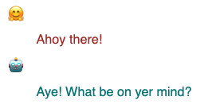

# Llama 3.2 in Keras

This is going to be the shortest blog post ever.

> **Question**: *Llama 3.2 landed two weeks ago on Hugging Face / Transformers. When will it be available in Keras?*

> **Answer**: *It has been working from day 1 😀. There is nothing to wait for.*

Yes, Keras Llama3 can be loaded from any standard (i.e. safetensor) Hugging Face checkpoint, including the 3.2 checkpoints. If a conversion is required, it happens on the fly. Try this:

```Python
!pip install keras_hub

from keras_hub import models.Llama3CausalLM
model = Llama3CausalLM.from_preset("hf://meta-llama/Llama-3.2-1B-Instruct", dtype="bfloat16")
model.generate("Hi there!")
```

### Here is a [Colab](https://drive.google.com/file/d/1cnAUQbDfM8lErQ8MD2x9Mo5sfKIqIxEh/view?usp=sharing) to try this out. Enjoy! 🤗

---

OK, OK, I'm being told that if I want to publish a blog post, I have to fill the space. Here are a couple of additional things to know about Keras.

## Keras is multi-backend

Keras is the time-tested modeling library for JAX, PyTorch and TensorFlow. You might have noticed this line in the [demo Colab](https://colab.research.google.com/drive/1Zz4wTCCYV3BqtFLroNDLqmUhJZJiqpkK?usp=sharing):

```Python
import os
os.environ["KERAS_BACKEND"] = "jax" # or "torch", or "tensorflow"
```

It has to appear before `import keras` and controls if the model is running on JAX, PyTorch or TensorFlow. Very handy to try your favorite models on JAX with XLA compilation 🚀.

## What is keras-hub?

Keras is a modeling library and [keras-hub](https://keras.io/keras_hub/) is its collection of pre-trained models. It was previously called [KerasNLP](https://keras.io/keras_nlp/) and [KerasCV](https://keras.io/keras_cv/). The [rename](https://github.com/keras-team/keras-hub/issues/1831) is in progress. It has all the popular pre-trained models (Llama3, Gemma, StableDiffusion, Segment Anything, ...) with their canonical implementation in Keras.

## LLMs in Keras come "batteries included"

I mean, "tokenizer included". `model.generate()` just works on strings:
```
model.generate("Hi there!")
> "Hi there! I'm looking for information on how to ...
```

Same thing for training. You can train on a set of strings directly:

```
model.fit(strings) # list or dataset of input strings
```

## Chatting with an LLM

Instruction-tuned variants of popular LLMs can be used for turn-by-turn conversations. Here, Llama-3.2-1B-Instruct understands the following conversation tagging (see [meta docs](https://www.llama.com/docs/model-cards-and-prompt-formats/llama3_1/#-instruct-model-prompt-)).

```
<|start_header_id|>system<|end_header_id|>You  are a helpful assistant<|eot_id|>\n
\n
<|start_header_id|>user<|end_header_id|>Hello_<|eot_id|>\n
\n
<|start_header_id|>assistant<|end_header_id|>\n
\n
```
The conversation, once formatted in this way, can be fed directly to `model.generate()`.

For convenience, the [demo Colab](https://colab.research.google.com/drive/1cnAUQbDfM8lErQ8MD2x9Mo5sfKIqIxEh#scrollTo=nsETCgARe9Sz) implements a helper class called `ChatState` that does the necessary string concats automatically.


## Lower level access: Tokenizer, Backbone

If you don't like "batteries included" and want to get to the underlying tokenizer and model, they are easily accessible:

```
# tokenizer
model.preprocessor.tokenizer

# the model itself
model.backbone

# You can even load them separately from the same preset
backbone = keras_hub.models.Llama3CausalLM.from_preset("hf://meta-llama/Llama-3.2-1B-Instruct", dtype="float16")
tokenizer = keras_hub.models.Llama3Tokenizer.from_preset("hf://meta-llama/Llama-3.2-1B-Instruct")
```

## Wait, Tokenizer, Preprocessor? I'm confused

The Tokenizer just transforms text into integer vectors. Here "Hello" translates into a single token:

```
tokenizer("Hello")
> Array([9906], dtype=int32)
```

The Preprocessor is a catch-all concept for doing all the data transformations a model requires. This could be, for example, image resizing or augmentation for tasks involving images, or text tokenization like here for a text model. For the CausalLM task, the preprocessor takes care of three additional details:
* adding the text start and text end tokens expected by the model
* padding the token sequences and generating a mask
* generating "expected outputs" for training and fine-tuning. For CausalLM tasks this is the input string shifted by one.

```
tokens = model.preprocessor("Hello")

tokens[0] # 128000 and 128009 are the start and end text tokens
> {'token_ids': Array([128000,   9906, 128009, 0, 0, 0], dtype=int32), 'padding_mask': Array([True, True, True, False, False, False], dtype=bool)}

tokens[1] # input sequence shifted by one
> [9906, 128009, 0, 0, 0, 0]

# feeding the model manually
model.backbone(model.preprocessor(["Hello", "Hi!"])[0]) # raw logits as output
> [[[ 0.9805   0.1664   0.625   ... -0.834   -0.264    0.05203]
  ...]]

# More typically you would use Keras built-in functions model.generate, model.fit, model.predict, model.evaluate
```

## Keras has a built-in trainer

Just call `model.fit(ds)` on your training dataset. This trainer is compatible with the various [distributed training](https://keras.io/guides/distribution/), [mixed precision](https://keras.io/api/mixed_precision/), [quantization](https://keras.io/examples/keras_recipes/float8_training_and_inference_with_transformer/) or [LoRA/QLoRA](https://keras.io/examples/keras_recipes/parameter_efficient_finetuning_of_gemma_with_lora_and_qlora/) options available in Keras. It's also totally optional. You can write a custom training loop if you want.

For a complete example, see the [demo Colab](https://colab.research.google.com/drive/1cnAUQbDfM8lErQ8MD2x9Mo5sfKIqIxEh#scrollTo=nsETCgARe9Sz) where we fine-tune Llam 3.2 to speak like a pirate:




## You can upload to the Hub

Once you are happy with your fine-tuned model, upload it directly from Keras using:

```
model.save_to_preset("./pirate-llama")
# Use your own repo here
keras_hub.upload_preset(
    uri = "hf://martin-gorner/llama-3.2-1B-pirate-instruct",
    preset = "./pirate-llama")
```

## Distributed model parallelism for inference or training

### Demo Colab for this section: [Llama 3.1 Keras model parallel](https://drive.google.com/file/d/1WzErEM04rieeCMY6s_wGyTjWcuhAF-3D/view?usp=sharing)

Some of you are wondering, why use Keras when one can already work with LLMs on Hugging Face using Transformers? Answer: even if you don't care about Keras flexibility and usability as a modeling framework (you should!), Keras is your quickest path to advanced model parallelism thanks to [JAX](https://github.com/jax-ml/jax) and its powerful [XLA](https://github.com/openxla/xla) compiler.

Let's pick an 8B parameters model to demonstrate: meta-llama/Llama-3.1-8B-Instruct ([demo Colab here](https://drive.google.com/file/d/1WzErEM04rieeCMY6s_wGyTjWcuhAF-3D/view?usp=sharing)). Without quantization, this model is too large for any single accelerator. With Keras, you can load it on multiple accelerators, GPU or TPU. If you are uncertain about the "correct" weight sharding, most models provide sensible defaults. Here, call `keras_hub.models.Llama3Backbone.get_layout_map(device_mesh)`:

```
devices = keras.distribution.list_devices() # 8 TPU cores: let's do a 2x4 mesh
device_mesh = keras.distribution.DeviceMesh((2, 4), ["batch", "model"], devices)
layout_map = keras_hub.models.Llama3Backbone.get_layout_map(device_mesh) # defaults
distrib = keras.distribution.ModelParallel(layout_map=layout_map, batch_dim_name="batch")
keras.distribution.set_distribution(distrib)

# Now load the model, distributed across the accelerators
model = keras_hub.models.Llama3CausalLM.from_preset("hf://meta-llama/Llama-3.1-8B-Instruct")
```

And if you don't trust the default layout map provided by the model, you can define your own. In this example running on a "small" TPU setup with only 8 cores, the following layout map is a bit faster than the default (54s/epoch rather than 62s/epoch):

```
layout_map = keras.distribution.LayoutMap(device_mesh)

layout_map["token_embedding/embeddings"] = ("model", None)
layout_map["token_embedding/reverse_embeddings"] = ("model", None)
layout_map["self_attention.*(query|key|value).kernel"] = ("model", None, None)
layout_map["self_attention.*attention_output.kernel"] = ("model", None, None)
layout_map["feedforward_intermediate_dense.kernel"] = (None, "model")
layout_map["feedforward_gate_dense.kernel"] = (None, "model")
layout_map["feedforward_output_dense.kernel"] = ("model", None)
```

Check out the [demo Colab here](https://drive.google.com/file/d/1WzErEM04rieeCMY6s_wGyTjWcuhAF-3D/view?usp=sharing) which fine-tunes the larger 8B Llama on pirate-speak, in just under 8 min on a Google TPU v5e (available in [JupyterLab on Hugging Face Spaces](https://huggingface.co/docs/hub/main/en/spaces-sdks-docker-jupyter). And if you need a short model explainer about model parallelism and Keras, I have you [covered here](https://developers.googleblog.com/en/fine-tuning-gemma-2-with-keras-hugging-face-update/). 

