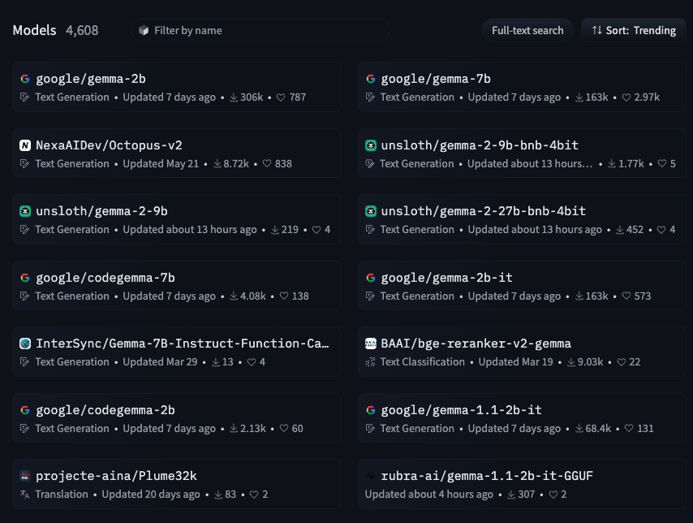

# Introduction

The Hugging Face Hub is a vast repository, currently hosting
[750K+](https://huggingface.co/models?sort=trending) public models,
offering a diverse range of pre-trained models for various machine
learning frameworks. Among these,
[346,268](https://huggingface.co/models?library=transformers&sort=trending)
(as of the time of writing) models are built using the popular
[Transformers](https://huggingface.co/docs/transformers/en/index) library.
The [KerasNLP](https://keras.io/keras_nlp/) library recently added an
integration with the Hub compatible with a first batch of
[33](https://huggingface.co/models?library=keras-nlp&sort=trending) models.

In this first version, users of KerasNLP were *limited* to only the
KerasNLP-based models available on the Hugging Face Hub.

```py
from keras_nlp.models import GemmaCausalLM

gemma_lm = GemmaCausalLM.from_preset(
    "hf://google/gemma-2b-keras"
)
```

They were able to train/fine-tune the model and upload it back to
the Hub (notice that the model is still a Keras model).

```py
model.save_to_preset("./gemma-2b-finetune")
keras_nlp.upload_preset(
    "hf://username/gemma-2b-finetune",
    "./gemma-2b-finetune"
)
```

They were missing out on the extensive collection of over 300K
models created with the transformers library. Figure 1 shows 4k
Gemma models in the Hub.

||
|:--:|
|Figure 1: Gemma Models in the Hugging Face Hub (Source:https://huggingface.co/models?other=gemma)|

> However, what if we told you that you can now access and use these
300K+ models with KerasNLP, significantly expanding your model
selection and capabilities?

```py
from keras_nlp.models import GemmaCausalLM

gemma_lm = GemmaCausalLM.from_preset(
    "hf://google/gemma-2b" # this is not a keras model!
)
```

We're thrilled to announce a significant step forward for the NLP
community: Transformers and KerasNLP now have a **shared** model save
format. This means that models of the transformers library on the
Hugging Face Hub can now also be loaded directly into KerasNLP - immediately
making a huge range of fine-tuned models available to KerasNLP users.
Initially, this integration focuses on enabling the use of
**Gemma** (1 and 2), **Llama 3,** and **PaliGemma** models, with plans
to expand compatibility to a wider range of architectures in the near future.

## Use a wider range of frameworks

Because KerasNLP models can seamlessly use **TensorFlow**, **JAX**,
or **PyTorch** backends, this means that a huge range of model
checkpoints can now be loaded into any of these frameworks in a single
line of code. Found a great checkpoint on Hugging Face, but you wish
you could deploy it to TFLite for serving or port it into JAX to do
research? Now you can!

## How to use it

Using the integration requires updating your Keras versions

```sh
$ pip install -U -q keras-nlp
$ pip install -U keras>=3.3.3
```

Once updated, trying out the integration is as simple as:

```py
from keras_nlp.models import Llama3CausalLM

# this model was not fine-tuned with Keras but can still be loaded
causal_lm = Llama3CausalLM.from_preset(
    "hf://NousResearch/Hermes-2-Pro-Llama-3-8B"
)

causal_lm.summary()
```

## Under the Hood: How It Works

Transformers models are stored as a set of config files in JSON format,
a tokenizer (usually also a .JSON file), and a set of
[safetensors](https://huggingface.co/docs/safetensors/en/index) weights
files. The actual modeling code is contained in the Transformers
library itself. This means that cross-loading a Transformers checkpoint
into KerasNLP is relatively straightforward as long as both libraries
have modeling code for the relevant architecture. All we need to do is
map config variables, weight names, and tokenizer vocabularies from one
format to the other, and we create a KerasNLP checkpoint from a
Transformers checkpoint, or vice-versa.

All of this is handled internally for you, so you can focus on trying
out the models rather than converting them!

## Common Use Cases

### Generation

A first use case of language models is to generate text. Here is an
example to load a transformers model and generate new tokens using
the `.generate` method from KerasNLP.

```py
from keras_nlp.models import Llama3CausalLM

# Get the model
causal_lm = Llama3CausalLM.from_preset(
    "hf://NousResearch/Hermes-2-Pro-Llama-3-8B"
)

prompts = [
"""<|im_start|>system
You are a sentient, superintelligent artificial general intelligence, here to teach and assist me.<|im_end|>
<|im_start|>user
Write a short story about Goku discovering kirby has teamed up with Majin Buu to destroy the world.<|im_end|>
<|im_start|>assistant""",
]

# Generate from the model
causal_lm.generate(prompts, max_length=200)[0]

```

### Changing precision

You can change the precision of your model using `keras.config` like so

```py
import keras
keras.config.set_dtype_policy("bfloat16")

from keras_nlp.models import Llama3CausalLM

causal_lm = Llama3CausalLM.from_preset(
    "hf://NousResearch/Hermes-2-Pro-Llama-3-8B"
)
```

### Using the checkpoint with JAX backend

To test drive a model using JAX, you can leverage Keras to run the
model with the JAX backend. This can be achieved by simply switching
Keras's backend to JAX. Here’s how you can use the model within the
JAX environment.

```py
import os
os.environ["KERAS_BACKEND"] = "jax"

from keras_nlp.models import Llama3CausalLM

causal_lm = Llama3CausalLM.from_preset(
    "hf://NousResearch/Hermes-2-Pro-Llama-3-8B"
)
```

## Gemma 2

We are pleased to inform you that the Gemma 2 models are also
compatible with this integration.

```py
from keras_nlp.models import GemmaCausalLM

causal_lm = keras_nlp.models.GemmaCausalLM.from_preset(
    "hf://google/gemma-2-9b" # This is Gemma 2!
)
```

## PaliGemma

You can also use any PaliGemma safetensor checkpoint in your KerasNLP pipeline.

```py
from keras_nlp.models import PaliGemmaCausalLM

pali_gemma_lm = PaliGemmaCausalLM.from_preset(
    "hf://gokaygokay/sd3-long-captioner" # A finetuned version of PaliGemma
)
```

## What's Next?

This is just the beginning. We envision expanding this integration to
encompass an even wider range of Hugging Face models and architectures.
Stay tuned for updates and be sure to explore the incredible potential
that this collaboration unlocks!