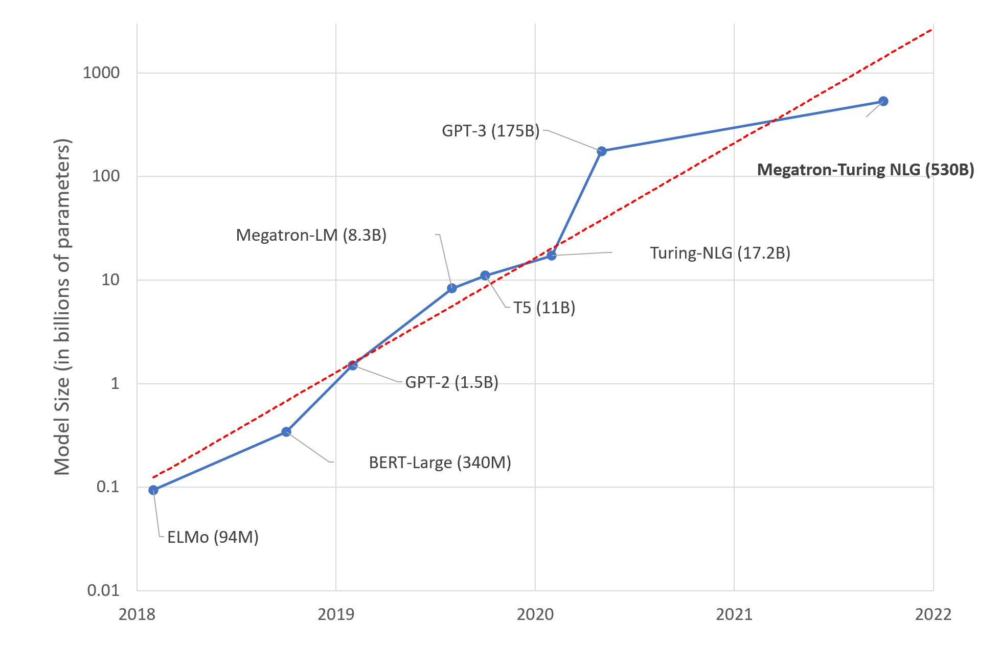

# Large Language Models: A New Moore's Law?

{blog_metadata}
{authors}

A few days ago, Microsoft and NVIDIA [introduced](https://www.microsoft.com/en-us/research/blog/using-deepspeed-and-megatron-to-train-megatron-turing-nlg-530b-the-worlds-largest-and-most-powerful-generative-language-model/) Megatron-Turing NLG 530B, a Transformer-based model hailed as "*the world’s largest and most powerful generative language model*."
 
This is an impressive show of Machine Learning engineering, no doubt about it. Yet, should we be excited about this mega-model trend?  I, for one, am not. Here's why.

<kbd>
  
</kbd>

### This is your Brain on Deep Learning

Researchers estimate that the human brain contains an average of [86 billion neurons](https://pubmed.ncbi.nlm.nih.gov/19226510/) and 100 trillion synapses. It's safe to assume that not all of them are dedicated to language either. Interestingly, GPT-4 is [expected](https://www.wired.com/story/cerebras-chip-cluster-neural-networks-ai/) to have about 100 trillion parameters... As crude as this analogy is, shouldn't we wonder whether building language models that are about the size of the human brain is the best long-term approach?

Of course, our brain is a marvelous device, produced by millions of years of evolution, while Deep Learning models are only a few decades old. Still, our intuition should tell us that something doesn't compute (pun intended).

### Deep Learning, Deep Pockets?

As you would expect, training a 530-billion parameter model on humongous text datasets requires a fair bit of infrastructure. In fact, Microsoft and NVIDIA used hundreds of DGX A100 multi-GPU servers. At $199,000 a piece, and factoring in networking equipment, hosting costs, etc., anyone looking to replicate this experiment would have to spend close to $100 million dollars. Want fries with that?

Seriously, which organizations have business use cases that would justify spending $100 million on Deep Learning infrastructure? Or even $10 million? Very few. So who are these models for, really?

### That Warm Feeling is your GPU Cluster

For all its engineering brilliance, training Deep Learning models on GPUs is a brute force technique. According to the spec sheet, each DGX server can consume up to 6.5 kilowatts. Of course, you'll need at least as much cooling power in your datacenter (or your server closet). Unless you're the Starks and need to keep Winterfell warm in winter, that's another problem you'll have to deal with. 

In addition, as public awareness grows on climate and social responsibility issues, organizations need to account for their carbon footprint. According to this 2019 [study](https://arxiv.org/pdf/1906.02243.pdf) from the University of Massachusetts, "*training BERT on GPU is roughly equivalent to a trans-American flight*".

BERT-Large has 340 million parameters. One can only extrapolate what the footprint of Megatron-Turing could be... People who know me wouldn't call me a bleeding-heart environmentalist. Still, some numbers are hard to ignore.

### So?

Am I excited by Megatron-Turing NLG 530B and whatever beast is coming next? No. Do I think that the (relatively small) benchmark improvement is worth the added cost, complexity and carbon footprint? No. Do I think that building and promoting these huge models is helping organizations understand and adopt Machine Learning ? No.

I'm left wondering what's the point of it all. Science for the sake of science? Good old marketing? Technological supremacy? Probably a bit of each. I'll leave them to it, then.

Instead, let me focus on pragmatic and actionable techniques that you can all use to build high quality Machine Learning solutions.

### Use Pretrained Models

In the vast majority of cases, you won't need a custom model architecture. Maybe you'll *want* a custom one (which is a different thing), but there be dragons. Experts only!

A good starting point is to look for [models](https://huggingface.co/models) that have been pretrained for the task you're trying to solve (say, [summarizing English text](https://huggingface.co/models?language=en&pipeline_tag=summarization&sort=downloads)).

Then, you should quickly try out a few models to predict your own data. If metrics tell you that one works well enough, you're done! If you need a little more accuracy, you should consider fine-tuning the model (more on this in a minute).

### Use Smaller Models

When evaluating models, you should pick the smallest one that can deliver the accuracy you need. It will predict faster and require fewer hardware resources for training and inference. Frugality goes a long way.

It's nothing new either. Computer Vision practitioners will remember when [SqueezeNet](https://arxiv.org/abs/1602.07360) came out in 2017, achieving a 50x reduction in model size compared to [AlexNet](https://papers.nips.cc/paper/2012/hash/c399862d3b9d6b76c8436e924a68c45b-Abstract.html), while meeting or exceeding its accuracy. How clever that was!

Downsizing efforts are also under way in the Natural Language Processing community, using transfer learning techniques such as [knowledge distillation](https://en.wikipedia.org/wiki/Knowledge_distillation). [DistilBERT](https://arxiv.org/abs/1910.01108) is perhaps its most widely known achievement. Compared to the original BERT model, it retains 97% of language understanding while being 40% smaller and 60% faster. You can try it [here](https://huggingface.co/distilbert-base-uncased). The same approach has been applied to other models, such as Facebook's [BART](https://arxiv.org/abs/1910.13461), and you can try DistilBART [here](https://huggingface.co/models?search=distilbart).

Recent models from the [Big Science](https://bigscience.huggingface.co/) project are also very impressive. As visible in this graph included in the [research paper](https://arxiv.org/abs/2110.08207), their T0 model outperforms GPT-3 on many tasks while being 16x smaller.

<kbd>
  
</kbd>

You can try T0 [here](https://huggingface.co/bigscience/T0pp). This is the kind of research we need more of!

### Fine-Tune Models

If you need to specialize a model, there should be very few reasons to train it from scratch. Instead, you should fine-tune it, that is to say train it only for a few epochs on your own data. If you're short on data, maybe of one these [datasets](https://huggingface.co/datasets) can get you started.

You guessed it, that's another way to do transfer learning, and it'll help you save on everything!
 
* Less data to collect, store, clean and annotate,
* Faster experiments and iterations,
* Fewer resources required in production.

In other words: save time, save money, save hardware resources, save the world! 

If you need a tutorial, the Hugging Face [course](https://huggingface.co/course) will get you started in no time.

### Use Cloud-Based Infrastructure

Like them or not, cloud companies know how to build efficient infrastructure. Sustainability studies show that cloud-based infrastructure is more energy and carbon efficient than the alternative: see [AWS](https://sustainability.aboutamazon.com/environment/the-cloud), [Azure](https://azure.microsoft.com/en-us/global-infrastructure/sustainability), and [Google](https://cloud.google.com/sustainability). Earth.org [says](https://earth.org/environmental-impact-of-cloud-computing/) that while cloud infrastructure is not perfect, "[*it's] more energy efficient than the alternative and facilitates environmentally beneficial services and economic growth.*"

Cloud certainly has a lot going for it when it comes to ease of use, flexibility and pay as you go. It's also a little greener than you probably thought. If you're short on GPUs, why not try fine-tune your Hugging Face models on [Amazon SageMaker](https://aws.amazon.com/sagemaker/), AWS' managed service for Machine Learning? We've got [plenty of examples](https://huggingface.co/docs/sagemaker/train) for you.

### Optimize Your Models

From compilers to virtual machines, software engineers have long used tools that automatically optimize their code for whatever hardware they're running on. 

However, the Machine Learning community is still struggling with this topic, and for good reason. Optimizing models for size and speed is a devilishly complex task, which involves techniques such as:

* Specialized hardware that speeds up training ([Graphcore](https://www.graphcore.ai/), [Habana](https://habana.ai/)) and inference ([Google TPU](https://cloud.google.com/tpu), [AWS Inferentia](https://aws.amazon.com/machine-learning/inferentia/)).
* Pruning: remove model parameters that have little or no impact on the predicted outcome.
* Fusion: merge model layers (say, convolution and activation).
* Quantization: storing model parameters in smaller values (say, 8 bits instead of 32 bits)

Fortunately, automated tools are starting to appear, such as the [Optimum](https://huggingface.co/hardware) open source library, and [Infinity](https://huggingface.co/infinity), a containerized solution that delivers Transformers accuracy at 1-millisecond latency.

### Conclusion 

Large language model size has been increasing 10x every year for the last few years. This is starting to look like another [Moore's Law](https://en.wikipedia.org/wiki/Moore%27s_law).  

We've been there before, and we should know that this road leads to diminishing returns, higher cost, more complexity, and new risks. Exponentials tend not to end well. Remember [Meltdown and Spectre](https://meltdownattack.com/)? Do we want to find out what that looks like for AI?

Instead of chasing trillion-parameter models (place your bets), wouldn't all be better off if we built practical and efficient solutions that all developers can use to solve real-world problems?

*Interested in how Hugging Face can help your organization build and deploy production-grade Machine Learning solutions? Get in touch at [julsimon@huggingface.co](mailto:julsimon@huggingface.co) (no recruiters, no sales pitches, please).*

