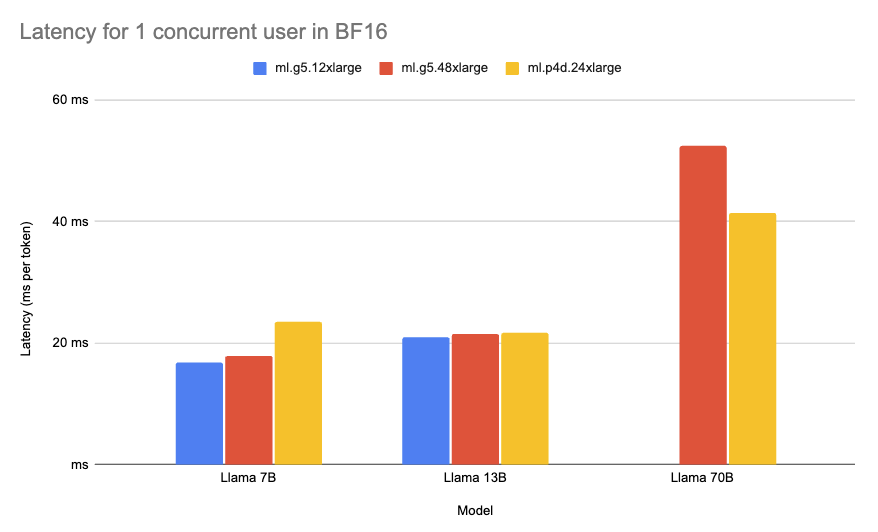

# Llama 2 on Amazon SageMaker a Benchmark

Deploying large language models (LLMs) and other generative AI models can be challenging due to their computational requirements and latency needs. To provide useful recommendations to companies looking to deploy Llama 2 on Amazon SageMaker with the [Hugging Face LLM Inference Container](https://huggingface.co/blog/sagemaker-huggingface-llm), we created a comprehensive benchmark analyzing over 60 different deployment configurations for Llama 2.

In this benchmark, we evaluated varying sizes of Llama 2 on a range of Amazon EC2 instance types with different load levels. Our goal was to measure latency (ms per token), and throughput (tokens per second) to find the optimal deployment strategies for three common use cases:

- Most Cost-Effective Deployment: For users looking for good performance at low cost
- Best Latency Deployment: Minimizing latency for real-time services
- Best Throughput Deployment: Maximizing tokens processed per second

To keep this benchmark fair, transparent, and reproducible, we share all of the assets, code, and data we used and collected: 

- [GitHub Repository](https://github.com/philschmid/text-generation-inference-tests/tree/master/sagemaker_llm_container)
- [Raw Data](https://github.com/philschmid/text-generation-inference-tests/tree/master/results/sagemaker)
- [Spreadsheet with processed data](https://docs.google.com/spreadsheets/d/1PBjw6aG3gPaoxd53vp7ZtCdPngExi2vWPC0kPZXaKlw/edit?usp=sharing)

We hope to enable customers to use LLMs and Llama 2 efficiently and optimally for their use case. Before we get into the benchmark and data, let's look at the technologies and methods we used. 

- [Llama 2 on Amazon SageMaker a Benchmark](#llama-2-on-amazon-sagemaker-a-benchmark)
    - [What is the Hugging Face LLM Inference Container?](#what-is-the-hugging-face-llm-inference-container)
    - [What is Llama 2?](#what-is-llama-2)
    - [What is GPTQ?](#what-is-gptq)
  - [Benchmark](#benchmark)
  - [Recommendations \& Insights](#recommendations--insights)
    - [Most Cost-Effective Deployment](#most-cost-effective-deployment)
    - [Best Throughput Deployment](#best-throughput-deployment)
    - [Best Latency Deployment](#best-latency-deployment)
  - [Conclusions](#conclusions)

### What is the Hugging Face LLM Inference Container?

[Hugging Face LLM DLC](https://huggingface.co/blog/sagemaker-huggingface-llm) is a purpose-built Inference Container to easily deploy LLMs in a secure and managed environment. The DLC is powered by [Text Generation Inference (TGI)](https://github.com/huggingface/text-generation-inference), an open-source, purpose-built solution for deploying and serving LLMs. TGI enables high-performance text generation using Tensor Parallelism and dynamic batching for the most popular open-source LLMs, including StarCoder, BLOOM, GPT-NeoX, Falcon, Llama, and T5. VMware, IBM, Grammarly, Open-Assistant, Uber, Scale AI, and many more already use Text Generation Inference.

### What is Llama 2?

Llama 2 is a family of LLMs from Meta, trained on 2 trillion tokens. Llama 2 comes in three sizes - 7B, 13B, and 70B parameters - and introduces key improvements like longer context length, commercial licensing, and optimized chat abilities through reinforcement learning compared to Llama (1). If you want to learn more about Llama 2 check out this [blog post](https://huggingface.co/blog/llama2). 

### What is GPTQ?

GPTQ is a post-training quantziation method to compress LLMs, like GPT. GPTQ compresses GPT (decoder) models by reducing the number of bits needed to store each weight in the model, from 32 bits down to just 3-4 bits. This means the model takes up much less memory and can run on less Hardware, e.g. Single GPU for 13B Llama2 models. GPTQ analyzes each layer of the model separately and approximates the weights to preserve the overall accuracy. If you want to learn more and how to use it, check out [Optimize open LLMs using GPTQ and Hugging Face Optimum](https://www.philschmid.de/gptq-llama).

## Benchmark

To benchmark the real-world performance of Llama 2, we tested 3 model sizes (7B, 13B, 70B parameters) on four different instance types with four different load levels, resulting in 60 different configurations:

- Models: We evaluated all currently available model sizes, including 7B, 13B, and 70B.
- Concurrent Requests: We tested configurations with 1, 5, 10, and 20 concurrent requests to determine the performance on different usage scenarios.
- Instance Types: We evaluated different GPU instances, including g5.2xlarge, g5.12xlarge, g5.48xlarge powered by NVIDIA A10G GPUs, and p4d.24xlarge powered by NVIDIA A100 40GB GPU.
- Quantization: We compared performance with and without quantization. We used GPTQ 4-bit as a quantization technique.

As metrics, we used Throughput and Latency defined as: 

- Throughput (tokens/sec): Number of tokens being generated per second.
- Latency (ms/token): Time it takes to generate a single token

We used those to evaluate the performance of Llama across the different setups to understand the benefits and tradeoffs. If you want to run the benchmark yourself, we created a [Github repository](https://github.com/philschmid/text-generation-inference-tests/tree/master/sagemaker_llm_container). 

You can find the full data of the benchmark in the [Amazon SageMaker Benchmark: TGI 1.0.3 Llama 2](https://docs.google.com/spreadsheets/d/1PBjw6aG3gPaoxd53vp7ZtCdPngExi2vWPC0kPZXaKlw/edit#gid=0) sheet. The raw data is available on [GitHub](https://github.com/philschmid/text-generation-inference-tests/tree/master/results/sagemaker). 

If you are interested in all of the details, we recommend you to dive deep into the provided raw data. 

## Recommendations & Insights

Based on the benchmark, we provide specific recommendations for optimal LLM deployment depending on your priorities between cost, throughput, and latency for all Llama 2 model sizes. 

*Note: The recommendations are based on the configuration we tested. In the future, other environments or hardware offerings, such as Inferentia2, may be even more cost-efficient.*

### Most Cost-Effective Deployment

The most cost-effective configuration focuses on the right balance between performance (latency and throughput) and cost. Maximizing the output per dollar spent is the goal. We looked at the performance during 5 concurrent requests. We can see that GPTQ offers the best cost-effectiveness, allowing customers to deploy Llama 2 13B on a single GPU. 

| Model       | Quantization | Instance       | concurrent requests | Latency (ms/token) median | Throughput (tokens/second) | On-demand cost ($/h) in us-west-2 | Time to generate 1 M tokens (minutes) | cost to generate 1M tokens ($) |
| ----------- | ------------ | -------------- | ------------------- | ------------------------- | -------------------------- | --------------------------------- | ------------------------------------- | ------------------------------ |
| Llama 2 7B  | GPTQ         | g5.2xlarge     | 5                   | 34.245736                 | 120.0941633                | $1.52                             | 138.78                                | $3.50                          |
| Llama 2 13B | GPTQ         | g5.2xlarge     | 5                   | 56.237484                 | 71.70560104                | $1.52                             | 232.43                                | $5.87                          |
| Llama 2 70B | GPTQ         | ml.g5.12xlarge | 5                   | 138.347928                | 33.33372399                | $7.09                             | 499.99                                | $59.08                         |

### Best Throughput Deployment

The Best Throughput configuration maximizes the number of tokens that are generated per second. This might come with some reduction in overall latency since you process more tokens simultaneously. We looked at the highest tokens per second performance during twenty concurrent requests, with some respect to the cost of the instance. The highest throughput was for Llama 2 13B on the ml.p4d.24xlarge instance with 688 tokens/sec.

| Model       | Quantization | Instance        | concurrent requests | Latency (ms/token) median | Throughput (tokens/second) | On-demand cost ($/h) in us-west-2 | Time to generate 1 M tokens (minutes) | cost to generate 1M tokens ($) |
| ----------- | ------------ | --------------- | ------------------- | ------------------------- | -------------------------- | --------------------------------- | ------------------------------------- | ------------------------------ |
| Llama 2 7B  | None         | ml.g5.12xlarge  | 20                  | 43.99524                  | 449.9423027                | $7.09                             | 33.59                                 | $3.97                          |
| Llama 2 13B | None         | ml.p4d.12xlarge  | 20                 | 67.4027465                | 668.0204881                | $37.69                             | 24.95                                 | $15.67                          |
| Llama 2 70B | None         | ml.p4d.24xlarge | 20                  | 59.798591                 | 321.5369158                | $37.69                            | 51.83                                 | $32.56                         |

### Best Latency Deployment

The Best Latency configuration minimizes the time it takes to generate one token. Low latency is important for real-time use cases and providing a good experience to the customer, e.g. Chat applications. We looked at the lowest median for milliseconds per token during 1 concurrent request. The lowest overall latency was for Llama 2 7B on the ml.g5.12xlarge instance with 16.8ms/token.

| Model       | Quantization | Instance        | concurrent requests | Latency (ms/token) median | Thorughput (tokens/second) | On-demand cost ($/h) in us-west-2 | Time to generate 1 M tokens (minutes) | cost to generate 1M tokens ($) |
| ----------- | ------------ | --------------- | ------------------- | ------------------------- | -------------------------- | --------------------------------- | ------------------------------------- | ------------------------------ |
| Llama 2 7B  | None         | ml.g5.12xlarge  | 1                   | 16.812526                 | 61.45733054                | $7.09                             | 271.19                                | $32.05                         |
| Llama 2 13B | None         | ml.g5.12xlarge  | 1                   | 21.002715                 | 47.15736567                | $7.09                             | 353.43                                | $41.76                         |
| Llama 2 70B | None         | ml.p4d.24xlarge | 1                   | 41.348543                 | 24.5142928                 | $37.69                            | 679.88                                | $427.05                        |

## Conclusions

In this benchmark, we tested 60 configurations of Llama 2 on Amazon SageMaker. For cost-effective deployments, we found 13B Llama 2 with GPTQ on g5.2xlarge delivers 71 tokens/sec at an hourly cost of $1.55. For max throughput, 13B Llama 2 reached 296 tokens/sec on ml.g5.12xlarge at $2.21 per 1M tokens. And for minimum latency, 7B Llama 2 achieved 16ms per token on ml.g5.12xlarge. 

We hope the benchmark will help companies deploy Llama 2 optimally based on their needs. If you want to get started deploying Llama 2 on Amazon SageMaker, check out [Introducing the Hugging Face LLM Inference Container for Amazon SageMaker](https://huggingface.co/blog/sagemaker-huggingface-llm) and [Deploy Llama 2 7B/13B/70B on Amazon SageMaker](https://www.philschmid.de/sagemaker-llama-llm) blog posts.

---

Thanks for reading! If you have any questions, feel free to contact me on [Twitter](https://twitter.com/_philschmid) or [LinkedIn](https://www.linkedin.com/in/philipp-schmid-a6a2bb196/).
