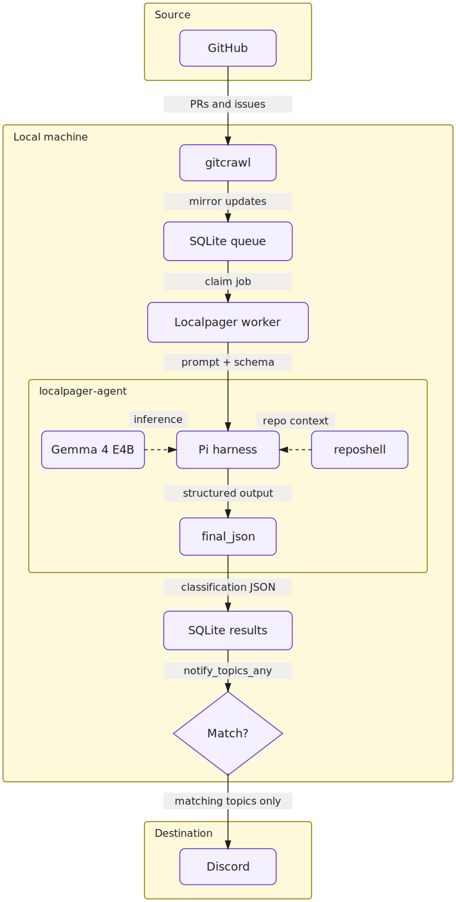
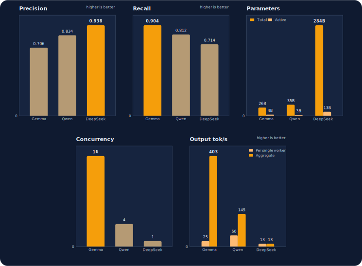

# We got local models to triage the OpenClaw repo for FREE!*

*\*Free as in beer, excluding the cost of electricity, and assuming you already own an Nvidia GB10*

June 2026 will go down as the moment that people realized closed models can be taken away. With the removal of Anthropic's latest flagship model Fable fresh in memory, one can see why it is more important than ever to own your AI stack and be able to run models locally, especially if you are building your business on top of AI.

In that light, we wanted to share how we use local models like Gemma and Qwen in an agent harness, to run classification tasks[^1]. This approach is different from using a model like BERT for classification. A local model in an agent harness like Pi can be used in tandem with structured outputs, to assign labels. We chose this approach because we already had local models and the harness on hand, and have conviction that similar setups will increase in popularity as local models improve in capability.[^2]

Our starting point was open source contributions in the OpenClaw repo. OpenClaw gets hundreds of issues and PRs every day, which need to be triaged, prioritized and routed to maintainers. I, Onur, am working to make local models work well with OpenClaw. Being a maintainer of this specific vertical, I need to react quickly to any P0 issues.

With SOTA closed models like GPT-5, Opus, or Sonnet, this is a pretty straightforward task. But I happen to sit on 128 GB of unified memory, namely an NVIDIA GB10. So I took on the task:

> Can I build a real-time notification system that filters and notifies me for only the issues that I am responsible for... with local open-weight models?

<figure class="image table text-center m-0 w-full" style="text-align: center;">
  
  <figcaption>This tiny box, a.k.a. DGX Spark, can run gemma-4-26b-a4b with high concurrency and generate hundreds of tokens per second.</figcaption>
</figure>

If I set up my OpenClaw main agent running on a $200/mo ChatGPT Pro plan to trigger a job on every new issue or PR, that would use up my quota. I might instead set it to run every 2 hours, or 6 hours. This would batch issues over longer periods, so we would be trading real-time notifications for delayed processing.

If I were to run this on a local model on the hardware I already have up and running, I would not only have near-instantaneous notifications, I would also be able to do it for free (or rather, for the cost of electricity).


## Categorizing issues and PRs

We came up with a finite set of labels representing the categories of issues we need to triage, and then use a local model to classify each issue into one of those categories, like `local_models`, `self_hosted_inference`, `acp`, `agent_runtime`, `codex`, `ui_tui` and so on.[^3]

But how do we classify pull requests? A simple single request to a Chat Completions endpoint with a tool JSON schema, with the topics as an enum?

Kind of. But this is 2026, not 2023, and we have AGENTS. We can do better!

For the local model choices, we tested `gemma-4-26b-a4b` and `qwen3.6-35b-a3b`. With performance optimizations, both can generate hundreds of tokens per second locally.

We use an agent harness to drive the classification run. For this, we bundle [pi](https://pi.dev) as a harness that can call local model endpoints.

The agent by default receives the PR title, body and a truncated excerpt of the PR diff in the first prompt. Then, it can choose to use the `bash` tool to perform read-only operations on the OpenClaw repo (in case it needs to look at the codebase), or the `final_json` tool to submit the final classification result.

You wouldn't want to give full bash access to a local model running in this high-throughput setting, because a prompt-injected issue or PR could otherwise steer the model into doing something unrelated to classification.

For that reason, we use [`reposhell`](https://github.com/osolmaz/localpager/tree/main/reposhell) instead of `bash`: a restricted `bash`-like shell that only allows read-only operations (`ls`, `find`, `cat`, `grep`, etc.) on the OpenClaw repo. The model thinks it is using `bash`, but any operation that is not allowed is rejected:


```
reposhell bound cwd=/repo/openclaw repos=openclaw
type help for allowed commands; exit or quit to leave

reposhell /repo/openclaw> help
allowed: pwd, ls, find, rg, grep, sed -n, cat, head, tail, wc -l, git status --short, git show --name-only, git grep, git ls-files
search: rg -n -i "lm studio" or grep -R -n -i "lm studio" .
files: rg --files -g "*.ts" or git ls-files src
examples: rg -n reposhell README.md | sed is not allowed; use one simple command at a time

reposhell /repo/openclaw> head README.md
# 🦞 OpenClaw — Personal AI Assistant

<p align="center">
    <picture>
        <source media="(prefers-color-scheme: light)" srcset="https://raw.githubusercontent.com/openclaw/openclaw/main/docs/assets/openclaw-logo-text-dark.svg">
        
    </picture>
</p>

<p align="center">

reposhell /repo/openclaw> curl localhost
reposhell policy denied command: unsupported command "curl"
exit_code=2

reposhell /repo/openclaw>
```

Here is a concrete example where this mattered. In one [saved session example](https://huggingface.co/datasets/dutifuldev/openclaw-classification-dataset/blob/main/session-examples/README.md), `qwen3.6-35b-a3b` was classifying [`openclaw/openclaw#84621`](https://github.com/openclaw/openclaw/pull/84621), titled `Fix Kimi tool-call rewriting stop reason handling`. The thinking block shows the model initially considering `coding_agent_integrations` because the changed path `extensions/kimi-coding` made it look plausible. The model used reposhell to inspect the local repo with simple read-only commands like `ls extensions`, `ls extensions/kimi-coding`, and `cat extensions/kimi-coding/package.json`. That package metadata showed the extension was actually `@openclaw/kimi-provider`, an OpenClaw Kimi provider plugin. So the model corrected the final labels to `inference_api` and `tool_calling`, and explicitly excluded `coding_agent_integrations`.

We have mentioned earlier that we bundle a specific `pi` configuration that can only perform read-only operations and return classification output. We call it [`localpager-agent`](https://github.com/osolmaz/localpager/tree/main/localpager-agent), named after `localpager`, the main project here. Each PR and issue generates a prompt, which is then passed to the CLI like below, alongside other args:

```bash
localpager-agent \
  --model "<model-id>" \
  --base-url "<openai-compatible-base-url>" \
  --session-dir "<session-output-dir>" \
  --final-schema "<runtime-schema.json>" \
  --tools bash,final_json \
  --reposhell-socket "<reposhell.sock>" \
  --reposhell-default-repo "<repo-id>" \
  --reposhell-visible-repos "<repo-id>[,<repo-id>...]" \
  -p "$(cat <rendered-prompt.md>)"
```

## Processing incoming PRs and issues

So then what orchestrates everything in between the incoming PR/issue and the final notification on Discord?

<figure class="image table text-center m-0 w-full" style="text-align: center;">
  
  <figcaption>This is what the final filtered Discord notification looks like: a PR about the desired vertical gets routed to me.</figcaption>
</figure>

This part is very simple and does not involve any LLMs:

1. We use [openclaw/gitcrawl](http://github.com/openclaw/gitcrawl) to act as a local mirror for the repo. Whenever there is a new PR or issue, each item is normalized into the same shape and written into localpager's own SQLite database. If the item is new, localpager creates a classification job for it.
2. A worker then claims jobs from that queue. It builds a GitHub context object containing the issue or PR title, body, labels, author, state, and optionally comments, changed files, and selected diff excerpts. That means the local model does not need to browse GitHub or open the URL itself most of the time. It is handed all the relevant context.
3. The context object is rendered into a prompt and passed to `localpager-agent` as described in the previous section. The agent can think and use reposhell, but must eventually output a classification result in the defined schema.
4. The output is stored back in localpager SQLite database, and relayed to Discord based on the notification policy configured by the user (i.e. notify me for these topics, but not these other ones).

Below is a figure showing the overall architecture of localpager:

<figure class="image table text-center m-0 w-full" style="text-align: center;">
  
</figure>

The architecture is semi-agentic. Labeling is done agentically, while sending a notification is handled by deterministic rules. This is to make the notification pipeline faster by removing the need for inference for the most straightforward parts of the task. Local inference is free but each task has a resource contention cost: GPU bandwidth should be reserved for tasks where inference is absolutely needed. This also reduces chance of errors from notifcation.


## Can local models triage PRs?

Let's be frank: the first local versions of this system were noisy. `gemma-4-e4b-it` was useful for getting the end-to-end local pipeline working, but it also had a tendency to put too many unrelated labels on a PR or issue. That pushed us toward testing larger local models, including `gemma-4-26b-a4b` and `qwen3.6-35b-a3b`, on the 330-row evaluation set below.

For early prompt work, we also used `DeepSeek-V4-Flash` through the antirez DS4 implementation[^4] to create the earlier dataset labels. That setup used the DS4 server over CUDA. We eventually gave up on DS4 as the labeler because it was not labeling consistently across runs. We also did not consider it as the main `localpager-agent` model because it was too big to get enough throughput on our hardware: the DS4 server gave us around 14 tokens per second, with maximum concurrency of 1.

For evaluation, we used the 330-row `evalstate-openclaw-git-labels` set from our [OpenClaw classification dataset](https://huggingface.co/datasets/dutifuldev/openclaw-classification-dataset). We generated it programmatically from real OpenClaw issues and PRs: each row had five teacher passes behind it, three GPT teacher runs and two Opus teacher runs, and the pipeline kept rows whose modal labels were stable enough under its quality gates. We use those labels as a fixed comparison target for local model runs while still treating ambiguous cases as genuinely subjective.

We did not need to do prompt optimization for `gemma-4-26b-a4b` or `qwen3.6-35b-a3b` before getting useful results on this evaluation set. Using the same routing prompt, Gemma had higher recall and lower wall-clock time per row, while Qwen had higher precision, higher exact match, and fewer false positives. We also ran `DeepSeek-V4-Flash` on the same set as a reference. It had the fewest false positives, but the model size and throughput make it impractical for executing these tasks in real time on the NVIDIA GB10. Since each row can have multiple labels, false positives and false negatives are total label counts across all rows. The Qwen results below are after retrying structured-output failures where the model ran out of output tokens before calling `final_json`. For Gemma and Qwen, the score and wall-clock rows report mean ± sample standard deviation across three runs. `DeepSeek-V4-Flash` was run once as a reference.

| Metric | `gemma-4-26b-a4b` | `qwen3.6-35b-a3b` | `DeepSeek-V4-Flash` |
| --- | ---: | ---: | ---: |
| Precision | 0.716 ± 0.010 | 0.831 ± 0.007 | 0.938 |
| Recall | 0.905 ± 0.004 | 0.818 ± 0.006 | 0.714 |
| F1 | 0.800 ± 0.008 | 0.824 ± 0.002 | 0.811 |
| Exact match | 0.410 ± 0.014 | 0.540 ± 0.014 | 0.509 |
| False positives | 227.0 ± 10.5 | 105.7 ± 6.4 | 30 |
| False negatives | 60.0 ± 2.6 | 115.3 ± 4.0 | 181 |
| Wall seconds / row | 1.41 ± 0.04 | 13.51 ± 0.79 | 144.14 |
| Output tok/s / worker | 25 | 50 | 13 |
| Output tok/s aggregate | 402.6 | 145.3 | 13 |
| Concurrency | 16 | 4 | 1 |
| Total parameters | 26B | 35B | 284B |
| Active parameters | 4B | 3B | 13B |

The throughput and wall-clock numbers here are not definitive maximum performance numbers for these models on this hardware. They are the settings we used at the time with the optimizations we had available. For example, in a separate probe, `gemma-4-26b-a4b` also supported concurrency 32 and reached over 700 aggregate output tokens per second.

<figure class="image table text-center m-0 w-full" style="text-align: center;">
  
  <figcaption>Benchmark comparison across the 330-row label set. Each panel uses its own vertical scale; blue marks the best value for that metric. Error bars on Precision and Recall show sample standard deviation across three runs for Gemma and Qwen.</figcaption>
</figure>

For the Gemma benchmark, we served `gemma-4-26b-a4b` with vLLM using the optimizations we found available for this setup. A big part of that is the NVFP4 quantization: on GB10-class Blackwell hardware, it is not just a smaller model file, but a hardware-friendly format that can use the NVIDIA/vLLM execution path more directly than a portable GGUF quantization like Q4_K_M. In practice, that means less memory traffic and more room for batching. We also enabled prefix caching, FP8 KV cache, the CUTLASS MoE backend, and language-model-only mode. The full 330-row run finished in about 7.5 minutes at concurrency 16.

## Tracking and validating real time performance using OpenClaw

We have mentioned earlier that instead of running a job with a local model for every new issue or PR, we can run a batch job with a SOTA cloud model, like GPT-5.5 running in OpenClaw, every n hours (e.g. every 2 hours) to achieve the same end.

In that case, we would need a ChatGPT Pro plan. Since the model is SOTA, we can still expect it to perform reasonably well, despite batching 2 hours of issues/PRs together.

Because we want to see how well the local classifier performs against GPT-5.5, we run both simultaneously, and let GPT-5.5 be the judge of false positives and negatives, every 2 hours.

To be safe, we run the OpenClaw job in a sandbox, with only access to the [public repo](https://github.com/osolmaz/onurclaw) we report results to. In our case, we let the OpenClaw job update a machine-readable file, then a simple script reads the Codex-assigned labels and computes the false positive/negative status. Example output:

> False negatives
> 
> - Issue #88499 openai-responses provider: 404 on previous_response_id when store=false (default)
>   - inventory area: OpenAI-compatible/proxy; notifier topics: agent_runtime, api_surface, sessions; notification: none
> 
> False positives
> 
> - PR #88275 fix(models-config): allow self-hosted providers without apiKey in models.json (#88267)
>   - notifier interest: i0; topics: self_hosted_inference, local_model_providers, config; notification: sent
> - PR #88266 refactor: extract model catalog core package
>   - notifier interest: i1; topics: config, api_surface, local_model_providers; notification: sent
> - PR #88247 feat: add hosted model providers
>   - notifier interest: i0; topics: local_model_providers, model_serving, docs, api_surface; notification: sent

The instructions on how to classify, edit the machine-readable file, get the false positives and false negatives using a script are present in an [agent skill](https://github.com/osolmaz/onurclaw/blob/main/.agents/skills/openclaw-onur-inventory/SKILL.md) which is referenced in an [OpenClaw cron job](https://docs.openclaw.ai/automation/cron-jobs) that runs every 2 hours. The OpenClaw agent then ingests any new issues or PRs, adds them to the JSON file with appropriate labels, runs the scripts and reports back in the same Discord channel. This way, we can observe the local model's performance every few hours, and get notified of the misses.

## Conclusion

We think that the issue/PR triage task is a specific case of a broader set of tasks which we call "high throughput triage". This post explored the idea of using a local model to filter out information in real time in only one domain, that is, open source contributions.

However, the same approach can be applied to other domains as well:

- News categorization in journalism
- Filtering for posts of interest in social media and forums like X or Reddit
- Triaging customer support tickets
- Triaging content moderation appeals
- Filtering potential outreach while doing sales
- Filtering for certain topics on arXiv while doing research

The list can be extended, but we think that the idea should be clear.

Besides triaging, we have also explored how classification can be performed with agent harnesses running fast local models in a secure manner. We called this approach *agentic classification*: the model is not fed the entire body of information upfront, but can search for more context before returning structured data.

[^1]: For the use case in this post, we have discovered that breaking down a PR/Issue in a way that means the product surface is understood and labelled correctly is a hard problem.
[^2]: Although in our testing we didn't---it would be quite reasonable for a model to conclude a next-step to gather info, use an external classifier. The agentic approach and the traditional approach are not mutually exclusive.
[^3]: See full list of topics and other configuration [here](https://github.com/osolmaz/localpager/blob/main/examples/profiles/openclaw-routing-topics.json)
[^4]: We used `DeepSeek-V4-Flash-IQ2XXS-w2Q2K-AProjQ8-SExpQ8-OutQ8-chat-v2.gguf` from [antirez/deepseek-v4-gguf](https://huggingface.co/antirez/deepseek-v4-gguf).
