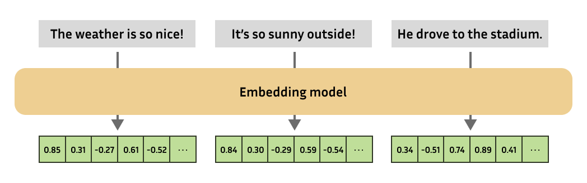
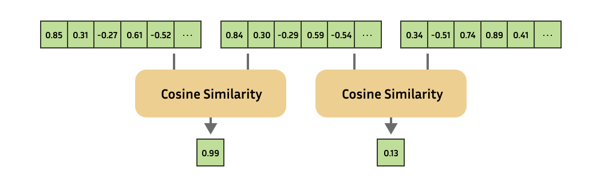
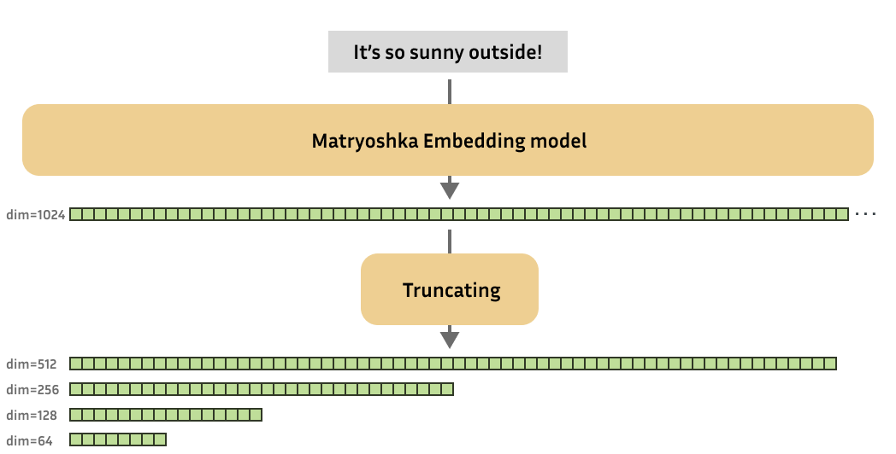

# 🪆 Introduction to Matryoshka Embedding Models

## Understanding Embeddings
Embeddings are one of the most versatile tools in natural language processing, enabling practitioners to solve a large variety of tasks. In essence, an embedding is a numerical representation of a more complex object, like text, images, audio, etc. 



You can compute the similarity of the complex object by computing the similarity of the embeddings!



This has an enormous amount of use cases, and serves as the backbone for recommendation systems, retrieval, one-shot or few-shot learning, outlier detection, similarity search, paraphrase detection, clustering, classification, and much more!

## 🪆 Matryoshka Embeddings
As research progressed, new state-of-the-art (text) embedding models started producing embeddings with increasingly high output dimensions, i.e. every input text is represented using more values. Although this results in great performance, it does come at a cost of efficiency of downstream tasks such as search or classification.

As a result, [Kusupati et al.](https://arxiv.org/abs/2205.13147) were inspired to create embedding models whose embeddings could reasonably be shrunk without suffering too much on performance.



These Matryoshka embedding models are trained such that these small truncated embeddings are still useful. In short, Matryoshka embedding models can produce useful embeddings of various dimensions.

## Why would you use 🪆 Matryoshka Embedding models?
Such variable-size embedding models can be quite valuable to practitioners for various reasons, for example:
1. **Shortlisting and reranking**: Rather than performing your downstream task (e.g. nearest neighbor search) on the full embeddings, you can shrink the embeddings to a smaller size and very efficiently "shortlist" your embeddings. Afterwards, you can process the remaining embeddings using their full dimensionality.
2. **Trade-offs**: Matryoshka models will allow you to scale your embedding solutions to your desired storage cost, processing speed and performance. 

## How are 🪆 Matryoshka Embedding models trained?
### Theoretically
The Matryoshka Representation Learning (MRL) approach can be adopted for almost all embedding model training frameworks. Normally, a training step for an embedding model involves producing embeddings for your training batch (of texts, for example), and then using some loss function to create a loss values that represents the quality of the produced embeddings. Throughout training, the optimizer will then adjust the model weights to reduce the loss value.

For Matryoshka Embedding models, a training step also involves producing embeddings for your training batch, but then you use some loss function to determine not just the quality of your full-size embeddings, but the quality of your embeddings at various different dimensionalities. For example, at output dimensionalities of 768, 512, 256, 128 and 64. The loss values for each dimensionality are added together, resulting in a final loss value. The optimizer will then try and adjust the model weights to lower this loss value.

In practice, this creates an incentive for the model to frontload the most important information in the start of an embedding, such that it will be retained if the embedding is shrunk. 

### In Sentence Transformers
[Sentence Tranformers](https://sbert.net) is a commonly used framework to train embedding models, and it recently implemented support for Matryoshka models. Training a Matryoshka embedding model using Sentence Transformers is quite elementary: rather than applying some loss function on only the full-size embeddings, we also apply that same loss function on truncated portions of the embeddings.

For example, if a model has an embedding dimension of 768 by default, it can now be trained on 768, 512, 256, 128 and 64. Each of these losses will be added together, optionally with some weight:

```python
from sentence_transformers import SentenceTransformer
from sentence_transformers.losses import CoSENTLoss, MatryoshkaLoss

model = SentenceTransformer("microsoft/mpnet-base")

base_loss = CoSENTLoss(model=model)
loss = MatryoshkaLoss(
    model=model,
    loss=base_loss,
    matryoshka_dims=[768, 512, 256, 128, 64],
    matryoshka_weight=[1, 1, 1, 1, 1],
)

model.fit(
    train_objectives=[(train_dataset, loss)],
    ...,
)
```
Training with `MatryoshkaLoss` does not incur a notable overhead in training time.

References:
* [`MatryoshkaLoss`](https://sbert.net/docs/package_reference/losses.html#matryoshkaloss)
* [`CoSENTLoss`](https://sbert.net/docs/package_reference/losses.html#cosentloss)
* [`SentenceTransformer`](https://sbert.net/docs/package_reference/SentenceTransformer.html)
* [`SentenceTransformer.fit`](https://sbert.net/docs/package_reference/SentenceTransformer.html#sentence_transformers.SentenceTransformer.fit)
* [Matryoshka Embeddings - Training](https://sbert.net/examples/training/matryoshka/README.html#training)

See the following complete scripts as examples of how to apply the `MatryoshkaLoss` in practice:
* **[matryoshka_nli.py](https://github.com/UKPLab/sentence-transformers/blob/master/examples/training/matryoshka/matryoshka_nli.py)**: This example uses the MultipleNegativesRankingLoss with MatryoshkaLoss to train a strong embedding model using Natural Language Inference (NLI) data. It is an adaptation of the [NLI](../nli/README) documentation.
* **[matryoshka_nli_reduced_dim.py](https://github.com/UKPLab/sentence-transformers/blob/master/examples/training/matryoshka/matryoshka_nli_reduced_dim.py)**: This example uses the MultipleNegativesRankingLoss with MatryoshkaLoss to train a strong embedding model with a small maximum output dimension of 256. It trains using Natural Language Inference (NLI) data, and is an adaptation of the [NLI](../nli/README) documentation.
* **[matryoshka_sts.py](https://github.com/UKPLab/sentence-transformers/blob/master/examples/training/matryoshka/matryoshka_sts.py)**: This example uses the CoSENTLoss with MatryoshkaLoss to train an embedding model on the training set of the STSBenchmark dataset. It is an adaptation of the [STS](../sts/README) documentation.

## How do I use 🪆 Matryoshka Embedding models?
### Theoretically
In practice, getting embeddings from a Matryoshka embedding model works the same way as with a normal embedding model. The only difference is that after receiving the embeddings, we can optionally truncate them to a smaller dimensionality. Do note that if the embeddings were normalized, then after truncating they will no longer be, so you may want to re-normalize.

Keep in mind that although processing smaller embeddings for downstream tasks (retrieval, clustering, etc.) will be faster, getting the smaller embeddings from the model is just as fast as getting the larger ones.

### In Sentence Transformers
In Sentence Transformers, you can load a Matryoshka Embedding model like normal, and run inference with it using [`SentenceTransformers.encode`](https://sbert.net/docs/package_reference/SentenceTransformer.html#sentence_transformers.SentenceTransformer.encode). After getting the embeddings, we can truncate them to our desired size, and we can normalize them if we want.

Let's try to use a model that I trained using [`matryoshka_nli.py`](https://github.com/UKPLab/sentence-transformers/blob/master/examples/training/matryoshka/matryoshka_nli.py) with [`microsoft/mpnet-base`](https://huggingface.co/microsoft/mpnet-base):
```python
from sentence_transformers import SentenceTransformer
from sentence_transformers.util import cos_sim

model = SentenceTransformer("tomaarsen/mpnet-base-nli-matryoshka")

matryoshka_dim = 64
embeddings = model.encode(
    [
        "The weather is so nice!",
        "It's so sunny outside!",
        "He drove to the stadium.",
    ]
)
embeddings[..., :matryoshka_dim]  # Shrink the embedding dimensions

# Similarity of the first sentence to the other two:
similarities = cos_sim(embeddings[0], embeddings[1:])
print(similarities)
# => tensor([[0.8428, 0.0873]])
```
* Link to the model: [tomaarsen/mpnet-base-nli-matryoshka](https://huggingface.co/tomaarsen/mpnet-base-nli-matryoshka)

Feel free to experiment with  using different values for `matryoshka_dim` and observing how that affects the similarities.

References:
* [`SentenceTransformer`](https://sbert.net/docs/package_reference/SentenceTransformer.html)
* [`SentenceTransformer.encode`](https://sbert.net/docs/package_reference/SentenceTransformer.html#sentence_transformers.SentenceTransformer.encode)
* [`util.cos_sim`](https://sbert.net/docs/package_reference/util.html#sentence_transformers.util.cos_sim)
* [Matryoshka Embeddings - Inference](https://sbert.net/examples/training/matryoshka/README.html#inference)

<details><summary><b>Click here to see how to use the Nomic v1.5 Matryoshka Model</b></summary>

```python
from sentence_transformers import SentenceTransformer
from sentence_transformers.util import cos_sim
import torch.nn.functional as F

model = SentenceTransformer("nomic-ai/nomic-embed-text-v1.5", trust_remote_code=True)

matryoshka_dim = 64
embeddings = model.encode(
    [
        "search_query: What is TSNE?",
        "search_document: t-distributed stochastic neighbor embedding (t-SNE) is a statistical method for visualizing high-dimensional data by giving each datapoint a location in a two or three-dimensional map.",
        "search_document: Amelia Mary Earhart was an American aviation pioneer and writer.",
    ],
    convert_to_tensor=True,
)
# The Nomic team uses a custom architecture, making them recommend Layer Normalization before truncation
embeddings = F.layer_norm(embeddings, normalized_shape=(embeddings.shape[1],))
embeddings[..., :matryoshka_dim]  # Shrink the embedding dimensions

similarities = cos_sim(embeddings[0], embeddings[1:])
# => tensor([[0.7154, 0.4468]])
```

* Link to the model: [nomic-ai/nomic-embed-text-v1.5](https://huggingface.co/nomic-ai/nomic-embed-text-v1.5)


</details>

## Results


## Demo

In this demo, you can dynamically shrink the output dimensions of the [`nomic-ai/nomic-embed-text-v1.5`](https://huggingface.co/nomic-ai/nomic-embed-text-v1.5) Matryoshka embedding model and observe how it affects the retrieval performance. All of the embeddings are computed in the browser using [🤗 Transformers.js](https://github.com/xenova/transformers.js).

<script type="module" src="https://gradio.s3-us-west-2.amazonaws.com/3.32.0/gradio.js"></script>
<gradio-app theme_mode="light" space="Xenova/adaptive-retrieval-web"></gradio-app>

## References
* Kusupati, A., Bhatt, G., Rege, A., Wallingford, M., Sinha, A., Ramanujan, V., ... & Farhadi, A. (2022). Matryoshka representation learning. Advances in Neural Information Processing Systems, 35, 30233-30249. https://arxiv.org/abs/2205.13147
* Matryoshka Embeddings — Sentence-Transformers documentation. (n.d.). https://sbert.net/examples/training/matryoshka/README.html
* Unboxing Nomic Embed v1.5: Resizable Production Embeddings with Matryoshka Representation Learning. (n.d.). https://blog.nomic.ai/posts/nomic-embed-matryoshka