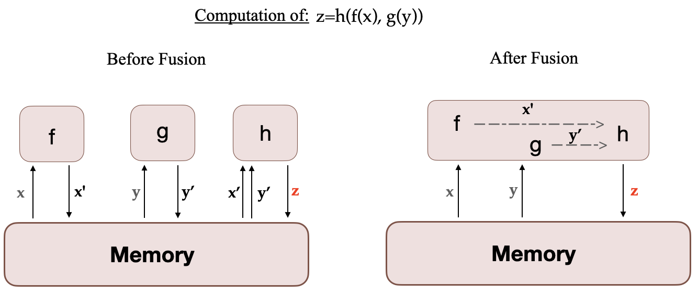

# How to train a Language Model with Megatron-LM


Training large language models in Pytorch requires more than a simple training loop. It is usually distributed across multiple devices, with many optimization techniques for a stable and efficient training. Hugging Face 🤗 [Accelerate](https://huggingface.co/docs/accelerate/index) library was created to support distributed training across GPUs and TPUs with very easy integration into the training loops. 🤗 [Transformers](https://huggingface.co/docs/transformers/index) also support distributed training through the [Trainer](https://huggingface.co/docs/transformers/main_classes/trainer#transformers.Trainer) API, which provides feature-complete training in PyTorch, without even needing to implement a training loop. 

Another popular tool among researchers to pre-train large transformer models is [Megatron-LM](https://github.com/NVIDIA/Megatron-LM), a powerful framework developed by the Applied Deep Learning Research team at NVIDIA. Unlike `accelerate` and the `Trainer`, using Megatron-LM is not straightforward and can be a little overwhelming for beginners. But it is highly optimized for the training on GPUs and can give some speedups. In this blogpost,  you will learn how to train a language model on NVIDIA GPUs in Megatron-LM, and use it with `transformers`.

We will try to break down the different steps for training a GPT2 model in this framework, this includes:
* Environment setup
* Data preprocessing
* Training
* Model conversion to 🤗 Transformers

## Why Megatron-LM?

Before getting into the training details, let’s first understand what makes this framework more efficient than others. This section is inspired by this great [blog](https://huggingface.co/blog/bloom-megatron-deepspeed) about BLOOM training with [Megatron-DeepSpeed](https://github.com/bigscience-workshop/Megatron-DeepSpeed), please refer to it for more details as this blog is intended to give a gentle introduction to Megatron-LM.

### DataLoader

Megatron-LM comes with an efficient DataLoader where the data is tokenized and shuffled before the training. It also splits the data into numbered sequences with indexes that are stored such that they need to be computed only once. To build the index, the number of epochs is computed based on the training parameters and an ordering is created and then shuffled. This is unlike most cases where we iterate through the entire dataset until it is exhausted and then repeat for the second epoch. This smoothes the learning curve and saves time during the training.

### Fused CUDA Kernels

When a computation is run on the GPU, the necessary data is fetched from memory, then the computation is run and the result is saved back into memory. In simple terms, the idea of fused kernels is that similar operations, usually performed separately by Pytorch, are combined into a single hardware operation. So they reduce the number of memory movements done in multiple discrete computations by merging them into one. The figure below illustrates the idea of Kernel Fusion. It is inspired from this [paper](https://www.arxiv-vanity.com/papers/1305.1183/), which discusses the concept in detail.

<p align="center">
    
</p>

When f, g and h are fused in one kernel, the intermediary results x’ and y’ of f and g are stored in the GPU registers and immediately used by h. But without fusion,  x’ and y’ would need to be copied to the memory and then loaded by h. Therefore, Kernel Fusion gives a significant speed up to the computations.
Megatron-LM also uses a Fused implementation of AdamW from [Apex](https://github.com/NVIDIA/apex) which is faster than the Pytorch implementation.

While one can customize the DataLoader like Megatron-LM and use Apex’s Fused optimizer with `transformers`, it is not a beginner friendly undertaking to build custom Fused CUDA Kernels.

Now that you are familiar with the framework and what makes it advantageous, let’s get into the training details!

## How to train with Megatron-LM ?

### Setup
The easiest way to setup the environment is to pull an NVIDIA PyTorch Container that comes with all the required installations from [NGC](https://catalog.ngc.nvidia.com/orgs/nvidia/containers/pytorch). See [documentation](https://docs.nvidia.com/deeplearning/frameworks/pytorch-release-notes/index.html) for more details. If you don't want to use this container you will need to install the latest pytorch, cuda, nccl, and NVIDIA [APEX](https://github.com/NVIDIA/apex#quick-start) releases and the `nltk` library.

So after having installed Docker, you can run the container with the following command (`xx.xx` denotes your Docker version), and then clone [Megatron-LM repository](https://github.com/NVIDIA/Megatron-LM) inside it:
```bash
docker run --gpus all -it --rm nvcr.io/nvidia/pytorch:xx.xx-py3
git clone https://github.com/NVIDIA/Megatron-LM
```

You also need to add the vocabulary file `vocab.json` and merges table `merges.txt` of your tokenizer inside Megatron-LM folder of your container.  These files can be found in the model’s repository with the weights, see this [repository](https://huggingface.co/gpt2/tree/main) for GPT2. You can also train your own tokenizer using `transformers`. You can checkout the [CodeParrot project](https://github.com/huggingface/transformers/tree/main/examples/research_projects/codeparrot) for a practical example. 
Now if you want to copy this data from outside the container you can use the following commands:
```bash
sudo docker cp vocab.json CONTAINER_ID:/workspace/Megatron-LM
sudo docker cp merges.txt CONTAINER_ID:/workspace/Megatron-LM
```

### Data preprocessing
In the rest of this tutorial we will be using [CodeParrot](https://huggingface.co/codeparrot/codeparrot-small) model and data as an example.

The training data requires some preprocessing. First, you need to convert it into a loose json format, with one json containing a text sample per line. If you're using 🤗 [Datasets](https://huggingface.co/docs/datasets/index), here is an example on how to do that (always inside Megatron-LM folder):
```python
from datasets import load_dataset

train_data = load_dataset('codeparrot/codeparrot-clean-train', split='train')
train_data.to_json("codeparrot_data.json", lines=True)  
```

The data is then tokenized, shuffled and processed into a binary format for training using the following command:
```bash
#if nltk isn't installed
pip install nltk
python tools/preprocess_data.py \
       --input codeparrot_data.json \
       --output-prefix codeparrot \
       --vocab vocab.json \
       --dataset-impl mmap \
       --tokenizer-type GPT2BPETokenizer \
       --merge-file merges.txt \
       --json-keys content \
       --workers 32 \
       --chunk-size 25 \
       --append-eod
```
The `workers` and `chunk_size` options refer to the number of workers used in the preprocessing and the chunk size of data assigned to each one. `dataset-impl` refers to the implementation mode of the indexed datasets from ['lazy', 'cached', 'mmap'].
This outputs two files `codeparrot_content_document.idx` and `codeparrot_content_document.bin` which are used in the training.

### Training
You can configure the model architecture and training parameters as shown below, or put it in a bash script that you will run. This command runs the pretraining on 8 GPUs for a 110M parameter CodeParrot model. Note that the data is partitioned by default into a 969:30:1 ratio for training/validation/test sets.
```bash
GPUS_PER_NODE=8
MASTER_ADDR=localhost
MASTER_PORT=6001
NNODES=1
NODE_RANK=0
WORLD_SIZE=$(($GPUS_PER_NODE*$NNODES))
DISTRIBUTED_ARGS="--nproc_per_node $GPUS_PER_NODE --nnodes $NNODES --node_rank $NODE_RANK --master_addr $MASTER_ADDR --master_port $MASTER_PORT"
CHECKPOINT_PATH=/workspace/Megatron-LM/experiments/codeparrot-small
VOCAB_FILE=vocab.json
MERGE_FILE=merges.txt
DATA_PATH=codeparrot_content_document
GPT_ARGS="--num-layers 12
--hidden-size 768
--num-attention-heads 12
--seq-length 1024
--max-position-embeddings 1024
--micro-batch-size 12
--global-batch-size 192
--lr 0.0005
--train-iters 150000
--lr-decay-iters 150000
--lr-decay-style cosine
--lr-warmup-iters 2000
--weight-decay .1
--adam-beta2 .999
--fp16
--log-interval 10
--save-interval 2000
--eval-interval 200
--eval-iters 10
"
TENSORBOARD_ARGS="--tensorboard-dir experiments/tensorboard"
python3 -m torch.distributed.launch $DISTRIBUTED_ARGS \
        pretrain_gpt.py \
        --tensor-model-parallel-size 1 \
        --pipeline-model-parallel-size 1 \
        $GPT_ARGS \
        --vocab-file $VOCAB_FILE \
        --merge-file $MERGE_FILE \
        --save $CHECKPOINT_PATH \
        --load $CHECKPOINT_PATH \
        --data-path $DATA_PATH \
        $TENSORBOARD_ARGS
```
With this setting, the training takes roughly 12 hours.

This setup uses Data Parallelism, but it is also possible to use Model Parallelism for very large models that don't fit in one GPU. The first option consists of Tensor Parallelism that splits the execution of a single transformer module over multiple GPUs, you will need to change `tensor-model-parallel-size` parameter to the desired number of GPUs. The second option is Pipeline Parallelism where the transformer modules are split into equally sized stages. The parameter `pipeline-model-parallel-size` determines the number of stages to split the model into. For more details please refer to this [blog](https://huggingface.co/blog/bloom-megatron-deepspeed)


### Converting the model to 🤗 Transformers
After training we want to use the model in `transformers` e.g. for evaluation or to deploy it to production. You can convert it to a `transformers` model following this [tutorial](https://huggingface.co/nvidia/megatron-gpt2-345m). For instance, after the training is finished you can copy the weights of the last iteration 150k and convert the `model_optim_rng.pt` file to a `pytorch_model.bin` file that is supported by `transformers` with the following commands:

```bash
# to execute outside the container:
mkdir -p nvidia/megatron-codeparrot-small
# copy the weights from the container
sudo docker cp CONTAINER_ID:/workspace/Megatron-LM/experiments/codeparrot-small/iter_0150000/mp_rank_00/model_optim_rng.pt nvidia/megatron-codeparrot-small
git clone https://github.com/huggingface/transformers.git
git clone https://github.com/NVIDIA/Megatron-LM.git
export PYTHONPATH=Megatron-LM
python transformers/src/transformers/models/megatron_gpt2/convert_megatron_gpt2_checkpoint.py nvidia/megatron-codeparrot-small/model_optim_rng.pt
```
Be careful, you will need to replace the generated vocabulary file and merges table after the conversion, with the original ones we introduced earlier if you plan to load the tokenizer from there.

Don't forget to push your model to the hub and share it with the community, it only takes three lines of code 🤗:
```python
from transformers import AutoModelForCausalLM

model = AutoModelForCausalLM.from_pretrained("nvidia/megatron-codeparrot-small")
# this creates a repository under your username with the model name codeparrot-small
model.push_to_hub("codeparrot-small")
```

You can also easily use it to generate text:
```python
from transformers import pipeline

pipe = pipeline("text-generation", model="your_username/codeparrot-small")
outputs = pipe("def hello_world():")
print(outputs[0]["generated_text"])
```
```
 def hello_world():   
    print("Hello World!")
```

Tranfsormers also handle big model inference efficiently. In case you trained a very large model (e.g. using Model Parallelism), you can easily use it for inference with the following command:
```python
from transformers import AutoModelForCausalLM

model = AutoModelForCausalLM.from_pretrained("your_username/codeparrot-large", device_map="auto")
```
This will use [accelerate](https://huggingface.co/docs/accelerate/index) library behind the scenes to automatically dispatch the model weights across the devices you have available (GPUs, CPU RAM).

Disclaimer: We have shown that anyone can use Megatron-LM to train language models. The question is when to use it. This framework obviously adds some time overhead because of the extra preprocessing and conversion steps.  So it is important that you decide which framework is more appropriate for your case and model size. We recommend trying it for pre-training models or extended fine-tuning, but probably not for shorter fine-tuning of medium-sized models. The `Trainer` API and `accelerate` library are also very handy for model training, they are device-agnostic and give significant flexibility to the users.

Congratulations 🎉 now you know how to train a GPT2 model in Megatron-LM and make it supported by `transformers`!
