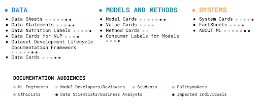

# Model Cards

    <small>Published December 29, 2022</small>
    <a target="_blank" class="btn no-underline text-sm mb-5 font-sans" href="https://github.com/huggingface/blog/blob/Ezi/model-cards/model-cards.md">
        Update on GitHub
    </a>

    <a href="/Ezi"> 
        
        

            <code>Ezinwanne (Ezi) Ozoani</code>
            Ezinwanne (Ezi) Ozoani
        

    </a>

    <a href="/Marissa"> 
        
        

            <code>Marissa Gerchick</code>
            Marissa Gerchick
        

    </a>

    <a href="/Meg"> 
        
        

            <code>Margaret Mitchell</code>
            Margaret Mitchell
        

    </a>

## Introduction

Model cards are an important documentation framework for understanding, sharing, and improving machine learning models. When done well, a model card can serve as a _boundary object_, a single artefact that is accessible to people with different backgrounds and goals in understanding models - including developers, students, policymakers, ethicists, and those impacted by machine learning models.

Today, we launch both a [model card creation tool](https://huggingface.co/spaces/huggingface/Model_Cards_Writing_Tool) and a model card Guide Book, which details how to fill out model cards, user studies, and the state of the art in ML documentation. This work, building from the work of many other people and organization, is focused on _inclusion_ of people with different backgrounds and roles. We hope it serves as a stepping stone in the path towards improved ML documentation.

## Model Cards To-Date

Since model cards were proposed by [Mitchell et al., (2018)](https://arxiv.org/abs/1810.03993), inspired by the major documentation framework efforts of Data Statements for Natural Language Processing [(Bender & Friedman, 2018)](https://aclanthology.org/Q18-1041/) and Datasheets for Datasets [(Gebru et al., 2018)](https://www.fatml.org/media/documents/datasheets_for_datasets.pdf), the landscape of machine learning documentation has expanded and evolved. A plethora of documentation tools and templates for data, models, and ML systems have been proposed and developed - reflecting the incredible work of hundreds of researchers, impacted community members, advocates, and other stakeholders. Important discussions about the relationship between ML documentation and theories of change in responsible AI have also shaped these developments in the ML documentation ecosystem.

  

## Our Work

Our work presents a view of where we think model cards stand right now and where they could go in the future. We conducted a broad analysis of the growing landscape of ML documentation tools and conducted user interviews within Hugging Face to supplement our understanding of the diverse opinions about model cards. We also created or updated dozens of model cards for ML models on the Hugging Face Hub, and informed by all of these experiences, we propose a new template for model cards. 

### Standardising Model Card Structure
Through our background research and user studies, we aimed to establish a standard of "model cards" as understood by the general public. From this research, we found that there is a variance in the content of a model card and the layout of a model card - the presence or absence of some headings and sub-headings - but there was consistency in the different types of headings.

Through our user studies and as  illustrated in the model book **[link to section in guide book]**, we noted that  while the Bias, Risks and Limitations section ranks second for both model card writers and model card readers for In what order do you write the model card and What section do you look at first, respectively, it is also noted as the most challenging/longest section to write. 

Directed by these findings we created a  research informed  model card template, that not only standardised the structure and content of HF model cards but also provided default prompted text, with the aim  to aid with writing model card sections, with a particular focus on the Bias, Risks and Limitations section.

### Accessibility and Inclusion

In order to lower barriers to entry for creating model cards, we designed [the model card writing tool](https://huggingface.co/spaces/huggingface/Model_Cards_Writing_Tool), a tool with a graphical user interface (GUI) to enable people and teams with different skill sets and roles to easily collaborate and create model cards, without needing to code or use markdown. 

  

The writing tool encourages those who have yet to write model cards to create them more easily and those who have previously written them. This approach invites them to add to the prompted information. All while centering the ethical components of model documentation.

As ML continues to be more intertwined with different domains, the ability to be part of a collaborative and open-source process that centres accessibility, ethics and technical inclusion is a critical part of the machine learning lifecycle and a stepping stone in ML documentation.

This work is a "*snapshot*" of the current state of model cards, informed by a landscape analysis of the many ways ML documentation artefacts have been instantiated.

The model book and these findings represent one perspective amongst multiple about both the current state and more aspirational visions of model cards.

Being part of a collaborative and open-source process that centres accessibility, ethics and technical inclusion, when building tools instead of their inclusion as an afterthought, has been an amazing stepping stone in ML documentation.

## Call to action

Let's look ahead

  

As model cards continue to grow and evolve within the ML, ethics, policy and further spaces, so will this tool.

* The Hugging Face ecosystem will continue to advance methods that streamline Model Card creation [through code](https://huggingface.co/spaces/huggingface/Model_Cards_Writing_Tool) and user interfaces, including building more features directly into the repos and product. 
* As we further develop model tools such as [Evaluate on the Hub](https://huggingface.co/blog/eval-on-the-hub), we will integrate their usage within the model card development workflow. For example, as automatically evaluating model performance across disaggregated factors becomes easier, these results will be possible to import into the model card.
* There is further study to be done to advance the pairing of research models and model cards, such as building out a research paper → to model documentation pipeline, making it  make it trivial to go from paper to model card creation. This would allow for greater cross-domain reach and further standardisation of model documentation.

We continue to learn more about how model cards are created and used, and the effect of cards on model usage. Based on these learnings, we will further update the model card template, instructions, and Hub integrations. 

As we strive to incorporate more voices and stakeholders' use cases for model cards, [bookmark our model cards writing tool and give it a try](https://huggingface.co/spaces/huggingface/Model_Cards_Writing_Tool).

  

We are excited to know your thoughts on model cards, our model card writing GUI, and how AI documentation can empower your domain.🤗
