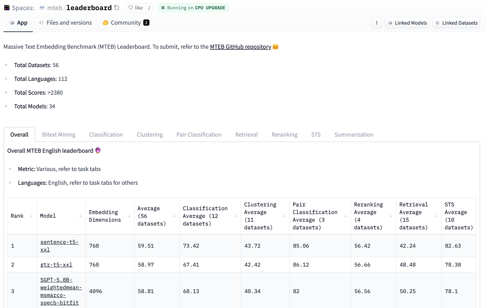
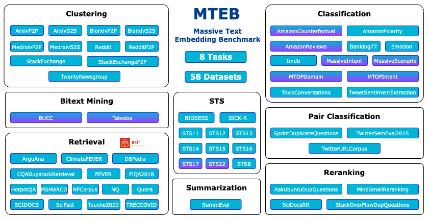
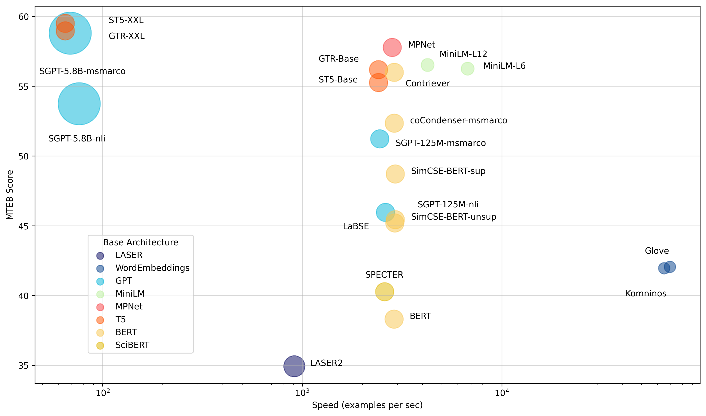

<h1>MTEB: Massive Text Embedding Benchmark</h1>

<div class="blog-metadata">
    <small>Published September 02, 2022.</small>
    <a target="_blank" class="btn no-underline text-sm mb-5 font-sans" href="https://github.com/huggingface/blog/blob/main/mteb.md">
        Update on GitHub
    </a>
</div>

<div class="author-card">
    <a href="/Muennighoff">
        
        <div class="bfc">
            <code>Muennighoff</code>
            <span class="fullname">Niklas Muennighoff</span>
        </div>
    </a>
</div>


MTEB is a massive benchmark for measuring the performance of text embedding models on a variety of tasks!

The 🥇 [leaderboard](https://huggingface.co/spaces/mteb/leaderboard) provides a holistic view of the best text embedding models out there on a variety of tasks. 

The 📝 [paper](https://arxiv.org/abs/2210.07316) gives background on the tasks and datasets in MTEB and analyzes leaderboard results!

The 💻 [Github repo](https://github.com/embeddings-benchmark/mteb) contains the code for benchmarking and submitting any model of your choice to the leaderboard.


<p align="center">
    
</p>

## Why Text Embeddings?

Text Embeddings are vector representations of text that encode semantic information. As machines require numerical inputs to perform computations, text embeddings are a crucial component of many downstream NLP applications. For example, Google uses text embeddings to [power their search engine](https://cloud.google.com/blog/topics/developers-practitioners/find-anything-blazingly-fast-googles-vector-search-technology). Text Embeddings can also be used for finding [patterns in large amount of text via clustering](https://txt.cohere.ai/combing-for-insight-in-10-000-hacker-news-posts-with-text-clustering/) or as inputs to text classification models, such as in our recent [SetFit](https://huggingface.co/blog/setfit) work. The quality of text embeddings, however, is highly dependent on the embedding model used. MTEB is designed to help you find the best embedding model out there for a variety of tasks!

## MTEB 


🐋 **Massive**: MTEB includes 56 datasets across 8 tasks and currently summarizes >2000 results on the [leaderboard](https://huggingface.co/spaces/mteb/leaderboard). 

🌎 **Multilingual**: MTEB contains up to 112 different languages! We have benchmarked several multilingual models on Bitext Mining, Classification, and STS. 

🦚 **Extensible**: Be it new tasks, datasets, metrics, or leaderboard additions, any contribution is very welcome. Check out the GitHub repository to [submit to the leaderboard](https://github.com/embeddings-benchmark/mteb#leaderboard) or [solve open issues](https://github.com/embeddings-benchmark/mteb/issues). We hope you join us on the journey to finding the best text embedding model!


<p align="center">
    
</p>
<p align="center">
    <em>Overview of tasks and datasets in MTEB. Multilingual datasets are marked with a purple shade.</em> 
</p>


## Models

For the initial benchmarking of MTEB, we focused on models claiming state-of-the-art results and popular models on the Hub. This led to a high representation of transformers. 🤖

<p align="center">
    
</p>
<p align="center">
    <em>Models by average English MTEB score (y) vs speed (x) vs embedding size (circle size).</em> 
</p>


We grouped models into the following three attributes to simplify finding the best model for your task:

**🏎 Maximum speed** Models like [Glove](https://huggingface.co/sentence-transformers/average_word_embeddings_glove.6B.300d) offer high speed, but suffer from a lack of context awareness.

**⚖️ Speed and performance** Slightly slower, but significantly stronger, [all-mpnet-base-v2](https://huggingface.co/sentence-transformers/all-mpnet-base-v2) or [all-MiniLM-L6-v2](https://huggingface.co/sentence-transformers/all-MiniLM-L6-v2) provide a good balance between speed and performance.

**💪 Maximum performance** Multi-billion parameter models like [ST5-XXL](https://huggingface.co/sentence-transformers/sentence-t5-xxl), [GTR-XXL](https://huggingface.co/sentence-transformers/gtr-t5-xxl) or [SGPT-5.8B-msmarco](https://huggingface.co/Muennighoff/SGPT-5.8B-weightedmean-msmarco-specb-bitfit) dominate on MTEB. They tend to also produce bigger embeddings like [SGPT-5.8B-msmarco](https://huggingface.co/Muennighoff/SGPT-5.8B-weightedmean-msmarco-specb-bitfit) which produces 4096 dimensional embeddings requiring more storage!


Model performance varies a lot depending on the task and dataset, so we recommend checking the various tabs of the [leaderboard](https://huggingface.co/spaces/mteb/leaderboard) before deciding which model to use!


## Benchmark your model

Using the [MTEB library](https://github.com/embeddings-benchmark/mteb), you can benchmark any model that produces embeddings and add its results to the public leaderboard. Let's run through a quick example!


First, install the library:
```sh
pip install mteb
```

Next, benchmark a model on a dataset, for example [komninos word embeddings](https://huggingface.co/sentence-transformers/average_word_embeddings_komninos) on [Banking77](https://huggingface.co/datasets/mteb/banking77).

```python
from mteb import MTEB
from sentence_transformers import SentenceTransformer

model_name = "average_word_embeddings_komninos"
model = SentenceTransformer(model_name)

evaluation = MTEB(tasks=["Banking77Classification"])
results = evaluation.run(model, output_folder=f"results/{model_name}")
```

This should produce a `results/average_word_embeddings_komninos/Banking77Classification.json` file!

Now you can submit the results to the leaderboard by adding it to the metadata of the README.md of any model on the Hub.

Run our [automatic script](https://github.com/embeddings-benchmark/mteb/blob/main/scripts/mteb_meta.py) to generate the metadata:

```sh
python mteb_meta.py results/average_word_embeddings_komninos
```

The script will produce a `mteb_metadata.md` file that looks like this:
```sh
---
tags:
- mteb
model-index:
- name: average_word_embeddings_komninos
  results:
  - task:
      type: Classification
    dataset:
      type: mteb/banking77
      name: MTEB Banking77Classification
      config: default
      split: test
      revision: 0fd18e25b25c072e09e0d92ab615fda904d66300
    metrics:
    - type: accuracy
      value: 66.76623376623377
    - type: f1
      value: 66.59096432882667
---
```

Now add the metadata to the top of a README.md of any model on the Hub, like this [SGPT-5.8B](https://huggingface.co/Muennighoff/SGPT-5.8B-weightedmean-msmarco-specb-bitfit/blob/main/README.md) model, and it will show up on the [leaderboard](https://huggingface.co/spaces/mteb/leaderboard) after refreshing!

## Next steps

Go out there and benchmark any model you like! Let us know if you have questions or feedback by opening an issue on our [GitHub repo](https://github.com/embeddings-benchmark/mteb) or the [leaderboard community tab](https://huggingface.co/spaces/mteb/leaderboard/discussions) 🤗

Happy embedding!

## Credits

Huge thanks to the following who contributed to improve the readability of the article or to the MTEB codebase (listed in alphabetic order): Steven Liu, Loïc Magne, Nils Reimers and Nouamane Tazi.
